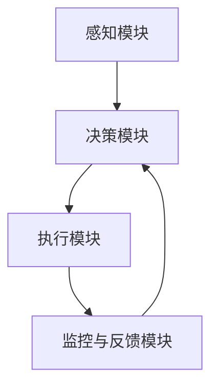
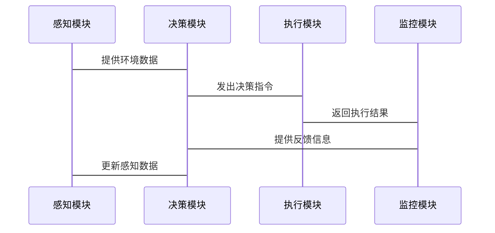

                 


# 构建具有自我修正能力的AI Agent

**关键词**：AI Agent、自我修正、机器学习、强化学习、算法优化

**摘要**：  
本文详细探讨了如何构建一个具有自我修正能力的AI Agent。通过分析AI Agent的基本概念、自我修正机制的核心算法、系统架构设计、项目实战以及高级主题，本文为读者提供了一套完整的构建方法论。文章从背景介绍到算法实现，再到系统架构设计，层层深入，结合实际案例分析，帮助读者全面理解并掌握如何设计和实现具有自我修正能力的AI Agent。

---

# 构建具有自我修正能力的AI Agent

## 第一部分: 构建具有自我修正能力的AI Agent基础

### 第1章: 自我修正AI Agent的背景与概念

#### 1.1 自我修正AI Agent的背景
##### 1.1.1 AI Agent的基本概念
AI Agent（人工智能代理）是指能够感知环境并采取行动以实现目标的智能实体。它可以是一个软件程序、机器人或其他智能系统，通过与环境交互来完成特定任务。

##### 1.1.2 自我修正能力的定义
自我修正能力是指AI Agent在运行过程中能够自动检测错误、识别问题，并通过调整自身行为或参数来修复这些问题的能力。这种能力使AI Agent能够在动态变化的环境中保持高效和稳定。

##### 1.1.3 自我修正能力的背景与意义
随着AI技术的快速发展，AI Agent的应用场景越来越广泛，但其在复杂环境中的稳定性和可靠性仍面临挑战。自我修正能力的引入，使得AI Agent能够更好地适应复杂环境，提高系统的鲁棒性和用户体验。

---

#### 1.2 自我修正AI Agent的核心特征
##### 1.2.1 自动检测错误
自我修正AI Agent能够实时监控自身的运行状态，识别潜在的问题或错误。例如，通过异常检测算法，AI Agent可以发现模型预测与实际结果之间的偏差。

##### 1.2.2 动态调整策略
在检测到问题后，AI Agent能够根据当前状态和环境反馈，动态调整其行为策略或模型参数。这种动态调整能力使得AI Agent能够在变化的环境中保持高效。

##### 1.2.3 实时反馈与优化
自我修正AI Agent能够实时接收反馈，并基于反馈进行优化。例如，通过强化学习算法，AI Agent可以根据奖励信号调整其动作策略，以最大化长期收益。

---

#### 1.3 自我修正AI Agent与传统AI Agent的区别
##### 1.3.1 传统AI Agent的功能特点
传统AI Agent通常基于固定的规则或预训练的模型进行决策，缺乏动态调整的能力。一旦环境发生变化，传统AI Agent可能无法有效应对。

##### 1.3.2 自我修正AI Agent的独特优势
自我修正AI Agent的核心优势在于其动态调整和自我优化能力。它能够根据实时反馈和环境变化，自主调整行为策略，从而适应复杂多变的环境。

##### 1.3.3 两者的对比分析
| 特性                | 传统AI Agent                     | 自我修正AI Agent               |
|---------------------|----------------------------------|---------------------------------|
| 动态调整能力         | 无或有限                        | 强                                 |
| 环境适应性           | 较差                            | 优异                             |
| 系统维护成本         | 高                              | 低                                |

---

#### 1.4 自我修正AI Agent的应用场景
##### 1.4.1 自动化系统中的应用
在工业自动化、智能家居等领域，自我修正AI Agent可以通过实时调整参数和策略，确保系统的高效运行。

##### 1.4.2 人机交互中的优化
在自然语言处理、语音识别等领域，自我修正AI Agent能够根据用户反馈动态优化交互策略，提高用户体验。

##### 1.4.3 复杂环境下的适应性
在自动驾驶、智能安防等领域，复杂多变的环境要求AI Agent具备强大的自我修正能力，以应对突发事件和环境变化。

---

#### 1.5 本章小结
本章介绍了AI Agent的基本概念，重点阐述了自我修正能力的定义、核心特征及其与传统AI Agent的区别。通过对比分析，读者可以清晰地理解自我修正AI Agent的独特优势及其在实际场景中的广泛应用。

---

## 第二部分: 自我修正机制的算法原理

### 第2章: 自我修正算法的核心原理

#### 2.1 监督学习与自我修正
##### 2.1.1 监督学习的基本原理
监督学习是一种基于标签数据的机器学习方法，通过最小化预测值与真实值的差异来优化模型。公式表示为：
$$ L = \frac{1}{n}\sum_{i=1}^n (y_i - \hat{y}_i)^2 $$
其中，$L$是损失函数，$y_i$是真实值，$\hat{y}_i$是预测值。

##### 2.1.2 自我修正的监督学习模型
自我修正AI Agent可以通过监督学习模型实现自我优化。例如，图像识别任务中，AI Agent可以通过对比预测结果与真实结果的差异，调整模型参数以减少误差。

##### 2.1.3 案例分析：图像识别中的自我修正
以下是一个简单的图像分类模型优化案例：
```python
import tensorflow as tf
from tensorflow import keras

# 定义模型
model = keras.Sequential([
    keras.layers.Conv2D(32, (3,3), activation='relu', input_shape=(28,28,1)),
    keras.layers.MaxPooling2D((2,2)),
    keras.layers.Flatten(),
    keras.layers.Dense(10, activation='softmax')
])

# 编译模型
model.compile(optimizer='adam', loss='sparse_categorical_crossentropy', metrics=['accuracy'])

# 训练模型
model.fit(x_train, y_train, epochs=5, batch_size=32)
```

---

#### 2.2 强化学习与自我修正
##### 2.2.1 强化学习的基本原理
强化学习是一种基于奖励机制的机器学习方法，通过优化动作策略以最大化累积奖励。数学表示为：
$$ Q(s, a) = Q(s, a) + \alpha (r + \max_{a'} Q(s', a') - Q(s, a)) $$
其中，$Q(s, a)$是状态-动作值函数，$\alpha$是学习率，$r$是奖励，$s'$是下一个状态。

##### 2.2.2 自我修正的强化学习框架
自我修正AI Agent可以通过强化学习框架实现动态调整。例如，游戏AI可以通过强化学习算法不断优化其策略，以提高游戏胜率。

##### 2.2.3 案例分析：游戏AI的自我修正
以下是一个简单的强化学习算法实现：
```python
import gym
import numpy as np

env = gym.make('CartPole-v0')
env.seed(1)

# 定义策略网络
class Policy:
    def __init__(self, input_dim, output_dim):
        self.theta = np.random.randn(input_dim, output_dim) * 0.1

    def predict(self, state):
        return np.dot(state, self.theta)

# 强化学习算法
def reinforce(env, policy, gamma=0.99):
    states = []
    actions = []
    rewards = []
    obs = env.reset()
    while True:
        states.append(obs)
        action_probs = policy.predict(obs)
        action = np.random.choice(2, p=action_probs)
        actions.append(action)
        obs, r, done, _ = env.step(action)
        rewards.append(r)
        if done:
            break
    returns = []
    G = 0
    for i in reversed(range(len(rewards))):
        G = gamma * G + rewards[i]
        returns.append(G)
    returns = np.array(returns[::-1])
    inputs = np.array(states)
    target = np.zeros(len(inputs))
    for i in range(len(inputs)):
        target[i] = returns[i]
    policy.theta += 0.1 * (target - np.mean(target)) * inputs.T

reinforce(env, Policy(4, 2))
```

---

#### 2.3 自适应优化算法
##### 2.3.1 自适应优化的基本概念
自适应优化算法是一种动态调整优化参数的方法，能够根据问题特点和环境变化自动调整优化策略。

##### 2.3.2 常用自适应优化算法（如Q-learning、进化策略）
- **Q-learning**：基于值函数的强化学习算法，通过更新Q表实现策略优化。
- **进化策略**：基于自然选择和遗传变异的优化算法，通过模拟生物进化过程优化参数。

##### 2.3.3 算法对比与选择策略
| 算法         | 优点                     | 缺点                       |
|--------------|--------------------------|---------------------------|
| Q-learning  | 实现简单，适合离散动作空间 | 需要大量样本，收敛较慢       |
| 进化策略     | 全局搜索能力强            | 计算复杂，收敛较慢           |

---

#### 2.4 算法实现的数学模型
##### 2.4.1 监督学习的损失函数
$$ L = \frac{1}{n}\sum_{i=1}^n (y_i - \hat{y}_i)^2 $$

##### 2.4.2 强化学习的Q-learning算法
$$ Q(s, a) = Q(s, a) + \alpha (r + \max_{a'} Q(s', a') - Q(s, a)) $$

##### 2.4.3 进化策略的参数更新
$$ \theta_{t+1} = \theta_t + \sigma \cdot \text{randn}(n\_params) $$

---

## 第三部分: 自我修正AI Agent的系统架构设计

### 第3章: 自我修正AI Agent的系统架构设计

#### 3.1 系统模块划分
##### 3.1.1 感知模块
负责接收环境输入并进行初步处理，例如图像识别、语音识别等。

##### 3.1.2 决策模块
基于感知模块的输入，结合模型和策略，输出动作或决策。

##### 3.1.3 执行模块
将决策模块输出的指令转化为实际操作，例如控制机器人运动、发送网络请求等。

##### 3.1.4 监控与反馈模块
实时监控系统运行状态，并提供反馈用于模型优化。

---

#### 3.2 系统架构图


---

#### 3.3 系统接口设计
##### 3.3.1 输入接口
- 感知模块：接收环境输入数据
- 决策模块：接收感知数据和反馈数据

##### 3.3.2 输出接口
- 执行模块：输出控制指令
- 监控模块：输出系统运行状态

---

#### 3.4 系统交互流程图


---

## 第四部分: 自我修正AI Agent的项目实战

### 第4章: 自我修正AI Agent的实现与应用

#### 4.1 项目环境搭建
##### 4.1.1 系统环境要求
- Python 3.7+
- TensorFlow或PyTorch框架
- OpenAI Gym或其他仿真环境

##### 4.1.2 开发工具安装
```bash
pip install tensorflow gym numpy matplotlib
```

---

#### 4.2 系统核心实现
##### 4.2.1 感知模块实现
```python
import numpy as np

class PerceptionModule:
    def __init__(self):
        self.model = self.build_model()

    def build_model(self):
        model = keras.Sequential([
            keras.layers.Dense(64, activation='relu', input_dim=4),
            keras.layers.Dense(1)
        ])
        model.compile(optimizer='adam', loss='mse')
        return model

    def process_input(self, input_data):
        return self.model.predict(input_data)
```

##### 4.2.2 决策模块实现
```python
class DecisionModule:
    def __init__(self):
        self.model = self.build_model()

    def build_model(self):
        model = keras.Sequential([
            keras.layers.Dense(64, activation='relu', input_dim=4),
            keras.layers.Dense(2, activation='softmax')
        ])
        model.compile(optimizer='adam', loss='categorical_crossentropy')
        return model

    def make_decision(self, state, perception_output):
        return self.model.predict(perception_output)[0]
```

##### 4.2.3 执行模块实现
```python
class ExecutionModule:
    def execute_action(self, action):
        # 示例：控制机器人执行动作
        pass
```

##### 4.2.4 监控与反馈模块实现
```python
class MonitoringModule:
    def monitor_system(self, state, action, reward):
        # 示例：监控系统运行状态
        pass
```

---

#### 4.3 项目实战案例分析
##### 4.3.1 案例背景
在自动驾驶场景中，AI Agent需要实时感知环境、做出决策并执行动作。如果检测到异常（如障碍物突然出现），AI Agent需要动态调整决策策略以避免碰撞。

##### 4.3.2 实施步骤
1. 搭建感知模块，实现环境数据的采集与处理。
2. 实现决策模块，基于感知数据和反馈信息动态调整策略。
3. 集成执行模块，将决策转化为实际动作。
4. 实现监控模块，实时监控系统运行状态并提供反馈。

##### 4.3.3 代码实现与分析
```python
# 感知模块实现
perception = PerceptionModule()
decision = DecisionModule()
execution = ExecutionModule()
monitoring = MonitoringModule()

# 系统运行
state = initial_state
while True:
    perception_output = perception.process_input(state)
    action = decision.make_decision(state, perception_output)
    next_state, reward, done, _ = execution.execute_action(action)
    monitoring.monitor_system(state, action, reward)
    state = next_state
    if done:
        break
```

---

## 第五部分: 自我修正AI Agent的高级主题

### 第5章: 高级主题探讨

#### 5.1 可解释性与透明性
##### 5.1.1 可解释性的重要性
可解释性是指AI Agent的行为和决策过程能够被人类理解和解释。这对于信任建设和责任追究至关重要。

##### 5.1.2 提高可解释性的方法
- 使用可解释性模型（如线性回归、决策树）
- 提供可视化工具展示决策过程
- 设计可解释的反馈机制

---

#### 5.2 鲁棒性与安全性
##### 5.2.1 系统鲁棒性的提升
通过增强学习（Reinforcement Learning with Robustness）和对抗训练（Adversarial Training）提高系统的鲁棒性。

##### 5.2.2 系统安全性的保障
通过设计安全机制（如访问控制、加密通信）和安全测试（如漏洞扫描、渗透测试）保障系统安全性。

---

#### 5.3 实时性与效率优化
##### 5.3.1 实时性要求
在实时系统中，AI Agent需要在限定时间内完成决策和执行。

##### 5.3.2 效率优化方法
- 使用轻量化模型（如MobileNet、EfficientNet）
- 优化算法复杂度（如贪心算法、并行计算）
- 采用分布式计算框架（如TensorFlow、PyTorch）

---

#### 5.4 伦理与法律问题
##### 5.4.1 伦理问题
自我修正AI Agent的行为可能涉及伦理问题，例如隐私保护、责任归属等。

##### 5.4.2 法律问题
AI Agent的自主决策可能引发法律问题，例如自动驾驶汽车的交通事故责任。

---

## 第六部分: 最佳实践与总结

### 第6章: 最佳实践与总结

#### 6.1 最佳实践
##### 6.1.1 系统设计
- 模块化设计：便于维护和扩展
- 可测试性：确保每个模块可独立测试
- 可扩展性：支持新功能的添加

##### 6.1.2 算法选择
- 根据任务需求选择合适的算法
- 保持算法的可解释性和透明性
- 定期评估和优化算法性能

##### 6.1.3 系统监控
- 实时监控系统运行状态
- 建立完善的日志系统
- 定期进行系统维护和更新

---

#### 6.2 小结
通过本文的详细讲解，读者可以全面理解如何构建一个具有自我修正能力的AI Agent。从算法原理到系统架构设计，再到项目实战，每一步都至关重要。通过不断优化算法和系统设计，可以进一步提升AI Agent的性能和用户体验。

---

#### 6.3 注意事项
- 在实际应用中，需注意系统的安全性和稳定性
- 定期进行系统测试和优化
- 遵守相关法律法规和伦理规范

---

#### 6.4 拓展阅读
- 《Reinforcement Learning: Theory and Algorithms》
- 《Self-Supervised Learning: A Review》
- 《Deep Learning for Computer Vision》

---

**作者：AI天才研究院/AI Genius Institute & 禅与计算机程序设计艺术 /Zen And The Art of Computer Programming**

