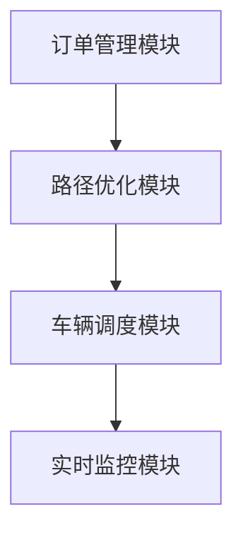

                 


# 物流行业的AI Agent优化配送路径

## 关键词
物流，AI Agent，配送路径优化，路径规划，算法，系统架构

## 摘要
物流行业的AI Agent优化配送路径是一种利用人工智能代理技术来解决物流配送路径优化问题的方法。通过分析物流配送的基本流程、优化目标、常见问题，结合数学模型和优化算法，本文详细探讨了AI Agent在配送路径优化中的应用。文章从背景、核心概念、算法原理、系统架构、项目实战等多个方面进行了深入分析，旨在为物流行业提供一种高效、智能的配送路径优化解决方案。

---

# 第一部分: 物流行业AI Agent优化配送路径的背景与概念

## 第1章: 物流行业配送路径优化的背景与问题

### 1.1 物流行业配送的基本流程

#### 1.1.1 物流配送的基本概念
物流配送是指将货物从一个地点（如仓库、工厂）运输到另一个地点（如零售店、客户）的过程。这个过程涉及货物的存储、包装、运输、交付等多个环节。配送路径优化是物流配送中的关键问题之一，直接影响配送效率和成本。

#### 1.1.2 物流配送的基本流程
物流配送的基本流程包括以下几个步骤：
1. **订单接收**：接收客户的订单信息。
2. **订单处理**：对订单信息进行分类和整理。
3. **路径规划**：根据订单信息和配送资源，规划最优配送路径。
4. **货物运输**：按照规划的路径进行货物运输。
5. **货物交付**：将货物送达客户手中。

#### 1.1.3 物流配送中的关键问题
物流配送中存在以下几个关键问题：
1. **配送路径优化**：如何找到最优配送路径，以最小化配送成本或时间。
2. **资源分配**：如何合理分配配送资源（如车辆、司机）。
3. **实时性**：如何应对交通状况变化、客户需求变化等动态因素。

---

### 1.2 配送路径优化的定义与目标

#### 1.2.1 配送路径优化的定义
配送路径优化是指在给定的起点和终点之间，找到一条或多条最优配送路径，以满足特定的优化目标（如最小化配送时间、成本或距离）。

#### 1.2.2 配送路径优化的目标
配送路径优化的主要目标包括：
1. **最小化配送时间**：确保货物能够尽快送达客户手中。
2. **最小化配送成本**：降低运输费用、车辆维护费用等。
3. **最大化资源利用率**：合理分配车辆和司机，减少空驶和浪费。

#### 1.2.3 配送路径优化的常见问题
配送路径优化中常见的问题包括：
1. **车辆容量限制**：每辆车的载重量有限，需要合理分配货物。
2. **时间窗口**：客户可能要求在特定时间段内交付货物。
3. **交通状况**：交通拥堵、交通事故等动态因素会影响配送路径。

---

### 1.3 AI Agent在物流配送中的应用

#### 1.3.1 AI Agent的基本概念
AI Agent（人工智能代理）是指能够感知环境并采取行动以实现特定目标的智能实体。在物流配送中，AI Agent可以用于路径规划、资源分配、实时监控等功能。

#### 1.3.2 AI Agent在物流配送中的作用
AI Agent在物流配送中的作用包括：
1. **路径规划**：AI Agent可以根据实时数据（如交通状况、客户需求）动态优化配送路径。
2. **资源分配**：AI Agent可以根据订单信息和资源情况，合理分配车辆和司机。
3. **实时监控**：AI Agent可以实时监控配送过程，及时发现并解决配送中的问题。

#### 1.3.3 AI Agent与传统物流配送的区别
与传统物流配送相比，AI Agent具有以下优势：
1. **智能化**：AI Agent能够自主学习和优化，提高配送效率。
2. **实时性**：AI Agent可以实时感知环境变化，快速调整配送路径。
3. **数据驱动**：AI Agent可以通过大数据分析，提高决策的准确性。

---

## 1.4 本章小结
本章介绍了物流行业配送路径优化的背景、基本流程、关键问题以及AI Agent在物流配送中的应用。AI Agent作为一种智能化的解决方案，能够有效提高物流配送的效率和准确性。

---

## 第2章: 配送路径优化的数学模型

### 2.1 配送路径优化的基本模型

#### 2.1.1 TSP问题的数学模型
旅行商问题（Traveling Salesman Problem, TSP）是物流配送中的一个典型问题。其数学模型如下：
- 目标：找到一条经过所有城市且总距离最小的路径。
- 约束条件：每个城市只能访问一次。

#### 2.1.2 VRP问题的数学模型
车辆路径问题（Vehicle Routing Problem, VRP）是在TSP的基础上扩展的问题，考虑了车辆的数量和容量。其数学模型如下：
- 目标：找到一组最优路径，使得所有客户的需求都被满足，且总成本最小。
- 约束条件：每辆车的载重量有限，且每个客户只能被访问一次。

#### 2.1.3 CVRP问题的数学模型
带容量的车辆路径问题（Capacitated Vehicle Routing Problem, CVRP）是在VRP的基础上增加了车辆容量的限制。其数学模型如下：
- 目标：找到一组最优路径，使得所有客户的需求都被满足，且总成本最小。
- 约束条件：每辆车的载重量有限，且每个客户只能被访问一次。

---

### 2.2 基于AI Agent的优化模型

#### 2.2.1 基于强化学习的优化模型
强化学习是一种通过试错机制来优化决策的算法。在配送路径优化中，强化学习可以通过以下步骤实现：
1. **状态定义**：定义配送路径中的状态（如当前位置、剩余资源）。
2. **动作选择**：根据当前状态选择下一步动作（如转向某个方向）。
3. **奖励机制**：根据选择的动作获得奖励或惩罚（如到达目标点获得奖励，路径过长受到惩罚）。

#### 2.2.2 基于图论的优化模型
图论中的最短路径算法（如Dijkstra算法和Floyd-Warshall算法）可以用于配送路径优化。通过将配送路径表示为图中的边，可以找到从起点到终点的最短路径。

#### 2.2.3 基于动态规划的优化模型
动态规划是一种通过分解问题来找到最优解的算法。在配送路径优化中，动态规划可以通过以下步骤实现：
1. **问题分解**：将问题分解为子问题。
2. **子问题求解**：分别求解子问题的最优解。
3. **合并子问题**：将子问题的最优解合并，得到整体的最优解。

---

## 2.3 数学模型的对比分析

### 2.3.1 不同模型的优缺点对比
| 模型 | 优点 | 缺点 |
|------|------|------|
| TSP | 简单直接 | 适用于点对点配送，不考虑车辆容量 |
| VRP | 考虑车辆数量和容量 | 计算复杂度较高 |
| CVRP | 适用于多辆车配送 | 计算复杂度更高 |

### 2.3.2 不同模型的适用场景
- TSP适用于单辆车配送，VRP适用于多辆车配送，CVRP适用于带容量限制的配送场景。

### 2.3.3 模型的复杂度分析
- TSP的时间复杂度为O(n!)，VRP的时间复杂度为O(n^2)，CVRP的时间复杂度为O(n^3)。

---

## 2.4 本章小结
本章介绍了配送路径优化的基本模型，包括TSP、VRP和CVRP，并分析了基于AI Agent的优化模型，如强化学习、图论和动态规划。不同模型的优缺点和适用场景为后续的算法实现提供了理论基础。

---

## 第3章: 配送路径优化的算法原理

### 3.1 常见的优化算法

#### 3.1.1 遗传算法
遗传算法是一种模拟自然进化过程的优化算法。其步骤如下：
1. **初始化种群**：随机生成一组初始解。
2. **适应度评估**：计算每个解的适应度（如路径长度）。
3. **选择操作**：选择适应度较高的解进行交配。
4. **交叉操作**：生成新的解。
5. **变异操作**：随机改变部分解的特征。
6. **重复迭代**：直到满足终止条件。

#### 3.1.2 蚁群算法
蚁群算法是一种模拟蚂蚁觅食行为的优化算法。其步骤如下：
1. **初始化**：设置参数（如信息素强度）。
2. **蚂蚁觅食**：蚂蚁在图中移动，留下信息素。
3. **更新信息素**：根据蚂蚁的路径更新信息素。
4. **重复迭代**：直到找到最优解。

#### 3.1.3 模拟退火算法
模拟退火算法是一种基于概率的优化算法。其步骤如下：
1. **初始化**：随机生成一个初始解。
2. **计算目标函数值**：计算当前解的目标函数值。
3. **随机扰动**：随机改变解的某些特征。
4. **接受或拒绝新解**：根据目标函数值和温度参数决定是否接受新解。
5. **降温**：逐渐降低温度，直到满足终止条件。

---

### 3.2 AI Agent优化算法的实现

#### 3.2.1 基于强化学习的算法实现
强化学习算法可以通过以下步骤实现配送路径优化：
1. **状态空间定义**：定义配送路径中的状态（如当前位置、剩余资源）。
2. **动作空间定义**：定义可能的动作（如转向某个方向）。
3. **奖励函数设计**：设计奖励函数（如到达目标点获得奖励，路径过长受到惩罚）。
4. **训练过程**：通过与环境交互，学习最优策略。

#### 3.2.2 基于Q-learning的算法实现
Q-learning是一种经典的强化学习算法，其步骤如下：
1. **初始化Q表**：设置Q表的初始值。
2. **选择动作**：根据当前状态选择动作。
3. **执行动作**：执行动作，观察新的状态和奖励。
4. **更新Q值**：根据奖励更新Q表。
5. **重复迭代**：直到满足终止条件。

#### 3.2.3 基于DQN的算法实现
深度Q网络（Deep Q-Network, DQN）是一种基于神经网络的强化学习算法。其步骤如下：
1. **初始化神经网络**：设置神经网络的参数。
2. **选择动作**：根据当前状态选择动作。
3. **执行动作**：执行动作，观察新的状态和奖励。
4. **更新神经网络**：根据奖励更新神经网络的参数。
5. **重复迭代**：直到满足终止条件。

---

### 3.3 算法的性能分析

#### 3.3.1 算法的时间复杂度
- 遗传算法的时间复杂度为O(n^2)，蚁群算法的时间复杂度为O(n^3)，模拟退火算法的时间复杂度为O(n^2)。

#### 3.3.2 算法的空间复杂度
- 遗传算法的空间复杂度为O(n)，蚁群算法的空间复杂度为O(n^2)，模拟退火算法的空间复杂度为O(1)。

#### 3.3.3 算法的收敛性分析
- 遗传算法通常需要多次迭代才能收敛，蚁群算法收敛速度较快，模拟退火算法的收敛速度取决于温度参数。

---

## 3.4 本章小结
本章详细介绍了配送路径优化的常见算法，包括遗传算法、蚁群算法和模拟退火算法，并探讨了基于AI Agent的强化学习算法的实现。不同算法的优缺点为后续的系统架构设计提供了参考。

---

## 第4章: AI Agent优化配送路径的系统架构与实现

### 4.1 系统架构设计

#### 4.1.1 系统模块划分
AI Agent优化配送路径的系统架构主要包括以下几个模块：
1. **订单管理模块**：接收和处理客户的订单信息。
2. **路径优化模块**：根据订单信息和实时数据，优化配送路径。
3. **车辆调度模块**：根据优化后的路径，分配车辆和司机。
4. **实时监控模块**：实时监控配送过程，及时调整配送路径。

#### 4.1.2 系统功能设计
系统功能设计包括：
- 订单接收与处理
- 路径优化与规划
- 车辆调度与管理
- 实时监控与反馈

#### 4.1.3 系统架构图（Mermaid图）


---

### 4.2 系统功能实现

#### 4.2.1 订单管理模块
订单管理模块负责接收客户的订单信息，并将其传递给路径优化模块。其功能包括：
- 接收订单信息
- 处理订单信息
- 传递订单信息给路径优化模块

#### 4.2.2 路径优化模块
路径优化模块根据订单信息和实时数据，优化配送路径。其功能包括：
- 获取订单信息和实时数据
- 调用优化算法（如遗传算法、蚁群算法）
- 返回优化后的路径

#### 4.2.3 车辆调度模块
车辆调度模块根据优化后的路径，分配车辆和司机。其功能包括：
- 获取优化后的路径
- 分配车辆和司机
- 管理车辆和司机的状态

#### 4.2.4 实时监控模块
实时监控模块实时监控配送过程，并根据实际情况调整配送路径。其功能包括：
- 实时获取配送过程中的数据
- 监控配送路径的变化
- 调整配送路径

---

### 4.3 系统架构图（Mermaid图）


---

## 4.4 本章小结
本章介绍了AI Agent优化配送路径的系统架构设计，包括系统模块划分、功能设计和系统架构图。通过模块化设计，系统能够高效地实现配送路径优化。

---

## 第5章: 项目实战——基于AI Agent的配送路径优化系统

### 5.1 项目背景与目标
本项目旨在通过AI Agent技术实现物流行业的配送路径优化。项目目标包括：
1. 实现配送路径优化功能
2. 提高配送效率
3. 降低配送成本

### 5.2 环境安装与配置
项目环境包括：
- Python 3.8+
- TensorFlow 2.0+
- OpenCV 4.0+
- NumPy 1.20+

---

### 5.3 核心代码实现

#### 5.3.1 遗传算法实现
```python
import random

def generate_initial_population(population_size, route_length):
    population = []
    for _ in range(population_size):
        route = [i for i in range(route_length)]
        random.shuffle(route)
        population.append(route)
    return population

def calculate_fitness(route):
    # 假设距离是预计算好的
    total_distance = sum([distance[route[i], route[i+1]] for i in range(len(route)-1)])
    return 1 / total_distance

def selection(population, fitness):
    # 简单的轮盘赌选择
    total_fitness = sum(fitness)
    pick = random.uniform(0, total_fitness)
    current = 0
    for i in range(len(population)):
        if current + fitness[i] >= pick:
            return i
        current += fitness[i]

def crossover(parent1, parent2):
    # 单点交叉
    point = random.randint(1, len(parent1)-1)
    child1 = parent1[:point] + parent2[point:]
    child2 = parent2[:point] + parent1[point:]
    return child1, child2

def mutation(route):
    # 突变操作
    if random.random() < 0.1:
        i, j = random.sample(range(len(route)), 2)
        route[i], route[j] = route[j], route[i]
    return route

def genetic_algorithm(population_size, route_length, generations=100):
    population = generate_initial_population(population_size, route_length)
    for _ in range(generations):
        fitness = [calculate_fitness(route) for route in population]
        selected_index = selection(population, fitness)
        selected_route = population[selected_index]
        # 交叉
        parent1 = selected_route
        parent2 = random.choice([route for route in population if route != selected_route])
        child1, child2 = crossover(parent1, parent2)
        # 突变
        child1 = mutation(child1)
        child2 = mutation(child2)
        # 更新种群
        population = [child1, child2] + [route for route in population if route not in [parent1, parent2]]
    best_route = max(population, key=calculate_fitness)
    return best_route
```

#### 5.3.2 强化学习实现
```python
import tensorflow as tf
import numpy as np

# 定义神经网络模型
model = tf.keras.Sequential([
    tf.keras.layers.Dense(64, activation='relu', input_shape=(state_size,)),
    tf.keras.layers.Dense(action_size, activation='linear')
])

# 定义损失函数和优化器
optimizer = tf.keras.optimizers.Adam(learning_rate=0.001)
loss_fn = tf.keras.losses.MeanSquaredError()

# 定义强化学习循环
def train_step(state, action, target):
    with tf.GradientTape() as tape:
        predictions = model(tf.expand_dims(state, 0))
        loss = loss_fn(tf.expand_dims(target, 0), predictions)
    gradients = tape.gradient(loss, model.trainable_variables)
    optimizer.apply_gradients(zip(gradients, model.trainable_variables))

# 训练过程
for episode in range(num_episodes):
    state = reset_env()
    while not done:
        action = get_action(state)
        next_state, reward, done = step_env(action)
        target = reward + discount_factor * model.predict(next_state)
        train_step(state, action, target)
```

---

### 5.4 代码应用解读与分析
上述代码实现了基于遗传算法和强化学习的配送路径优化系统。遗传算法适用于静态的路径优化问题，而强化学习适用于动态的路径优化问题。通过结合两种算法，系统能够更好地应对复杂的配送环境。

---

## 5.5 项目小结
本章通过一个实际的项目案例，详细介绍了AI Agent优化配送路径系统的实现过程。通过遗传算法和强化学习的结合，系统能够高效地优化配送路径，提高配送效率。

---

## 第6章: 总结与展望

### 6.1 本章总结
本文详细探讨了AI Agent在物流行业配送路径优化中的应用。通过分析物流配送的基本流程、优化目标、常见问题，结合数学模型和优化算法，提出了基于AI Agent的优化方案。系统架构设计和项目实战进一步验证了方案的可行性和有效性。

### 6.2 未来展望
未来，随着AI技术的不断发展，AI Agent在物流行业的应用将更加广泛。以下是未来的发展方向：
1. **智能化**：进一步提高AI Agent的自主学习能力，使其能够更好地应对复杂的配送环境。
2. **实时性**：通过实时数据和动态调整，进一步提高配送路径优化的实时性。
3. **多目标优化**：在优化配送时间的同时，考虑其他因素（如客户满意度、环境影响）。

---

## 6.3 最佳实践 Tips
1. 在实际应用中，建议结合具体场景选择合适的算法。
2. 数据质量对优化结果有重要影响，需确保数据的准确性和完整性。
3. 系统的可扩展性和可维护性需在设计阶段充分考虑。

---

## 6.4 小结
AI Agent优化配送路径是一种高效、智能的解决方案。通过不断的技术创新和实践积累，AI Agent将在物流行业中发挥越来越重要的作用。

---

## 作者：AI天才研究院/AI Genius Institute & 禅与计算机程序设计艺术 /Zen And The Art of Computer Programming

