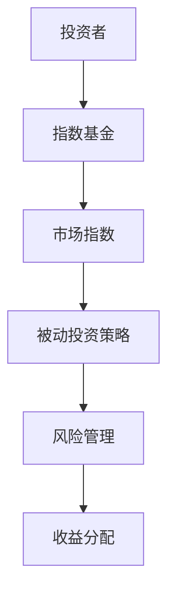
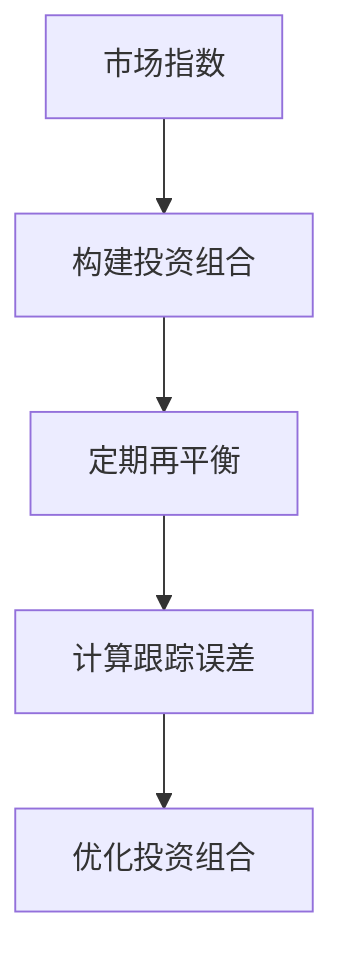
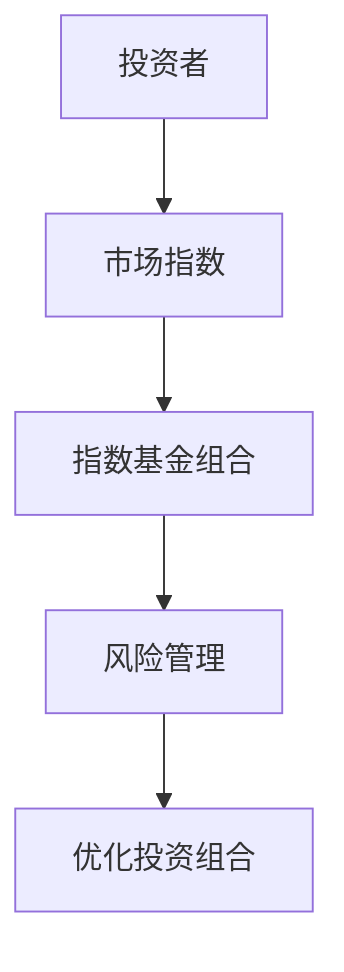
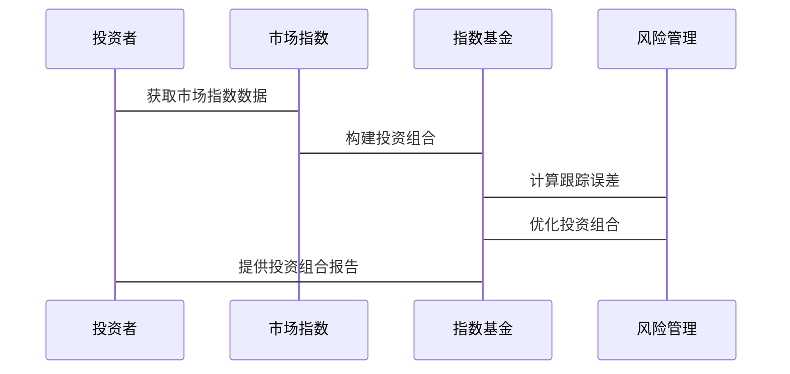

                 


# 约翰·伯格的遗产：被动投资的未来

> 关键词：被动投资、指数基金、约翰·伯格、投资策略、风险管理

> 摘要：本文深入探讨被动投资的起源与发展，详细分析约翰·伯格的遗产及其对现代投资策略的影响。通过技术化的语言，我们阐述了被动投资的核心概念、算法原理、系统架构，并结合实际案例进行详细解读，最后展望了被动投资的未来趋势。

---

# 第一部分: 被动投资的背景与核心概念

## 第1章: 被动投资的起源与约翰·伯格的遗产

### 1.1 被动投资的起源

#### 1.1.1 投资的定义与分类
- **投资**：是指将资金投入到某种资产中，以期望在未来获得收益或资本增值。
- **主动投资**：投资者试图通过主动选择股票、债券等资产来超越市场表现。
- **被动投资**：投资者通过跟踪市场指数，如标普500，来获得市场平均收益。

#### 1.1.2 被动投资的起源与发展
- **起源**：20世纪70年代，随着对市场有效性的研究，被动投资逐渐兴起。
- **发展**：指数基金的出现使得被动投资变得更简单和经济。

#### 1.1.3 约翰·伯格的贡献与影响
- **约翰·伯格**： Vanguard集团的创始人，他推动了低成本指数基金的发展。
- **影响**：伯格的遗产使得被动投资成为全球投资者的重要选择。

### 1.2 约翰·伯格的遗产

#### 1.2.1 约翰·伯格的生平简介
- **早期经历**：伯格在金融行业积累了丰富的经验，最终创立了Vanguard集团。
- **贡献**：他发明了指数基金，改变了投资行业。

#### 1.2.2 约翰·伯格的投资理念
- **长期投资**：伯格认为长期持有指数基金是实现财富增长的最佳方式。
- **低成本**：他强调降低管理费用对投资回报的重要性。

#### 1.2.3 约翰·伯格对被动投资的贡献
- **低成本指数基金**：伯格的创新使得更多投资者能够以更低的成本获得市场平均收益。
- **教育投资者**：他通过著作和演讲，普及了被动投资的理念。

### 1.3 现代被动投资的发展

#### 1.3.1 被动投资的定义与特点
- **定义**：被动投资是通过跟踪市场指数来实现投资收益，不主动择时或选股。
- **特点**：分散风险、低成本、简单易行。

#### 1.3.2 被动投资与主动投资的区别
- **目标**：被动投资追求市场平均收益，主动投资追求超额收益。
- **成本**：被动投资费用低，主动投资费用高。

#### 1.3.3 被动投资在全球市场中的应用
- **美国市场**：指数基金占据重要地位，如Vanguard的标普500指数基金。
- **新兴市场**：被动投资逐渐普及，吸引更多投资者。

### 1.4 被动投资的未来趋势

#### 1.4.1 技术进步对被动投资的影响
- **自动化投资工具**：技术使得被动投资更加便捷，如智能投顾。
- **大数据分析**：技术进步帮助投资者更好地构建指数基金。

#### 1.4.2 被动投资在新兴市场中的潜力
- **增长空间**：随着全球化的推进，新兴市场的被动投资需求增加。
- **低成本技术**：技术进步降低了新兴市场的投资门槛。

#### 1.4.3 被动投资的风险与挑战
- **市场波动**：被动投资无法避免市场整体波动。
- **流动性风险**：在某些新兴市场，被动投资可能面临流动性问题。

## 1.5 本章小结
本章详细介绍了被动投资的起源与发展，重点分析了约翰·伯格的遗产及其对被动投资的深远影响。被动投资作为一种简单有效的投资策略，正在全球范围内得到广泛应用，未来也将面临更多的机遇和挑战。

---

## 第2章: 被动投资的核心概念与原理

### 2.1 被动投资的核心概念

#### 2.1.1 指数基金的定义与特点
- **定义**：指数基金是跟踪特定市场指数的基金，如标普500。
- **特点**：分散风险、低成本、长期稳定收益。

#### 2.1.2 被动投资的策略与目标
- **策略**：长期持有指数基金，避免频繁交易。
- **目标**：实现市场平均收益，降低投资风险。

#### 2.1.3 被动投资的适用场景
- **适合长期投资者**：适合那些无法或不愿频繁监控投资的人。
- **适合稳健投资者**：适合追求稳定收益而非高风险高回报的投资者。

### 2.2 被动投资的数学模型与公式

#### 2.2.1 投资回报的计算公式
- **单利计算**：\( \text{单利} = P \times (1 + r \times t) \)
- **复利计算**：\( \text{复利} = P \times (1 + r)^t \)

#### 2.2.2 指数基金的跟踪误差
- **跟踪误差公式**：\( \text{跟踪误差} = \sqrt{\text{基金收益} - \text{指数收益}} \)

#### 2.2.3 被动投资的风险调整收益模型
- **夏普比率**：\( \text{夏普比率} = \frac{E[r - r_f]}{\sigma} \)
  - \( E[r] \)：基金的预期收益
  - \( r_f \)：无风险利率
  - \( \sigma \)：基金收益的标准差

### 2.3 被动投资与主动投资的对比

#### 2.3.1 投资目标的对比
- **被动投资**：追求市场平均收益。
- **主动投资**：追求超越市场平均收益。

#### 2.3.2 投资策略的对比
- **被动投资**：长期持有，减少交易。
- **主动投资**：频繁交易，主动选股。

#### 2.3.3 成本与收益的对比
- **被动投资**：管理费用低。
- **主动投资**：管理费用高。

### 2.4 被动投资的ER实体关系图



## 2.5 本章小结
本章详细讲解了被动投资的核心概念，包括指数基金的定义、被动投资的策略与目标，以及被动投资与主动投资的对比。通过数学模型和ER图，进一步分析了被动投资的运作机制和风险管理。

---

## 第3章: 被动投资的算法原理与实现

### 3.1 被动投资的算法原理

#### 3.1.1 指数基金构建算法
- **步骤**：
  1. 选择市场指数。
  2. 按指数成分股的权重配置资金。
  3. 定期再平衡投资组合。

#### 3.1.2 被动投资组合优化算法
- **目标**：最小化跟踪误差。
- **方法**：使用优化算法调整投资组合权重。

#### 3.1.3 市场风险评估算法
- **方法**：利用历史波动率和相关性矩阵评估市场风险。

### 3.2 被动投资算法的Python实现

#### 3.2.1 示例代码：构建指数基金组合

```python
import numpy as np
import pandas as pd

# 示例：构建一个简单的指数基金组合

# 假设市场指数成分股及其权重
index_weights = {'股票A': 0.3, '股票B': 0.2, '股票C': 0.5}

# 模拟市场指数表现
market_returns = pd.Series([0.1, -0.02, 0.05], index=['2023-01', '2023-02', '2023-03'])

# 计算基金收益
fund_returns = sum(index_weights[stock] * market_returns for stock in index_weights)

# 计算跟踪误差
tracking_error = np.std(fund_returns - market_returns.mean())

print("跟踪误差:", tracking_error)
```

#### 3.2.2 算法流程图



### 3.3 被动投资的数学模型

#### 3.3.1 简单线性回归模型

$$ y = \beta x + \epsilon $$

其中：
- \( y \)：市场指数收益
- \( x \)：投资组合收益
- \( \beta \)：回归系数
- \( \epsilon \)：误差项

#### 3.3.2 跟踪误差的数学表达

$$ \text{跟踪误差} = \sqrt{E[(r_f - r_m)^2]} $$

其中：
- \( r_f \)：基金收益
- \( r_m \)：市场收益

### 3.4 本章小结
本章详细讲解了被动投资的算法原理，包括指数基金构建、组合优化和风险评估。通过Python代码和数学模型，展示了被动投资的具体实现方法和优化策略。

---

## 第4章: 被动投资的系统分析与架构设计

### 4.1 系统分析

#### 4.1.1 问题场景介绍
- **场景**：投资者希望通过被动投资实现长期收益，需要构建一个指数基金投资系统。

#### 4.1.2 系统功能设计
- **需求分析**：
  - 自动化构建指数基金组合。
  - 定期再平衡投资组合。
  - 监测跟踪误差并优化。

### 4.2 系统架构设计

#### 4.2.1 领域模型设计


#### 4.2.2 系统架构图



### 4.3 接口设计与交互流程

#### 4.3.1 系统接口设计
- **输入接口**：投资者资金和投资目标。
- **输出接口**：投资组合配置和跟踪误差报告。

#### 4.3.2 交互流程图



### 4.4 本章小结
本章从系统分析的角度，详细设计了被动投资系统的架构，包括领域模型和系统交互流程，为实际应用提供了理论基础。

---

## 第5章: 被动投资的项目实战

### 5.1 环境安装

#### 5.1.1 安装Python环境
- **工具**：安装Python 3.x，推荐使用Anaconda。

#### 5.1.2 安装相关库
```bash
pip install numpy pandas matplotlib
```

### 5.2 核心代码实现

#### 5.2.1 示例代码：构建指数基金组合

```python
import numpy as np
import pandas as pd

# 示例数据：市场指数成分股及其权重
index_weights = {'股票A': 0.3, '股票B': 0.2, '股票C': 0.5}

# 模拟市场收益率
market_returns = pd.Series([0.1, -0.02, 0.05], index=['2023-01', '2023-02', '2023-03'])

# 计算投资组合收益
fund_returns = sum(index_weights[stock] * market_returns for stock in index_weights)

# 计算跟踪误差
tracking_error = np.std(fund_returns - market_returns.mean())

print("跟踪误差:", tracking_error)
```

#### 5.2.2 代码解读与分析
- **数据输入**：市场指数成分股及其权重。
- **计算投资组合收益**：根据权重和市场收益率计算投资组合收益。
- **跟踪误差计算**：衡量投资组合与市场指数的偏离程度。

### 5.3 案例分析与解读

#### 5.3.1 实际案例分析
- **案例**：构建一个跟踪标普500的指数基金组合。
- **步骤**：
  1. 数据收集：获取标普500成分股及其权重。
  2. 计算投资组合收益。
  3. 监测跟踪误差并优化。

#### 5.3.2 案例解读
- **数据来源**：使用历史数据计算指数收益。
- **优化策略**：定期再平衡投资组合以减少跟踪误差。

### 5.4 项目小结
本章通过实际案例分析，详细讲解了被动投资的实现过程，包括环境搭建、代码实现和案例解读，为读者提供了实战经验。

---

## 第6章: 被动投资的未来展望与最佳实践

### 6.1 未来展望

#### 6.1.1 技术进步对被动投资的影响
- **自动化投资工具**：人工智能和大数据技术将推动被动投资进一步发展。
- **全球化市场**：被动投资将扩展到更多新兴市场。

#### 6.1.2 被动投资的风险管理
- **风险管理技术**：利用现代统计方法和技术工具，提升风险管理能力。

### 6.2 最佳实践 tips

#### 6.2.1 投资者建议
- **长期投资**：坚持长期持有，避免短期波动影响。
- **选择低成本基金**：降低管理费用，提高净收益。

#### 6.2.2 系统优化建议
- **定期再平衡**：保持投资组合与市场指数一致。
- **监控跟踪误差**：及时调整优化投资组合。

### 6.3 本章小结
本章展望了被动投资的未来发展方向，并提供了投资者和系统的最佳实践建议，帮助读者更好地应对未来的挑战和机遇。

---

## 作者：AI天才研究院/AI Genius Institute & 禅与计算机程序设计艺术 /Zen And The Art of Computer Programming

---

通过以上结构，文章详细介绍了被动投资的背景、核心概念、算法实现、系统设计和实际案例，为读者提供了全面的技术解读和实践指导。

