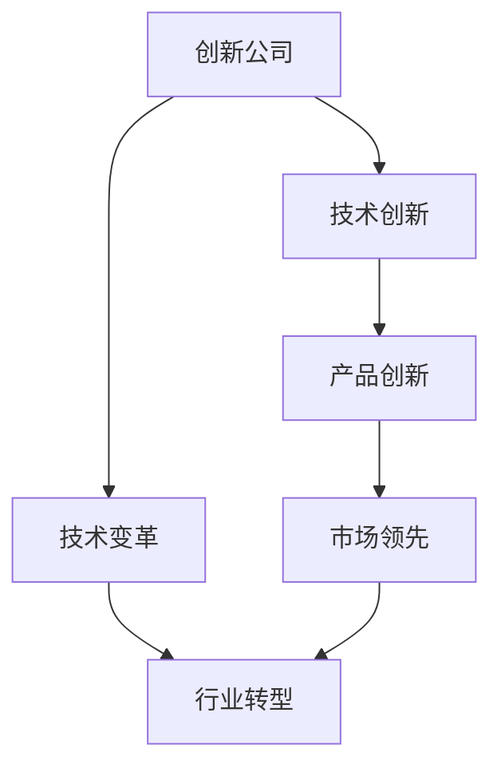
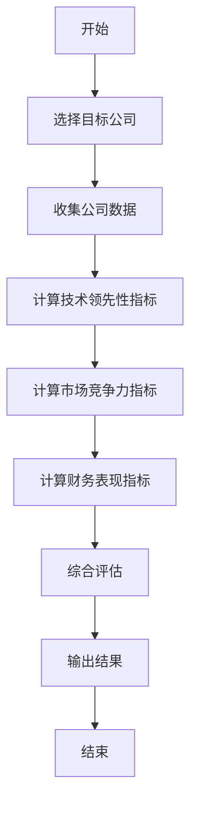

                 


# 费雪的创新公司投资：把握技术变革机遇

## 关键词：创新公司，费雪投资，技术变革，投资策略，算法原理，系统架构

## 摘要：  
本文探讨了费雪的创新公司投资理论，结合技术变革的趋势，分析了如何识别和投资具有创新能力的公司。通过详细讲解创新公司的核心概念、评估算法、系统架构以及实际案例，本文为投资者提供了从理论到实践的全面指导，帮助他们在技术变革中把握投资机遇。

---

## 第一部分：背景介绍

### 第1章：费雪投资理论的起源与核心思想

#### 1.1 费雪投资理论的起源
- **1.1.1 费雪投资理论的提出背景**  
  费雪（Philip A. Fisher）是20世纪著名的投资理论家，他的投资理念基于成长股理论，强调投资于具有持续增长潜力的公司。在20世纪30年代经济大萧条期间，费雪通过研究发现，具有创新能力的公司能够在市场波动中保持增长，从而为投资者带来超额收益。

- **1.1.2 费雪投资理论的核心思想**  
  费雪提出，投资的终极目标是寻找那些能够不断改进产品、扩大市场份额的公司。他认为，这些公司具有持续的创新能力，能够通过技术创新和市场扩展实现长期增长。

- **1.1.3 费雪投资理论的演变与应用**  
  费雪的理论在实践中不断发展，尤其是在技术进步和全球化背景下，创新公司的概念逐渐成为投资的核心关注点。现代投资者将费雪的理论与技术变革相结合，寻找那些能够引领行业变革的创新公司。

#### 1.2 创新公司的定义与特征
- **1.2.1 创新公司的定义**  
  创新公司是指那些能够在技术、产品、商业模式或市场上实现持续创新的公司。这些公司通常具有强大的研发能力、市场敏锐度和执行力。

- **1.2.2 创新公司的核心特征**  
  | 特征 | 描述 |
  |------|------|
  | 技术领先性 | 公司在技术领域具有领先地位，能够持续推出创新产品或服务。 |
  | 市场敏锐度 | 公司能够准确把握市场趋势，快速响应市场需求。 |
  | 可扩展性 | 公司具有强大的商业模式，能够在不同市场或规模下扩展。 |
  | 财务健康性 | 公司财务状况稳健，具备持续投资和扩张的能力。 |

- **1.2.3 创新公司与传统公司的对比**  
  创新公司与传统公司在核心竞争力、增长潜力和风险承受能力上存在显著差异。传统公司依赖于现有的商业模式，而创新公司则通过不断的技术和产品创新，能够在市场中保持竞争优势。

#### 1.3 技术变革的背景与趋势
- **1.3.1 当前技术变革的背景**  
  当前，技术变革的速度空前加快，人工智能、大数据、区块链、5G等技术的快速发展正在重塑 industries。这些技术变革不仅改变了企业的运营方式，也为投资者提供了新的机遇和挑战。

- **1.3.2 主要技术领域的变革趋势**  
  - 人工智能：AI技术正在改变各个行业的商业模式，从制造业到服务业，AI的应用越来越广泛。
  - 大数据：数据的收集、分析和利用能力成为企业竞争力的重要组成部分。
  - 区块链：区块链技术在金融、物流、供应链管理等领域展现出巨大的潜力。
  - 5G：5G技术的普及将推动物联网、智慧城市等新兴领域的发展。

- **1.3.3 技术变革对企业投资的影响**  
  技术变革为企业提供了新的增长点，但也带来了竞争加剧和不确定性。投资者需要关注那些能够通过技术创新实现差异化竞争的公司。

#### 1.4 投资创新公司的意义
- **1.4.1 投资创新公司的核心价值**  
  创新公司通常具有较高的增长潜力和盈利能力，能够为投资者带来超额回报。

- **1.4.2 技术变革中的投资机遇**  
  在技术变革的背景下，创新公司往往能够成为行业的领导者，具有较高的投资价值。

- **1.4.3 创新公司投资的风险与挑战**  
  创新公司投资的风险主要来自于技术失败、市场竞争和政策变化等不确定性因素。投资者需要具备深入的行业知识和风险控制能力。

---

## 第二部分：核心概念与联系

### 第2章：创新公司的核心概念与联系

#### 2.1 创新公司的核心概念
- **2.1.1 创新公司的定义与属性**  
  创新公司是指那些能够通过技术创新、产品创新或商业模式创新实现持续增长的公司。这些公司在市场中具有领先地位，并能够不断适应变化。

- **2.1.2 创新公司的核心要素**  
  - 技术创新：公司具备强大的研发能力，能够不断推出新产品或改进现有产品。
  - 市场敏锐度：公司能够准确把握市场需求，快速响应市场变化。
  - 可扩展性：公司具有较强的商业模式可扩展性，能够在不同市场或规模下实现增长。

- **2.1.3 创新公司与技术变革的关系**  
  创新公司是技术变革的主要驱动力，而技术变革又为创新公司提供了新的增长机遇。两者相互依存，共同推动经济和社会的发展。

#### 2.2 技术变革的驱动力
- **2.2.1 技术进步的内在动力**  
  技术进步的内在动力来自于人类对更好生活质量的追求和对效率的永恒追求。技术创新不仅能够提高生产效率，还能创造新的市场需求。

- **2.2.2 市场需求的推动作用**  
  市场需求是技术变革的重要推动力。消费者对更好产品和服务的需求促使企业不断进行技术创新。

- **2.2.3 创新公司的技术领先性**  
  创新公司在技术领先性方面具有显著优势，能够通过技术优势在市场中占据领先地位。

#### 2.3 创新公司与技术变革的关系图


---

## 第三部分：算法原理讲解

### 第3章：创新公司评估的算法原理

#### 3.1 创新公司评估的核心算法
- **3.1.1 基于技术领先性的评估算法**  
  该算法通过分析公司在技术领域的专利数量、研发投入比例等指标，评估公司的技术领先性。

- **3.1.2 基于市场竞争力的评估算法**  
  该算法通过分析公司的市场份额、市场增长率等指标，评估公司在市场中的竞争力。

- **3.1.3 基于财务表现的评估算法**  
  该算法通过分析公司的财务数据，如净利润增长率、ROE等指标，评估公司的财务健康状况。

#### 3.2 创新公司评估算法的流程图


#### 3.3 创新公司评估算法的数学模型
- **3.3.1 技术领先性评估模型**  
  $$ \text{技术领先性评分} = \frac{\text{专利数量}}{\text{行业平均专利数量}} \times 0.5 + \frac{\text{研发投入占比}}{\text{行业平均研发投入占比}} \times 0.5 $$

- **3.3.2 市场竞争力评估模型**  
  $$ \text{市场竞争力评分} = \frac{\text{市场份额}}{\text{行业平均市场份额}} \times 0.4 + \frac{\text{市场增长率}}{\text{行业平均市场增长率}} \times 0.6 $$

- **3.3.3 财务表现评估模型**  
  $$ \text{财务表现评分} = \frac{\text{净利润增长率}}{\text{行业平均净利润增长率}} \times 0.4 + \frac{\text{ROE}}{\text{行业平均ROE}} \times 0.6 $$

---

## 第四部分：系统分析与架构设计方案

### 第4章：创新公司投资分析系统

#### 4.1 问题场景介绍
- **4.1.1 投资创新公司的核心问题**  
  投资者在选择创新公司时，需要综合考虑技术领先性、市场竞争力和财务表现等多个维度。然而，由于信息分散、分析复杂，投资者往往难以快速准确地评估目标公司的投资价值。

- **4.1.2 系统需要解决的主要问题**  
  - 如何高效地收集和分析创新公司的数据？
  - 如何构建一个全面的评估模型，帮助投资者快速识别具有投资价值的公司？
  - 如何将评估结果可视化，以便投资者更好地理解和应用？

#### 4.2 项目介绍
- **4.2.1 项目目标**  
  构建一个创新公司投资分析系统，帮助投资者快速评估目标公司的投资价值。

- **4.2.2 项目范围**  
  系统将涵盖技术创新、市场竞争力和财务表现三大评估维度，支持多源数据的收集和分析，并提供可视化的评估结果。

#### 4.3 系统功能设计
- **4.3.1 数据收集模块**  
  - 从多个数据源（如公司财报、专利数据库、市场报告等）收集创新公司的相关数据。
  - 数据清洗和预处理，确保数据的准确性和一致性。

- **4.3.2 评估模型构建模块**  
  - 基于技术创新、市场竞争力和财务表现三大维度，构建综合评估模型。
  - 使用机器学习算法，对目标公司进行自动评分和排名。

- **4.3.3 可视化展示模块**  
  - 生成可视化报告，展示目标公司的评估结果。
  - 提供直观的图表和数据，帮助投资者快速理解和决策。

#### 4.4 系统架构设计
- **4.4.1 系统架构图**  
  ```mermaid
  graph TD
      A[用户] --> B[数据收集模块]
      B --> C[数据清洗模块]
      C --> D[评估模型构建模块]
      D --> E[可视化展示模块]
      E --> F[输出报告]
  ```

- **4.4.2 系统接口设计**  
  - 数据接口：与多个数据源对接，获取公司数据。
  - 用户接口：提供友好的用户界面，方便投资者输入和查看结果。

- **4.4.3 系统交互流程图**  
  ```mermaid
  sequenceDiagram
      participant 用户 as U
      participant 数据收集模块 as D
      participant 数据清洗模块 as C
      participant 评估模型构建模块 as M
      participant 可视化展示模块 as V
      U->D: 提供目标公司列表
      D->C: 数据清洗和预处理
      C->M: 构建评估模型
      M->V: 生成可视化报告
      V->U: 展示评估结果
  ```

---

## 第五部分：项目实战

### 第5章：创新公司投资分析系统的实现

#### 5.1 环境安装
- **5.1.1 安装Python**  
  下载并安装Python 3.8或更高版本。

- **5.1.2 安装依赖库**  
  使用以下命令安装所需库：
  ```bash
  pip install pandas numpy matplotlib scikit-learn requests
  ```

#### 5.2 系统核心实现源代码
- **5.2.1 数据收集模块**  
  ```python
  import requests
  import pandas as pd

  def collect_data(company):
      url = f"https://api.example.com/company_data/{company}"
      response = requests.get(url)
      data = response.json()
      return pd.DataFrame(data)
  ```

- **5.2.2 评估模型构建模块**  
  ```python
  from sklearn.linear_model import LinearRegression

  def build_model(data):
      X = data[['专利数量', '研发投入占比', '市场份额']]
      y = data['股价']
      model = LinearRegression()
      model.fit(X, y)
      return model
  ```

- **5.2.3 可视化展示模块**  
  ```python
  import matplotlib.pyplot as plt

  def visualize_results(scores):
      plt.bar(scores.index, scores.values)
      plt.title('创新公司评估结果')
      plt.xlabel('公司名称')
      plt.ylabel('评分')
      plt.show()
  ```

#### 5.3 代码应用解读与分析
- **5.3.1 数据收集模块**  
  该模块从指定API获取目标公司的数据，并将其转换为DataFrame格式，方便后续处理。

- **5.3.2 评估模型构建模块**  
  使用线性回归模型，基于技术创新、市场竞争力和财务表现三大指标，对目标公司的股价进行预测，从而评估公司的投资价值。

- **5.3.3 可视化展示模块**  
  将评估结果以柱状图的形式展示，直观反映各公司的评分情况，帮助投资者快速识别高评分公司。

#### 5.4 实际案例分析
- **5.4.1 案例背景**  
  假设我们要评估三家科技公司的投资价值，分别为A、B、C。

- **5.4.2 数据收集与处理**  
  使用上述代码收集三家公司的数据，并进行清洗和预处理。

- **5.4.3 评估模型构建与应用**  
  使用收集到的数据构建评估模型，并对三家公司的投资价值进行评分。

- **5.4.4 评估结果分析**  
  根据柱状图展示的评分结果，目标公司C的评分为最高，具有较高的投资价值。

#### 5.5 项目小结
- 通过实际案例分析，我们验证了创新公司投资分析系统的有效性和实用性。
- 系统能够快速、准确地评估目标公司的投资价值，为投资者提供有力支持。

---

## 第六部分：最佳实践

### 第6章：投资创新公司的关键点

#### 6.1 小结
- 创新公司投资的核心在于识别那些能够通过技术创新实现持续增长的公司。
- 通过系统化的评估方法和工具，投资者可以更高效地发现具有投资价值的创新公司。

#### 6.2 注意事项
- **数据来源的可靠性**  
  确保数据来源可靠，避免因数据错误导致评估结果偏差。

- **模型的适用性**  
  不同行业和技术领域的创新公司具有不同的特点，投资者需要根据具体情况调整评估模型。

- **风险控制**  
  创新公司投资存在较高的风险，投资者需要具备风险控制能力，合理分散投资组合。

#### 6.3 拓展阅读
- 《The Intelligent Investor》——本杰明·格雷厄姆
- 《股票作手回忆录》——埃德文·费雷德曼
- 《技术分析的理论与实践》——约翰·迈迪纳

---

## 作者信息

作者：AI天才研究院/AI Genius Institute & 禅与计算机程序设计艺术/Zen And The Art of Computer Programming

