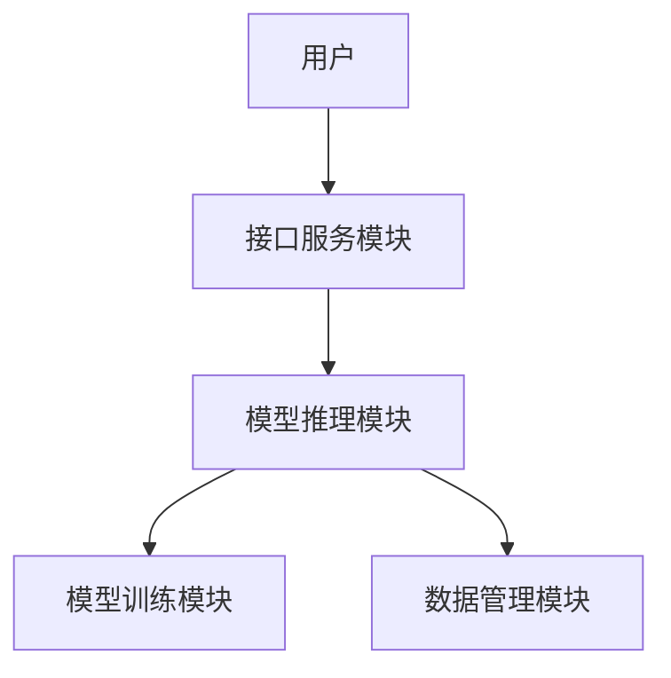
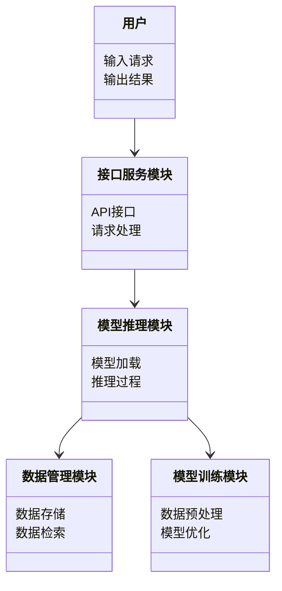

                 


# 选择合适的LLM：OpenAI GPT vs. Google BERT vs. Facebook LLaMA

> 关键词：大语言模型，LLM，GPT，BERT，LLaMA，NLP，自然语言处理

> 摘要：本文详细对比分析了OpenAI GPT、Google BERT和Facebook LLaMA三种主流大语言模型（LLM）的核心原理、应用场景和技术特点，帮助读者理解如何选择最适合自身需求的模型。

---

# 第1章: 大语言模型（LLM）概述

## 1.1 大语言模型的定义与核心概念

### 1.1.1 大语言模型的定义

大语言模型（Large Language Model，LLM）是指基于深度学习技术构建的、能够理解和生成人类语言的大型神经网络模型。这类模型通常采用Transformer架构，通过大量真实文本数据进行预训练，具备处理自然语言文本的多种能力，如文本生成、问答系统、文本摘要等。

$$
\text{LLM} = \text{深度学习} + \text{Transformer架构} + \text{大规模预训练}
$$

### 1.1.2 大语言模型的核心概念

- **预训练**：通过在海量文本数据上训练模型，使其掌握语言的结构和语义。
- **微调**：在特定任务或领域数据上进一步训练模型，提升其在特定场景下的性能。
- **生成式模型**：能够根据输入生成新的文本内容。
- **理解式模型**：能够理解和解析输入文本的语义。

### 1.1.3 大语言模型与传统NLP的区别

| 特性 | 传统NLP | 大语言模型（LLM） |
|------|---------|------------------|
| 数据需求 | 需要大量标注数据 | 依赖海量未标注数据 |
| 模型复杂度 | 模型相对简单 | 模型深度大，参数多 |
| 任务泛化能力 | 适用于特定任务 | 具备多任务泛化能力 |

---

## 1.2 大语言模型的发展历程

### 1.2.1 NLP技术的演进

- **规则驱动时代**：基于语言学规则构建NLP系统，如基于有限状态机的分词和语法分析。
- **统计驱动时代**：基于统计模型，如n-gram和隐马尔可夫模型。
- **深度学习时代**：基于深度神经网络，如RNN、LSTM和Transformer架构。

### 1.2.2 大语言模型的崛起

- **Transformer架构的提出**：由Vaswney等人提出，彻底改变了NLP领域的模型结构。
- **预训练技术的发展**：从BERT到GPT，预训练技术不断完善，模型性能显著提升。
- **开源与生态建设**：以PyTorch、TensorFlow等框架为核心，构建了完善的开源生态系统。

### 1.2.3 当前主流的大语言模型

| 模型 | 开发者 | 特点 |
|------|--------|------|
| GPT系列 | OpenAI | 基于生成式模型，擅长文本生成 |
| BERT系列 | Google | 基于理解式模型，擅长文本理解 |
| LLaMA系列 | Facebook | 开源且轻量化，适合研究和部署 |

---

## 1.3 选择合适的大语言模型的重要性

### 1.3.1 不同场景下的模型选择

- **文本生成**：GPT系列更适合。
- **文本理解**：BERT系列更适合。
- **通用任务**：LLaMA系列在开源生态和轻量化部署上有优势。

### 1.3.2 模型性能与应用场景的关系

- **性能优先**：选择参数量大的模型（如GPT-4）。
- **资源受限**：选择开源且轻量的模型（如LLaMA）。
- **特定任务优化**：选择针对特定任务优化的模型（如BERT）。

### 1.3.3 模型选择的常见误区

- **盲目追求大模型**：忽视实际应用场景和资源限制。
- **忽视可解释性**：选择黑箱模型时，需考虑结果的可解释性。
- **忽略部署成本**：选择模型时需考虑计算资源和部署成本。

---

## 1.4 本章小结

本章从大语言模型的基本概念出发，梳理了其发展历程，并重点分析了选择合适模型的重要性。通过对比不同模型的特点，为后续章节的具体分析奠定了基础。

---

# 第2章: OpenAI GPT

## 2.1 GPT系列模型概述

### 2.1.1 GPT的起源与发展

GPT（Generative Pre-trained Transformer）由OpenAI团队开发，自2018年发布以来，经历了GPT-1、GPT-2到GPT-3等多个版本的迭代，目前最新的版本是GPT-4。

### 2.1.2 GPT的核心设计理念

GPT采用生成式模型架构，通过基于Transformer的自回归方式生成文本。其核心设计理念是通过预训练的方式，让模型学会语言的生成规律。

### 2.1.3 GPT的主要应用场景

- **文本生成**：新闻生成、内容创作。
- **对话系统**：智能客服、聊天机器人。
- **代码生成**：自动编写代码片段。

---

## 2.2 GPT的算法原理

### 2.2.1 GPT的模型架构

GPT基于Transformer架构，由编码器和解码器组成。编码器负责将输入文本转换为向量表示，解码器负责根据编码器的输出生成目标文本。

$$
\text{编码器}: x \rightarrow z \\
\text{解码器}: z \rightarrow y
$$

### 2.2.2 GPT的训练过程

GPT采用自监督学习，通过预测下一个词的概率来训练模型。具体步骤如下：

1. 随机遮蔽输入序列中的部分词。
2. 模型预测被遮蔽词的概率分布。
3. 通过交叉熵损失函数优化模型参数。

### 2.2.3 GPT的推理机制

GPT的推理过程是一个自回归的过程，模型逐词生成输出，每一步都基于当前已生成的词。

$$
y_1, y_2, \dots, y_n = \text{GPT}(x)
$$

---

## 2.3 GPT的优势与局限性

### 2.3.1 GPT的优点

- **生成能力强**：在文本生成任务中表现出色。
- **易于部署**：通过API即可快速接入。
- **生态系统完善**：OpenAI提供完善的开发文档和工具支持。

### 2.3.2 GPT的不足

- **理解能力有限**：在复杂语义理解任务中表现不如BERT。
- **计算成本高**：训练和推理需要大量计算资源。
- **黑箱特性**：缺乏对生成结果的可解释性。

### 2.3.3 GPT的适用场景

- **内容生成**：新闻、文章、邮件等。
- **对话系统**：智能客服、聊天机器人。
- **创意写作**：小说、诗歌等创作。

---

## 2.4 本章小结

本章详细介绍了GPT系列模型的核心原理、应用场景及其优缺点。GPT作为生成式模型的代表，适合需要文本生成的任务。

---

# 第3章: Google BERT

## 3.1 BERT系列模型概述

### 3.1.1 BERT的起源与发展

BERT（Bidirectional Encoder Representations from Transformers）由Google团队于2018年提出，是首个基于Transformer编码器的预训练语言模型。

### 3.1.2 BERT的核心设计理念

BERT采用双向Transformer架构，通过掩码自注意力机制，同时利用上下文信息进行文本表示。

### 3.1.3 BERT的主要应用场景

- **文本理解**：问答系统、文本分类。
- **信息抽取**：实体识别、关系抽取。
- **机器翻译**：跨语言翻译任务。

---

## 3.2 BERT的算法原理

### 3.2.1 BERT的模型架构

BERT基于双向Transformer编码器，通过自注意力机制捕捉文本中的长距离依赖关系。

$$
\text{输入}: x_1, x_2, \dots, x_n \\
\text{输出}: z_1, z_2, \dots, z_n
$$

### 3.2.2 BERT的训练过程

BERT采用两种预训练任务：

1. **掩码语言模型**：随机遮蔽部分词，预测被遮蔽词。
2. **下一句预测**：判断两个句子是否是连续的。

### 3.2.3 BERT的推理机制

BERT的推理过程基于编码器输出的文本表示，通过下游任务的模型（如全连接层）进行分类或预测。

$$
\text{输出}: y = f(z_1, z_2, \dots, z_n)
$$

---

## 3.3 BERT的优势与局限性

### 3.3.1 BERT的优点

- **理解能力强**：在文本理解任务中表现优异。
- **灵活性高**：支持多种任务，如分类、问答等。
- **开源生态好**：提供多种开源实现和基准测试。

### 3.3.2 BERT的不足

- **生成能力弱**：不擅长生成任务。
- **计算资源需求高**：训练和推理需要大量计算资源。
- **依赖上下文**：生成的文本可能缺乏全局性。

### 3.3.3 BERT的适用场景

- **文本理解**：问答系统、文本分类。
- **信息抽取**：实体识别、关系抽取。
- **机器翻译**：跨语言翻译任务。

---

## 3.4 本章小结

本章详细介绍了BERT系列模型的核心原理、应用场景及其优缺点。BERT作为理解式模型的代表，适合需要文本理解的任务。

---

# 第4章: Facebook LLaMA

## 4.1 LLaMA系列模型概述

### 4.1.1 LLaMA的起源与发展

LLaMA（Large Language Model Meta AI）由Meta（原Facebook）团队于2023年推出，是首个开源的大语言模型。

### 4.1.2 LLaMA的核心设计理念

LLaMA基于Transformer架构，采用开源设计理念，提供多种参数规模的模型供开发者选择。

### 4.1.3 LLaMA的主要应用场景

- **通用任务**：文本生成、理解、翻译。
- **学术研究**：支持研究人员进行模型优化和创新。
- **企业级部署**：适合企业内部应用和定制化开发。

---

## 4.2 LLaMA的算法原理

### 4.2.1 LLaMA的模型架构

LLaMA采用与GPT类似的生成式模型架构，支持多种参数规模的模型。

$$
\text{输入}: x_1, x_2, \dots, x_n \\
\text{输出}: y_1, y_2, \dots, y_n
$$

### 4.2.2 LLaMA的训练过程

LLaMA采用与GPT类似的自监督学习方法，通过预测下一个词的概率来训练模型。

### 4.2.3 LLaMA的推理机制

LLaMA的推理过程与GPT类似，通过自回归的方式生成目标文本。

---

## 4.3 LLaMA的优势与局限性

### 4.3.1 LLaMA的优点

- **开源性**：提供开源模型和训练代码，便于研究和部署。
- **轻量化**：提供多种参数规模的模型，适合不同场景。
- **生态友好**：支持研究人员进行模型优化和创新。

### 4.3.2 LLaMA的不足

- **生成能力有限**：与GPT相比，生成质量可能稍逊一筹。
- **资源需求**：虽然轻量化，但仍然需要一定的计算资源。
- **更新频率**：作为新兴模型，生态支持可能不如GPT和BERT成熟。

### 4.3.3 LLaMA的适用场景

- **学术研究**：支持研究人员进行模型优化和创新。
- **企业级部署**：适合企业内部应用和定制化开发。
- **通用任务**：文本生成、理解、翻译等。

---

## 4.4 本章小结

本章详细介绍了LLaMA系列模型的核心原理、应用场景及其优缺点。LLaMA作为开源模型的代表，适合需要灵活性和可定制性的场景。

---

# 第5章: 模型对比分析与选择建议

## 5.1 模型对比分析

### 5.1.1 技术指标对比

| 模型 | 参数规模（亿参数） | 训练数据 | 推理能力 | 开源支持 |
|------|--------------------|----------|----------|----------|
| GPT系列 | 175B（GPT-4） | 万亿字符 | 生成式 | 封闭源 |
| BERT系列 | 33B（BERT-Large） | 330B tokens | 理解式 | 开源 |
| LLaMA系列 | 7B/17B/70B | 万亿字符 | 生成式 | 开源 |

### 5.1.2 应用场景对比

| 场景 | GPT系列 | BERT系列 | LLaMA系列 |
|------|----------|----------|----------|
| 文本生成 | √ | × | √ |
| 文本理解 | × | √ | √ |
| 对话系统 | √ | × | √ |
| 机器翻译 | √ | √ | √ |

### 5.1.3 性能对比

- **生成质量**：GPT > LLaMA > BERT
- **理解能力**：BERT > LLaMA > GPT
- **计算成本**：BERT > LLaMA > GPT

---

## 5.2 模型选择建议

### 5.2.1 根据任务需求选择模型

- **生成任务**：优先选择GPT系列。
- **理解任务**：优先选择BERT系列。
- **通用任务**：优先选择LLaMA系列。

### 5.2.2 根据资源限制选择模型

- **计算资源充足**：选择大参数模型（如GPT-4、BERT-Large）。
- **计算资源有限**：选择开源轻量化模型（如LLaMA）。

### 5.2.3 根据可解释性需求选择模型

- **可解释性要求高**：选择BERT系列。
- **可解释性要求低**：选择GPT系列或LLaMA系列。

---

## 5.3 本章小结

通过对GPT、BERT和LLaMA三种模型的对比分析，我们可以根据任务需求、资源限制和可解释性需求等因素，选择最适合的模型。

---

# 第6章: 大语言模型的系统架构与设计

## 6.1 系统架构概述

### 6.1.1 系统功能模块

1. **模型训练模块**：负责模型的预训练和微调。
2. **模型推理模块**：负责根据输入生成输出。
3. **数据管理模块**：负责数据的存储和管理。
4. **接口服务模块**：负责与外部系统的交互。

### 6.1.2 系统架构图



---

## 6.2 系统设计与实现

### 6.2.1 系统功能设计

- **数据预处理**：清洗、标注和分词。
- **模型训练**：基于预训练数据，优化模型参数。
- **模型推理**：根据输入生成输出。
- **结果展示**：将生成结果以用户友好的形式展示。

### 6.2.2 系统架构设计



---

## 6.3 接口设计与实现

### 6.3.1 API接口设计

- **输入接口**：接受文本输入或查询请求。
- **输出接口**：返回生成文本或查询结果。

### 6.3.2 API实现示例

```python
def generate_text(prompt):
    headers = {
        "Content-Type": "application/json",
        "Authorization": f"Bearer {API_KEY}"
    }
    data = {
        "model": "gpt-4",
        "messages": [{"role": "user", "content": prompt}]
    }
    response = requests.post("https://api.openai.com/v1/chat/completions", headers=headers, json=data)
    return response.json()['choices'][0]['message']['content']
```

---

## 6.4 本章小结

本章从系统架构和设计的角度，详细介绍了如何构建一个基于大语言模型的应用系统，包括功能模块设计、架构设计和接口设计。

---

# 第7章: 大语言模型的项目实战

## 7.1 环境安装与配置

### 7.1.1 安装Python环境

```bash
python -m pip install --upgrade pip
pip install torch transformers
```

### 7.1.2 下载模型权重

```bash
wget https://huggingface.co/facebook/llama-7b-hf-q4/kompiled/gpu/main.zip
```

---

## 7.2 模型推理与代码实现

### 7.2.1 加载模型权重

```python
from transformers import LlamaForCausalCompletion, LlamaTokenizer

model = LlamaForCausalCompletion.from_pretrained('facebook/llama-7b-hf')
tokenizer = LlamaTokenizer.from_pretrained('facebook/llama-7b-hf')
```

### 7.2.2 文本生成代码

```python
def generate_text(prompt, max_length=50):
    inputs = tokenizer.encode(prompt, add_special_tokens=True, return_tensors='pt')
    outputs = model.generate(inputs, max_length=max_length, do_sample=True)
    return tokenizer.decode(outputs[0], skip_special_tokens=True)
```

---

## 7.3 案例分析与结果解读

### 7.3.1 案例分析

假设我们使用LLaMA模型进行文本生成任务：

```python
prompt = "写一篇关于人工智能的文章。"
print(generate_text(prompt))
```

### 7.3.2 生成结果

输出结果可能如下：

"人工智能（AI）是当前科技领域的 hottest topics之一。随着技术的不断进步，AI 已经渗透到我们生活的方方面面。从智能音箱到自动驾驶，人工智能正在改变我们的生活方式..."

---

## 7.4 本章小结

本章通过实际项目案例，详细展示了如何在Python环境中安装和使用大语言模型。通过代码实现，读者可以快速上手，理解模型的应用方式。

---

# 第8章: 最佳实践与注意事项

## 8.1 最佳实践

### 8.1.1 模型选择

- 根据具体任务需求选择模型。
- 结合计算资源和预算选择模型。

### 8.1.2 模型调优

- 对模型进行微调以适应特定任务。
- 优化模型推理过程以提高性能。

### 8.1.3 模型部署

- 使用云服务或本地部署。
- 确保模型的安全性和稳定性。

---

## 8.2 注意事项

### 8.2.1 计算资源

- 大语言模型需要大量的计算资源，建议使用GPU加速。
- 确保网络带宽和存储空间充足。

### 8.2.2 数据隐私

- 在处理敏感数据时，需遵守相关法律法规。
- 确保数据存储和传输的安全性。

### 8.2.3 模型更新

- 定期更新模型以保持性能。
- 关注模型供应商的更新和维护。

---

## 8.3 未来趋势

### 8.3.1 模型优化

- 更轻量化的模型设计。
- 更高效的训练和推理算法。

### 8.3.2 多模态发展

- 结合图像、音频等多模态信息，提升模型能力。

### 8.3.3 伦理与安全

- 加强模型的伦理规范和安全监管。
- 防止模型滥用和误用。

---

## 8.4 本章小结

本章总结了使用大语言模型的最佳实践，并提出了未来的趋势和注意事项，帮助读者更好地管理和优化模型。

---

# 作者信息

作者：AI天才研究院/AI Genius Institute & 禅与计算机程序设计艺术 /Zen And The Art of Computer Programming

---

# 结语

通过本文的详细分析和对比，读者可以更好地理解OpenAI GPT、Google BERT和Facebook LLaMA这三种大语言模型的核心原理和应用场景，并根据实际需求选择最合适的模型。希望本文能为读者在大语言模型的选型和使用上提供有价值的参考。

