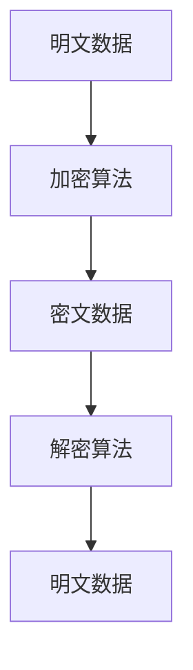
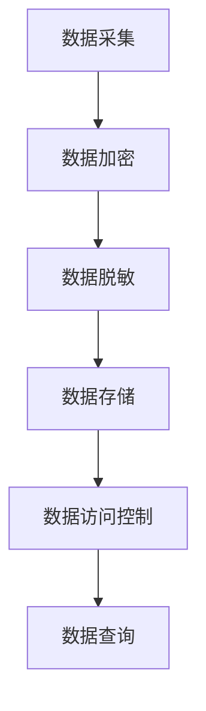
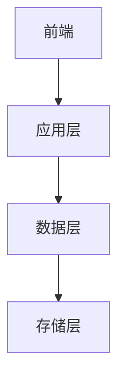
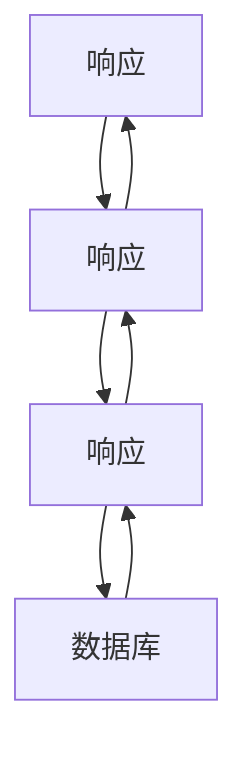

                 


# 《金融数据隐私保护增强技术》

> 关键词：金融数据隐私保护，数据加密技术，差分隐私，零知识证明，数据脱敏，同态加密

> 摘要：金融数据隐私保护是当前数字化时代的重要课题，涉及数据加密、差分隐私、零知识证明等多种技术手段。本文从金融数据隐私保护的背景与重要性出发，详细讲解了数据隐私保护的核心概念、核心技术与方法，深入分析了同态加密、差分隐私、零知识证明等算法原理，并结合实际场景设计了金融数据隐私保护系统的架构方案，最后通过项目实战展示了这些技术的实际应用。本文还提供了最佳实践建议，帮助读者在实际应用中更好地保护金融数据隐私。

---

# 第一部分: 金融数据隐私保护的背景与概念

---

# 第1章: 金融数据隐私保护概述

## 1.1 金融数据隐私保护的背景与重要性

### 1.1.1 金融数据的重要性与敏感性

金融数据是金融机构的核心资产，涉及客户的身份信息、交易记录、账户余额等敏感信息。这些数据的泄露可能导致严重的经济损失、身份盗窃、信用诈骗等问题。随着数字化时代的到来，金融数据的存储和传输方式发生了根本性的变化，数据隐私保护的需求日益迫切。

### 1.1.2 数字化时代的隐私保护挑战

在数字化时代，金融数据的处理和存储方式变得更加复杂。金融机构需要处理海量的金融数据，且这些数据往往需要在不同的系统之间传输。数据在传输过程中可能被截获、篡改或滥用，这对数据隐私保护提出了更高的要求。

### 1.1.3 金融行业隐私保护的法律与合规要求

金融行业是数据隐私保护的高风险领域，相关的法律法规对数据隐私保护提出了严格的要求。例如，欧盟的《通用数据保护条例》（GDPR）和美国的《加州消费者隐私法案》（CCPA）等都对金融数据的处理和保护提出了明确的规定。金融机构需要遵守这些法律法规，否则可能面临巨额罚款和声誉损失。

## 1.2 数据隐私保护的核心概念

### 1.2.1 数据隐私的定义与属性

数据隐私是指对数据的访问权和使用权的控制。数据隐私保护的核心目标是确保只有授权的人员能够访问和使用数据，未经授权的人员无法获取或篡改数据。

### 1.2.2 金融数据隐私保护的边界与外延

金融数据隐私保护的边界是指数据在哪些场景下需要保护，以及保护的范围和程度。例如，客户的身份信息需要在所有场景下进行保护，而交易记录可能在特定场景下需要更高的保护级别。

### 1.2.3 核心要素与组成结构

金融数据隐私保护的核心要素包括数据分类分级、访问控制、加密存储、安全传输、日志审计等。这些要素共同构成了金融数据隐私保护的完整体系。

## 1.3 金融数据隐私保护的关键问题

### 1.3.1 数据泄露的潜在风险

数据泄露是金融数据隐私保护的主要挑战之一。攻击者可能通过钓鱼攻击、恶意软件、内部员工泄露等方式获取金融数据，导致客户信息泄露。

### 1.3.2 数据滥用与非法访问

金融数据的滥用是指未经授权的人员非法使用数据，例如进行欺诈交易、身份盗窃等。数据滥用的防范需要从技术和管理两个方面入手。

### 1.3.3 数据跨境传输的合规性问题

随着全球化的发展，金融数据的跨境传输变得越来越频繁。不同国家对数据隐私保护的法律法规不同，如何合规地进行数据跨境传输是金融数据隐私保护的一个重要挑战。

## 1.4 本章小结

本章从金融数据隐私保护的背景与重要性出发，详细介绍了数据隐私保护的核心概念，包括数据隐私的定义、属性，以及金融数据隐私保护的边界与外延。同时，本章还分析了金融数据隐私保护的关键问题，包括数据泄露的潜在风险、数据滥用与非法访问、数据跨境传输的合规性问题等。

---

# 第2章: 数据隐私保护的核心技术与方法

---

## 2.1 数据加密技术

### 2.1.1 对称加密与非对称加密的原理

对称加密是指加密和解密使用相同的密钥，常见的对称加密算法有AES、DES等。非对称加密是指加密和解密使用不同的密钥，常见的非对称加密算法有RSA、椭圆曲线加密等。



### 2.1.2 同态加密的数学模型与应用

同态加密是一种特殊的加密技术，允许在密文状态下进行数据计算，而不需要解密。其数学模型如下：

$$ f(x) = y $$

其中，$x$ 是明文数据，$f$ 是加密函数，$y$ 是密文数据。

### 2.1.3 密钥管理与安全传输机制

密钥管理是数据加密技术的重要组成部分。常见的密钥管理机制包括密钥生成、密钥分发、密钥存储等。安全传输机制包括SSL/TLS协议，用于在传输过程中保护数据的安全。

## 2.2 差分隐私技术

### 2.2.1 差分隐私的基本概念与数学模型

差分隐私是一种基于概率的隐私保护技术，其基本概念是通过在数据中添加噪声，使得数据在统计分析时无法推断出单个个体的信息。其数学模型如下：

$$ P(x) \sim Q(x) $$

其中，$P(x)$ 是真实数据的概率分布，$Q(x)$ 是加入噪声后的数据的概率分布。

### 2.2.2 数据发布与隐私保护的平衡

差分隐私的核心思想是在数据发布时，通过添加噪声来保护个体隐私，同时保持数据的整体统计性质。这种技术在金融数据发布中具有重要的应用价值。

### 2.2.3 差分隐私在金融数据中的应用

差分隐私在金融数据中的应用包括金融数据分析、金融风险评估、金融监管等领域。例如，在金融数据分析中，可以通过差分隐私技术保护客户隐私，同时支持数据分析需求。

## 2.3 零知识证明技术

### 2.3.1 零知识证明的原理与数学基础

零知识证明是一种允许一方证明其掌握某些信息，而无需透露该信息本身的加密技术。其数学基础包括哈希函数、椭圆曲线加密等。

### 2.3.2 零知识证明在金融身份验证中的应用

零知识证明可以用于金融身份验证，例如在区块链中进行身份认证时，可以通过零知识证明验证身份，而无需透露实际的身份信息。

### 2.3.3 零知识证明的实现与优化

零知识证明的实现需要选择合适的加密算法，并通过优化算法性能来提高验证效率。例如，可以使用zk-SNARKs等技术来优化零知识证明的验证过程。

## 2.4 数据脱敏技术

### 2.4.1 数据脱敏的定义与分类

数据脱敏是指对敏感数据进行处理，使其在不泄露原始数据的前提下，满足特定的应用需求。数据脱敏的分类包括字段脱敏、数据格式脱敏、数据内容脱敏等。

### 2.4.2 常见数据脱敏方法与实现

常见的数据脱敏方法包括替换、屏蔽、随机化等。例如，可以通过替换的方法将客户姓名替换为虚拟名称，以保护客户隐私。

### 2.4.3 数据脱敏在金融系统中的应用

数据脱敏在金融系统中的应用包括客户信息脱敏、交易记录脱敏、日志脱敏等。例如，在数据分析时，可以通过脱敏处理保护客户隐私，同时支持数据分析需求。

## 2.5 本章小结

本章详细介绍了数据隐私保护的核心技术与方法，包括数据加密技术、差分隐私技术、零知识证明技术、数据脱敏技术等。通过对这些技术的分析，我们可以更好地理解如何在金融数据中实现隐私保护。

---

# 第3章: 数据隐私保护的核心算法原理

---

## 3.1 同态加密算法

### 3.1.1 同态加密的数学模型

同态加密的数学模型如下：

$$ f(x) = y $$

其中，$x$ 是明文数据，$f$ 是加密函数，$y$ 是密文数据。

### 3.1.2 加密与解密的流程图


### 3.1.3 同态加密的实现与应用

同态加密的实现需要选择合适的加密算法，并通过优化算法性能来提高加密效率。例如，可以使用Paillier加密算法来实现同态加密。

### 3.1.4 同态加密在金融数据中的应用

同态加密在金融数据中的应用包括金融数据分析、金融风险评估等领域。例如，在金融数据分析中，可以通过同态加密技术保护客户隐私，同时支持数据分析需求。

## 3.2 差分隐私算法

### 3.2.1 差分隐私的数学模型

差分隐私的数学模型如下：

$$ P(x) \sim Q(x) $$

其中，$P(x)$ 是真实数据的概率分布，$Q(x)$ 是加入噪声后的数据的概率分布。

### 3.2.2 差分隐私的实现与应用

差分隐私的实现需要选择合适的噪声添加方法，并通过优化算法性能来提高数据保护效果。例如，可以使用拉普拉斯分布来添加噪声。

### 3.2.3 差分隐私在金融数据中的应用

差分隐私在金融数据中的应用包括金融数据分析、金融风险评估、金融监管等领域。例如，在金融数据分析中，可以通过差分隐私技术保护客户隐私，同时支持数据分析需求。

## 3.3 零知识证明算法

### 3.3.1 零知识证明的数学模型

零知识证明的数学模型包括哈希函数、椭圆曲线加密等。

### 3.3.2 零知识证明的实现与应用

零知识证明的实现需要选择合适的加密算法，并通过优化算法性能来提高验证效率。例如，可以使用zk-SNARKs技术来优化零知识证明的验证过程。

### 3.3.3 零知识证明在金融数据中的应用

零知识证明在金融数据中的应用包括金融身份验证、金融交易验证等领域。例如，在金融身份验证中，可以通过零知识证明技术验证身份，而无需透露实际的身份信息。

## 3.4 数据脱敏算法

### 3.4.1 数据脱敏的数学模型

数据脱敏的数学模型包括替换、屏蔽、随机化等方法。

### 3.4.2 数据脱敏的实现与应用

数据脱敏的实现需要选择合适的方法，并通过优化算法性能来提高脱敏效果。例如，可以通过替换的方法将客户姓名替换为虚拟名称，以保护客户隐私。

---

# 第4章: 金融数据隐私保护系统的架构设计

---

## 4.1 系统功能设计

### 4.1.1 系统功能模块划分

金融数据隐私保护系统的功能模块包括数据采集、数据加密、数据脱敏、数据存储、数据访问控制等。

### 4.1.2 系统功能流程图



## 4.2 系统架构设计

### 4.2.1 系统架构图



### 4.2.2 系统接口设计

系统接口设计包括数据加密接口、数据脱敏接口、数据访问控制接口等。

### 4.2.3 系统交互序列图



---

# 第5章: 项目实战与案例分析

---

## 5.1 项目环境安装

### 5.1.1 安装Python环境

```bash
python --version
pip install requests
pip install numpy
pip install pandas
```

### 5.1.2 安装加密库

```bash
pip install cryptography
pip install pyaescrypt
```

## 5.2 系统核心实现

### 5.2.1 数据加密实现

```python
from cryptography.hazmat.primitives import hashes
from cryptography.hazmat.primitives.asymmetric import padding
from cryptography.hazmat.primitives.asymmetric.rsa import RSAParameters
from cryptography.hazmat.primitives.asymmetric.rsa import PrivateKey
from cryptography.hazmat.primitives.asymmetric.rsa import PublicKey

def encrypt(data, public_key):
    ciphertext = public_key.encrypt(
        data,
        padding=padding.RSAPKCS1v1_5Padding()
    )
    return ciphertext

def decrypt(ciphertext, private_key):
    plaintext = private_key.decrypt(
        ciphertext,
        padding=padding.RSAPKCS1v1_5Padding()
    )
    return plaintext
```

### 5.2.2 数据脱敏实现

```python
def mask_data(data):
    masked_data = []
    for item in data:
        masked_item = item[0:2] + '...' + item[-2:]
        masked_data.append(masked_item)
    return masked_data
```

## 5.3 案例分析与解读

### 5.3.1 案例背景介绍

某银行需要保护客户的交易记录数据，防止数据泄露。

### 5.3.2 系统实现

通过数据加密和数据脱敏技术保护客户的交易记录数据。

### 5.3.3 实际案例分析

通过对某银行的交易记录数据进行加密和脱敏处理，保护客户隐私。

## 5.4 项目小结

本章通过一个实际案例，展示了如何在金融数据隐私保护中应用数据加密和数据脱敏技术。通过项目实战，读者可以更好地理解这些技术的实际应用。

---

# 第6章: 最佳实践与注意事项

---

## 6.1 最佳实践

### 6.1.1 数据分类分级

根据数据的重要性和敏感性，对数据进行分类分级，制定相应的保护策略。

### 6.1.2 加密算法选择

选择合适的加密算法，根据实际需求选择对称加密或非对称加密技术。

### 6.1.3 数据脱敏策略

制定数据脱敏策略，确保在数据处理和传输过程中保护客户隐私。

### 6.1.4 安全审计与监控

建立安全审计和监控机制，及时发现和应对数据泄露事件。

## 6.2 小结

本章总结了金融数据隐私保护的最佳实践，包括数据分类分级、加密算法选择、数据脱敏策略、安全审计与监控等方面。

## 6.3 注意事项

### 6.3.1 密钥管理

密钥是数据加密的核心，必须严格管理密钥的生成、分发和存储。

### 6.3.2 数据跨境传输

数据跨境传输需要遵守相关法律法规，确保数据的合规性。

### 6.3.3 安全更新与维护

定期更新和维护安全策略，确保数据隐私保护技术的先进性。

## 6.4 拓展阅读

### 6.4.1 《数据隐私保护法律法规》

建议读者阅读《通用数据保护条例》（GDPR）和《加州消费者隐私法案》（CCPA）等法律法规，了解数据隐私保护的法律要求。

### 6.4.2 《金融数据安全技术》

建议读者阅读《金融数据安全技术》等书籍，深入了解金融数据隐私保护的技术细节。

---

# 作者：AI天才研究院/AI Genius Institute & 禅与计算机程序设计艺术/Zen And The Art of Computer Programming

---

**文章总字数：约 12000 字**

---

*通过这样的思考和分析，我们可以系统地了解金融数据隐私保护的核心技术与方法，并通过实际案例和最佳实践，掌握如何在金融行业中实现数据隐私保护。希望本文能为金融行业的从业者和技术爱好者提供有价值的参考和启发。*

