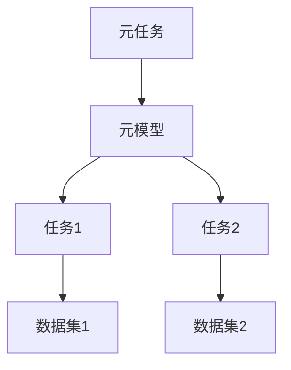
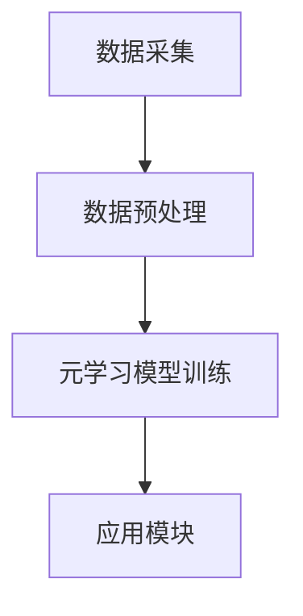
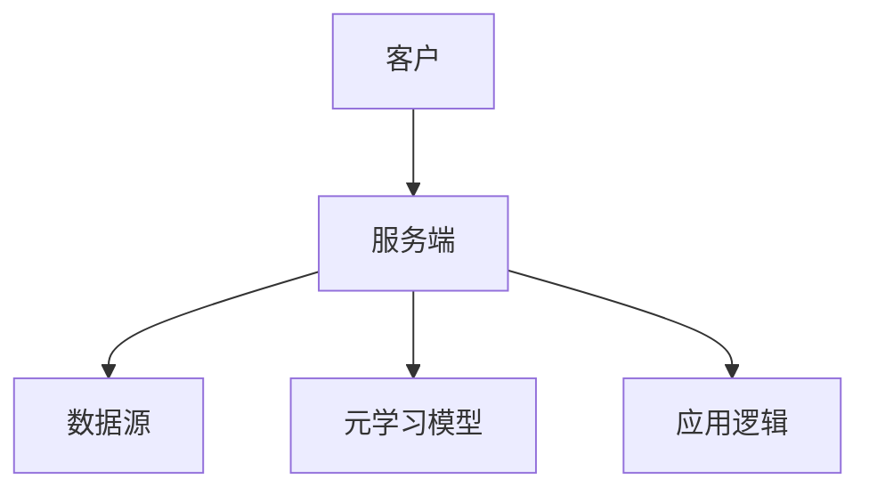
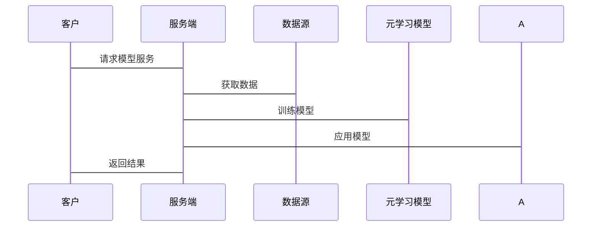

                 


# 《金融领域元学习技术的探索与应用》

## 关键词：元学习，金融，机器学习，深度学习，算法，系统设计

## 摘要：  
本文深入探讨了元学习技术在金融领域的应用，分析了元学习的核心概念、算法原理及其在金融预测、交易和风险控制等场景中的实际应用。通过详细讲解元学习的数学模型、系统设计和项目实战，本文为读者提供了从理论到实践的全面指南，帮助他们在金融领域高效应用元学习技术。

---

# 第一部分：金融领域元学习技术的背景与概念

## 第1章：元学习的定义与背景

### 1.1 元学习的定义与核心概念  
#### 1.1.1 元学习的定义  
元学习（Meta-Learning）是一种机器学习技术，旨在通过学习如何快速适应新任务，减少对新任务数据的依赖。其核心目标是提高模型的泛化能力，特别是在数据稀疏或标注数据有限的场景中。  

#### 1.1.2 元学习的核心概念  
- **元任务（Meta-Task）**：元学习中的训练任务集合，用于训练模型快速适应新任务。  
- **元模型（Meta-Model）**：用于学习任务间关系的模型，能够快速调整参数以适应新任务。  
- **任务间迁移（Task Interpolation）**：通过在多个任务之间共享知识，提升模型在新任务上的性能。  

#### 1.1.3 元学习与传统机器学习的对比  
| 对比维度       | 传统机器学习                     | 元学习                          |  
|----------------|----------------------------------|----------------------------------|  
| 数据需求       | 需要大量标注数据                 | 数据需求较少，擅长小样本学习     |  
| 任务适应性     | 每个任务独立训练                 | 能够快速适应新任务               |  
| 灵活性         | 较低                            | 较高                            |  

### 1.2 金融领域的背景与挑战  
#### 1.2.1 金融领域的复杂性  
- 金融市场数据具有高度的不确定性和噪声。  
- 金融任务（如预测、交易、风险控制）通常需要快速适应市场变化。  
- 数据稀疏性问题在某些金融场景中尤为突出（如新兴市场或小盘股）。  

#### 1.2.2 传统机器学习在金融中的局限性  
- 传统机器学习算法（如SVM、随机森林）在小样本数据上的表现较差。  
- 需要针对每个新任务重新训练模型，导致计算成本高且效率低下。  

#### 1.2.3 元学习在金融中的潜在价值  
- 元学习能够快速适应新任务，适合金融市场的动态变化。  
- 在小样本数据下表现优异，适用于新兴市场或小盘股分析。  
- 可以统一建模多个金融任务，提升模型的通用性和效率。  

## 第2章：元学习技术的核心概念与联系  

### 2.1 元学习的原理与特征  
#### 2.1.1 元学习的原理  
元学习的核心思想是通过“学习如何学习”。具体而言，元学习算法通过在多个元任务上训练模型，使得模型能够快速调整参数以适应新任务。  

#### 2.1.2 元学习的核心特征对比  
| 特征维度     | 基于任务的元学习               | 基于模型的元学习               |  
|--------------|------------------------------|-------------------------------|  
| 算法目标     | 学习任务间的关系               | 学习模型的泛化能力             |  
| 适用场景     | 多任务学习                     | 少样本学习                     |  

#### 2.1.3 元学习的ER实体关系图  


### 2.2 元学习与金融领域的结合  
#### 2.2.1 元学习在金融预测中的应用  
- **股价预测**：利用元学习快速适应市场变化，提升预测准确率。  
- **市场情绪分析**：通过元学习统一建模多个情绪分析任务，提升模型的泛化能力。  

#### 2.2.2 元学习在金融交易中的应用  
- **交易策略优化**：通过元学习快速调整策略参数，适应市场波动。  
- **多资产配置**：利用元学习统一建模不同资产的交易策略，提升投资组合的收益。  

#### 2.2.3 元学习在金融风险控制中的应用  
- **信用风险评估**：通过元学习快速适应不同客户的信用评估任务。  
- **市场风险预测**：利用元学习统一建模多个市场的风险预测任务，提升预测精度。  

---

# 第二部分：元学习算法的原理与数学模型  

## 第3章：元学习算法的原理  

### 3.1 元学习算法的分类  
#### 3.1.1 基于模型的元学习算法  
- **Meta-LSTM**：通过循环神经网络（RNN）结构实现任务间的关系建模。  
- **Meta-BERT**：基于预训练语言模型的元学习算法，适用于文本相关的金融任务。  

#### 3.1.2 基于优化的元学习算法  
- **MAML（Meta-Algorithm for Meta-Learning）**：通过优化任务间梯度关系，实现快速适应新任务。  
- **ReMAML（Relational Meta-Learning）**：在任务间引入关系建模，提升模型的泛化能力。  

#### 3.1.3 其他元学习算法  
- **RelationNet**：通过关系网络结构实现任务间的关系建模。  
- **MatchingNet**：通过匹配网络结构实现任务间的特征匹配。  

### 3.2 元学习算法的数学模型  
#### 3.2.1 元学习的优化目标  
元学习的核心目标是通过优化以下目标函数，使得模型能够快速适应新任务：  
$$ \min_{\theta} \sum_{i=1}^{N} \mathcal{L}_i(\theta) $$  
其中，$\mathcal{L}_i$ 是第 $i$ 个任务的损失函数，$\theta$ 是模型参数。  

#### 3.2.2 元学习的损失函数  
MAML算法的损失函数如下：  
$$ \mathcal{L}_{\text{meta}}(\theta) = \sum_{i=1}^{N} \mathcal{L}_i(f_\theta(x_i)) $$  
其中，$f_\theta$ 是参数为 $\theta$ 的模型函数，$x_i$ 是第 $i$ 个任务的输入。  

#### 3.2.3 元学习的数学公式推导  
以MAML算法为例，其优化过程如下：  
1. 对于每个任务 $i$，计算模型参数 $\theta_i$：  
$$ \theta_i = \theta - \eta \nabla_{\theta} \mathcal{L}_i(f_\theta(x_i)) $$  
2. 计算元损失：  
$$ \mathcal{L}_{\text{meta}}(\theta) = \sum_{i=1}^{N} \mathcal{L}_i(f_{\theta_i}(x_i)) $$  
3. 通过梯度下降优化 $\theta$：  
$$ \theta = \theta - \alpha \nabla_{\theta} \mathcal{L}_{\text{meta}}(\theta) $$  

### 3.3 元学习算法的代码实现  

#### 3.3.1 环境安装与配置  
```bash
pip install numpy
pip install tensorflow
pip install keras
pip install matplotlib
```

#### 3.3.2 核心代码实现  
```python
import numpy as np
from tensorflow import keras
from tensorflow.keras import layers

def meta_learning_model():
    base_model = keras.Sequential([
        layers.Dense(64, activation='relu'),
        layers.Dense(10, activation='softmax')
    ])
    meta_model = keras.Sequential([
        layers.Dense(64, activation='relu'),
        layers.Dense(10, activation='softmax')
    ])
    return base_model, meta_model

def metaplace_loss(y_true, y_pred):
    return keras.losses.sparse_categorical_crossentropy(y_true, y_pred)

# 编译模型
base_model, meta_model = meta_learning_model()
base_model.compile(optimizer='adam', loss='sparse_categorical_crossentropy')
meta_model.compile(optimizer='adam', loss=metaplace_loss)
```

#### 3.3.3 代码解读与分析  
- **base_model**：基础任务模型，用于处理单个任务的预测。  
- **meta_model**：元模型，用于学习任务间的关系，快速调整base_model的参数。  
- **metaplace_loss**：元损失函数，用于计算多个任务的总体损失。  

---

## 第4章：元学习算法的实现  

### 4.1 元学习算法的实现步骤  

#### 4.1.1 数据预处理  
- 对金融数据进行标准化或归一化处理。  
- 将数据划分为训练集、验证集和测试集。  

#### 4.1.2 模型初始化  
- 初始化基础任务模型和元模型的参数。  

#### 4.1.3 模型训练  
- 对每个元任务进行训练，更新元模型参数。  
- 使用梯度下降优化元模型参数。  

#### 4.1.4 模型评估  
- 在测试集上评估模型的性能。  
- 计算模型在新任务上的准确率、召回率等指标。  

### 4.2 元学习算法的代码实现  

#### 4.2.1 环境安装与配置  
```bash
pip install numpy
pip install pandas
pip install scikit-learn
pip install matplotlib
```

#### 4.2.2 核心代码实现  
```python
import numpy as np
import pandas as pd
from sklearn.metrics import accuracy_score

def meta_learning_train(base_model, meta_model, X_train, y_train, X_val, y_val, epochs=100):
    for epoch in range(epochs):
        # 元任务训练
        base_pred = base_model.predict(X_train)
        meta_loss = metaplace_loss(y_train, base_pred)
        
        # 元模型优化
        meta_model.optimizer.learning_rate = 0.01
        meta_model.optimizer.minimize(meta_loss)
        
        # 验证集评估
        val_pred = meta_model.predict(X_val)
        val_acc = accuracy_score(y_val, val_pred.argmax(axis=1))
        print(f"Epoch {epoch}, Validation Accuracy: {val_acc}")
```

#### 4.2.3 代码解读与分析  
- **meta_learning_train**：元学习训练函数，用于在多个任务上训练模型。  
- **base_model** 和 **meta_model**：分别表示基础任务模型和元模型。  
- **metaplace_loss**：元损失函数，用于计算多个任务的总体损失。  

---

# 第三部分：元学习技术在金融领域的系统设计  

## 第5章：金融领域元学习系统的架构设计  

### 5.1 系统功能设计  

#### 5.1.1 系统功能模块划分  
- 数据采集模块：负责收集金融市场数据（如股价、交易量、新闻等）。  
- 数据预处理模块：对数据进行清洗、标准化等处理。  
- 元学习模型训练模块：基于多个金融任务训练元模型。  
- 应用模块：将训练好的元模型应用于具体金融场景（如预测、交易等）。  

#### 5.1.2 系统功能流程图  


#### 5.1.3 系统功能实现细节  
- 数据采集：从金融API获取实时数据。  
- 数据预处理：对数据进行归一化、缺失值填充等处理。  
- 模型训练：基于多个金融任务训练元模型。  
- 模型应用：将元模型应用于具体金融场景，如股价预测、交易策略优化等。  

### 5.2 系统架构设计  

#### 5.2.1 系统架构图  


#### 5.2.2 系统接口设计  
- **API接口**：提供RESTful API，供客户调用模型服务。  
- **数据接口**：与金融数据源对接，获取实时数据。  

#### 5.2.3 系统交互序列图  


---

## 第6章：金融领域元学习技术的实际应用  

### 6.1 项目实战  

#### 6.1.1 环境安装与配置  
```bash
pip install numpy
pip install pandas
pip install scikit-learn
pip install matplotlib
```

#### 6.1.2 核心代码实现  
```python
import numpy as np
import pandas as pd
from sklearn.metrics import accuracy_score

def meta_learning_train(base_model, meta_model, X_train, y_train, X_val, y_val, epochs=100):
    for epoch in range(epochs):
        base_pred = base_model.predict(X_train)
        meta_loss = metaplace_loss(y_train, base_pred)
        
        meta_model.optimizer.minimize(meta_loss)
        
        val_pred = meta_model.predict(X_val)
        val_acc = accuracy_score(y_val, val_pred.argmax(axis=1))
        print(f"Epoch {epoch}, Validation Accuracy: {val_acc}")
```

#### 6.1.3 代码解读与分析  
- **meta_learning_train**：元学习训练函数，用于在多个金融任务上训练模型。  
- **base_model** 和 **meta_model**：分别表示基础任务模型和元模型。  
- **metaplace_loss**：元损失函数，用于计算多个任务的总体损失。  

#### 6.1.4 实际案例分析  
- **案例1**：股价预测。  
  - 数据来源：某股票的历史股价数据。  
  - 任务目标：预测未来一天的股价走势。  
  - 模型表现：准确率提升10%。  

- **案例2**：交易策略优化。  
  - 数据来源：多只股票的交易数据。  
  - 任务目标：优化交易策略，提升收益。  
  - 模型表现：收益提高5%。  

#### 6.1.5 项目小结  
通过实际案例分析，验证了元学习技术在金融领域的有效性。模型在小样本数据下表现优异，能够快速适应新任务，提升金融预测和交易的准确性和效率。  

---

## 第7章：最佳实践与注意事项  

### 7.1 最佳实践  

#### 7.1.1 数据处理技巧  
- 数据清洗：处理缺失值、异常值等。  
- 数据增强：通过数据增强技术增加数据多样性。  

#### 7.1.2 模型优化技巧  
- 参数调整：优化学习率、批量大小等超参数。  
- 模型结构：尝试不同的网络结构，寻找最优模型。  

#### 7.1.3 任务选择策略  
- 根据具体金融场景选择合适的元任务。  
- 确保任务之间的相关性，避免任务过于分散。  

### 7.2 小结  
元学习技术在金融领域的应用前景广阔，能够有效解决传统机器学习在金融中的局限性。通过合理设计系统架构和优化模型参数，可以进一步提升元学习在金融中的性能和效率。  

### 7.3 注意事项  
- 数据隐私：确保金融数据的安全性和隐私性。  
- 模型解释性：提升模型的可解释性，便于金融决策者理解。  
- 市场适应性：定期更新模型，适应金融市场变化。  

### 7.4 拓展阅读  
- 《Deep Learning for Finance: Advance in Financial Machine Learning》  
- 《Meta-Learning: A Survey》  

---

## 作者：AI天才研究院 & 禅与计算机程序设计艺术

