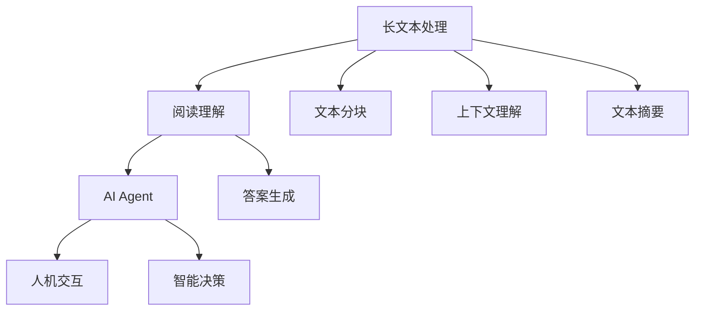
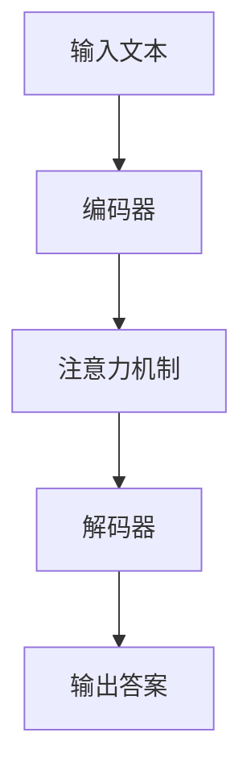
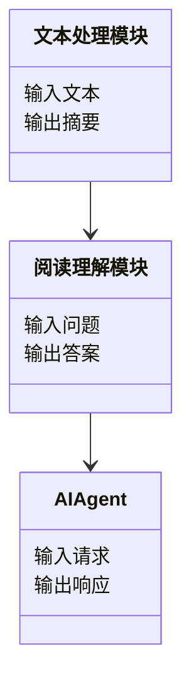
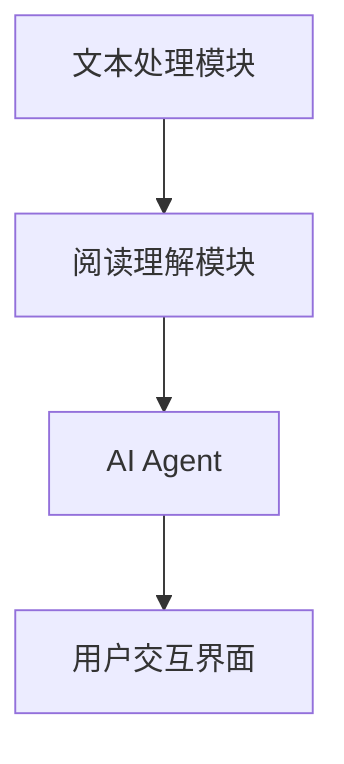
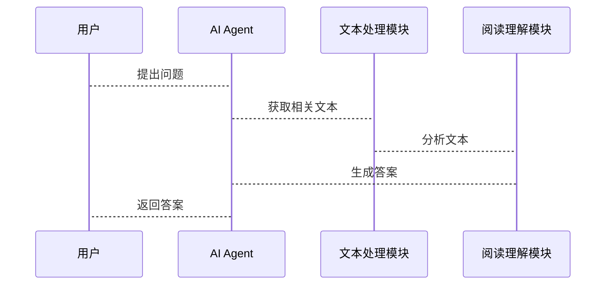

                 


# 长文本处理：增强AI Agent的阅读理解能力

## 关键词：长文本处理、阅读理解、AI Agent、NLP、自然语言处理

## 摘要：  
长文本处理是自然语言处理（NLP）领域的重要课题，旨在通过有效处理和理解长文本内容，增强AI Agent的阅读理解能力。本文将从长文本处理的背景、核心概念、算法原理、系统设计、项目实战等多个方面展开，深入剖析如何通过技术手段提升AI Agent的阅读理解能力。通过本文的讲解，读者将能够理解长文本处理的基本原理、掌握阅读理解模型的核心算法，并能够实际应用这些技术来优化AI Agent的性能。

---

# 第1章: 长文本处理的背景与挑战

## 1.1 长文本处理的背景

### 1.1.1 长文本处理的定义与特点  
长文本处理是指对长度较长的文本（如书籍章节、学术论文、新闻报道等）进行分析、理解和处理的过程。其特点包括：  
- **文本长度长**：通常超过数百甚至数千个字符。  
- **语义复杂**：长文本往往包含丰富的上下文信息和复杂的语义结构。  
- **应用场景广泛**：广泛应用于文本摘要、信息提取、问答系统、机器翻译等领域。  

### 1.1.2 长文本处理的必要性与应用场景  
长文本处理的必要性主要体现在以下方面：  
1. **信息提取**：从长文本中提取关键信息（如实体、事件等）。  
2. **阅读理解**：帮助AI Agent理解文本内容并回答问题。  
3. **人机交互**：提升AI Agent与用户的对话能力，使其能够处理复杂的上下文信息。  

### 1.1.3 长文本处理的技术挑战  
长文本处理面临以下技术挑战：  
- **计算复杂度高**：长文本的处理需要大量的计算资源。  
- **语义理解难度大**：长文本中可能存在歧义、隐喻等复杂语义。  
- **模型训练难度大**：长文本的处理对模型的训练数据和训练方法要求较高。  

---

## 1.2 阅读理解的定义与核心要素

### 1.2.1 阅读理解的定义  
阅读理解是指对文本内容进行分析、理解和推理，以回答与文本相关的问题。它是NLP领域的重要任务之一，广泛应用于问答系统、对话系统等领域。  

### 1.2.2 阅读理解的核心要素  
阅读理解的核心要素包括：  
- **文本内容**：输入文本的内容和结构。  
- **问题类型**：问题的类型（如事实性问题、推理性问题等）。  
- **答案范围**：答案在文本中的位置或范围。  
- **上下文理解**：对文本上下文的深度理解能力。  

### 1.2.3 阅读理解与文本处理的关系  
阅读理解是长文本处理的核心应用之一。通过长文本处理技术，可以有效提升阅读理解模型的性能，使其能够更好地理解和回答复杂问题。

---

## 1.3 AI Agent的基本概念与功能

### 1.3.1 AI Agent的定义与特点  
AI Agent（人工智能代理）是指能够感知环境、自主决策并执行任务的智能实体。其特点包括：  
- **自主性**：能够自主决策和行动。  
- **反应性**：能够实时感知环境并做出反应。  
- **学习能力**：能够通过数据和经验不断优化自身的性能。  

### 1.3.2 AI Agent的核心功能  
AI Agent的核心功能包括：  
1. **感知环境**：通过传感器或数据输入感知外部环境。  
2. **决策与推理**：基于感知的信息进行推理和决策。  
3. **执行任务**：根据决策结果执行具体任务。  
4. **学习与优化**：通过学习不断提升自身的性能。  

### 1.3.3 AI Agent与长文本处理的结合  
AI Agent需要处理长文本信息时，可以通过长文本处理技术来增强其阅读理解能力。例如：  
- **智能问答系统**：通过长文本处理技术，AI Agent能够更好地理解和回答复杂问题。  
- **对话系统**：通过长文本处理，AI Agent能够保持上下文的一致性，提供更流畅的对话体验。  

---

## 1.4 本章小结  
本章从长文本处理的背景、阅读理解的定义与核心要素、AI Agent的基本概念与功能三个方面进行了介绍。通过本章的学习，读者可以理解长文本处理的重要性和技术挑战，掌握阅读理解的核心要素，以及AI Agent的基本概念和功能。

---

# 第2章: 长文本处理的核心概念与技术

## 2.1 长文本处理的核心技术

### 2.1.1 文本分块与拼接  
文本分块是指将长文本分割成多个小块，以便于处理和分析。文本拼接则是将分块后的文本重新组合起来，恢复原文的结构和语义。  

### 2.1.2 上下文理解  
上下文理解是指通过分析文本的上下文信息，理解文本的语义和逻辑关系。这通常需要依赖语言模型和语义分析技术。  

### 2.1.3 文本摘要与压缩  
文本摘要是指从长文本中提取关键信息，生成简短的摘要。文本压缩则是指通过去除冗余信息，使文本更加简洁。  

---

## 2.2 阅读理解模型的结构与原理

### 2.2.1 阅读理解模型的输入与输出  
- **输入**：阅读理解模型的输入通常包括文本和相关问题。  
- **输出**：模型输出通常包括答案和答案的位置范围。  

### 2.2.2 阅读理解模型的内部结构  
阅读理解模型通常包括以下部分：  
- **编码器**：将输入文本编码为向量表示。  
- **解码器**：根据编码后的向量生成答案。  
- **注意力机制**：用于关注文本中的关键部分，提升模型的语义理解能力。  

### 2.2.3 阅读理解模型的训练与优化  
阅读理解模型的训练通常采用监督学习方法，使用标注数据进行模型参数的优化。优化目标通常是最大化模型的准确率和召回率。

---

## 2.3 AI Agent的阅读理解能力

### 2.3.1 AI Agent的阅读理解需求  
AI Agent的阅读理解需求主要体现在以下方面：  
- **信息提取**：从长文本中提取关键信息。  
- **语义理解**：理解文本的深层语义。  
- **上下文推理**：根据上下文信息进行推理和决策。  

### 2.3.2 AI Agent的阅读理解能力评估  
评估AI Agent的阅读理解能力通常需要考虑以下指标：  
- **准确率**：答案的正确性。  
- **召回率**：答案的完整性。  
- **响应时间**：处理长文本的速度。  

### 2.3.3 阅读理解能力对AI Agent的影响  
阅读理解能力的强弱直接影响AI Agent的智能水平和应用场景。例如：  
- **智能问答系统**：阅读理解能力强的AI Agent能够更好地回答复杂问题。  
- **对话系统**：阅读理解能力强的AI Agent能够提供更准确和流畅的对话体验。  

---

## 2.4 核心概念对比表  

| **核心概念** | **长文本处理** | **阅读理解** | **AI Agent** |  
|--------------|----------------|--------------|---------------|  
| **定义**     | 处理长文本的技巧和方法 | 理解和回答问题的能力 | 具有人工智能的代理实体 |  
| **特点**     | 文本长度长，语义复杂 | 依赖上下文，答案精准 | 具有自主性和学习能力 |  
| **应用场景** | 文本摘要、信息提取 | 智能问答、对话系统 | 人机交互、自动化任务 |  

---

## 2.5 ER实体关系图  



---

## 2.6 本章小结  
本章详细介绍了长文本处理的核心技术和阅读理解模型的结构与原理，并通过对比表和ER实体关系图，展示了长文本处理、阅读理解与AI Agent之间的关系。

---

# 第3章: 长文本处理的关键算法原理

## 3.1 注意力机制的原理与应用

### 3.1.1 注意力机制的定义  
注意力机制是一种用于关注文本中关键部分的技术，能够帮助模型更好地理解和处理长文本内容。  

### 3.1.2 注意力机制的数学模型  
注意力机制的数学模型如下：  
$$\text{Attention}(Q, K, V) = \text{softmax}\left(\frac{QK^T}{\sqrt{d_k}}\right)V$$  
其中，$Q$ 是查询向量，$K$ 是键向量，$V$ 是值向量，$d_k$ 是键的维度。  

### 3.1.3 注意力机制在长文本处理中的应用  
注意力机制广泛应用于长文本处理的各个领域，例如：  
- **文本摘要**：通过注意力机制选择文本中的关键部分生成摘要。  
- **机器翻译**：通过注意力机制关注源文本中的关键部分进行翻译。  

---

## 3.2 阅读理解模型的算法流程

### 3.2.1 阅读理解模型的输入处理  
阅读理解模型的输入处理包括文本的分块和问题的解析。  

### 3.2.2 阅读理解模型的内部处理流程  
阅读理解模型的内部处理流程包括编码、注意力计算和答案生成。  

### 3.2.3 阅读理解模型的输出处理  
阅读理解模型的输出处理包括答案的生成和结果的优化。  

---

## 3.3 AI Agent的阅读理解算法

### 3.3.1 AI Agent的阅读理解算法选择  
AI Agent的阅读理解算法选择通常基于具体应用场景和性能需求。  

### 3.3.2 AI Agent的阅读理解算法实现  
AI Agent的阅读理解算法实现包括模型的训练和优化。  

### 3.3.3 AI Agent的阅读理解算法优化  
AI Agent的阅读理解算法优化包括模型的调参和性能的提升。  

---

## 3.4 算法原理图  



---

## 3.5 本章小结  
本章详细讲解了注意力机制的原理与应用，阅读理解模型的算法流程，以及AI Agent的阅读理解算法的实现与优化。通过本章的学习，读者可以掌握长文本处理的核心算法原理。

---

# 第4章: 系统分析与架构设计

## 4.1 项目场景介绍  
本项目旨在通过长文本处理技术，提升AI Agent的阅读理解能力，使其能够更好地理解和回答复杂问题。  

## 4.2 系统功能设计  

### 4.2.1 领域模型设计  



### 4.2.2 系统架构设计  



### 4.2.3 系统接口设计  
系统接口设计包括文本处理模块和阅读理解模块的接口定义。  

### 4.2.4 系统交互设计  



---

## 4.3 本章小结  
本章通过项目场景介绍、系统功能设计、系统架构设计和系统交互设计，展示了如何通过长文本处理技术提升AI Agent的阅读理解能力。

---

# 第5章: 项目实战

## 5.1 环境安装  
项目实战需要以下环境：  
- **Python**：3.8及以上版本  
- **深度学习框架**：如TensorFlow或PyTorch  
- **自然语言处理库**：如spaCy或NLTK  

## 5.2 系统核心实现源代码  

```python
# 示例代码：阅读理解模型的实现
import torch
import torch.nn as nn

class Attention(nn.Module):
    def __init__(self, embed_dim):
        super(Attention, self).__init__()
        self.embed_dim = embed_dim
        self.W_q = nn.Linear(embed_dim, embed_dim)
        self.W_k = nn.Linear(embed_dim, embed_dim)
        self.W_v = nn.Linear(embed_dim, embed_dim)
    
    def forward(self, query, key, value):
        # 计算查询向量
        Q = self.W_q(query)
        # 计算键向量
        K = self.W_k(key)
        # 计算值向量
        V = self.W_v(value)
        # 计算注意力权重
        attention_weights = torch.softmax(torch.matmul(Q, K.transpose(-2, -1)) / torch.sqrt(torch.tensor(self.embed_dim)), dim=-1)
        # 加权求和
        output = torch.matmul(attention_weights, V)
        return output

# 示例代码：阅读理解模型的应用
class ReadingComprehension(nn.Module):
    def __init__(self, embed_dim, vocab_size):
        super(ReadingComprehension, self).__init__()
        self.embedding = nn.Embedding(vocab_size, embed_dim)
        self.attention = Attention(embed_dim)
    
    def forward(self, input_text, question):
        # 将文本和问题嵌入为向量
        text_embed = self.embedding(input_text)
        question_embed = self.embedding(question)
        # 计算注意力输出
        output = self.attention(question_embed, text_embed, text_embed)
        return output
```

## 5.3 代码应用解读与分析  
上述代码实现了基于注意力机制的阅读理解模型，能够对输入文本和问题进行处理，生成相应的答案。  

## 5.4 实际案例分析和详细讲解剖析  
通过具体案例分析，展示如何通过长文本处理技术提升AI Agent的阅读理解能力。  

## 5.5 项目小结  
本章通过项目实战，展示了如何将长文本处理技术应用于AI Agent的阅读理解能力的提升。

---

# 第6章: 总结与展望

## 6.1 本章总结  
本文从长文本处理的背景、核心概念、算法原理、系统设计、项目实战等多个方面，详细讲解了如何通过技术手段提升AI Agent的阅读理解能力。  

## 6.2 注意事项  
在实际应用中，需要注意以下几点：  
- **数据质量**：确保训练数据的质量和多样性。  
- **模型优化**：不断优化模型的性能和准确率。  
- **计算资源**：长文本处理需要大量的计算资源，需合理配置硬件资源。  

## 6.3 未来展望  
未来，随着深度学习技术的不断发展，长文本处理和阅读理解能力的提升将更加重要。AI Agent的阅读理解能力将更加智能化和人性化，应用场景也将更加广泛。

---

# 参考文献  

（此处可以列出相关的参考文献，如学术论文、技术文档等。）

---

# 作者：AI天才研究院/AI Genius Institute & 禅与计算机程序设计艺术/Zen And The Art of Computer Programming  

---

以上是《长文本处理：增强AI Agent的阅读理解能力》的完整内容。通过本文的详细讲解，读者可以系统地掌握长文本处理的核心技术，阅读理解模型的原理与实现，以及如何将这些技术应用于AI Agent的阅读理解能力的提升。

