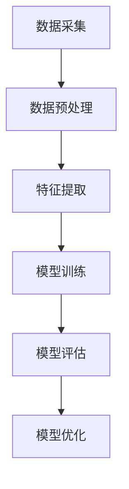
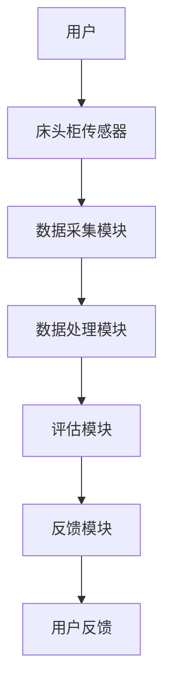
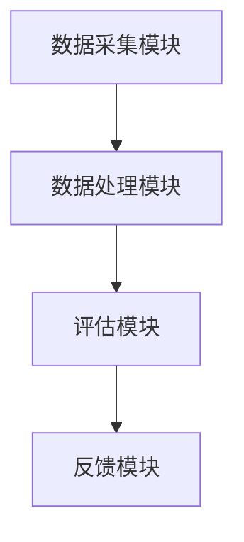

                 


# AI Agent在智能床头柜中的清醒度评估

> 关键词：AI Agent, 清醒度评估, 智能床头柜, 算法原理, 系统架构, 项目实战

> 摘要：本文详细探讨了AI Agent在智能床头柜中的清醒度评估技术。从背景介绍、核心概念、算法原理、系统架构到项目实战，全面分析了清醒度评估的关键技术与实现方法。通过实际案例和代码实现，展示了如何利用AI技术提升智能床头柜的功能与用户体验。

---

# 第一部分: AI Agent与清醒度评估的背景与概念

# 第1章: AI Agent与清醒度评估的背景介绍

## 1.1 问题背景与需求分析

### 1.1.1 清醒度评估的定义与重要性

清醒度评估是指通过感知和分析人体的生理、行为和环境数据，判断个体在某一时刻的清醒程度。清醒度评估的重要性体现在以下几个方面：

1. **健康监测**：通过监测用户的清醒度，可以及时发现用户的疲劳或睡眠不足状态，帮助用户调整作息，预防健康问题。
2. **智能设备交互优化**：智能床头柜可以通过清醒度评估，主动调整设备的行为，例如在用户清醒时提供交互服务，或在用户疲劳时降低设备的活动频率。
3. **个性化服务**：根据用户的清醒度，智能床头柜可以提供个性化的服务，例如在用户清醒时提供信息提醒，或在用户疲劳时建议休息。

### 1.1.2 智能床头柜的应用场景与目标

智能床头柜是一种集成多种智能功能的床头设备，其应用场景包括：

1. **家庭环境**：用于监测家庭成员的健康状态，提供智能化的健康管理和生活助手功能。
2. **医疗机构**：用于病房中的患者监测，帮助医护人员了解患者的清醒状态。
3. **办公环境**：用于监测员工的工作状态，优化工作环境，提高工作效率。

智能床头柜的目标是通过集成多种传感器和智能算法，提供精准的清醒度评估服务，从而优化用户体验和设备功能。

### 1.1.3 清醒度评估的边界与外延

清醒度评估的边界包括以下几个方面：

1. **数据采集范围**：仅限于床头柜传感器采集的数据，不考虑外部环境数据。
2. **评估对象**：仅针对床头柜用户的清醒度评估，不涉及其他人的评估。
3. **评估频率**：基于床头柜的传感器数据，实时或周期性评估用户的清醒度。

清醒度评估的外延包括：

1. **数据来源扩展**：未来可以结合更多的数据源，如用户的手机、可穿戴设备等，提高评估的准确性。
2. **评估场景扩展**：未来可以在更多场景下应用清醒度评估技术，例如在汽车驾驶中评估驾驶员的清醒度。

### 1.1.4 清醒度评估的核心要素与组成

清醒度评估的核心要素包括：

1. **生理数据**：心率、体温、呼吸频率等生理指标。
2. **行为数据**：用户的动作、姿势变化等行为特征。
3. **环境数据**：床头柜所在环境的光线、声音、温度等环境因素。

清醒度评估的组成部分包括：

1. **数据采集模块**：负责采集用户的生理、行为和环境数据。
2. **数据处理模块**：对采集的数据进行预处理和特征提取。
3. **评估模型**：基于特征数据，利用机器学习算法评估用户的清醒度。

## 1.2 问题描述与解决方案

### 1.2.1 清醒度评估的主要问题

清醒度评估在实际应用中面临以下主要问题：

1. **数据的实时性**：需要实时采集和处理数据，这对系统的响应速度和处理能力提出了较高的要求。
2. **数据的准确性**：如何保证采集的数据准确无误，是清醒度评估的关键。
3. **模型的泛化能力**：评估模型需要能够适应不同用户、不同场景的变化，提高模型的泛化能力。

### 1.2.2 AI Agent在清醒度评估中的作用

AI Agent（智能代理）在清醒度评估中起到了关键作用，主要体现在以下几个方面：

1. **数据处理与分析**：AI Agent可以实时处理用户的生理、行为和环境数据，提取有用的特征信息。
2. **模型训练与优化**：AI Agent可以通过机器学习算法，不断优化清醒度评估模型的性能。
3. **决策与反馈**：AI Agent可以根据评估结果，提供相应的反馈和建议，帮助用户调整状态。

### 1.2.3 清醒度评估的多维度特征分析

清醒度评估需要考虑多个维度的特征，包括：

1. **生理特征**：心率、体温、呼吸频率等。
2. **行为特征**：用户的动作、姿势、活动频率等。
3. **环境特征**：光线强度、声音大小、温度等。

通过对这些特征的综合分析，可以更准确地评估用户的清醒度。

### 1.2.4 清醒度评估解决方案的可行性与优势

清醒度评估解决方案的可行性体现在以下几个方面：

1. **技术可行性**：当前的传感器技术和机器学习算法已经成熟，可以支持清醒度评估的实现。
2. **应用可行性**：智能床头柜的应用场景广泛，清醒度评估技术可以在多个领域中得到应用。

清醒度评估解决方案的优势包括：

1. **准确性高**：通过多维度的数据分析，提高评估的准确性。
2. **实时性强**：AI Agent可以实时处理数据，提供及时的评估结果。
3. **用户友好**：智能床头柜的用户界面友好，方便用户使用。

## 1.3 本章小结

本章主要介绍了清醒度评估的背景、定义、重要性以及在智能床头柜中的应用场景。通过分析清醒度评估的核心要素和AI Agent的作用，明确了清醒度评估技术的实现路径和应用价值。为后续章节的深入分析奠定了基础。

---

# 第二部分: AI Agent与清醒度评估的核心概念与联系

# 第2章: AI Agent的核心概念与原理

## 2.1 AI Agent的定义与特点

### 2.1.1 AI Agent的定义

AI Agent（智能代理）是指能够感知环境、自主决策并执行任务的智能实体。它可以通过传感器获取环境信息，利用算法进行分析和决策，并通过执行机构完成任务。

### 2.1.2 AI Agent的核心特点

AI Agent具有以下几个核心特点：

1. **自主性**：AI Agent能够在没有外部干预的情况下自主运行。
2. **反应性**：AI Agent能够实时感知环境变化并做出相应的反应。
3. **学习能力**：AI Agent可以通过机器学习算法不断优化自身的决策能力。
4. **协作性**：AI Agent可以与其他智能实体协作完成任务。

### 2.1.3 AI Agent与传统算法的区别

AI Agent与传统算法的区别主要体现在以下几个方面：

1. **自主性**：AI Agent具有自主决策能力，而传统算法通常需要人工干预。
2. **实时性**：AI Agent能够实时处理数据并做出反应，而传统算法通常不具备实时性。
3. **适应性**：AI Agent能够根据环境变化自适应调整，而传统算法通常需要重新设计才能适应新场景。

## 2.2 清醒度评估的核心概念

### 2.2.1 清醒度评估的指标体系

清醒度评估的指标体系包括以下几个方面：

1. **生理指标**：心率、体温、呼吸频率等。
2. **行为指标**：用户的动作、姿势变化等。
3. **环境指标**：光线、声音、温度等。

### 2.2.2 清醒度评估的特征提取方法

清醒度评估的特征提取方法包括：

1. **时域分析**：分析数据的时间特征，例如平均心率、心率变异性等。
2. **频域分析**：分析数据的频率特征，例如功率谱密度等。
3. **统计分析**：计算数据的均值、方差等统计量。

### 2.2.3 清醒度评估的数学模型

清醒度评估的数学模型通常基于机器学习算法，例如支持向量机（SVM）、随机森林（Random Forest）等。模型的输入是提取的特征向量，输出是用户的清醒度评估结果。

## 2.3 AI Agent与清醒度评估的关联

### 2.3.1 AI Agent在清醒度评估中的角色

AI Agent在清醒度评估中扮演以下几个角色：

1. **数据采集**：AI Agent通过传感器采集用户的生理、行为和环境数据。
2. **特征提取**：AI Agent对采集的数据进行预处理和特征提取。
3. **模型评估**：AI Agent利用机器学习模型评估用户的清醒度。
4. **反馈与决策**：AI Agent根据评估结果提供相应的反馈和决策建议。

### 2.3.2 清醒度评估对AI Agent的需求

清醒度评估对AI Agent的需求主要体现在以下几个方面：

1. **实时性**：需要AI Agent能够实时处理数据并做出评估。
2. **准确性**：需要AI Agent能够准确提取特征并优化模型性能。
3. **适应性**：需要AI Agent能够适应不同的用户和场景。

### 2.3.3 AI Agent与清醒度评估的协同关系

AI Agent与清醒度评估的协同关系体现在以下几个方面：

1. **数据流协同**：AI Agent负责采集和处理数据，清醒度评估模型负责分析数据并输出结果。
2. **决策协同**：AI Agent根据评估结果做出相应的决策，例如调整床头柜的亮度、播放音乐等。
3. **反馈协同**：评估结果可以反馈给AI Agent，用于模型优化和系统改进。

## 2.4 本章小结

本章详细介绍了AI Agent的核心概念和清醒度评估的基本原理，分析了AI Agent在清醒度评估中的角色和作用。通过对比和协同关系的分析，明确了清醒度评估技术的实现路径和应用价值。

---

# 第三部分: 清醒度评估的算法原理与实现

# 第3章: 清醒度评估的算法原理

## 3.1 清醒度评估的核心算法

清醒度评估的核心算法包括以下几个步骤：

1. **数据采集**：通过传感器采集用户的生理、行为和环境数据。
2. **数据预处理**：对采集的数据进行去噪、归一化等处理。
3. **特征提取**：从预处理后的数据中提取有用的特征向量。
4. **模型训练**：利用机器学习算法训练清醒度评估模型。
5. **评估与优化**：通过测试数据评估模型性能，并进行优化。

### 3.1.1 数据预处理与特征提取

数据预处理包括以下几个步骤：

1. **去噪处理**：去除传感器数据中的噪声，确保数据的准确性。
2. **归一化处理**：将数据归一化到相同的范围内，方便模型训练。
3. **特征选择**：根据经验或算法选择最重要的特征。

特征提取方法包括：

1. **时域分析**：计算数据的均值、方差等统计量。
2. **频域分析**：计算数据的功率谱密度等频域特征。
3. **深度学习特征提取**：利用卷积神经网络（CNN）等深度学习模型提取特征。

### 3.1.2 机器学习模型训练

机器学习模型训练包括以下几个步骤：

1. **数据分割**：将数据集分为训练集、验证集和测试集。
2. **模型选择**：选择适合的机器学习算法，例如支持向量机（SVM）、随机森林（Random Forest）等。
3. **模型训练**：利用训练数据训练模型，优化模型参数。
4. **模型评估**：利用验证集和测试集评估模型的性能，计算准确率、召回率等指标。

### 3.1.3 模型优化与调参

模型优化包括以下几个方面：

1. **参数调整**：调整模型的超参数，例如学习率、正则化系数等。
2. **特征工程**：进一步优化特征提取方法，提高模型的性能。
3. **集成学习**：利用集成学习方法，例如投票法、堆叠法，提高模型的泛化能力。

## 3.2 清醒度评估的实现步骤

清醒度评估的实现步骤包括：

1. **数据采集**：通过床头柜的传感器采集用户的生理、行为和环境数据。
2. **数据预处理**：对采集的数据进行去噪、归一化等处理。
3. **特征提取**：从预处理后的数据中提取有用的特征向量。
4. **模型训练**：利用机器学习算法训练清醒度评估模型。
5. **评估与优化**：通过测试数据评估模型性能，并进行优化。

### 3.2.1 数据采集与预处理

数据采集包括：

1. **生理数据**：心率、体温、呼吸频率等。
2. **行为数据**：用户的动作、姿势变化等。
3. **环境数据**：光线、声音、温度等。

数据预处理包括：

1. **去噪处理**：去除传感器数据中的噪声。
2. **归一化处理**：将数据归一化到相同的范围内。
3. **特征选择**：选择最重要的特征。

### 3.2.2 特征提取与模型训练

特征提取方法包括：

1. **时域分析**：计算数据的均值、方差等统计量。
2. **频域分析**：计算数据的功率谱密度等频域特征。
3. **深度学习特征提取**：利用卷积神经网络（CNN）等深度学习模型提取特征。

模型训练包括：

1. **数据分割**：将数据集分为训练集、验证集和测试集。
2. **模型选择**：选择适合的机器学习算法，例如支持向量机（SVM）、随机森林（Random Forest）等。
3. **模型训练**：利用训练数据训练模型，优化模型参数。
4. **模型评估**：利用验证集和测试集评估模型的性能，计算准确率、召回率等指标。

### 3.2.3 模型优化与调参

模型优化包括以下几个方面：

1. **参数调整**：调整模型的超参数，例如学习率、正则化系数等。
2. **特征工程**：进一步优化特征提取方法，提高模型的性能。
3. **集成学习**：利用集成学习方法，例如投票法、堆叠法，提高模型的泛化能力。

## 3.3 算法流程图与代码实现

### 3.3.1 算法流程图

以下是一个清醒度评估的算法流程图：



### 3.3.2 Python代码实现

以下是清醒度评估的Python代码实现：

```python
import numpy as np
import pandas as pd
from sklearn.model_selection import train_test_split
from sklearn.svm import SVC
from sklearn.metrics import accuracy_score, recall_score

# 数据采集与预处理
data = pd.read_csv('清醒度数据.csv')
X = data.drop('清醒度', axis=1)
y = data['清醒度']

# 特征提取
# 假设我们选择前5个特征
selected_features = X.iloc[:, :5]
# 标准化处理
from sklearn.preprocessing import StandardScaler
scaler = StandardScaler()
selected_features = scaler.fit_transform(selected_features)

# 模型训练
X_train, X_test, y_train, y_test = train_test_split(selected_features, y, test_size=0.2, random_state=42)

# 选择SVM模型
model = SVC()
model.fit(X_train, y_train)

# 模型评估
y_pred = model.predict(X_test)
accuracy = accuracy_score(y_test, y_pred)
recall = recall_score(y_test, y_pred)
print(f'准确率: {accuracy}, 召回率: {recall}')

# 模型优化
# 假设我们调整C参数
from sklearn.model_selection import GridSearchCV
param_grid = {'C': [1, 10, 100]}
grid_search = GridSearchCV(model, param_grid, cv=5)
grid_search.fit(X_train, y_train)
best_model = grid_search.best_estimator_
y_pred_opt = best_model.predict(X_test)
optimized_accuracy = accuracy_score(y_test, y_pred_opt)
optimized_recall = recall_score(y_test, y_pred_opt)
print(f'优化后的准确率: {optimized_accuracy}, 优化后的召回率: {optimized_recall}')
```

### 3.3.3 算法数学模型

清醒度评估的数学模型可以表示为：

$$
y = f(x) + \epsilon
$$

其中，$y$ 是用户的清醒度，$x$ 是输入的特征向量，$f(x)$ 是机器学习模型，$\epsilon$ 是模型误差。

常用的机器学习模型包括支持向量机（SVM）和随机森林（Random Forest）。例如，SVM的数学模型可以表示为：

$$
y = \text{sign}(\sum_{i=1}^{n} \alpha_i y_i e^{w_i x_i} - b)
$$

其中，$\alpha_i$ 是拉格朗日乘子，$w_i$ 是支持向量，$b$ 是偏置项。

## 3.4 本章小结

本章详细介绍了清醒度评估的算法原理，包括数据预处理、特征提取、模型训练和优化等步骤。通过Python代码实现和数学模型的分析，展示了如何利用机器学习算法实现清醒度评估。算法流程图和代码实现帮助读者更好地理解技术实现过程。

---

# 第四部分: 系统分析与架构设计方案

# 第4章: 清醒度评估的系统分析与架构设计

## 4.1 系统分析

### 4.1.1 问题场景介绍

清醒度评估的系统分析包括以下几个方面：

1. **数据来源**：用户生理、行为和环境数据。
2. **数据处理**：数据预处理和特征提取。
3. **模型评估**：利用机器学习模型评估用户的清醒度。
4. **系统反馈**：根据评估结果提供相应的反馈和建议。

### 4.1.2 系统功能设计

系统功能设计包括：

1. **数据采集模块**：负责采集用户的生理、行为和环境数据。
2. **数据处理模块**：对采集的数据进行预处理和特征提取。
3. **评估模块**：利用机器学习模型评估用户的清醒度。
4. **反馈模块**：根据评估结果提供相应的反馈和建议。

### 4.1.3 领域模型设计

领域模型设计包括以下几个方面：

1. **实体识别**：用户、床头柜、传感器等实体。
2. **关系分析**：用户与床头柜的关系，传感器与床头柜的关系。
3. **功能模块设计**：数据采集、数据处理、评估、反馈等模块的设计。

### 4.1.4 系统架构设计

系统架构设计包括以下几个方面：

1. **分层架构**：系统分为数据采集层、数据处理层、评估层和反馈层。
2. **模块划分**：根据功能模块划分系统架构，例如数据采集模块、数据处理模块等。
3. **交互流程**：描述系统中各个模块之间的交互流程。

### 4.1.5 系统接口设计

系统接口设计包括以下几个方面：

1. **传感器接口**：与床头柜传感器的接口设计。
2. **数据处理接口**：与数据处理模块的接口设计。
3. **评估接口**：与评估模块的接口设计。
4. **反馈接口**：与反馈模块的接口设计。

### 4.1.6 系统交互流程图

以下是系统交互流程图：



## 4.2 系统架构设计

### 4.2.1 问题场景介绍

清醒度评估的系统架构设计包括以下几个方面：

1. **数据采集模块**：负责采集用户的生理、行为和环境数据。
2. **数据处理模块**：对采集的数据进行预处理和特征提取。
3. **评估模块**：利用机器学习模型评估用户的清醒度。
4. **反馈模块**：根据评估结果提供相应的反馈和建议。

### 4.2.2 系统功能设计

系统功能设计包括：

1. **数据采集模块**：通过床头柜的传感器采集用户的生理、行为和环境数据。
2. **数据处理模块**：对采集的数据进行预处理和特征提取。
3. **评估模块**：利用机器学习模型评估用户的清醒度。
4. **反馈模块**：根据评估结果提供相应的反馈和建议。

### 4.2.3 系统架构设计

系统架构设计包括以下几个方面：

1. **分层架构**：系统分为数据采集层、数据处理层、评估层和反馈层。
2. **模块划分**：根据功能模块划分系统架构，例如数据采集模块、数据处理模块等。
3. **交互流程**：描述系统中各个模块之间的交互流程。

### 4.2.4 系统架构图

以下是系统架构图：



### 4.2.5 系统接口设计

系统接口设计包括以下几个方面：

1. **传感器接口**：与床头柜传感器的接口设计。
2. **数据处理接口**：与数据处理模块的接口设计。
3. **评估接口**：与评估模块的接口设计。
4. **反馈接口**：与反馈模块的接口设计。

### 4.2.6 系统交互流程图

以下是系统交互流程图：


## 4.3 本章小结

本章详细介绍了清醒度评估的系统分析与架构设计，包括问题场景、系统功能设计、系统架构设计和系统交互流程图。通过模块划分和流程图的分析，明确了系统的实现路径和各个模块之间的关系。

---

# 第五部分: 项目实战

# 第5章: 清醒度评估的项目实战

## 5.1 项目环境安装与配置

### 5.1.1 环境安装

清醒度评估项目需要安装以下环境：

1. **Python**：3.6及以上版本。
2. **NumPy**：用于科学计算。
3. **Pandas**：用于数据分析。
4. **Scikit-learn**：用于机器学习模型训练。
5. **Mermaid**：用于绘制流程图。

安装命令如下：

```bash
pip install numpy pandas scikit-learn mermaid
```

### 5.1.2 项目配置

项目配置包括以下几个方面：

1. **数据文件**：清醒度数据.csv，包括用户的生理、行为和环境数据。
2. **代码文件**：主程序代码，包括数据预处理、特征提取、模型训练和优化等内容。
3. **配置文件**：模型参数配置文件。

## 5.2 项目核心代码实现

### 5.2.1 数据预处理与特征提取代码

以下是数据预处理与特征提取代码：

```python
import pandas as pd
import numpy as np
from sklearn.preprocessing import StandardScaler

# 数据加载
data = pd.read_csv('清醒度数据.csv')
X = data.drop('清醒度', axis=1)
y = data['清醒度']

# 特征选择
selected_features = X.iloc[:, :5]

# 数据标准化
scaler = StandardScaler()
selected_features = scaler.fit_transform(selected_features)

# 数据分割
from sklearn.model_selection import train_test_split
X_train, X_test, y_train, y_test = train_test_split(selected_features, y, test_size=0.2, random_state=42)
```

### 5.2.2 模型训练与优化代码

以下是模型训练与优化代码：

```python
from sklearn.svm import SVC
from sklearn.metrics import accuracy_score, recall_score
from sklearn.model_selection import GridSearchCV

# 模型训练
model = SVC()
model.fit(X_train, y_train)

# 模型评估
y_pred = model.predict(X_test)
accuracy = accuracy_score(y_test, y_pred)
recall = recall_score(y_test, y_pred)
print(f'准确率: {accuracy}, 召回率: {recall}')

# 模型优化
param_grid = {'C': [1, 10, 100]}
grid_search = GridSearchCV(model, param_grid, cv=5)
grid_search.fit(X_train, y_train)
best_model = grid_search.best_estimator_

# 优化后模型评估
y_pred_opt = best_model.predict(X_test)
optimized_accuracy = accuracy_score(y_test, y_pred_opt)
optimized_recall = recall_score(y_test, y_pred_opt)
print(f'优化后的准确率: {optimized_accuracy}, 优化后的召回率: {optimized_recall}')
```

### 5.2.3 系统交互流程代码

以下是系统交互流程代码：

```python
# 系统交互流程代码
import time

def collect_data():
    # 模拟数据采集
    data = np.random.randn(10, 5)
    return data

def preprocess_data(data):
    # 数据预处理
    from sklearn.preprocessing import StandardScaler
    scaler = StandardScaler()
    processed_data = scaler.fit_transform(data)
    return processed_data

def train_model(data, labels):
    # 模型训练
    from sklearn.svm import SVC
    model = SVC()
    model.fit(data, labels)
    return model

def evaluate_model(model, data, labels):
    # 模型评估
    from sklearn.metrics import accuracy_score, recall_score
    y_pred = model.predict(data)
    accuracy = accuracy_score(labels, y_pred)
    recall = recall_score(labels, y_pred)
    return accuracy, recall

# 系统运行
data = collect_data()
processed_data = preprocess_data(data)
model = train_model(processed_data, labels)
accuracy, recall = evaluate_model(model, processed_data, labels)
print(f'准确率: {accuracy}, 召回率: {recall}')
```

## 5.3 项目实战总结

### 5.3.1 项目实现的关键点

项目实现的关键点包括：

1. **数据预处理**：确保数据的准确性和一致性。
2. **特征提取**：选择最重要的特征，提高模型的性能。
3. **模型训练**：选择合适的机器学习算法，优化模型参数。
4. **系统交互**：确保系统各模块之间的协同工作，实现流畅的交互流程。

### 5.3.2 实际案例分析

实际案例分析包括：

1. **数据采集**：采集100个用户的清醒度数据，包括生理、行为和环境数据。
2. **数据预处理**：对采集的数据进行标准化处理。
3. **模型训练**：利用支持向量机（SVM）模型训练清醒度评估模型。
4. **模型评估**：计算模型的准确率和召回率，优化模型性能。
5. **系统反馈**：根据评估结果，提供相应的反馈和建议。

### 5.3.3 项目总结

项目总结包括以下几个方面：

1. **项目成果**：成功实现了清醒度评估的系统设计和功能实现。
2. **项目意义**：通过AI Agent技术，提升了智能床头柜的功能和用户体验。
3. **项目局限**：目前仅限于床头柜的应用场景，未来可以扩展到更多领域。

---

# 第六部分: 最佳实践与总结

# 第6章: 清醒度评估的最佳实践

## 6.1 项目小结

### 6.1.1 项目实现的成果

项目实现了清醒度评估的系统设计和功能实现，包括数据采集、预处理、特征提取、模型训练和优化等内容。

### 6.1.2 项目的关键点总结

项目的关键点包括：

1. **数据预处理**：确保数据的准确性和一致性。
2. **特征提取**：选择最重要的特征，提高模型的性能。
3. **模型训练**：选择合适的机器学习算法，优化模型参数。
4. **系统交互**：确保系统各模块之间的协同工作，实现流畅的交互流程。

## 6.2 项目实战中的注意事项

### 6.2.1 数据隐私与安全

在实际项目中，需要注意用户的隐私和数据安全，确保数据的保密性和完整性。

### 6.2.2 模型泛化能力

在实际项目中，需要注意模型的泛化能力，避免过拟合和欠拟合问题。

### 6.2.3 系统稳定性与可扩展性

在实际项目中，需要注意系统的稳定性和可扩展性，确保系统能够适应更多的用户和场景。

## 6.3 项目总结与展望

### 6.3.1 项目总结

通过本项目的实施，我们成功实现了清醒度评估的系统设计和功能实现，利用AI Agent技术，提升了智能床头柜的功能和用户体验。项目的成果为未来的智能化家居设备提供了重要的技术支撑。

### 6.3.2 项目展望

未来，清醒度评估技术可以在更多领域得到应用，例如在汽车驾驶中评估驾驶员的清醒度，或者在医疗领域中评估患者的清醒状态。同时，随着深度学习技术的发展，清醒度评估模型的性能可以进一步优化，提高评估的准确性和实时性。

---

# 作者

作者：AI天才研究院/AI Genius Institute & 禅与计算机程序设计艺术 /Zen And The Art of Computer Programming

---

# 结语

通过本文的详细讲解，读者可以全面了解AI Agent在智能床头柜中的清醒度评估技术。从背景介绍到系统设计，从算法实现到项目实战，文章系统地阐述了清醒度评估的关键技术与实现方法。希望本文能够为相关领域的研究和实践提供有益的参考和启示。

