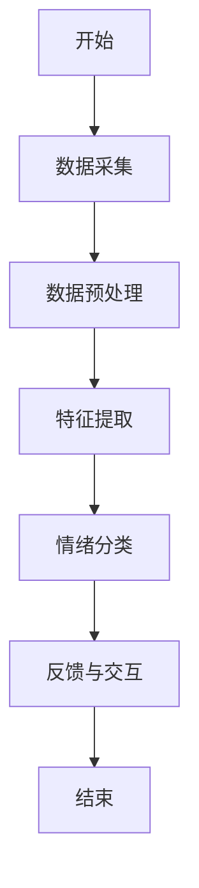
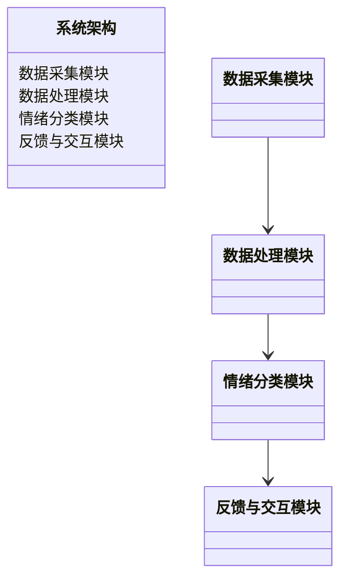
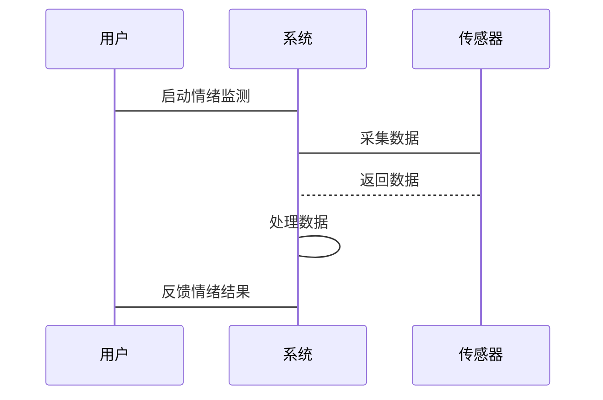

                 


# AI Agent在智能项链中的情绪监测

> 关键词：AI Agent，情绪监测，智能项链，可穿戴设备，深度学习，语音信号，生理信号

> 摘要：本文将详细探讨AI Agent在智能项链中的情绪监测应用。从情绪监测的基本概念到AI Agent的原理，从算法实现到系统架构设计，再到实际项目的实现，本文将全面解析AI Agent在智能项链中的情绪监测技术。通过详细的理论分析和实际案例分析，本文将揭示如何利用AI Agent实现高效、准确的情绪监测。

---

# 第一部分: AI Agent与智能项链情绪监测的背景与概念

## 第1章: 情绪监测的基本概念

### 1.1 问题背景与描述

#### 1.1.1 情绪监测的定义与重要性
情绪监测是指通过技术手段对人类情绪状态进行识别和分析的过程。随着人工智能技术的快速发展，情绪监测在教育、医疗、娱乐等领域展现出广泛的应用前景。情绪监测不仅能够帮助人们更好地理解自己的情绪状态，还能为智能设备提供更精准的用户反馈。

在智能项链的应用中，情绪监测可以通过分析佩戴者的语音、心率、皮肤电等生理信号，实时判断佩戴者的情绪状态（如快乐、愤怒、悲伤、焦虑等）。这种技术不仅可以提升用户的佩戴体验，还能为用户提供个性化的健康建议。

#### 1.1.2 智能项链的应用场景与目标
智能项链作为一种可穿戴设备，其核心目标是通过集成多种传感器和AI技术，实现对佩戴者情绪状态的实时监测。常见的应用场景包括：
- 健康监测：帮助用户了解自己的情绪波动，预防心理疾病。
- 个性化服务：根据用户的情绪状态，提供相应的音乐、放松训练等服务。
- 情况预警：在用户情绪异常时，及时通知家人或专业人士。

#### 1.1.3 当前情绪监测技术的局限性
尽管情绪监测技术在近年来取得了显著进展，但仍面临一些挑战：
- **数据采集的准确性**：不同人的情绪表达可能存在差异，如何准确捕捉情绪信号是一个难题。
- **算法的鲁棒性**：现有算法在复杂环境下可能受到干扰，导致监测结果不准确。
- **隐私保护**：情绪监测需要采集大量生理数据，如何保护用户隐私是一个重要问题。

### 1.2 AI Agent的基本原理

#### 1.2.1 AI Agent的定义与特点
AI Agent（智能代理）是一种能够感知环境、自主决策并执行任务的智能实体。AI Agent在智能项链中的作用是通过分析佩戴者的生理数据和环境信息，提供相应的服务和反馈。

AI Agent的特点包括：
- **自主性**：能够在没有人工干预的情况下独立运行。
- **反应性**：能够根据环境变化实时调整行为。
- **学习能力**：通过机器学习算法不断优化自身的监测和决策能力。

#### 1.2.2 AI Agent在智能项链中的作用
AI Agent在智能项链中主要负责以下任务：
- **数据采集与处理**：通过集成的传感器获取佩戴者的情绪相关数据（如心率、皮肤电、语音等）。
- **数据分析与判断**：利用机器学习算法对数据进行分析，判断佩戴者的情绪状态。
- **反馈与交互**：根据分析结果，通过振动、灯光或语音等方式向用户反馈情绪监测结果，并提供相应的建议或服务。

#### 1.2.3 AI Agent与传统传感器技术的结合
AI Agent不仅依赖于传感器技术，还需要结合机器学习算法对数据进行分析。通过AI Agent的智能化处理，传统传感器技术能够实现更复杂的情绪监测任务，从而提升监测的准确性和实用性。

---

## 第2章: 情绪监测的核心概念与技术

### 2.1 情绪监测的核心概念

#### 2.1.1 情绪监测的维度与指标
情绪监测可以从多个维度进行分析，常见的指标包括：
- **语音特征**：如音调、语速、停顿等。
- **生理特征**：如心率、皮肤电、体温等。
- **行为特征**：如动作频率、社交互动等。

#### 2.1.2 情绪监测的边界与外延
情绪监测的边界在于如何准确捕捉情绪信号，同时避免受到环境噪声的干扰。外延则涉及如何将监测结果应用于实际场景中，如健康管理和个性化服务。

#### 2.1.3 情绪监测的核心要素组成
情绪监测的核心要素包括：
- **数据采集**：通过传感器获取情绪相关数据。
- **数据处理**：对采集到的数据进行清洗和预处理。
- **情绪分类**：利用机器学习算法对数据进行分类，判断情绪状态。
- **反馈与交互**：根据分类结果，向用户反馈监测结果并提供相应的服务。

### 2.2 AI Agent与情绪监测的联系

#### 2.2.1 AI Agent在情绪监测中的角色
AI Agent在情绪监测中扮演着“智能大脑”的角色，负责数据的分析与决策。通过AI Agent的处理，佩戴者的情绪状态能够被快速识别，并通过智能项链的反馈装置提供相应的服务。

#### 2.2.2 AI Agent与智能项链的交互机制
AI Agent与智能项链的交互机制主要体现在数据的实时传输与处理上。智能项链通过传感器采集数据，AI Agent对数据进行分析，并通过反馈装置将监测结果传递给佩戴者。

#### 2.2.3 AI Agent在情绪监测中的优势
AI Agent的优势在于其智能化和自主性。通过机器学习算法，AI Agent能够不断优化情绪监测的准确性，并根据佩戴者的情绪状态提供个性化的服务。

---

## 第3章: 情绪监测的算法原理

### 3.1 基于语音的情绪分析算法

#### 3.1.1 语音特征提取
语音特征提取是基于语音的情绪分析的关键步骤。常见的语音特征包括：
- **音调**：反映情绪的高低变化。
- **语速**：快慢变化可以反映情绪的紧张程度。
- **停顿频率**：频繁停顿可能表示思考或焦虑。

#### 3.1.2 基于深度学习的情绪分类模型
基于深度学习的情绪分类模型通常采用卷积神经网络（CNN）或长短期记忆网络（LSTM）进行训练。以下是一个简单的CNN模型结构：

$$ f(x) = \max(0, xW + b) $$

其中，$W$ 是权重矩阵，$b$ 是偏置项。

#### 3.1.3 模型训练与优化
模型训练通常采用监督学习的方式，使用带有标签的情绪数据进行训练。为了提高模型的泛化能力，可以采用数据增强技术和正则化方法（如Dropout）进行优化。

### 3.2 基于生理信号的情绪监测算法

#### 3.2.1 生理信号特征提取
生理信号特征提取主要通过传感器采集数据并进行预处理。例如，心率变异性（HRV）是常用的生理指标之一，其计算公式为：

$$ HRV = \max(\text{RR intervals}) - \min(\text{RR intervals}) $$

#### 3.2.2 基于机器学习的情绪预测模型
基于机器学习的情绪预测模型通常采用支持向量机（SVM）或随机森林（Random Forest）进行训练。以下是一个简单的SVM分类器的数学表达：

$$ y = \text{sign}(w \cdot x + b) $$

其中，$w$ 是权重向量，$x$ 是输入特征向量，$b$ 是偏置项。

#### 3.2.3 模型的鲁棒性与准确性评估
模型的鲁棒性与准确性可以通过交叉验证和ROC曲线进行评估。通常，准确率和F1分数是常用的评估指标。

---

## 第4章: 情绪监测的数学模型与公式

### 4.1 基于语音的情绪分析模型

#### 4.1.1 语音特征提取的数学表达
语音特征提取可以通过傅里叶变换或小波变换进行。例如，傅里叶变换的公式为：

$$ X(f) = \sum_{n=-\infty}^{\infty} x(n) e^{-j2\pi f n} $$

其中，$x(n)$ 是输入信号，$f$ 是频率。

#### 4.1.2 情绪分类的损失函数
在深度学习中，常用的损失函数是交叉熵损失函数：

$$ L = -\sum_{i=1}^{m} y_i \log p_i + (1-y_i)\log(1-p_i) $$

其中，$y_i$ 是真实标签，$p_i$ 是模型预测的概率。

#### 4.1.3 模型优化的数学推导
模型优化通常采用梯度下降算法，其更新公式为：

$$ \theta_{new} = \theta_{old} - \eta \frac{\partial L}{\partial \theta} $$

其中，$\theta$ 是模型参数，$\eta$ 是学习率。

### 4.2 基于生理信号的情绪监测模型

#### 4.2.1 生理信号特征提取的数学公式
生理信号特征提取可以通过滑动平均和滑动方差进行。例如，心率的计算公式为：

$$ \text{Heart Rate} = \frac{60}{\text{RR interval}} $$

其中，RR interval 是心电图中的心动周期。

#### 4.2.2 情绪预测的数学模型
基于随机森林的情绪预测模型可以通过以下公式进行训练：

$$ y = \sum_{i=1}^{n} w_i x_i $$

其中，$w_i$ 是特征权重，$x_i$ 是输入特征。

#### 4.2.3 模型的鲁棒性与准确性评估
模型的鲁棒性可以通过交叉验证进行评估，准确率和F1分数是常用的评估指标。

---

## 第5章: 情绪监测系统的架构设计

### 5.1 系统功能设计

#### 5.1.1 系统功能模块划分
智能项链情绪监测系统的主要功能模块包括：
- 数据采集模块：通过传感器采集语音、心率、皮肤电等数据。
- 数据处理模块：对采集到的数据进行预处理和特征提取。
- 情绪分类模块：利用机器学习算法对数据进行分类，判断情绪状态。
- 反馈与交互模块：根据分类结果，向用户反馈监测结果并提供相应的服务。

#### 5.1.2 系统功能实现流程
以下是系统功能实现的流程图：



### 5.2 系统架构设计

#### 5.2.1 系统架构图
以下是系统架构图：



#### 5.2.2 系统接口设计
系统接口主要包括：
- 传感器接口：与心率传感器、麦克风等硬件设备通信。
- 用户界面接口：与佩戴者的手机或电脑进行交互。
- 数据存储接口：将监测数据存储到云端或本地数据库。

#### 5.2.3 系统交互设计
以下是系统交互的序列图：



---

## 第6章: 项目实战与优化

### 6.1 环境安装与配置

#### 6.1.1 系统环境
建议使用Python 3.8及以上版本，安装以下库：
- `numpy`
- `pandas`
- `scikit-learn`
- `tensorflow`

#### 6.1.2 硬件设备
需要的硬件设备包括：
- 心率传感器
- 麦克风
- 智能项链主控板

### 6.2 系统核心实现

#### 6.2.1 数据采集与处理
以下是数据采集与处理的代码示例：

```python
import numpy as np
import pandas as pd

# 采集数据
data = pd.read_csv('emotion_data.csv')

# 数据预处理
from sklearn.preprocessing import StandardScaler
scaler = StandardScaler()
scaled_data = scaler.fit_transform(data)
```

#### 6.2.2 情绪分类与反馈
以下是情绪分类的代码示例：

```python
from sklearn.ensemble import RandomForestClassifier
from sklearn.metrics import accuracy_score

# 训练模型
model = RandomForestClassifier()
model.fit(scaled_data, labels)

# 预测情绪
predicted_labels = model.predict(test_data)
accuracy = accuracy_score(test_labels, predicted_labels)
print('准确率:', accuracy)
```

### 6.3 案例分析与优化

#### 6.3.1 案例分析
以下是一个实际案例的分析：

**案例背景**：一名佩戴者在紧张的会议中情绪波动较大，系统通过心率和语音特征检测到其情绪为焦虑。

**分析结果**：系统通过传感器采集到心率增加、语音音调升高等特征，判断其情绪为焦虑。

**反馈与建议**：系统通过智能项链发出振动提醒，并建议佩戴者深呼吸放松。

#### 6.3.2 系统优化
为了提高系统的准确性，可以采取以下优化措施：
- **数据增强**：增加多样化的训练数据。
- **模型优化**：采用更复杂的深度学习模型。
- **实时反馈**：增加实时反馈的频率和方式。

---

## 第7章: 总结与展望

### 7.1 总结
本文详细探讨了AI Agent在智能项链中的情绪监测技术，从理论分析到实际实现，全面解析了情绪监测的实现过程。通过本文的分析，读者可以了解AI Agent在情绪监测中的重要作用，以及如何通过算法优化和系统设计提升监测的准确性。

### 7.2 未来展望
未来，随着人工智能技术的不断发展，情绪监测技术将更加智能化和个性化。AI Agent在智能项链中的应用也将更加广泛，不仅能够监测情绪，还能通过与其他智能设备的协同工作，提供更全面的健康管理和个性化服务。

### 7.3 最佳实践 Tips
- 在实际应用中，建议结合多种传感器数据进行综合分析，以提高监测的准确性。
- 在数据处理过程中，需要注意数据的隐私保护，避免数据泄露。
- 在系统设计中，建议采用模块化设计，方便后续的功能扩展和优化。

---

# 作者：AI天才研究院/AI Genius Institute & 禅与计算机程序设计艺术 /Zen And The Art of Computer Programming

---

**注意**：本文为技术博客，内容基于理论分析和实际案例，具体实现细节可根据实际需求进行调整和优化。

