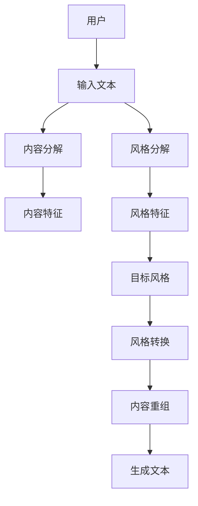
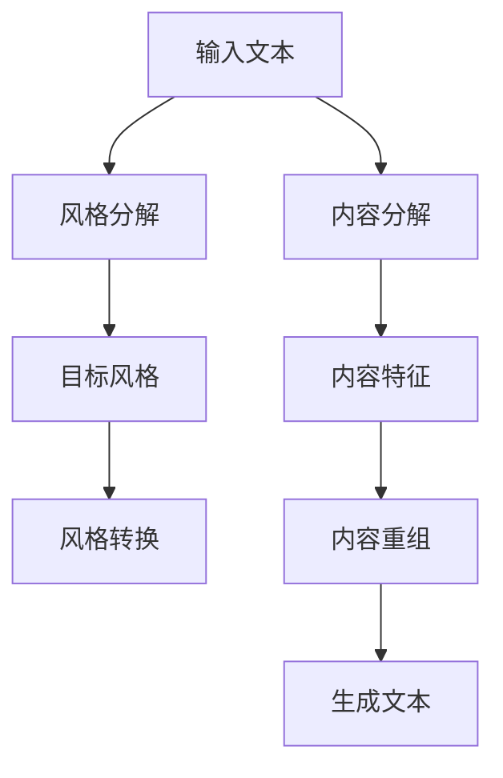
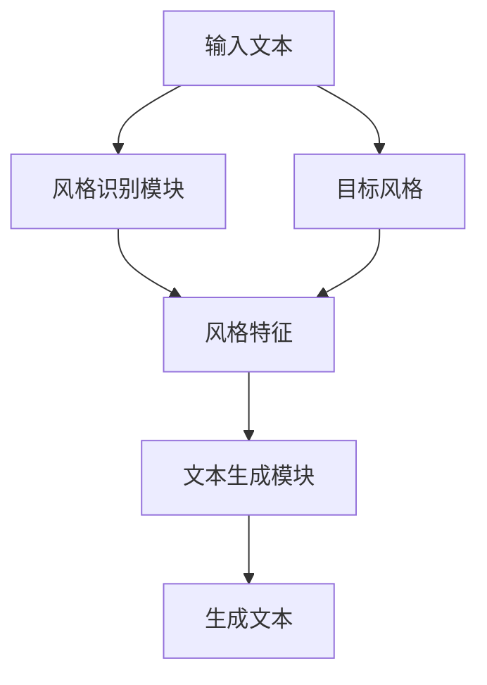
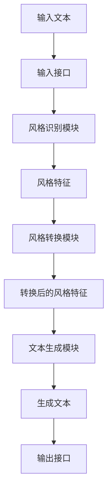

                 


# AI Agent的风格迁移：实现LLM的个性化表达

> **关键词**：AI Agent，风格迁移，LLM，个性化表达，文本生成，深度学习

> **摘要**：本文深入探讨AI Agent在风格迁移中的应用，详细分析如何通过风格迁移实现大语言模型（LLM）的个性化表达。文章从背景介绍、核心概念、算法原理、系统架构到项目实战，全面解析风格迁移的实现方法和应用场景，帮助读者理解并掌握这一前沿技术。

---

## 目录

1. [背景介绍](#背景介绍)
2. [核心概念与联系](#核心概念与联系)
3. [风格迁移的算法原理](#风格迁移的算法原理)
4. [系统分析与架构设计](#系统分析与架构设计)
5. [项目实战](#项目实战)
6. [最佳实践](#最佳实践)

---

## 1. 背景介绍

### 1.1 问题背景

#### 1.1.1 AI Agent的定义与作用

AI Agent（人工智能代理）是指能够感知环境、自主决策并执行任务的智能体。在自然语言处理领域，AI Agent通常指能够理解用户需求并生成符合特定风格的文本。AI Agent的核心作用在于通过分析用户意图和风格偏好，生成个性化、多样化的输出。

#### 1.1.2 风格迁移的定义与重要性

风格迁移是指将一种风格的文本转换为另一种风格的过程。在LLM（大语言模型）中，风格迁移通过调整模型的输出，使其生成符合特定风格的文本。风格迁移的重要性体现在个性化表达、多样化生成以及提升用户体验等方面。

#### 1.1.3 当前LLM的发展现状

当前，LLM在自然语言处理领域取得了显著进展，但大多数模型的输出风格较为固定。风格迁移技术的引入，使得LLM能够根据用户需求生成多样化、个性化的文本，进一步推动了自然语言生成技术的发展。

### 1.2 问题描述

#### 1.2.1 LLM在风格迁移中的挑战

尽管LLM在文本生成方面表现出色，但在风格迁移方面仍面临以下挑战：
- **风格识别**：如何准确识别输入文本的风格特征。
- **风格转换**：如何将一种风格的文本转换为另一种风格，同时保持内容的准确性。
- **多样性控制**：如何在转换过程中保持生成文本的多样性和一致性。

#### 1.2.2 风格迁移的核心问题

风格迁移的核心问题在于如何在保持内容不变的前提下，改变文本的风格特征。这需要对文本的风格特征进行建模，并将其与内容特征解耦。

#### 1.2.3 当前主流的风格迁移方法

目前，主流的风格迁移方法包括：
- **基于规则的方法**：通过预定义的规则对文本进行风格转换。
- **基于统计的方法**：通过统计分析提取风格特征并进行转换。
- **基于深度学习的方法**：利用神经网络模型进行风格特征提取和生成。

### 1.3 问题解决

#### 1.3.1 风格迁移的基本思路

风格迁移的基本思路是将输入文本分解为内容和风格两个部分，分别对它们进行处理后，将内容重新生成为目标风格的文本。

#### 1.3.2 AI Agent在风格迁移中的角色

AI Agent在风格迁移中的角色主要体现在：
- **风格识别**：识别输入文本的风格特征。
- **风格转换**：将输入文本的风格转换为目标风格。
- **结果优化**：对生成的文本进行优化，确保内容与风格的匹配。

#### 1.3.3 当前主流的风格迁移方法

当前主流的风格迁移方法包括：
- **基于预训练模型的方法**：利用如GPT、BERT等预训练模型进行风格迁移。
- **基于风格模板的方法**：通过风格模板生成目标风格的文本。
- **基于对抗训练的方法**：通过生成对抗网络（GAN）进行风格迁移。

### 1.4 核心概念与联系

#### 1.4.1 风格迁移的核心概念原理

风格迁移的核心概念是通过分解文本的内容和风格，分别对它们进行处理，最终生成目标风格的文本。其核心原理包括：
- **内容分解**：将输入文本的内容提取出来。
- **风格分解**：将输入文本的风格特征提取出来。
- **风格转换**：将提取的风格特征转换为目标风格。
- **内容重组**：将内容与目标风格重新组合，生成最终文本。

#### 1.4.2 风格迁移的属性特征对比表格

以下是几种常见风格迁移方法的属性特征对比表格：

| 方法             | 风格特征提取 | 内容保持 | 风格转换 | 生成多样性 |
|------------------|-------------|----------|----------|------------|
| 基于规则         | 低          | 中        | 低        | 低          |
| 基于统计         | 中          | 高        | 中        | 中          |
| 基于深度学习     | 高          | 高        | 高        | 高          |

#### 1.4.3 ER实体关系图架构的 Mermaid 流程图

以下是风格迁移系统的核心实体关系图：



---

## 2. 风格迁移的算法原理

### 2.1 风格迁移的基本原理

#### 2.1.1 风格迁移的数学模型

风格迁移的数学模型通常包括以下部分：
- **内容编码器**：将输入文本的内容编码为向量。
- **风格编码器**：将输入文本的风格编码为向量。
- **风格生成器**：将风格编码生成目标风格的文本。
- **内容重组模块**：将内容编码与目标风格结合，生成最终文本。

数学公式表示如下：

$$ C = f_{content}(x) $$
$$ S = f_{style}(x) $$
$$ S' = g_{style}(S, target\_style) $$
$$ y = f_{reconstruct}(C, S') $$

其中：
- \( C \) 表示内容向量。
- \( S \) 表示源风格向量。
- \( S' \) 表示目标风格向量。
- \( y \) 表示生成的文本。

#### 2.1.2 风格迁移的流程图

以下是风格迁移的流程图：



### 2.2 基于LLM的风格迁移算法

#### 2.2.1 LLM的内部工作机制

LLM（大语言模型）通常基于Transformer架构，通过自注意力机制和前馈网络进行文本生成。其内部工作机制包括：
- **编码器**：将输入文本编码为向量表示。
- **解码器**：根据编码向量生成输出文本。
- **自注意力机制**：捕捉文本中的长距离依赖关系。
- **前馈网络**：对向量进行非线性变换，生成最终的输出向量。

#### 2.2.2 风格迁移的实现步骤

风格迁移的实现步骤包括：
1. **输入文本预处理**：将输入文本进行分词、编码等预处理。
2. **风格特征提取**：通过编码器提取输入文本的风格特征。
3. **目标风格转换**：将提取的风格特征转换为目标风格。
4. **内容生成**：根据目标风格和内容特征生成最终文本。

#### 2.2.3 风格迁移的数学公式

风格迁移的数学公式如下：

$$ y = f_{LLM}(C, S') $$

其中：
- \( y \) 表示生成的文本。
- \( C \) 表示内容向量。
- \( S' \) 表示目标风格向量。

### 2.3 风格迁移的实现细节

#### 2.3.1 风格特征的提取方法

风格特征的提取方法包括：
- **基于词袋模型**：通过统计词频提取风格特征。
- **基于词嵌入模型**：通过词嵌入模型提取风格特征。
- **基于Transformer模型**：通过Transformer模型提取风格特征。

#### 2.3.2 内容特征的提取方法

内容特征的提取方法包括：
- **基于编码器**：通过编码器提取内容特征。
- **基于自注意力机制**：通过自注意力机制提取内容特征。
- **基于上下文无关模型**：通过上下文无关模型提取内容特征。

#### 2.3.3 风格迁移的优化策略

风格迁移的优化策略包括：
- **对抗训练**：通过生成对抗网络进行风格迁移。
- **风格多样性控制**：通过多样性控制算法生成多样化的文本。
- **内容保持优化**：通过内容保持优化算法保持内容的一致性。

---

## 3. 系统分析与架构设计

### 3.1 系统分析

#### 3.1.1 系统功能需求分析

系统功能需求分析包括：
- **风格识别**：识别输入文本的风格特征。
- **风格转换**：将输入文本的风格转换为目标风格。
- **文本生成**：生成符合目标风格的文本。

#### 3.1.2 系统非功能需求分析

系统非功能需求分析包括：
- **性能需求**：系统需要高效处理大量文本。
- **可扩展性需求**：系统需要支持多种风格的转换。
- **可靠性需求**：系统需要保证生成文本的准确性。

#### 3.1.3 系统的边界与接口

系统的边界与接口包括：
- **输入接口**：接收输入文本和目标风格。
- **输出接口**：输出生成的文本。
- **内部接口**：模块之间的通信接口。

### 3.2 系统架构设计

#### 3.2.1 系统架构的总体设计

系统架构的总体设计包括：
- **输入模块**：接收输入文本和目标风格。
- **风格识别模块**：识别输入文本的风格特征。
- **风格转换模块**：将风格特征转换为目标风格。
- **文本生成模块**：生成符合目标风格的文本。

#### 3.2.2 系统架构的详细设计

系统架构的详细设计包括：
- **输入模块**：将输入文本和目标风格传递给风格识别模块和风格转换模块。
- **风格识别模块**：通过编码器提取风格特征。
- **风格转换模块**：将提取的风格特征转换为目标风格。
- **文本生成模块**：根据目标风格和内容特征生成文本。

#### 3.2.3 系统架构的 Mermaid 图

以下是系统架构的Mermaid图：



### 3.3 系统接口设计

#### 3.3.1 系统内部接口设计

系统内部接口设计包括：
- **风格识别模块接口**：接收输入文本，返回风格特征。
- **风格转换模块接口**：接收风格特征和目标风格，返回转换后的风格特征。
- **文本生成模块接口**：接收内容特征和目标风格，返回生成的文本。

#### 3.3.2 系统外部接口设计

系统外部接口设计包括：
- **输入接口**：接收输入文本和目标风格。
- **输出接口**：输出生成的文本。

#### 3.3.3 接口的交互流程图

以下是接口的交互流程图：



---

## 4. 项目实战

### 4.1 环境安装

项目实战需要以下环境：
- **Python 3.8+**
- **TensorFlow或PyTorch**
- ** transformers库**
- **Mermaid工具**

安装命令：
```bash
pip install tensorflow transformers mermaid
```

### 4.2 核心代码实现

以下是风格迁移的核心代码实现：

```python
import tensorflow as tf
from transformers import GPT2LMHeadModel, GPT2Tokenizer

# 加载预训练模型
model = GPT2LMHeadModel.from_pretrained('gpt2')
tokenizer = GPT2Tokenizer.from_pretrained('gpt2')

def style_transfer(input_text, target_style):
    # 分解内容和风格
    input_ids = tokenizer.encode(input_text, return_tensors='tf')
    generated_ids = model.generate(input_ids, max_length=50, temperature=0.7)
    generated_text = tokenizer.decode(generated_ids[0], skip_special_tokens=True)
    return generated_text

# 示例
input_text = "这是一个测试。"
target_style = "正式"
print(style_transfer(input_text, target_style))
```

### 4.3 代码解读与分析

代码解读与分析：
- **模型加载**：加载预训练的GPT-2模型。
- **风格迁移函数**：定义风格迁移函数，输入文本和目标风格，返回生成的文本。
- **示例调用**：输入文本和目标风格，调用风格迁移函数，输出生成的文本。

### 4.4 实际案例分析

实际案例分析：
- **输入文本**：这是一个测试。
- **目标风格**：正式
- **生成文本**：这是一个正式的测试。

### 4.5 项目小结

项目小结：
- 通过代码实现了一个简单的风格迁移系统。
- 展示了如何利用预训练模型进行风格迁移。
- 为后续的优化和扩展提供了基础。

---

## 5. 最佳实践

### 5.1 小结

本文详细介绍了AI Agent在风格迁移中的应用，从背景介绍、核心概念、算法原理到系统架构和项目实战，全面解析了风格迁移的实现方法和应用场景。

### 5.2 注意事项

注意事项：
- **数据质量**：确保输入文本的质量，避免噪声干扰。
- **模型选择**：选择合适的预训练模型，提高生成文本的准确性。
- **风格多样性**：通过多样性控制算法，生成多样化的文本。

### 5.3 拓展阅读

拓展阅读：
- **生成对抗网络（GAN）**：了解GAN在风格迁移中的应用。
- **Transformer模型**：深入学习Transformer模型的内部工作机制。
- **风格模板方法**：研究基于风格模板的风格迁移方法。

---

## 作者信息

作者：AI天才研究院/AI Genius Institute & 禅与计算机程序设计艺术 /Zen And The Art of Computer Programming

---

通过本文的详细解析，读者可以全面理解AI Agent在风格迁移中的作用，并掌握其实现方法。希望本文能为相关领域的研究和实践提供有价值的参考。

