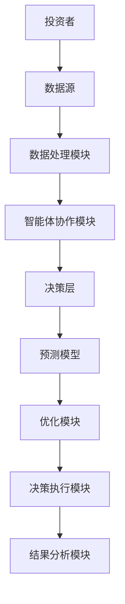
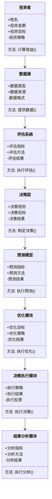
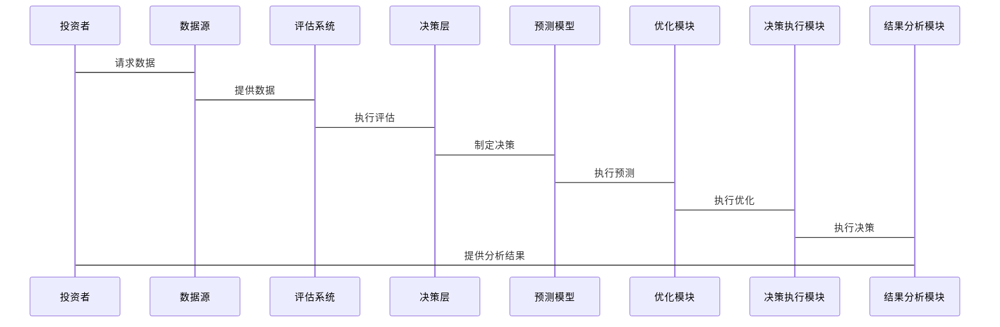

                 


# 价值投资中的多智能体AI人力资本评估系统

**关键词：** 多智能体AI、人力资本评估、价值投资、系统架构、算法实现、项目实战

**摘要：**  
本文深入探讨了多智能体AI在价值投资中的人力资本评估系统的应用，详细分析了其核心概念、算法原理、系统架构、项目实战及最佳实践。通过结合多智能体协作算法与价值投资的理论，构建了一个高效的人力资本评估系统，为投资者提供了科学的决策支持。文章内容详实，结构清晰，旨在为金融领域的技术从业者提供有价值的参考。

---

## 第一部分: 背景介绍与核心概念

### 第1章: 多智能体AI与人力资本评估的背景

#### 1.1 问题背景与问题描述
##### 1.1.1 传统人力资本评估的局限性
传统的资本评估方法主要依赖于财务指标和市场表现，难以全面反映人力资本的真实价值。这种方法忽视了员工能力、团队协作和创新能力对企业发展的重要影响。

##### 1.1.2 价值投资中的资本评估需求
在价值投资中，资本评估不仅仅是对财务数据的分析，更需要考虑企业的人力资本。人力资本的评估能够帮助投资者识别企业的核心竞争力，从而做出更精准的投资决策。

##### 1.1.3 多智能体AI的引入动机
传统的单智能体AI在处理复杂问题时存在局限性，而多智能体AI通过协作和分工能够更好地处理多维度、多层次的问题，为人力资本评估提供了新的思路。

#### 1.2 多智能体AI的定义与特点
##### 1.2.1 多智能体系统的定义
多智能体系统是由多个相互作用的智能体组成的系统，每个智能体都有自己的目标和决策机制，能够通过协作完成复杂的任务。

##### 1.2.2 多智能体AI的核心特点
- 分布式计算：智能体之间通过分布式计算实现协作。
- 协作与竞争：智能体之间既有协作也有竞争，能够动态调整策略。
- 自适应性：系统能够根据环境变化自适应调整。

##### 1.2.3 多智能体AI与单智能体AI的区别
- **决策方式**：单智能体AI由一个中心决策系统控制，而多智能体AI由多个独立决策的智能体组成。
- **协作能力**：多智能体AI能够通过协作提高整体效率，而单智能体AI则无法做到。
- **灵活性**：多智能体AI更具灵活性，能够应对复杂多变的环境。

#### 1.3 人力资本评估的核心要素
##### 1.3.1 人力资本的定义与构成
人力资本是指企业员工的知识、技能、经验和创新能力的总和。它包括员工的个体能力、团队协作能力和组织文化等多个方面。

##### 1.3.2 人力资本评估的关键指标
- **员工能力**：员工的专业知识和技能水平。
- **团队协作**：团队内部的协作效率和沟通能力。
- **创新能力**：员工在创新中的贡献能力。
- **员工稳定性**：员工的忠诚度和稳定性。

##### 1.3.3 价值投资中的资本评估目标
在价值投资中，人力资本评估的目标是识别企业的核心竞争力，评估企业的长期发展潜力，从而为投资者提供科学的决策依据。

---

### 第2章: 多智能体AI与人力资本评估的联系

#### 2.1 多智能体AI在人力资本评估中的应用
##### 2.1.1 多智能体协作的优势
- **分工协作**：通过分工协作，多个智能体可以同时处理不同类型的数据，提高评估效率。
- **信息共享**：智能体之间可以共享信息，避免重复劳动，提高评估的准确性。
- **动态调整**：智能体能够根据环境变化动态调整评估策略，提高评估的灵活性。

##### 2.1.2 多智能体AI在数据处理中的作用
- **数据清洗**：智能体可以协同完成数据清洗，确保数据的准确性和完整性。
- **特征提取**：通过协作，智能体能够提取更多的特征，提高评估的准确性。
- **数据建模**：多个智能体可以协同建模，提高模型的泛化能力。

##### 2.1.3 多智能体AI在决策支持中的应用
- **决策优化**：通过协作，智能体可以优化决策过程，提高评估的效率。
- **风险控制**：智能体能够实时监控风险，提供风险预警，帮助投资者做出更明智的决策。
- **动态调整**：智能体能够根据市场变化动态调整评估策略，提高评估的准确性。

#### 2.2 多智能体AI与价值投资的结合
##### 2.2.1 价值投资的基本原理
价值投资是一种以企业内在价值为基础的投资策略，旨在通过分析企业的财务状况、市场地位和管理能力等因素，识别被低估的企业进行投资。

##### 2.2.2 多智能体AI在价值评估中的角色
- **数据收集与处理**：智能体可以协同完成数据的收集与处理，确保数据的准确性和完整性。
- **模型构建与优化**：通过协作，智能体能够构建更复杂的模型，提高评估的准确性。
- **决策支持**：智能体可以为投资者提供实时的决策支持，帮助其做出更明智的投资决策。

##### 2.2.3 多智能体AI如何优化投资决策
- **多维度分析**：通过协作，智能体可以从多个维度分析企业的价值，提高评估的全面性。
- **动态调整**：智能体能够根据市场变化动态调整评估策略，提高评估的灵活性。
- **风险控制**：智能体可以实时监控风险，提供风险预警，帮助投资者做出更明智的决策。

#### 2.3 实体关系图与系统架构
##### 2.3.1 多智能体AI的ER实体关系图
```mermaid
er
    actor 投资者
    actor 数据源
    actor 评估系统
    actor 决策层
    actor 投资结果
    actor 竞争对手
    actor 市场环境
    actor 风险因素
    actor 时间维度
    actor 空间维度
    actor 预测模型
    actor 优化模块
    actor 反馈机制
    actor 知识库
    actor 专家意见
    actor 历史数据
    actor 实时数据
    actor 数据处理模块
    actor 智能体协作模块
    actor 决策执行模块
    actor 结果分析模块
```

---

## 第二部分: 多智能体AI的算法原理

### 第3章: 多智能体AI的算法基础

#### 3.1 多智能体协作算法
##### 3.1.1 协作式强化学习
协作式强化学习是一种通过多个智能体协作来最大化整体奖励的算法。智能体之间通过共享信息和策略，共同完成任务。

##### 3.1.2 非协作式强化学习
非协作式强化学习是指多个智能体在没有协作的情况下，通过竞争来最大化自己的奖励。这种算法适用于对抗性环境。

##### 3.1.3 多智能体决策模型
多智能体决策模型是一种基于多个智能体协作的决策模型，能够处理复杂环境中的决策问题。

#### 3.2 多智能体通信与协调
##### 3.2.1 智能体间通信机制
智能体之间的通信机制包括直接通信和间接通信。直接通信是指智能体之间通过共享信息进行通信，而间接通信是指通过中间媒介进行通信。

##### 3.2.2 协调算法实现
协调算法的实现可以通过分布式协调和集中式协调两种方式。分布式协调是指智能体之间通过分布式计算实现协调，而集中式协调是指通过一个中心节点实现协调。

##### 3.2.3 通信协议设计
通信协议设计需要考虑智能体之间的信息传递方式、数据格式和通信频率等因素，确保智能体之间的有效协作。

#### 3.3 算法流程图


---

## 第三部分: 系统分析与架构设计方案

### 第4章: 系统分析与架构设计

#### 4.1 问题场景介绍
在价值投资中，人力资本评估系统需要能够实时监控企业的经营状况，评估企业的内在价值，帮助投资者做出明智的投资决策。

#### 4.2 项目介绍
本项目旨在构建一个多智能体AI人力资本评估系统，通过协作和分工，提高评估的效率和准确性。

#### 4.3 系统功能设计
##### 4.3.1 领域模型（类图）


#### 4.4 系统架构设计
##### 4.4.1 系统架构图
```mermaid
container 多智能体AI系统 {
    投资者
    数据源
    评估系统
    决策层
    预测模型
    优化模块
    决策执行模块
    结果分析模块
}
```

#### 4.5 系统接口设计
系统接口设计需要考虑智能体之间的通信接口、数据接口和用户接口，确保系统的高效运行和用户友好的操作体验。

#### 4.6 系统交互流程
##### 4.6.1 交互流程图


---

## 第四部分: 项目实战

### 第5章: 项目实战

#### 5.1 环境安装
项目实战需要安装多智能体AI系统所需的环境，包括Python、TensorFlow、Keras等。

#### 5.2 核心代码实现
##### 5.2.1 系统模块实现
```python
class Investor:
    def __init__(self, name, investment_amount, investment_target):
        self.name = name
        self.investment_amount = investment_amount
        self.investment_target = investment_target
        self.strategy = None

    def calculate_profit(self):
        # 计算投资收益
        pass

class DataSource:
    def __init__(self, data_type, data_source, data_format):
        self.data_type = data_type
        self.data_source = data_source
        self.data_format = data_format

    def provide_data(self):
        # 提供数据
        pass

class EvaluationSystem:
    def __init__(self, evaluation_metrics, evaluation_method):
        self.evaluation_metrics = evaluation_metrics
        self.evaluation_method = evaluation_method
        self.result = None

    def execute_evaluation(self):
        # 执行评估
        pass

class DecisionLayer:
    def __init__(self, decision_rules, decision_target):
        self.decision_rules = decision_rules
        self.decision_target = decision_target
        self.result = None

    def制定决策(self):
        # 制定决策
        pass
```

#### 5.3 代码应用解读与分析
##### 5.3.1 代码实现解读
以上代码实现了一个简单的投资者数据源评估系统，通过类的定义实现了投资者、数据源和评估系统的基本功能。

##### 5.3.2 代码实现分析
该代码实现了投资者与数据源之间的交互，评估系统根据数据源提供的数据进行评估，为投资者提供决策支持。

#### 5.4 实际案例分析
##### 5.4.1 案例背景
假设我们有一个投资者，希望评估某家企业的内在价值，决定是否进行投资。

##### 5.4.2 数据收集与处理
投资者首先需要收集该企业的财务数据、市场数据和竞争对手数据等。

##### 5.4.3 模型构建与优化
通过多智能体AI系统，构建预测模型，优化模型参数，提高评估的准确性。

##### 5.4.4 决策支持
根据评估结果，投资者可以做出是否投资的决策。

#### 5.5 项目小结
通过项目实战，我们验证了多智能体AI系统在人力资本评估中的应用价值，提高了评估的效率和准确性。

---

## 第五部分: 最佳实践与总结

### 第6章: 最佳实践与总结

#### 6.1 最佳实践 tips
- 在多智能体AI系统中，智能体之间的通信机制需要精心设计，确保高效协作。
- 数据的准确性和完整性对评估结果至关重要，需要加强数据质量管理。
- 系统的灵活性和可扩展性需要充分考虑，以应对复杂多变的市场环境。

#### 6.2 小结
本文详细探讨了多智能体AI在价值投资中的人力资本评估系统的应用，通过系统的分析和项目的实战，验证了其在实际应用中的价值和可行性。

#### 6.3 注意事项
- 多智能体AI系统的复杂性较高，需要专业的技术人员进行开发和维护。
- 在实际应用中，需要根据具体需求进行系统调优和功能扩展。
- 系统的安全性和稳定性需要充分考虑，避免因系统故障导致投资决策失误。

#### 6.4 拓展阅读
建议读者进一步阅读相关领域的书籍和论文，深入了解多智能体AI和价值投资的理论与实践。

---

## 作者信息

**作者：** AI天才研究院/AI Genius Institute & 禅与计算机程序设计艺术/Zen And The Art of Computer Programming

