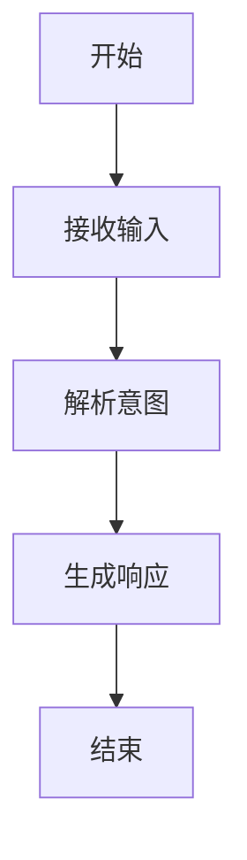
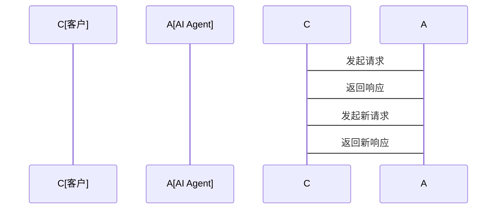
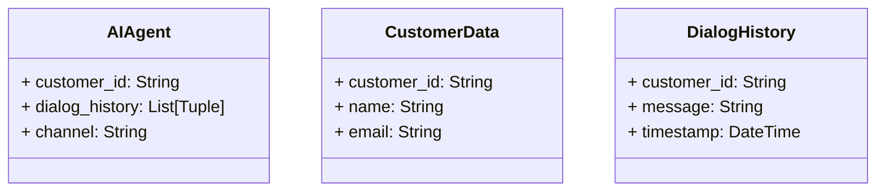
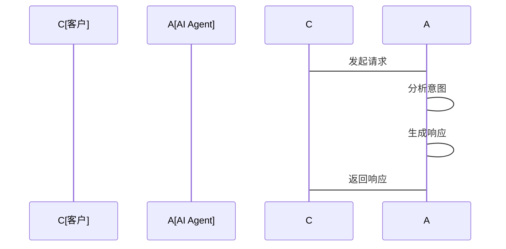

                 


# 《企业AI Agent的多渠道集成：打造统一客户服务体验》

> 关键词：企业AI Agent，多渠道集成，客户服务体验，统一交互，智能客服系统，NLP，对话管理

> 摘要：本文将深入探讨企业AI Agent的多渠道集成方法，分析如何通过统一客户服务体验来提升客户满意度和效率。文章从AI Agent的核心概念、算法原理、系统架构到实际项目部署，逐一展开，结合具体案例和代码实现，为读者提供全面的技术指导。

---

# 第一章: 企业AI Agent的背景与概念

## 1.1 问题背景

### 1.1.1 企业客户服务的痛点与挑战

在企业运营中，客户服务是一个关键环节。传统的客服系统通常依赖于电话、邮件、在线聊天等单一渠道，导致客户体验分散且不一致。例如，客户可能需要在不同的平台上重复描述问题，导致效率低下，体验不佳。

### 1.1.2 多渠道客服系统的问题与不足

随着客户接触点的多样化，企业通常会采用多渠道客服系统，但这些系统往往各自独立，数据孤岛现象严重，难以实现统一的客户视图和一致的服务体验。

### 1.1.3 AI Agent的出现与意义

AI Agent（人工智能代理）作为一种智能化的解决方案，能够通过自然语言处理（NLP）和机器学习技术，实现跨渠道的统一交互，提供高效、一致的客户服务体验。

## 1.2 问题描述

### 1.2.1 客户服务渠道分散化的问题

客户可能通过多种渠道（如网站、移动应用、社交媒体）与企业互动，但这些渠道缺乏统一的管理，导致客户体验不一致。

### 1.2.2 不同渠道间体验不统一的挑战

客户在不同渠道上可能遇到不同的响应时间和服务质量，这会降低客户满意度。

### 1.2.3 用户需求与系统响应的不匹配

传统客服系统难以准确理解客户意图，导致响应错误或延迟。

## 1.3 问题解决思路

### 1.3.1 统一客户体验的目标

通过AI Agent实现跨渠道的统一交互，确保客户在任何渠道都能获得一致的服务体验。

### 1.3.2 AI Agent的核心作用

AI Agent能够整合多种渠道，通过NLP技术理解客户需求，并协调不同系统提供统一的响应。

### 1.3.3 多渠道集成的实现路径

通过API网关、消息队列等技术手段，实现不同渠道的统一接入和管理。

## 1.4 AI Agent的边界与外延

### 1.4.1 AI Agent的功能边界

AI Agent主要负责跨渠道的客户交互、需求理解与响应，但不直接处理后端业务逻辑。

### 1.4.2 相关概念的对比与区分

与传统客服系统相比，AI Agent具有更高的智能化和自动化能力，能够7x24小时提供服务。

### 1.4.3 与传统客服系统的区别

AI Agent通过NLP和机器学习技术，能够更准确地理解客户需求，并提供个性化的服务。

## 1.5 核心概念结构与要素

### 1.5.1 AI Agent的核心要素

- **自然语言处理（NLP）**：理解客户的输入。
- **对话管理**：跟踪对话状态，生成合适的响应。
- **多渠道接入**：支持多种客户交互渠道。

### 1.5.2 多渠道集成的关键因素

- **统一客户视图**：整合不同渠道的客户信息。
- **一致的交互界面**：确保客户在任何渠道都能获得一致的体验。
- **实时协调**：动态调整资源以满足客户需求。

### 1.5.3 统一客户体验的实现机制

- **数据集成**：整合不同渠道的客户数据。
- **智能路由**：根据客户需求和系统能力分配响应渠道。
- **统一反馈**：将结果通过客户选择的渠道反馈。

## 1.6 本章小结

本章介绍了企业AI Agent的背景和核心概念，分析了多渠道客服系统的问题，并提出了通过AI Agent实现统一客户服务体验的解决方案。

---

# 第二章: AI Agent的核心概念与联系

## 2.1 AI Agent的定义与特点

### 2.1.1 AI Agent的定义

AI Agent是一种能够感知环境、理解用户需求，并通过执行动作以实现目标的智能系统。

### 2.1.2 AI Agent的核心特点

- **智能性**：通过NLP和机器学习技术理解客户需求。
- **自主性**：能够自主决策和执行动作。
- **适应性**：能够根据环境变化动态调整行为。

### 2.1.3 AI Agent与其他技术的对比

| 技术 | 描述 | 优势 |
|------|------|------|
| 传统客服系统 | 依赖人工操作，响应时间长 | 成本高，效率低 |
| 智能音箱 | 仅支持语音交互 | 场景受限 |
| AI Agent | 支持多渠道交互，智能化响应 | 全渠道覆盖，高效便捷 |

## 2.2 AI Agent的实体关系

```mermaid
erDiagram
    actor 客户
    actor 系统管理员
    actor 第三方服务
    class AI Agent
    class 渠道
    class 客户数据
    class 对话历史
    class 系统设置
    客户 --> AI Agent : 发起请求
    AI Agent --> 渠道 : 通过渠道响应
    AI Agent --> 客户数据 : 存储客户信息
    AI Agent --> 对话历史 : 记录对话
    AI Agent --> 系统设置 : 获取配置
    AI Agent --> 第三方服务 : 调用API
```

## 2.3 本章小结

本章通过定义、特点和实体关系图，详细解释了AI Agent的核心概念及其与其他技术的区别。

---

# 第三章: AI Agent的算法原理

## 3.1 自然语言处理（NLP）算法

### 3.1.1 NLP的核心流程

1. **文本预处理**：分词、去停用词。
2. **特征提取**：将文本转换为向量表示。
3. **模型训练**：使用深度学习模型（如BERT）进行训练。

### 3.1.2 NLP实现代码

```python
import numpy as np
from sklearn.feature_extraction.text import TfidfVectorizer

# 示例文本
texts = ["Hello, how are you?", "I need help with my account."]

# 创建TF-IDF向量器
vectorizer = TfidfVectorizer()
tfidf = vectorizer.fit_transform(texts)

# 查看特征
print(vectorizer.get_feature_names_out())
```

### 3.1.3 NLP的数学模型

$$ \text{TF-IDF} = \text{TF} \times \text{IDF} $$

其中，TF是词频，IDF是逆文档频率。

### 3.1.4 对话管理算法



## 3.2 对话管理算法实现

### 3.2.1 对话状态跟踪

```python
class DialogStateTracker:
    def __init__(self):
        self.history = []
    
    def update_state(self, input_text, response_text):
        self.history.append((input_text, response_text))
    
    def get_previous_state(self, n):
        return self.history[-n]
```

### 3.2.2 对话策略

$$ P(\text{intent} | \text{input}) = \frac{\text{count}(\text{intent} \cap \text{input})}{\text{total inputs}} $$

### 3.2.3 对话上下文管理



## 3.3 本章小结

本章详细讲解了AI Agent中NLP和对话管理的算法原理，并通过代码和流程图展示了实现过程。

---

# 第四章: 系统分析与架构设计

## 4.1 项目介绍

### 4.1.1 项目目标

实现一个多渠道集成的AI Agent系统，支持包括网页、移动端和社交媒体在内的多种客户交互渠道。

### 4.1.2 项目范围

- 支持多种渠道的接入。
- 提供统一的客户视图和交互体验。
- 实现智能路由和对话管理。

## 4.2 系统功能设计

### 4.2.1 领域模型



### 4.2.2 系统架构


### 4.2.3 系统接口设计

- **API接口**：提供RESTful API，供前端调用。
- **消息队列**：使用Kafka或RabbitMQ处理异步请求。

### 4.2.4 系统交互流程



## 4.3 本章小结

本章通过系统设计图和交互流程图，详细描述了AI Agent系统的架构和功能模块。

---

# 第五章: 项目实战

## 5.1 环境安装

### 5.1.1 安装Python和相关库

```bash
pip install numpy scikit-learn tensorflow
```

### 5.1.2 安装Nginx作为反向代理

```bash
sudo apt-get install nginx
```

## 5.2 系统核心实现

### 5.2.1 NLP引擎实现

```python
import tensorflow as tf
from tensorflow.keras import layers

model = tf.keras.Sequential([
    layers.Embedding(input_dim=10000, output_dim=16),
    layers.GlobalAveragePooling1D(),
    layers.Dense(1, activation='sigmoid')
])
model.compile(optimizer='adam', loss='binary_crossentropy', metrics=['accuracy'])
```

### 5.2.2 对话管理实现

```python
class DialogManager:
    def __init__(self):
        self.current_dialogue = []
    
    def process_message(self, message):
        self.current_dialogue.append(message)
        return self.generate_response(message)
    
    def generate_response(self, message):
        # 示例逻辑
        if "help" in message.lower():
            return "How can I assist you today?"
        else:
            return "I'm sorry, I don't understand. Please rephrase."
```

### 5.2.3 API接口实现

```python
from flask import Flask, request, jsonify

app = Flask(__name__)

@app.route('/api/agent', methods=['POST'])
def process_request():
    data = request.json
    message = data['message']
    response = dialog_manager.process_message(message)
    return jsonify({'response': response})
```

## 5.3 代码应用解读与分析

### 5.3.1 环境搭建

- 使用Python 3.8及以上版本。
- 安装必要的库，如TensorFlow、Flask等。

### 5.3.2 代码功能分析

- **NLP引擎**：用于理解客户输入。
- **对话管理**：跟踪对话状态，生成响应。
- **API接口**：提供外部调用的接口。

## 5.4 实际案例分析

### 5.4.1 案例背景

某电商平台希望通过AI Agent实现统一的客户服务体验，支持网页、移动端和社交媒体三种渠道。

### 5.4.2 案例实现


### 5.4.3 案例分析

通过AI Agent的多渠道集成，客户可以在任何渠道获得一致的服务体验，提高了客户满意度和效率。

## 5.5 本章小结

本章通过具体案例和代码实现，详细讲解了AI Agent系统的部署和实现过程。

---

# 第六章: 最佳实践与总结

## 6.1 最佳实践

### 6.1.1 系统设计建议

- **模块化设计**：便于维护和扩展。
- **容错设计**：确保系统健壮性。
- **日志管理**：便于故障排查。

### 6.1.2 代码实现建议

- **单元测试**：确保各模块功能正常。
- **性能优化**：通过缓存和并行处理提升性能。
- **安全措施**：保护客户数据和系统安全。

## 6.2 小结

通过本文的详细讲解，读者可以全面理解企业AI Agent的多渠道集成方法，以及如何通过统一客户服务体验来提升客户满意度和效率。

## 6.3 注意事项

- **数据隐私**：确保客户数据的安全性。
- **系统兼容性**：确保AI Agent能够适配多种渠道和系统。
- **用户体验**：持续优化交互体验，提升客户满意度。

## 6.4 拓展阅读

- 《深度学习》——Ian Goodfellow
- 《自然语言处理实战》——Harvey Newman

---

# 作者：AI天才研究院/AI Genius Institute & 禅与计算机程序设计艺术 /Zen And The Art of Computer Programming

---

希望这篇文章能为您提供有价值的技术见解和实践指导。如需进一步探讨或获取更多资源，请随时联系。

