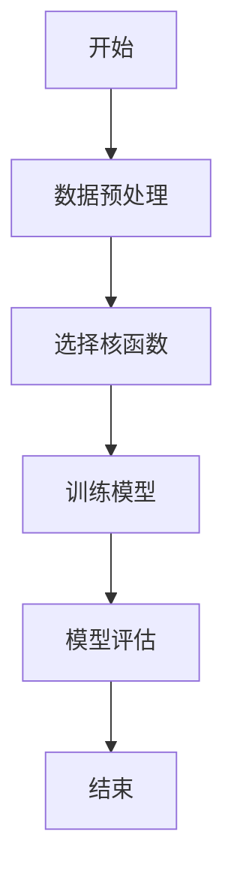
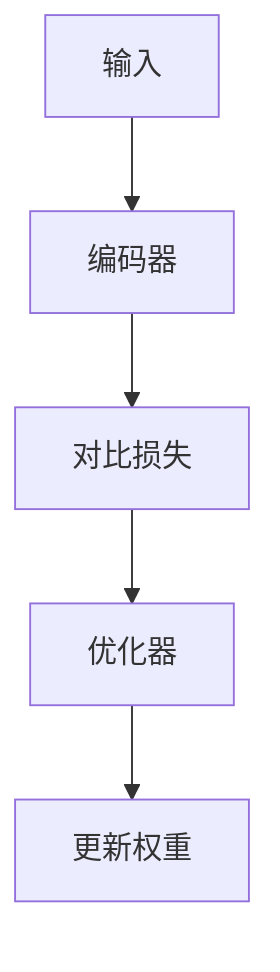
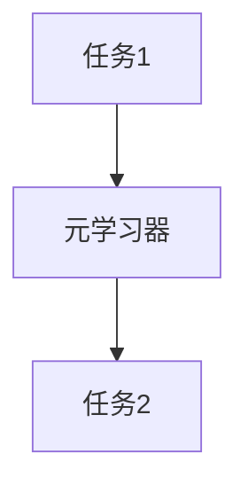
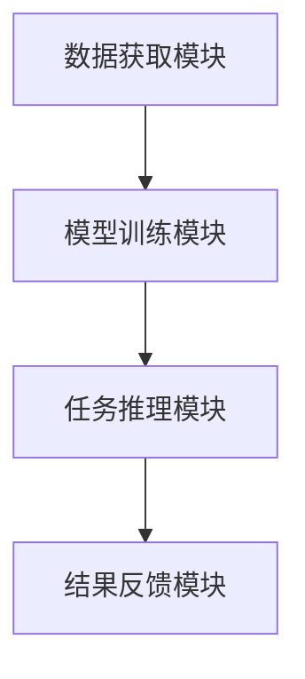
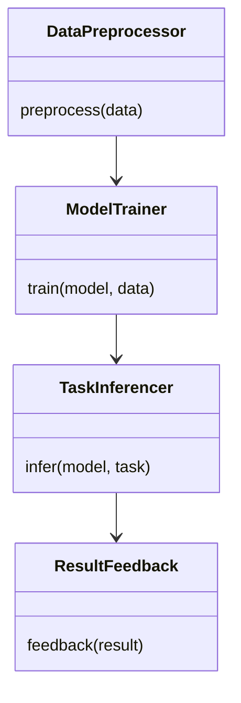
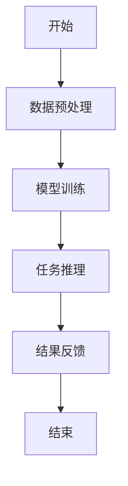
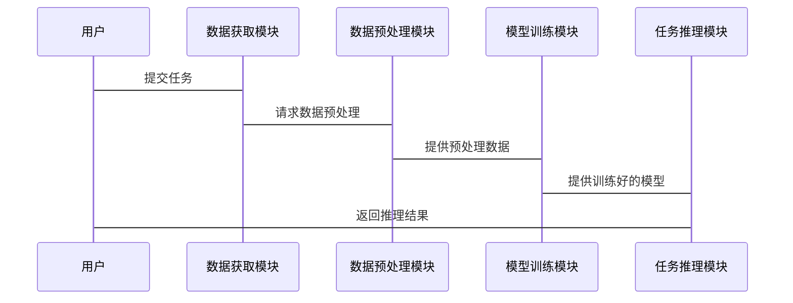
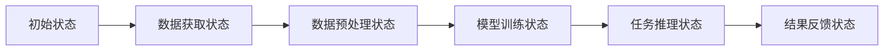

                 


# 企业AI Agent的少样本学习：快速适应新业务场景

## 关键词：企业AI Agent，少样本学习，快速适应，新业务场景，机器学习，数据挖掘，对比学习，元学习，系统架构，项目实战

## 摘要：  
本文探讨了企业AI Agent在新业务场景中的快速适应问题，重点分析了少样本学习在这一过程中的关键作用。通过结合数据驱动和知识驱动的方法，本文详细阐述了支持向量数据挖掘、对比学习和元学习等算法的原理，并提供了系统架构设计和实际案例分析。文章旨在帮助企业技术决策者和技术团队理解如何利用少样本学习技术，快速构建适应性强的AI Agent系统，以应对不断变化的业务需求。

---

# 第一部分: 少样本学习的背景与问题描述

## 第1章: 少样本学习的背景与问题描述

### 1.1 少样本学习的背景

#### 1.1.1 传统机器学习的局限性  
传统机器学习方法通常依赖于大量标注数据来训练模型。然而，在企业环境中，新业务场景的快速变化和多样化需求常常导致数据获取困难，标注成本高昂。这种情况下，传统机器学习方法往往难以满足实时性和灵活性的要求。

#### 1.1.2 少样本学习的定义与特点  
少样本学习（Few-Shot Learning）是一种机器学习技术，能够在仅使用少量样本的情况下完成模型训练和推理。其特点包括：  
- **数据高效性**：利用少量数据实现高性能模型。  
- **快速适应性**：能够快速适应新的业务场景。  
- **领域通用性**：适用于多个领域的数据。  

#### 1.1.3 企业AI Agent的应用需求  
企业AI Agent需要在复杂的业务环境中快速理解和适应新的任务。少样本学习能够通过少量的样本来构建适用于新场景的模型，从而满足企业的实时性和灵活性需求。

### 1.2 企业AI Agent的核心问题

#### 1.2.1 业务场景的快速变化  
企业业务场景的变化速度快，新场景的数据获取成本高，传统机器学习方法难以快速适应。

#### 1.2.2 数据获取的挑战  
在新业务场景中，数据可能稀缺，标注成本高，难以满足传统机器学习对大量数据的需求。

#### 1.2.3 模型的快速适应性需求  
企业需要AI Agent能够在短时间内快速适应新场景，完成任务并提供实时反馈。

### 1.3 少样本学习在企业AI Agent中的应用价值

#### 1.3.1 提高模型的泛化能力  
通过少样本学习，模型可以在有限数据下保持较高的泛化能力，适应新场景的需求。

#### 1.3.2 降低数据获取成本  
少样本学习减少了对大量标注数据的依赖，降低了数据获取和标注的成本。

#### 1.3.3 加速业务场景的适应  
企业可以快速部署AI Agent，利用少样本学习技术快速适应新业务场景，提高业务效率。

### 1.4 本章小结  
本章介绍了少样本学习的背景、定义和特点，并分析了企业在AI Agent应用中的需求和挑战。通过少样本学习技术，企业可以在数据稀缺的情况下快速构建适应性强的AI Agent系统。

---

## 第2章: 少样本学习的核心概念与联系

### 2.1 少样本学习的原理

#### 2.1.1 数据驱动与知识驱动的结合  
少样本学习通过结合数据驱动和知识驱动的方法，充分利用少量数据和先验知识来提升模型性能。

#### 2.1.2 元学习与迁移学习的联系  
元学习（Meta-Learning）通过训练模型在不同任务间快速迁移，而迁移学习（Transfer Learning）则利用已有的知识来提升新任务的性能。两者在少样本学习中具有重要地位。

#### 2.1.3 少样本学习的关键技术  
- **支持向量数据挖掘**：通过支持向量机（SVM）进行分类和回归任务。  
- **对比学习**：通过对比特征相似性来提升模型的特征提取能力。  
- **元学习**：通过训练模型在不同任务间快速适应。  

### 2.2 AI Agent的少样本学习模型

#### 2.2.1 基于支持向量的数据挖掘  
支持向量机（SVM）是一种监督学习方法，适用于分类和回归任务。在少样本学习中，SVM通过找到数据的最优超平面，实现高效分类。

#### 2.2.2 对比学习与特征提取  
对比学习通过最大化正样本之间的相似性和最小化负样本之间的相似性，提升模型的特征提取能力。这种方法在图像和文本处理中表现尤为突出。

#### 2.2.3 基于图的少样本学习  
基于图的少样本学习通过构建图结构，利用节点之间的关系进行推理和预测。这种方法适用于复杂关系的场景。

### 2.3 少样本学习与传统机器学习的对比

#### 2.3.1 数据量与模型复杂度的关系  
少样本学习通过简化模型或利用先验知识，降低对数据量的依赖。

#### 2.3.2 模型的泛化能力对比  
少样本学习在数据稀缺情况下能够保持较高的泛化能力，而传统机器学习在数据充足时表现更优。

#### 2.3.3 适用场景的差异  
少样本学习适用于数据稀缺和快速适应的场景，而传统机器学习适用于数据充足且任务固定的场景。

### 2.4 本章小结  
本章详细讲解了少样本学习的原理和核心技术，并通过对比分析，明确了少样本学习在企业AI Agent中的优势和适用场景。

---

## 第3章: 少样本学习的算法原理

### 3.1 支持向量数据挖掘算法

#### 3.1.1 算法原理  
支持向量机（SVM）通过寻找数据的最优超平面，将数据分为不同类别。其核心在于找到能够最大化区分两类数据的超平面。

#### 3.1.2 算法流程图  


#### 3.1.3 Python代码实现  
```python
from sklearn import svm
import numpy as np

# 示例数据
X = np.array([[0, 0], [1, 1], [2, 2], [3, 3]])
y = np.array([0, 1, 0, 1])

# 训练模型
model = svm.SVC(kernel='linear')
model.fit(X, y)

# 预测
print(model.predict([[4, 4]]))  # 输出：array([1])
```

#### 3.1.4 示例分析  
上述代码展示了如何使用SVM进行分类任务。通过少量数据训练模型，并在新数据上进行预测。

### 3.2 对比学习算法

#### 3.2.1 对比学习的基本原理  
对比学习通过最大化正样本的相似性和最小化负样本的相似性，提升模型的特征提取能力。

#### 3.2.2 对比学习的网络结构  


#### 3.2.3 对比学习的损失函数  
对比损失函数可以表示为：
$$ L = -\log(\text{sim}(x_i, x_j) + \text{sim}(x_i, x_k)) $$
其中，$\text{sim}$表示相似性度量。

#### 3.2.4 代码实现与分析  
```python
import torch
import torch.nn as nn

# 示例对比学习模型
class ContrastiveModel(nn.Module):
    def __init__(self, embedding_dim):
        super(ContrastiveModel, self).__init__()
        self.encoder = nn.Linear(embedding_dim, 128)
        self.reducer = nn.Linear(128, 1)

    def forward(self, x):
        x = self.encoder(x)
        x = self.reducer(x)
        return x

# 训练过程
model = ContrastiveModel(input_dim)
criterion = nn.CrossEntropyLoss()
optimizer = torch.optim.Adam(model.parameters(), lr=0.001)

# 前向传播
outputs = model(inputs)
loss = criterion(outputs, labels)
loss.backward()
optimizer.step()
```

### 3.3 元学习算法

#### 3.3.1 元学习的定义与原理  
元学习通过训练模型在不同任务间快速迁移，适用于少样本学习场景。

#### 3.3.2 元学习的网络结构  


#### 3.3.3 元学习的训练策略  
元学习的训练目标是通过多个任务的损失函数，优化模型的参数以适应新任务。

#### 3.3.4 代码实现与分析  
```python
import torch
import torch.nn as nn

# 示例元学习模型
class MetaLearner(nn.Module):
    def __init__(self, feature_dim, hidden_dim):
        super(MetaLearner, self).__init__()
        self.embedding = nn.Linear(feature_dim, hidden_dim)
        self.classifier = nn.Linear(hidden_dim, num_classes)

    def forward(self, x):
        x = self.embedding(x)
        x = self.classifier(x)
        return x

# 元学习训练过程
model = MetaLearner(feature_dim, hidden_dim)
optimizer = torch.optim.Adam(model.parameters(), lr=0.001)

# 前向传播
outputs = model(inputs)
loss = criterion(outputs, labels)
loss.backward()
optimizer.step()
```

### 3.4 本章小结  
本章详细讲解了支持向量数据挖掘、对比学习和元学习的算法原理，并通过代码示例展示了这些算法的实现过程。

---

## 第4章: 少样本学习的系统架构与设计

### 4.1 企业AI Agent的系统架构

#### 4.1.1 系统功能模块划分  
企业AI Agent系统通常包括数据获取模块、模型训练模块、任务推理模块和结果反馈模块。

#### 4.1.2 系统架构图  


#### 4.1.3 各模块的交互流程  
数据获取模块负责收集和预处理数据，模型训练模块基于少样本学习算法构建模型，任务推理模块利用模型进行推理和预测，结果反馈模块将结果返回给用户。

### 4.2 系统功能设计

#### 4.2.1 领域模型类图  


#### 4.2.2 系统功能流程图  


#### 4.2.3 系统接口设计  
系统接口包括数据输入接口、模型训练接口和结果输出接口，确保各模块之间的数据交互顺畅。

### 4.3 系统交互设计

#### 4.3.1 序列图  


#### 4.3.2 状态转换图  


#### 4.3.3 交互流程分析  
用户提交任务后，系统依次完成数据获取、预处理、模型训练和任务推理，最后将结果反馈给用户。

### 4.4 本章小结  
本章详细设计了企业AI Agent的系统架构，并通过类图和流程图展示了系统的功能模块和交互流程。

---

## 第5章: 项目实战

### 5.1 环境安装与配置

#### 5.1.1 安装依赖  
安装必要的Python库，如`scikit-learn`、`torch`等。

```bash
pip install scikit-learn torch numpy
```

#### 5.1.2 环境配置  
确保Python版本兼容，建议使用Python 3.6及以上版本。

### 5.2 核心代码实现

#### 5.2.1 支持向量数据挖掘的实现  
```python
from sklearn import svm
import numpy as np

# 示例数据
X = np.array([[0, 0], [1, 1], [2, 2], [3, 3]])
y = np.array([0, 1, 0, 1])

# 训练模型
model = svm.SVC(kernel='linear')
model.fit(X, y)

# 预测
print(model.predict([[4, 4]]))  # 输出：array([1])
```

#### 5.2.2 对比学习的实现  
```python
import torch
import torch.nn as nn

# 示例对比学习模型
class ContrastiveModel(nn.Module):
    def __init__(self, embedding_dim):
        super(ContrastiveModel, self).__init__()
        self.encoder = nn.Linear(embedding_dim, 128)
        self.reducer = nn.Linear(128, 1)

    def forward(self, x):
        x = self.encoder(x)
        x = self.reducer(x)
        return x

# 训练过程
model = ContrastiveModel(input_dim)
criterion = nn.CrossEntropyLoss()
optimizer = torch.optim.Adam(model.parameters(), lr=0.001)

# 前向传播
outputs = model(inputs)
loss = criterion(outputs, labels)
loss.backward()
optimizer.step()
```

### 5.3 案例分析与总结

#### 5.3.1 案例分析  
通过实际案例，展示如何利用少样本学习算法快速构建AI Agent模型，并在新业务场景中进行推理和预测。

#### 5.3.2 总结  
总结项目实施的经验和教训，提出改进建议。

### 5.4 本章小结  
本章通过实际项目展示了少样本学习技术的应用，详细讲解了环境配置、核心代码实现和案例分析。

---

## 第6章: 最佳实践与小结

### 6.1 小结

#### 6.1.1 核心观点总结  
少样本学习能够在数据稀缺的情况下快速构建高性能模型，满足企业AI Agent的实时性和灵活性需求。

#### 6.1.2 实施经验总结  
在实际应用中，需要根据具体场景选择合适的算法，并合理配置系统架构。

### 6.2 注意事项

#### 6.2.1 数据质量的重要性  
确保输入数据的质量，避免噪声干扰模型性能。

#### 6.2.2 模型选择的策略  
根据具体任务需求选择合适的算法，避免盲目使用复杂模型。

#### 6.2.3 系统优化的建议  
通过合理的系统设计和优化，提升模型的运行效率和准确性。

### 6.3 拓展阅读

#### 6.3.1 推荐书籍  
- 《Deep Learning》  
- 《Pattern Recognition and Machine Learning》  

#### 6.3.2 相关论文  
- "Meta-Learning for Few-Shot Classification"  
- "Contrastive Learning of Visual Representations"  

### 6.4 本章小结  
本章总结了少样本学习在企业AI Agent中的应用经验，并提出了最佳实践建议，帮助读者更好地实施相关技术。

---

# 结语  
通过本文的深入探讨，读者可以全面了解少样本学习在企业AI Agent中的应用价值和实现方法。结合实际案例和系统设计，企业可以有效利用少样本学习技术，快速适应新业务场景，提升业务效率和竞争力。

---

# 作者：AI天才研究院/AI Genius Institute & 禅与计算机程序设计艺术 /Zen And The Art of Computer Programming

