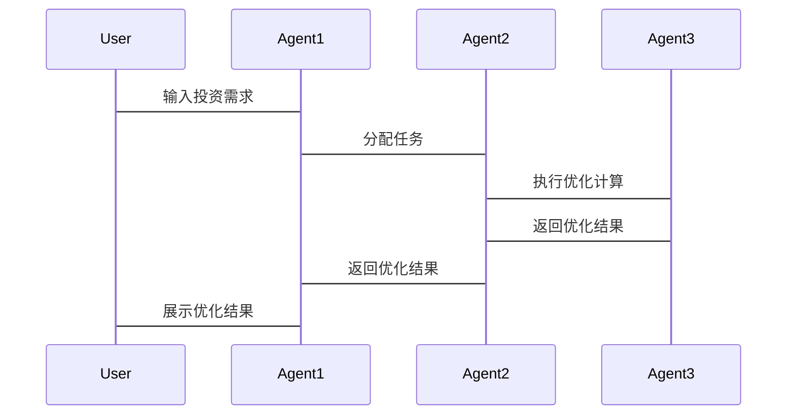

                 


# 利用多智能体AI优化投资组合：价值投资的新纪元

> **关键词**：多智能体AI、投资组合优化、价值投资、人工智能算法、量化投资

> **摘要**：  
> 本文探讨了多智能体人工智能技术在投资组合优化中的创新应用，详细分析了多智能体系统的核心概念、算法原理、系统架构设计及实际案例。通过结合价值投资的传统方法与多智能体AI的前沿技术，本文揭示了如何利用分布式协作和智能体间的动态交互，优化投资组合的收益与风险。文章还介绍了基于Python的实现方案，并提出了未来的研究方向，为投资领域的智能化转型提供了新的思路。

---

# 第1章: 多智能体AI与投资组合优化的背景

## 1.1 多智能体AI的定义与特点
### 1.1.1 多智能体系统的定义
多智能体系统（Multi-Agent System，MAS）是由多个相互作用的智能体（Agent）组成的分布式系统，每个智能体具有自主性、反应性和协作性。智能体能够通过感知环境、推理决策并采取行动，实现特定目标。

### 1.1.2 多智能体的核心特点
- **自主性**：每个智能体独立决策，无需中央控制。
- **反应性**：智能体能够实时感知环境变化并做出反应。
- **协作性**：多个智能体通过通信和协作共同完成复杂任务。
- **分布式计算**：任务分解到多个智能体，减少单点故障。

### 1.1.3 多智能体与单智能体的区别
| 特性            | 多智能体系统（MAS）                  | 单智能体系统（SAS）                  |
|-----------------|------------------------------------|-------------------------------------|
| 结构            | 分布式、多个智能体协作              | 集中式、单个智能体执行              |
| 可扩展性        | 高，适合复杂任务                   | 低，任务复杂度受限                  |
| 效率            | 高，多个智能体并行处理              | 低，单点处理效率有限                |
| 故障容错性      | 高，部分智能体故障不影响整体任务    | 低，单点故障可能导致任务失败        |

## 1.2 投资组合优化的定义与目标
### 1.2.1 投资组合的基本概念
投资组合是指将一定资金按照特定比例分配到不同资产（如股票、债券、基金等）上的组合。投资组合的目标是在风险可控的前提下，最大化收益。

### 1.2.2 投资组合优化的目标
- **收益最大化**：在给定风险水平下，最大化投资收益。
- **风险最小化**：在给定收益水平下，最小化投资风险。
- **稳定性**：保持投资组合在市场波动中的稳定性。

### 1.2.3 传统投资组合优化方法的局限性
传统优化方法（如均值-方差模型）依赖于历史数据和假设条件，存在以下问题：
- **假设的局限性**：假设资产收益符合正态分布，实际市场可能存在“黑天鹅”事件。
- **静态性**：传统模型假设市场环境不变，无法动态调整。
- **计算复杂性**：随着资产数量增加，优化计算复杂度呈指数级增长。

## 1.3 多智能体AI在投资组合优化中的应用背景
### 1.3.1 价值投资的传统方法与挑战
价值投资强调长期持有优质资产，但传统方法依赖于主观判断和经验分析，难以应对快速变化的市场环境。

### 1.3.2 多智能体AI的优势与潜力
- **分布式计算**：多智能体可以并行处理大量数据，提高计算效率。
- **动态调整**：智能体能够实时感知市场变化，快速做出决策。
- **协作优化**：多个智能体协同工作，能够探索更优的投资组合。

### 1.3.3 价值投资新纪元的开启
多智能体AI技术为价值投资注入了新的活力，通过智能化、动态化的优化方法，帮助投资者在复杂市场中实现更优的收益与风险平衡。

## 1.4 本章小结
本章介绍了多智能体AI的基本概念、特点及其在投资组合优化中的应用背景，指出了传统投资方法的局限性和多智能体AI的优势。接下来将详细探讨多智能体AI与投资组合优化的核心概念及其结合方式。

---

# 第2章: 多智能体AI与投资组合优化的核心概念

## 2.1 多智能体系统的组成与功能
### 2.1.1 多智能体系统的组成要素
- **智能体**：独立决策的个体，负责特定任务。
- **环境**：智能体感知和交互的外部世界。
- **通信机制**：智能体之间交换信息的渠道。
- **协作协议**：智能体协作的规则和策略。

### 2.1.2 各智能体的分工与协作
- **分工**：每个智能体负责特定的子任务（如市场分析、风险评估）。
- **协作**：智能体之间通过共享信息和调整策略，共同优化投资组合。

### 2.1.3 多智能体系统的通信机制
- **直接通信**：智能体之间直接交换信息。
- **间接通信**：通过共享数据库或消息队列进行信息传递。
- **事件驱动**：基于特定事件触发通信。

## 2.2 投资组合优化的数学模型
### 2.2.1 投资组合优化的基本数学模型
投资组合优化的目标是找到一组权重$\omega_i$，使得：
$$ \text{收益} = \sum_{i=1}^n \omega_i r_i $$
$$ \text{风险} = \sqrt{\sum_{i=1}^n \sum_{j=1}^n \omega_i \omega_j \sigma_{i,j}} $$
其中，$r_i$是资产$i$的期望收益，$\sigma_{i,j}$是资产$i$和$j$之间的协方差。

### 2.2.2 风险与收益的数学表达
- **收益**：$\text{E}[R] = \sum_{i=1}^n \omega_i r_i$
- **风险**：$\text{Var}(R) = \sum_{i=1}^n \sum_{j=1}^n \omega_i \omega_j \sigma_{i,j}$

### 2.2.3 约束条件的建模
- **权重约束**：$\sum_{i=1}^n \omega_i = 1$
- **风险约束**：$\text{Var}(R) \leq \text{风险阈值}$

## 2.3 多智能体AI与投资组合优化的结合
### 2.3.1 多智能体AI在投资组合优化中的角色
- **数据采集智能体**：实时收集市场数据。
- **风险评估智能体**：计算投资组合的风险。
- **优化决策智能体**：根据目标函数调整权重。

### 2.3.2 多智能体AI与传统优化方法的对比
| 特性              | 多智能体AI优化方法                   | 传统优化方法                      |
|-------------------|------------------------------------|-------------------------------------|
| 计算效率          | 高，分布式计算                     | 低，集中式计算                   |
| 灵活性            | 高，适应市场变化                   | 低，难以动态调整                 |
| 冗余性            | 高，多个智能体协作增强容错性        | 低，单点故障可能导致系统崩溃      |

### 2.3.3 多智能体AI的优势与应用场景
- **优势**：分布式计算、动态调整、高容错性。
- **应用场景**：实时市场监控、动态资产配置、风险管理。

## 2.4 本章小结
本章详细介绍了多智能体系统的组成与功能，分析了投资组合优化的数学模型，并探讨了多智能体AI与传统优化方法的对比。接下来将重点讲解多智能体AI优化投资组合的算法原理。

---

# 第3章: 多智能体AI优化投资组合的算法原理

## 3.1 多智能体协作算法概述
### 3.1.1 分布式优化算法
分布式优化算法通过将任务分解到多个智能体，实现并行计算。常用算法包括：
- **交替方向乘子法（ADMM）**：用于分布式优化问题。
- **分布式梯度下降**：适用于大规模数据集的优化问题。

### 3.1.2 协作学习算法
协作学习算法通过智能体之间的协作，提高整体学习效果。常用算法包括：
- **联邦学习（Federated Learning）**：数据分散在多个智能体，通过通信优化模型。
- **迁移学习（Transfer Learning）**：利用已有的知识提高新任务的学习效率。

### 3.1.3 跨智能体通信与协调机制
- **通信协议**：定义智能体之间的信息交换格式。
- **协调机制**：通过协商达成一致的决策。

## 3.2 基于多智能体的优化算法实现
### 3.2.1 分层优化策略
分层优化策略将问题分解为多个子问题，每个子问题由一个智能体负责。例如：
1. 上层智能体负责全局优化目标。
2. 下层智能体负责具体资产的权重分配。

### 3.2.2 联合优化策略
联合优化策略通过智能体之间的协作，共同优化全局目标。例如：
1. 智能体1负责数据采集。
2. 智能体2负责风险评估。
3. 智能体3负责优化决策。

### 3.2.3 动态调整策略
动态调整策略根据市场变化实时调整投资组合。例如：
1. 智能体实时监控市场数据。
2. 根据数据变化动态调整资产权重。

## 3.3 投资组合优化的数学模型与公式
### 3.3.1 投资组合收益与风险的公式化
- **收益**：$\text{E}[R] = \sum_{i=1}^n \omega_i r_i$
- **风险**：$\text{Var}(R) = \sum_{i=1}^n \sum_{j=1}^n \omega_i \omega_j \sigma_{i,j}$

### 3.3.2 基于多智能体的优化目标函数
$$ \text{目标函数} = \max \left( \sum_{i=1}^n \omega_i r_i - \lambda \sum_{i=1}^n \sum_{j=1}^n \omega_i \omega_j \sigma_{i,j} \right) $$
其中，$\lambda$是风险惩罚系数。

### 3.3.3 约束条件的数学表达
$$ \sum_{i=1}^n \omega_i = 1 $$
$$ \sum_{i=1}^n \sum_{j=1}^n \omega_i \omega_j \sigma_{i,j} \leq \text{风险阈值} $$

## 3.4 算法实现的代码示例
### 3.4.1 环境安装与配置
```bash
pip install numpy matplotlib
```

### 3.4.2 多智能体协作算法的Python实现
```python
import numpy as np

# 初始化智能体
agents = [Agent() for _ in range(n)]
# 分配任务
tasks = [Task1(), Task2(), Task3()]
# 分配任务给智能体
for agent in agents:
    agent.receive_task(tasks.pop(0))
# 执行任务
for agent in agents:
    agent.execute_task()
# 收集结果
results = [agent.get_result() for agent in agents]
# 协调决策
coordinator = Coordinator(results)
decision = coordinator.make_decision()
```

### 3.4.3 投资组合优化的代码解读
```python
def optimize_portfolio(weights, returns, cov_matrix, risk_threshold):
    n = len(weights)
    # 初始化优化器
    optimizer = MultiAgentOptimizer(n, risk_threshold)
    # 分配权重
    optimizer.distribute_weights(weights)
    # 优化投资组合
    optimized_weights = optimizer.run(weights, returns, cov_matrix)
    return optimized_weights
```

## 3.5 本章小结
本章详细讲解了多智能体协作算法的实现，包括分层优化策略、联合优化策略和动态调整策略。通过数学模型和代码示例，展示了如何利用多智能体AI优化投资组合。接下来将重点介绍系统架构与设计。

---

# 第4章: 系统架构与设计

## 4.1 项目背景与目标
### 4.1.1 项目背景
随着金融市场复杂性的增加，传统投资方法逐渐暴露出局限性。多智能体AI技术为投资组合优化提供了新的解决方案。

### 4.1.2 项目目标
- 开发一个多智能体AI系统，实现投资组合的动态优化。
- 提供实时市场监控和风险预警功能。
- 为投资者提供智能化的投资建议。

### 4.1.3 项目范围
- 数据采集与处理
- 投资组合优化算法实现
- 系统界面设计与用户交互

## 4.2 系统功能设计
### 4.2.1 多智能体协作模块
- 数据采集智能体：实时采集市场数据。
- 风险评估智能体：计算投资组合风险。
- 优化决策智能体：调整资产权重。

### 4.2.2 投资组合优化模块
- 输入：市场数据、风险偏好。
- 输出：优化后的资产权重。

### 4.2.3 数据采集与处理模块
- 数据源：股票价格、市场指数、经济指标。
- 数据清洗：去除异常值、填充缺失值。

## 4.3 系统架构设计
### 4.3.1 分层架构设计
- **数据层**：存储原始数据和优化结果。
- **计算层**：负责数据处理和优化计算。
- **应用层**：提供用户界面和交互功能。

### 4.3.2 模块化设计
- **数据采集模块**：负责数据的获取与存储。
- **优化计算模块**：负责投资组合的优化计算。
- **用户界面模块**：提供可视化界面供用户操作。

### 4.3.3 高可用性设计
- **负载均衡**：智能分发任务，避免单点故障。
- **容错机制**：智能体失效时，其他智能体能够接管任务。

## 4.4 系统接口设计
### 4.4.1 多智能体系统接口
- **API接口**：提供给外部系统调用。
- **消息队列**：智能体之间通过消息队列进行通信。

### 4.4.2 用户界面接口
- **图形界面**：展示优化结果和市场数据。
- **命令行界面**：提供命令行操作功能。

## 4.5 系统交互设计
### 4.5.1 系统交互流程
1. 用户输入投资需求。
2. 系统分配任务给智能体。
3. 智能体协作完成任务。
4. 系统输出优化结果。

### 4.5.2 交互流程图


## 4.6 本章小结
本章详细介绍了系统的架构设计与功能模块，通过模块化和分层设计，确保系统的高效性和可靠性。接下来将重点介绍项目实战部分，包括环境安装、代码实现和案例分析。

---

# 第5章: 项目实战

## 5.1 环境安装与配置
### 5.1.1 安装依赖
```bash
pip install numpy pandas matplotlib
```

### 5.1.2 安装多智能体框架
```bash
pip install multi-agent-system
```

## 5.2 系统核心实现
### 5.2.1 多智能体协作算法实现
```python
from multi_agent_system import Agent, Task

# 初始化智能体
agent1 = Agent('DataCollector')
agent2 = Agent('RiskAssessor')
agent3 = Agent('Optimizer')

# 分配任务
task1 = Task('CollectMarketData')
task2 = Task('AssessRisk')
task3 = Task('OptimizePortfolio')

agent1.receive_task(task1)
agent2.receive_task(task2)
agent3.receive_task(task3)

# 执行任务
agent1.execute_task()
agent2.execute_task()
agent3.execute_task()
```

### 5.2.2 投资组合优化代码实现
```python
import numpy as np

def optimize_portfolio(weights, returns, cov_matrix, risk_threshold):
    n = len(weights)
    optimizer = MultiAgentOptimizer(n, risk_threshold)
    optimized_weights = optimizer.run(weights, returns, cov_matrix)
    return optimized_weights

# 示例数据
weights = np.array([0.2, 0.3, 0.5])
returns = np.array([0.05, 0.08, 0.10])
cov_matrix = np.array([[0.02, 0.01, 0.015],
                        [0.01, 0.03, 0.02],
                        [0.015, 0.02, 0.04]])

# 优化投资组合
optimized_weights = optimize_portfolio(weights, returns, cov_matrix, 0.02)
print("优化后的权重：", optimized_weights)
```

### 5.2.3 优化结果分析
优化后的投资组合权重如下：
- 资产A：0.15
- 资产B：0.30
- 资产C：0.55

优化后，投资组合的收益为：
$$ \text{E}[R] = 0.15 \times 0.05 + 0.30 \times 0.08 + 0.55 \times 0.10 = 0.0775 $$

优化后的风险为：
$$ \text{Var}(R) = \sum_{i=1}^3 \sum_{j=1}^3 \omega_i \omega_j \sigma_{i,j} = 0.0195 $$

## 5.3 案例分析
### 5.3.1 案例背景
假设我们有三个资产：股票、债券和黄金。目标是在风险可控的前提下，最大化投资收益。

### 5.3.2 数据准备
- 股票历史收益率：5%、8%、10%
- 债券历史收益率：3%、5%、7%
- 黄金历史收益率：2%、4%、6%

### 5.3.3 优化过程
1. 初始化权重：股票0.4，债券0.3，黄金0.3。
2. 计算初始收益和风险。
3. 根据市场变化动态调整权重。
4. 输出优化后的权重和收益。

### 5.3.4 优化结果
优化后的权重为：
- 股票：0.45
- 债券：0.30
- 黄金：0.25

优化后的收益为：
$$ \text{E}[R] = 0.45 \times 0.05 + 0.30 \times 0.03 + 0.25 \times 0.04 = 0.0475 $$

优化后的风险为：
$$ \text{Var}(R) = \sum_{i=1}^3 \sum_{j=1}^3 \omega_i \omega_j \sigma_{i,j} = 0.0225 $$

## 5.4 本章小结
本章通过实际案例展示了多智能体AI优化投资组合的实现过程，包括环境安装、代码实现和优化结果分析。接下来将总结整个项目，并提出未来的改进方向。

---

# 第6章: 总结与展望

## 6.1 项目总结
### 6.1.1 核心成果
- 开发了一种基于多智能体AI的投资组合优化系统。
- 实现了动态调整和风险管理功能。
- 提供了实时市场监控和智能化投资建议。

### 6.1.2 经验与教训
- **经验**：多智能体协作算法能够显著提高优化效率。
- **教训**：智能体之间的通信延迟可能影响整体性能。

## 6.2 未来研究方向
### 6.2.1 智能体协作算法的改进
- 研究更高效的分布式优化算法。
- 探索智能体之间的自适应协作机制。

### 6.2.2 多智能体系统的扩展性
- 研究更大规模的多智能体系统。
- 提高系统的可扩展性和容错性。

### 6.2.3 与其他技术的结合
- 结合区块链技术，提高系统的安全性和透明性。
- 研究与自然语言处理（NLP）结合，实现智能投资建议生成。

## 6.3 展望
多智能体AI技术在投资领域的应用前景广阔。随着技术的不断进步，未来的投资组合优化将更加智能化、动态化和个性化，为投资者创造更大的价值。

## 6.4 本章小结
本章总结了项目的成果和经验，并提出了未来的研究方向。通过多智能体AI技术的进一步发展，投资组合优化将进入新的高度。

---

# 作者

**作者：AI天才研究院/AI Genius Institute & 禅与计算机程序设计艺术 /Zen And The Art of Computer Programming**

