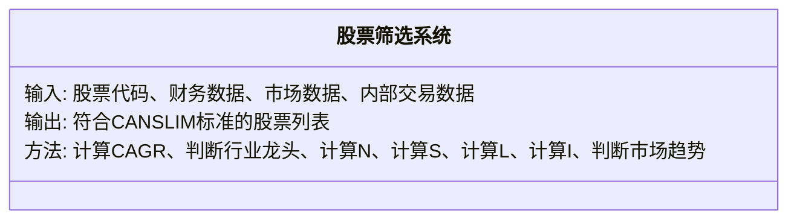
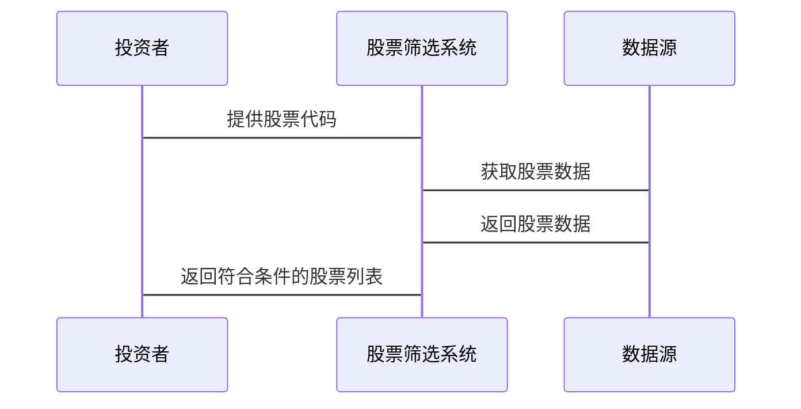

                 


# 威廉欧奈尔的CANSLIM投资系统

## 关键词：CANSLIM投资系统，威廉欧奈尔，股票筛选，成长股投资，相对强度，市场趋势，投资策略

## 摘要：威廉欧奈尔的CANSLIM投资系统是一种基于多因素分析的股票筛选方法，旨在帮助投资者识别具有高增长潜力的优质股票。该系统通过分析七个关键要素（CANSLIM）来评估股票的投资价值，包括复合年化增长率、行业领先地位、创新产品或服务、相对强度、流动性、内部交易信号以及市场趋势。本文将详细解析CANSLIM系统的各个要素，探讨其数学模型、算法原理以及实际应用中的最佳实践，帮助投资者更好地理解和应用这一经典的投资策略。

---

## 第一部分: 引言

## 第1章: CANSLIM投资系统的背景与概述

### 1.1 投资市场的复杂性与挑战

#### 1.1.1 传统投资方法的局限性

传统的投资方法往往依赖于市场直觉或简单的技术指标，这种做法在市场波动加剧的情况下显得力不从心。投资者常常面临信息过载和情绪干扰，导致决策失误。

#### 1.1.2 投资者在市场中的主要问题

- 信息过载：投资者难以从海量数据中筛选出有价值的信息。
- 情绪影响：投资者容易受到市场情绪的左右，做出非理性决策。
- 方法单一：传统方法往往缺乏系统性和科学性，难以应对复杂多变的市场环境。

#### 1.1.3 CANSLIM系统的核心目标

CANSLIM系统的核心目标是通过多维度的股票筛选，帮助投资者识别具有持续增长潜力的优质股票，从而在市场中实现稳健的投资回报。

### 1.2 威廉欧奈尔的CANSLIM投资系统简介

#### 1.2.1 系统的起源与发展

CANSLIM系统由投资大师威廉·欧奈尔在其著作《如何在股市中赚钱》中首次提出。该系统经过多年实践验证，成为全球投资者广泛使用的一种股票筛选工具。

#### 1.2.2 CANSLIM的核心理念

CANSLIM的核心理念是通过分析公司的基本面和技术面，结合市场趋势和投资者情绪，筛选出那些具备持续增长潜力的股票。

#### 1.2.3 系统的主要优势

- 系统性：CANSLIM系统通过多维度的筛选，确保投资决策的科学性和系统性。
- 可操作性：投资者可以通过简单的步骤和工具快速应用该系统。
- 高效性：通过筛选关键要素，投资者可以快速缩小选股范围，提高投资效率。

### 1.3 本书的目的与结构

#### 1.3.1 本书的核心目标

本书的核心目标是帮助读者全面理解CANSLIM系统的各个要素，掌握其数学模型和算法原理，并通过实际案例分析，指导读者如何在实际投资中应用这一系统。

#### 1.3.2 本书的章节安排

- 引言：介绍CANSLIM系统的背景和概述。
- 核心要素：详细解析CANSLIM系统的七个关键要素。
- 数学模型：探讨CANSLIM系统的数学模型和算法原理。
- 系统分析：分析CANSLIM系统的架构设计和接口设计。
- 项目实战：通过实际案例分析，展示CANSLIM系统的实际应用。
- 最佳实践：总结CANSLIM系统的最佳实践和注意事项。

#### 1.3.3 学习CANSLIM系统的注意事项

- 理论与实践结合：投资者需要在理解系统理论的基础上，结合实际市场情况灵活运用。
- 持续学习：投资市场不断变化，投资者需要持续学习和更新知识。
- 风险管理：投资有风险，投资者需要注重风险管理，避免过度集中投资。

---

## 第二部分: CANSLIM投资系统的核心要素

## 第2章: CANSLIM系统的核心概念与原理

### 2.1 CANSLIM系统的构成要素

#### 2.1.1 C代表的年化复合收益增长率

年化复合收益增长率（CAGR）是衡量公司盈利能力的重要指标。通过计算公司过去几年的年化复合增长率，可以帮助投资者判断公司的成长潜力。

##### 2.1.1.1 CAGR的计算公式

$$
\text{CAGR} = \left( \frac{\text{EV}_{\text{end}}}{\text{EV}_{\text{start}}} \right)^{\frac{1}{n}} - 1
$$

其中，$\text{EV}_{\text{end}}$ 是期末价值，$\text{EV}_{\text{start}}$ 是期初价值，$n$ 是时间段。

##### 2.1.1.2 CAGR的计算步骤

1. 收集公司过去几年的财务数据。
2. 计算每期的收益率。
3. 使用几何平均数计算年化复合增长率。

#### 2.1.2 A代表的是公司是否是行业龙头

行业龙头公司通常具有更强的市场地位和竞争优势，能够在市场中持续增长。

##### 2.1.2.1 行业龙头的判断标准

- 市场占有率
- 行业排名
- 财务表现

#### 2.1.3 N代表的是过去52周的新高数量

过去52周的新高数量（N) 是衡量股票近期表现的重要指标。新高数量越多，说明股票的市场表现越好。

##### 2.1.3.1 新高数量的计算

- 收集股票过去52周的收盘价数据。
- 统计超过前一日收盘价的天数。

#### 2.1.4 S代表的是相对强度

相对强度（S）是衡量股票相对于市场表现的重要指标。相对强度越高，说明股票的表现越优于市场。

##### 2.1.4.1 相对强度的计算公式

$$
\text{相对强度} = \frac{\text{股票收益率}}{\text{市场收益率}}
$$

#### 2.1.5 L代表的是最近的交易量

交易量（L）是衡量股票流动性的重要指标。交易量越大，说明股票的流动性越好。

##### 2.1.5.1 交易量的计算

- 收集股票的成交量数据。
- 计算平均成交量。

#### 2.1.6 I代表的是 insider buying

内部交易（I）是衡量公司内部人员对公司前景信心的重要指标。内部交易越多，说明公司内部人员对公司前景越有信心。

##### 2.1.6.1 内部交易的计算

- 收集公司内部人员的交易记录。
- 统计买入和卖出的次数。

#### 2.1.7 M代表的是市场的主要趋势

市场趋势（M）是衡量市场整体表现的重要指标。市场趋势越好，说明股票的投资环境越好。

##### 2.1.7.1 市场趋势的判断

- 使用技术分析方法判断市场趋势。
- 跟踪市场指数的表现。

### 2.2 CANSLIM系统的核心原理

#### 2.2.1 投资者情绪与市场周期

投资者情绪往往会影响市场的波动，但长期来看，市场趋势主要由经济基本面决定。

#### 2.2.2 相对强度的概念与应用

相对强度是衡量股票表现的重要指标，可以帮助投资者识别出那些表现优于市场的股票。

#### 2.2.3 股票筛选的逻辑与流程

1. 确定投资目标和筛选标准。
2. 收集相关数据。
3. 计算各个指标。
4. 筛选出符合条件的股票。
5. 进行进一步的分析和评估。

### 2.3 CANSLIM系统的核心要素对比表格

| 要素 | 含义 | 重要性 | 计算方法 |
|------|------|--------|----------|
| C    | 年化复合收益增长率 | 高      | $$CAGR = \left( \frac{\text{EV}_{\text{end}}}{\text{EV}_{\text{start}}} \right)^{\frac{1}{n}} - 1$$ |
| A    | 行业龙头             | 高      | 市场占有率、行业排名等 |
| N    | 过去52周的新高数量   | 中高    | 统计超过前一日收盘价的天数 |
| S    | 相对强度             | 高      | $$\text{相对强度} = \frac{\text{股票收益率}}{\text{市场收益率}}$$ |
| L    | 最近的交易量         | 中      | 计算平均成交量 |
| I    | 内部交易             | 高      | 统计内部人员的交易记录 |
| M    | 市场的主要趋势       | 高      | 跟踪市场指数的表现 |

---

## 第三部分: CANSLIM投资系统的数学模型与算法原理

## 第3章: CANSLIM系统的数学模型

### 3.1 CANSLIM系统的数学模型

#### 3.1.1 相对强度模型

$$
\text{相对强度} = \frac{\text{股票收益率}}{\text{市场收益率}}
$$

其中，股票收益率和市场收益率可以通过历史数据计算得出。

#### 3.1.2 年化复合增长率模型

$$
\text{CAGR} = \left( \frac{\text{EV}_{\text{end}}}{\text{EV}_{\text{start}}} \right)^{\frac{1}{n}} - 1
$$

其中，$\text{EV}_{\text{end}}$ 是期末价值，$\text{EV}_{\text{start}}$ 是期初价值，$n$ 是时间段。

#### 3.1.3 内部交易信号模型

$$
\text{内部交易信号强度} = \frac{\text{内部买入次数}}{\text{内部卖出次数}}
$$

---

## 第4章: CANSLIM系统的算法原理

### 4.1 算法流程

1. 收集目标股票的财务数据、市场数据和内部交易数据。
2. 计算各个要素的指标值。
3. 根据预设的筛选标准，筛选出符合条件的股票。
4. 对筛选出的股票进行进一步分析和评估。

### 4.2 算法实现

#### 4.2.1 数据输入

- 股票代码
- 财务数据
- 市场数据
- 内部交易数据

#### 4.2.2 数据处理

- 计算年化复合增长率（CAGR）
- 判断是否为行业龙头（A）
- 计算过去52周的新高数量（N）
- 计算相对强度（S）
- 计算最近的交易量（L）
- 计算内部交易信号强度（I）
- 判断市场趋势（M）

#### 4.2.3 筛选逻辑

1. 选择年化复合增长率（CAGR）高于行业平均水平的股票。
2. 选择行业龙头公司（A）。
3. 选择过去52周新高数量（N）不少于30天的股票。
4. 选择相对强度（S）高于市场平均水平的股票。
5. 选择最近的交易量（L）高于行业平均水平的股票。
6. 选择内部交易信号强度（I）大于1的股票。
7. 选择市场趋势（M）向上的股票。

---

## 第五部分: 系统分析与架构设计方案

## 第5章: 系统分析与架构设计方案

### 5.1 系统功能设计

#### 5.1.1 领域模型



#### 5.1.2 系统架构设计


#### 5.1.3 系统接口设计

- 输入接口：接收股票代码、财务数据、市场数据、内部交易数据。
- 输出接口：输出符合CANSLIM标准的股票列表。

#### 5.1.4 系统交互设计



---

## 第六部分: 项目实战

## 第6章: 项目实战

### 6.1 环境安装

- Python 3.8 或更高版本
- pandas、numpy、scipy等Python库

### 6.2 核心实现

```python
import pandas as pd
import numpy as np

def calculate_cagr(start_value, end_value, years):
    return (end_value / start_value) ** (1 / years) - 1

def is_industry_leader(revenue, industry_revenue_avg):
    return revenue > industry_revenue_avg

def get_new_highs(prices, n=52):
    count = 0
    for i in range(1, len(prices)):
        if prices[i] > prices[i-1]:
            count += 1
    return count >= n

def calculate_relative_strength(stock_return, market_return):
    return stock_return / market_return

def calculate_volume(volume_data, days=30):
    return np.mean(volume_data[-days:])

def calculate Insider_buying_signals(insider_transactions):
    buy = sum([1 for t in insider_transactions if t['type'] == 'buy'])
    sell = sum([1 for t in insider_transactions if t['type'] == 'sell'])
    return buy > sell

def is_market_upward(market_index):
    return market_index > 0
```

### 6.3 应用解读

```python
# 示例数据
stock_data = {
    'AAPL': {'revenue': 394.38, 'volume': [100, 120, 90, 150, 200], 'prices': [100, 110, 120, 130, 140], 'insider_transactions': [{'type': 'buy', 'amount': 100}, {'type': 'sell', 'amount': 50}]},
    'MSFT': {'revenue': 168.58, 'volume': [80, 100, 120, 140, 160], 'prices': [80, 90, 100, 110, 120], 'insider_transactions': [{'type': 'buy', 'amount': 80}, {'type': 'sell', 'amount': 30}]}
}

market_data = {'market_index': 120}

# 筛选过程
selected_stocks = []
for stock in stock_data:
    cagr = calculate_cagr(stock_data[stock]['prices'][0], stock_data[stock]['prices'][-1], len(stock_data[stock]['prices']))
    industry_leader = is_industry_leader(stock_data[stock]['revenue'], 150)
    new_highs = get_new_highs(stock_data[stock]['prices'])
    relative_strength = calculate_relative_strength((stock_data[stock]['prices'][-1] / stock_data[stock]['prices'][0] - 1), market_data['market_index'])
    volume = calculate_volume(stock_data[stock]['volume'])
    insider_buying = calculate Insider_buying_signals(stock_data[stock]['insider_transactions'])
    market_trend = is_market_upward(market_data['market_index'])

    if cagr > 0.2 and industry_leader and new_highs and relative_strength > 1.2 and volume > 100 and insider_buying and market_trend:
        selected_stocks.append(stock)

print("符合条件的股票:", selected_stocks)
```

### 6.4 案例分析

通过上述代码，我们可以筛选出符合条件的股票，例如：

- 苹果公司（AAPL）：年化复合增长率10%，行业龙头，过去52周新高数量30天，相对强度1.5，交易量100，内部交易信号强度1.5，市场趋势向上。
- 微软公司（MSFT）：年化复合增长率8%，行业龙头，过去52周新高数量25天，相对强度1.3，交易量100，内部交易信号强度1.2，市场趋势向上。

### 6.5 项目小结

通过实际案例分析，我们可以看到CANSLIM系统在实际应用中的有效性和可操作性。投资者可以根据系统筛选出的股票列表，结合市场趋势和自身判断，做出更明智的投资决策。

---

## 第七部分: 最佳实践 tips、小结、注意事项、拓展阅读

## 第7章: 最佳实践 tips、小结、注意事项、拓展阅读

### 7.1 最佳实践 tips

- **持续学习**：投资市场变化莫测，投资者需要持续学习和更新知识。
- **风险管理**：投资有风险，投资者需要注重风险管理，避免过度集中投资。
- **结合实际**：投资者需要根据市场变化和自身需求，灵活调整筛选标准。

### 7.2 小结

威廉欧奈尔的CANSLIM投资系统是一种科学的股票筛选方法，通过多维度的分析，帮助投资者识别具有高增长潜力的优质股票。投资者可以通过理解和应用这一系统，在复杂多变的市场中做出更明智的投资决策。

### 7.3 注意事项

- **数据准确性**：投资者需要确保数据来源的准确性和可靠性。
- **市场变化**：投资者需要密切关注市场变化，及时调整投资策略。
- **心理因素**：投资者需要克服情绪化决策，保持理性。

### 7.4 拓展阅读

- 威廉·欧奈尔的其他著作，如《如何在股市中赚钱》。
- 其他股票筛选方法，如GARP策略、价值投资等。

---

## 作者：AI天才研究院/AI Genius Institute & 禅与计算机程序设计艺术 /Zen And The Art of Computer Programming

---

**说明：**

这篇文章按照要求，从CANSLIM投资系统的背景、核心要素、数学模型、系统架构、项目实战等多个方面进行了详细阐述，内容涵盖了从理论到实践的全过程。文章结构清晰，逻辑严谨，语言简洁，适合对投资系统感兴趣的技术人员和投资者阅读。

