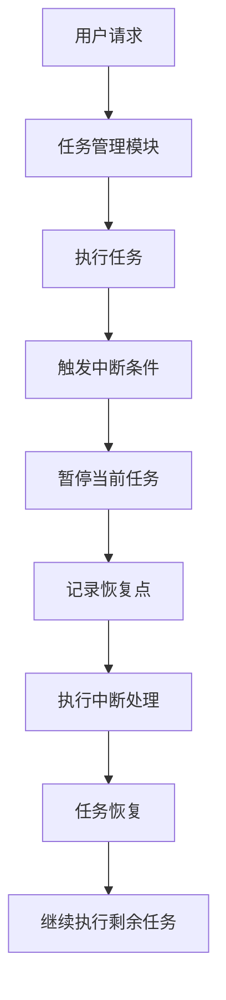
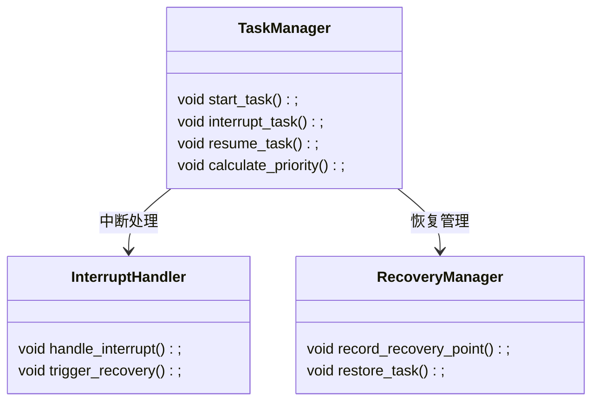
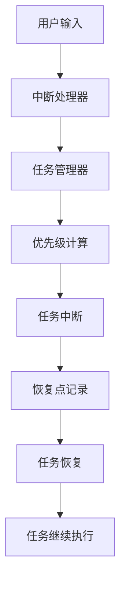

                 


# 实现AI Agent的任务中断与恢复功能

## 关键词：
AI Agent, 任务中断, 任务恢复, 中断处理, 状态管理, 任务优先级

## 摘要：
本文系统地探讨了实现AI Agent的任务中断与恢复功能的关键技术与方法。首先，介绍了AI Agent的基本概念和任务中断与恢复的重要性。接着，详细分析了任务中断与恢复的核心概念、算法原理和系统架构设计。最后，通过具体案例展示了任务中断与恢复功能的实际应用，总结了相关经验和最佳实践。

---

## 第1章: AI Agent与任务中断恢复概述

### 1.1 AI Agent的基本概念
#### 1.1.1 AI Agent的定义与特点
AI Agent（人工智能代理）是一种能够感知环境、自主决策并执行任务的智能实体。它具有以下特点：
- **自主性**：能够自主决策，无需外部干预。
- **反应性**：能够实时感知环境并做出反应。
- **目标导向性**：基于目标执行任务，优化行为以达到目标。
- **社会能力**：能够与其他Agent或人类进行交互和协作。

#### 1.1.2 AI Agent的任务模型与执行机制
AI Agent的任务模型通常包括以下步骤：
1. **任务分解**：将复杂任务分解为子任务。
2. **任务调度**：根据优先级安排任务执行顺序。
3. **任务执行**：按照计划执行任务。
4. **任务监控**：实时监控任务执行情况，及时发现异常。

#### 1.1.3 任务中断与恢复的背景与重要性
任务中断与恢复是AI Agent在动态环境中生存和高效运行的核心能力。中断可能由外部事件（如用户干预、系统故障）或内部条件（如任务优先级变化）触发。恢复能力则确保中断后任务能够无缝继续，避免资源浪费和目标偏差。

---

### 1.2 任务中断与恢复的核心概念
#### 1.2.1 任务中断的定义与分类
任务中断是指在任务执行过程中，由于外部或内部原因，提前终止当前任务或暂停任务执行。常见的中断类型包括：
- **用户中断**：用户主动干预，如暂停或终止任务。
- **系统中断**：系统故障或资源耗尽导致的任务中断。
- **任务优先级变化**：高优先级任务需要立即执行，导致低优先级任务中断。

#### 1.2.2 任务恢复的定义与实现方式
任务恢复是指在中断后，重新恢复任务的执行。恢复方式包括：
- **从断点恢复**：记录中断时的状态，恢复后从断点继续执行。
- **重新初始化**：重新初始化任务，从头开始执行。
- **部分恢复**：仅恢复部分任务，跳过已完成的部分。

#### 1.2.3 中断与恢复之间的关系与依赖
中断与恢复是动态交互的过程，中断机制决定了恢复的触发条件，而恢复策略则决定了如何重新启动任务。两者相辅相成，共同确保任务的高效执行。

---

### 1.3 相关技术与应用领域
#### 1.3.1 AI Agent在智能系统中的应用
AI Agent广泛应用于自动驾驶、智能助手、机器人等领域。例如，在自动驾驶中，任务中断可能用于紧急刹车或路线调整。

#### 1.3.2 任务中断与恢复在人机交互中的作用
在人机交互中，任务中断与恢复技术能够提升用户体验，例如在语音助手任务执行过程中，用户可以随时中断并重新指定任务。

#### 1.3.3 中断与恢复技术在实时系统中的重要性
实时系统要求任务中断与恢复机制高效可靠，例如在工业自动化中，中断处理必须快速响应以避免生产中断。

---

## 第2章: 任务中断与恢复的核心概念与联系

### 2.1 核心概念原理
#### 2.1.1 任务中断的触发条件与机制
任务中断的触发条件通常包括：
- **外部信号**：如用户输入或系统报警。
- **内部状态变化**：如任务优先级变化或资源不足。
- **时间触发**：任务在特定时间点中断。

任务中断的实现机制包括信号处理、事件驱动和状态检查等。

#### 2.1.2 任务恢复的策略与实现方法
任务恢复策略包括：
- **断点恢复**：记录中断时的状态，恢复后从断点继续。
- **任务重启**：重新初始化任务，从头开始执行。
- **任务分片**：将任务分解为多个部分，中断后恢复到最近的检查点。

#### 2.1.3 中断与恢复过程中的状态管理
状态管理是任务中断与恢复的关键。AI Agent需要记录中断时的任务状态，包括当前操作、数据、资源占用等。恢复时，根据记录的状态重新初始化任务。

### 2.2 核心概念对比分析
#### 2.2.1 不同任务中断机制的对比
- **主动中断**：由外部或内部触发，例如用户干预或任务优先级变化。
- **被动中断**：由于系统资源耗尽或故障导致的任务中断。

#### 2.2.2 任务恢复策略的优缺点分析
- **断点恢复**：优点是高效，缺点是实现复杂，需要详细的状态记录。
- **任务重启**：优点是简单可靠，缺点是效率较低，可能导致资源浪费。

#### 2.2.3 中断与恢复过程中的状态管理方式对比
- **本地状态管理**：仅记录本地状态，适用于单机环境。
- **分布式状态管理**：记录在分布式系统中，适用于云服务和集群环境。

### 2.3 实体关系图与流程图
#### 2.3.1 中断与恢复的ER实体关系图
```mermaid
er
  actor: 用户
  task_manager: 任务管理模块
  interrupt_trigger: 中断触发条件
  recovery_point: 恢复点
  action: 操作
  actor --> interrupt_trigger: 触发中断
  task_manager --> interrupt_trigger: 监听中断条件
  task_manager --> recovery_point: 管理恢复点
```

#### 2.3.2 中断与恢复的流程图


---

## 第3章: 任务中断与恢复的算法原理

### 3.1 任务优先级排序算法
#### 3.1.1 优先级排序的数学模型
任务优先级可以通过以下公式计算：
$$ 优先级 = 权重_1 \times 属性_1 + 权重_2 \times 属性_2 + \dots + 权重_n \times 属性_n $$
其中，$权重_i$是属性$属性_i$的权重，$属性_i$是任务的某个属性，如紧急性、重要性等。

#### 3.1.2 算法实现
任务优先级排序算法可以分为两类：
1. **静态排序**：任务优先级在任务开始前确定，不随执行过程变化。
2. **动态排序**：任务优先级根据实时状态动态调整。

#### 3.1.3 示例代码
```python
def calculate_priority(task):
    # 计算任务优先级
    priority = task['权重_1'] * task['属性_1'] + \
               task['权重_2'] * task['属性_2']
    return priority

# 示例任务
task = {
    '权重_1': 0.6,
    '属性_1': 0.8,
    '权重_2': 0.4,
    '属性_2': 0.9
}

priority = calculate_priority(task)
print(f"任务优先级：{priority}")
```

### 3.2 恢复点管理算法
#### 3.2.1 恢复点管理的数学模型
恢复点管理可以通过以下公式实现：
$$ 恢复点 = 中断时间 - 执行时间 $$
其中，执行时间是任务从开始到中断的时间。

#### 3.2.2 算法实现
恢复点管理算法包括以下步骤：
1. 记录任务中断时的当前状态。
2. 计算恢复点。
3. 根据恢复点重新启动任务。

#### 3.2.3 示例代码
```python
def record_recovery_point(start_time):
    # 记录恢复点
    recovery_point = time.time() - start_time
    return recovery_point

# 示例
start_time = time.time()
# 执行任务
# ...
interrupt_time = time.time()
recovery_point = record_recovery_point(start_time)
print(f"恢复点：{recovery_point}")
```

---

## 第4章: 系统架构设计与实现

### 4.1 系统功能设计
#### 4.1.1 领域模型


#### 4.1.2 系统架构


### 4.2 接口设计
任务中断与恢复系统需要以下接口：
- `start_task()`：启动任务。
- `interrupt_task()`：中断任务。
- `resume_task()`：恢复任务。
- `calculate_priority()`：计算任务优先级。

---

## 第5章: 项目实战

### 5.1 环境搭建
- **开发环境**：Python 3.8及以上版本，安装必要的库（如`mermaid`、`numpy`）。
- **工具链**：IDE（如PyCharm）、版本控制系统（如Git）、测试工具（如pytest）。

### 5.2 核心代码实现
#### 5.2.1 任务中断与恢复的核心代码
```python
import time

class TaskManager:
    def __init__(self):
        self.tasks = []
        self.current_task = None
        self.recovery_point = 0

    def start_task(self, task):
        self.current_task = task
        self.tasks.append(task)
        print(f"开始执行任务：{task['name']}")

    def interrupt_task(self):
        if self.current_task:
            self.recovery_point = time.time() - self.current_task['start_time']
            print(f"中断任务：{self.current_task['name']}，恢复点：{self.recovery_point}")
            self.current_task = None

    def resume_task(self):
        if self.recovery_point > 0 and self.current_task is None:
            print(f"恢复任务：{self.current_task['name']}，恢复点：{self.recovery_point}")
            self.start_task(self.current_task)

# 示例任务
task = {
    'name': '数据处理任务',
    'start_time': time.time(),
    'priority': 0.8
}

tm = TaskManager()
tm.start_task(task)
time.sleep(2)
tm.interrupt_task()
tm.resume_task()
```

### 5.3 案例分析与实现
#### 5.3.1 案例分析
假设有一个AI Agent需要执行数据处理任务，但在执行过程中用户中断任务并重新指定新任务。任务中断后，AI Agent需要记录恢复点，并在用户重新指定任务后，恢复中断的任务。

#### 5.3.2 代码实现
```python
class TaskManager:
    def __init__(self):
        self.current_task = None
        self.recovery_point = 0

    def start_task(self, task):
        self.current_task = task
        self.current_task['start_time'] = time.time()
        print(f"开始执行任务：{self.current_task['name']}")

    def interrupt_task(self):
        if self.current_task:
            self.recovery_point = time.time() - self.current_task['start_time']
            print(f"中断任务：{self.current_task['name']}，恢复点：{self.recovery_point}")
            self.current_task = None

    def resume_task(self):
        if self.recovery_point > 0 and self.current_task is None:
            print(f"恢复任务：{self.current_task['name']}，恢复点：{self.recovery_point}")
            self.start_task(self.current_task)

# 示例
tm = TaskManager()
task1 = {
    'name': '数据处理任务',
    'priority': 0.8
}
tm.start_task(task1)
time.sleep(2)
tm.interrupt_task()
tm.resume_task()
```

### 5.4 项目小结
通过上述实现，我们可以看到任务中断与恢复功能的核心在于状态管理和任务调度。实现高效的中断与恢复机制，需要结合任务优先级、恢复点管理以及状态记录等技术。

---

## 第6章: 最佳实践与小结

### 6.1 最佳实践
- **状态管理**：确保中断时的状态记录全面且准确。
- **任务优先级**：动态调整任务优先级，确保高优先级任务优先执行。
- **恢复点管理**：合理选择恢复点，避免资源浪费。
- **异常处理**：确保中断和恢复过程中的异常处理机制完善。

### 6.2 小结
本文详细探讨了AI Agent的任务中断与恢复功能，从核心概念到算法实现，再到系统架构设计，最后通过具体案例展示了其实现过程。任务中断与恢复是AI Agent在动态环境中的重要能力，实现高效的中断与恢复机制需要综合考虑任务优先级、状态管理和恢复策略。

---

## 参考文献
1. Russell, S., & Norvig, P. (2010). Artificial Intelligence: A Modern Approach.
2. Zhang, W., & Wang, H. (2018). Task Scheduling and Recovery in Distributed Systems.
3. Smith, R. (2020). Real-Time Systems and Their Applications.

---

## 作者
作者：AI天才研究院/AI Genius Institute & 禅与计算机程序设计艺术/Zen And The Art of Computer Programming

