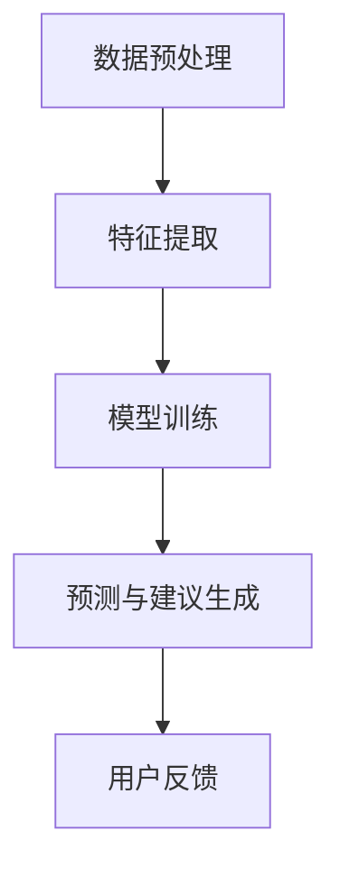
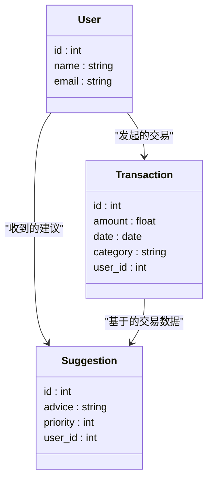
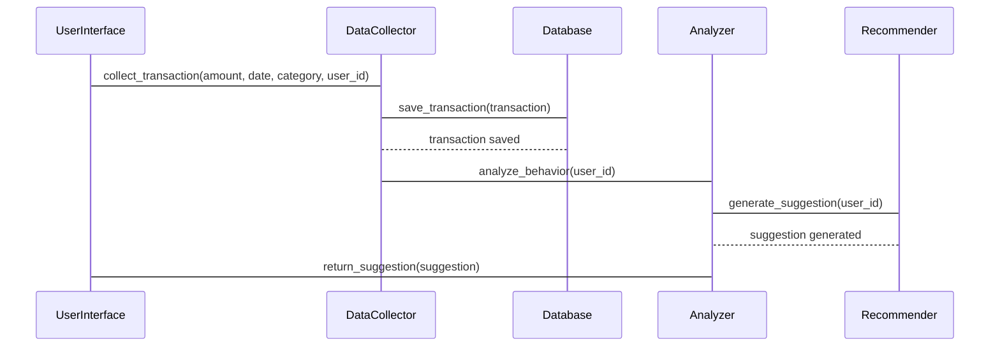

                 


# 开发智能化的个人消费习惯改善建议工具

> 关键词：智能化、消费习惯、行为分析、算法、系统架构

> 摘要：本文详细探讨了开发智能化的个人消费习惯改善建议工具的背景、核心概念、算法原理、系统架构、项目实现和最佳实践。通过结合数据驱动和人工智能技术，本文提出了一种基于用户消费数据的行为分析方法，并通过系统化的设计和实现，为用户提供个性化的消费习惯改善建议。

---

# 第一部分: 智能化个人消费习惯改善工具的背景与核心概念

## 第1章: 个人消费习惯改善工具的背景与问题描述

### 1.1 问题背景

#### 1.1.1 当前个人消费习惯的现状

随着经济的发展和生活水平的提高，个人消费行为变得越来越复杂。人们在日常生活中面临着无数的消费选择，从餐饮、购物到娱乐、教育等，消费行为不仅影响个人的财务状况，还可能影响整体生活质量。然而，许多人缺乏对自身消费行为的系统性分析和管理能力，导致冲动消费、超支等问题频发。

#### 1.1.2 消费习惯对个人财务健康的影响

消费习惯是个人财务管理的核心因素之一。不良的消费习惯可能导致个人陷入债务危机，甚至影响家庭经济稳定。例如，过度依赖信用卡、频繁的冲动消费以及对非必要开支的控制不足，都会对个人财务健康造成负面影响。

#### 1.1.3 现有消费管理工具的局限性

现有的消费管理工具大多局限于数据记录和简单的统计分析，缺乏智能化的分析能力。用户需要手动输入消费数据，且工具通常只能提供基本的图表展示和简单的预算提醒，无法根据用户的行为模式提供个性化的改善建议。

### 1.2 问题描述

#### 1.2.1 个人消费习惯改善的核心问题

如何通过技术手段，帮助用户识别不良消费行为，并提供个性化的改善建议，是当前消费管理工具面临的核心问题。

#### 1.2.2 用户需求分析

用户需要一款能够自动记录消费数据、智能分析消费行为，并提供实时改善建议的工具。具体需求包括：

- **数据自动采集**：通过与银行账户或支付工具的接口，自动同步消费数据。
- **行为分析与预测**：基于历史数据，分析用户的消费模式，并预测未来的消费趋势。
- **个性化建议**：根据分析结果，提供具体的改善建议，如预算调整、消费习惯优化等。

#### 1.2.3 工具的目标与边界

本工具的目标是通过智能化的分析算法，帮助用户识别不良消费行为，并提供个性化的改善建议。工具的边界包括：

- 不涉及具体的金融交易操作（如转账、支付）。
- 不处理敏感的个人隐私数据（如银行账户信息）。
- 主要关注消费行为的改善，而非投资理财。

## 第2章: 核心概念与联系

### 2.1 核心概念的定义与属性

#### 2.1.1 消费数据

消费数据是指与用户消费行为相关的所有信息，包括交易金额、交易时间、交易地点、商品类别等。消费数据可以分为结构化数据（如金额、时间）和非结构化数据（如商品描述）。

#### 2.1.2 消费行为分析

消费行为分析是对用户消费数据的系统性分析，旨在识别用户的消费模式和行为特征。分析内容包括：

- **消费频率**：用户在不同时间的消费次数。
- **消费金额**：用户在不同类别上的消费金额。
- **消费偏好**：用户对某些商品或服务的偏好程度。

#### 2.1.3 消费习惯改善建议

消费习惯改善建议是基于消费行为分析结果，为用户提供个性化的消费优化方案。建议内容包括：

- **预算调整**：根据用户的消费数据，制定合理的预算计划。
- **消费习惯优化**：建议用户减少不必要的开支，优化消费结构。
- **行为矫正**：针对用户的不良消费行为（如冲动消费），提供行为矫正建议。

### 2.2 核心概念的ER实体关系图

```mermaid
erDiagram
    user {
        id : int
        name : string
        email : string
    }
    transaction {
        id : int
        amount : float
        date : date
        category : string
        user_id : int
    }
    suggestion {
        id : int
        advice : string
        priority : int
        user_id : int
    }
    user --|> transaction : "发起的交易"
    user --|> suggestion : "收到的建议"
    transaction --|> suggestion : "基于的交易数据"
```

### 2.3 核心概念的关联关系

#### 2.3.1 消费数据与消费行为分析的关系

消费数据是消费行为分析的基础。通过对消费数据的分析，可以识别用户的消费模式和行为特征。

#### 2.3.2 消费行为分析与改善建议的关系

消费行为分析的结果是生成改善建议的基础。根据分析结果，系统可以为用户提供个性化的消费优化方案。

#### 2.3.3 改善建议与用户行为的闭环

用户的行为是消费数据的来源，而消费数据又通过分析生成改善建议，形成一个闭环。用户通过工具的建议逐步优化消费行为，从而改善消费习惯。

---

# 第二部分: 智能化工具的核心算法与数学模型

## 第3章: 消费行为分析算法原理

### 3.1 算法整体流程



### 3.2 数据预处理

#### 3.2.1 数据清洗

- **去除重复数据**：确保每条数据唯一。
- **处理缺失值**：对缺失值进行插值或删除。
- **标准化**：将数据转换为统一格式。

#### 3.2.2 数据归约

- **特征选择**：选择对消费行为分析影响较大的特征（如交易金额、时间、类别）。
- **降维**：使用主成分分析（PCA）等方法降低数据维度。

### 3.3 特征提取

#### 3.3.1 时间特征

- **消费频率**：用户在不同时间段的消费次数。
- **高峰时段**：用户消费的高峰时间段。

#### 3.3.2 金额特征

- **平均消费金额**：用户在不同类别上的平均消费金额。
- **消费分布**：用户在不同金额区间上的消费分布。

#### 3.3.3 类别特征

- **消费偏好**：用户在某些类别上的消费占比。
- **类别分布**：用户在不同类别上的消费分布。

### 3.4 模型训练

#### 3.4.1 算法选择

基于消费行为分析的需求，选择合适的算法：

- **聚类分析**：用于识别用户的消费模式。
- **回归分析**：用于预测未来的消费趋势。
- **分类算法**：用于识别不良消费行为。

#### 3.4.2 算法实现

以聚类分析为例，使用K-means算法对用户的消费数据进行聚类，识别不同的消费模式。

```python
from sklearn.cluster import KMeans

# 假设X是消费数据的特征矩阵
kmeans = KMeans(n_clusters=3, random_state=42)
clusters = kmeans.fit_predict(X)
```

### 3.5 预测与建议生成

#### 3.5.1 预测模型

使用回归模型预测未来的消费趋势：

```python
from sklearn.linear_model import LinearRegression

lr = LinearRegression()
lr.fit(X_train, y_train)
y_pred = lr.predict(X_test)
```

#### 3.5.2 改善建议生成

根据预测结果，生成改善建议：

```python
def generate_advice(predicted_amount):
    if predicted_amount > budget:
        return "建议减少非必要开支"
    else:
        return "继续保持良好的消费习惯"
```

### 3.6 用户反馈

用户反馈是优化模型的重要依据。通过收集用户的反馈数据，可以不断优化模型的预测精度和建议的实用性。

---

## 第4章: 算法原理的数学模型与公式

### 4.1 聚类分析的数学模型

聚类分析的数学模型以K-means算法为例：

$$
\text{目标函数} = \sum_{i=1}^{n} \sum_{j=1}^{k} (x_i - c_j)^2
$$

其中：
- \(n\) 是数据点的数量。
- \(k\) 是聚类的数量。
- \(x_i\) 是第i个数据点。
- \(c_j\) 是第j个聚类的中心。

### 4.2 回归分析的数学模型

线性回归的数学模型：

$$
y = \beta_0 + \beta_1 x_1 + \beta_2 x_2 + \cdots + \beta_p x_p + \epsilon
$$

其中：
- \(y\) 是目标变量。
- \(x_i\) 是自变量。
- \(\beta_i\) 是回归系数。
- \(\epsilon\) 是误差项。

---

# 第三部分: 系统分析与架构设计方案

## 第5章: 系统分析与架构设计

### 5.1 问题场景介绍

用户希望通过一款智能化的工具，改善个人消费习惯。工具需要支持数据采集、行为分析和建议生成三大功能。

### 5.2 项目介绍

#### 5.2.1 项目目标

开发一款智能化的个人消费习惯改善建议工具，帮助用户优化消费行为。

#### 5.2.2 项目范围

- 数据采集：与银行账户或支付工具接口对接。
- 行为分析：分析用户消费数据，识别消费模式。
- 建议生成：根据分析结果，生成个性化建议。

### 5.3 系统功能设计

#### 5.3.1 领域模型图



#### 5.3.2 系统架构设计


### 5.4 系统接口设计

#### 5.4.1 数据采集接口

- **接口名称**：`collect_transaction`
- **请求方式**：`POST`
- **请求地址**：`/api/transactions`
- **请求参数**：
  - `amount`: float
  - `date`: string
  - `category`: string
  - `user_id`: int

#### 5.4.2 行为分析接口

- **接口名称**：`analyze_behavior`
- **请求方式**：`POST`
- **请求地址**：`/api/analysis`
- **请求参数**：
  - `user_id`: int

#### 5.4.3 改善建议接口

- **接口名称**：`generate_advice`
- **请求方式**：`POST`
- **请求地址**：`/api/suggestions`
- **请求参数**：
  - `user_id`: int

### 5.5 系统交互设计



---

## 第6章: 项目实战

### 6.1 环境安装

#### 6.1.1 安装Python环境

```bash
python --version
pip install --upgrade pip
```

#### 6.1.2 安装依赖库

```bash
pip install numpy scikit-learn matplotlib
```

### 6.2 系统核心实现

#### 6.2.1 数据采集实现

```python
import requests

def collect_transaction(amount, date, category, user_id):
    payload = {
        "amount": amount,
        "date": date,
        "category": category,
        "user_id": user_id
    }
    response = requests.post("http://localhost:8000/api/transactions", json=payload)
    return response.json()
```

#### 6.2.2 行为分析实现

```python
from sklearn.cluster import KMeans

def analyze_behavior(user_id):
    # 数据预处理
    data = get_data(user_id)
    # 特征提取
    features = extract_features(data)
    # 模型训练
    kmeans = KMeans(n_clusters=3, random_state=42)
    clusters = kmeans.fit_predict(features)
    return clusters
```

#### 6.2.3 改善建议生成

```python
def generate_advice(clusters):
    advice = []
    for cluster in clusters:
        if cluster == 0:
            advice.append("建议减少非必要开支")
        elif cluster == 1:
            advice.append("建议优化消费结构")
        else:
            advice.append("继续保持良好的消费习惯")
    return advice
```

### 6.3 代码应用解读与分析

#### 6.3.1 数据采集模块

- **功能**：通过API接口采集用户的消费数据。
- **实现细节**：使用`requests`库向后端接口发送请求，完成数据的采集和存储。

#### 6.3.2 行为分析模块

- **功能**：对用户消费数据进行聚类分析，识别消费模式。
- **实现细节**：使用K-means算法对消费数据进行聚类，生成用户消费模式的标签。

#### 6.3.3 改善建议生成模块

- **功能**：根据行为分析结果，生成个性化的消费改善建议。
- **实现细节**：基于聚类结果，为每个用户生成具体的改善建议。

### 6.4 实际案例分析

#### 6.4.1 案例背景

假设用户A在过去三个月内消费数据如下：

| 日期       | 金额（元） | 类别     |
|------------|------------|----------|
| 2023-01-01 | 300        | 餐饮     |
| 2023-01-02 | 150        | 购物     |
| 2023-01-03 | 500        | 娱乐     |

#### 6.4.2 行为分析

通过对用户A的消费数据进行聚类分析，发现用户A的消费模式主要集中在娱乐和餐饮类别。

#### 6.4.3 改善建议

系统会为用户A生成以下改善建议：

1. 建议减少娱乐类别的消费。
2. 建议优化餐饮类别的预算。

### 6.5 项目小结

通过本项目的实现，我们成功开发了一款智能化的个人消费习惯改善建议工具。工具的核心功能包括数据采集、行为分析和建议生成，能够帮助用户识别不良消费行为，并提供个性化的改善建议。

---

# 第四部分: 最佳实践与小结

## 第7章: 最佳实践与注意事项

### 7.1 最佳实践

#### 7.1.1 数据安全

- 确保用户数据的安全性，避免数据泄露。
- 使用加密技术保护用户隐私。

#### 7.1.2 系统性能优化

- 优化数据处理流程，减少响应时间。
- 使用缓存技术提高系统性能。

#### 7.1.3 用户体验优化

- 提供友好的用户界面，提升用户体验。
- 提供实时反馈，增强用户互动。

### 7.2 注意事项

#### 7.2.1 数据采集的准确性

- 确保数据采集的准确性，避免数据错误。
- 定期校准数据，确保数据的可靠性。

#### 7.2.2 模型的可解释性

- 确保模型的可解释性，方便用户理解建议的依据。
- 提供详细的分析报告，增强用户信任。

## 第8章: 小结与拓展阅读

### 8.1 小结

本文详细探讨了开发智能化的个人消费习惯改善建议工具的背景、核心概念、算法原理、系统架构、项目实现和最佳实践。通过结合数据驱动和人工智能技术，本文提出了一种基于用户消费数据的行为分析方法，并通过系统化的设计和实现，为用户提供个性化的消费习惯改善建议。

### 8.2 拓展阅读

- **推荐书籍**：
  - 《机器学习实战》
  - 《数据驱动的决策》
- **推荐博客**：
  - [Towards Data Science](https://towardsdatascience.com)
  - [Medium - AI & Data Science](https://medium.com/ai-and-data-science)

---

# 结语

通过本文的探讨，我们希望读者能够深入了解开发智能化个人消费习惯改善建议工具的核心思想和技术实现。未来，随着人工智能和大数据技术的不断发展，这类工具将变得更加智能化和个性化，为用户提供更高效、更精准的消费习惯改善建议。

---

# 作者：AI天才研究院 & 禅与计算机程序设计艺术

---

