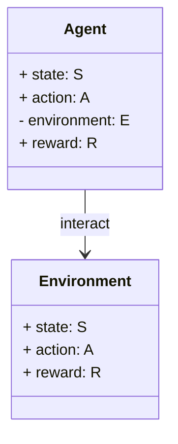
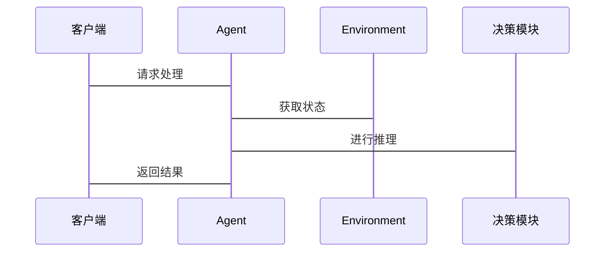

                 


# 搭建AI Agent开发环境：必要工具与框架

---

> 关键词：AI Agent, 开发环境, 工具, 框架, 自然语言处理, 强化学习, 系统架构

> 摘要：本文详细介绍了搭建AI Agent开发环境所需的核心工具与框架，从背景知识到技术实现，再到系统架构与项目实战，全面解析AI Agent开发的必要技能和实践方法。

---

# 第一部分：AI Agent开发环境的背景与基础

## 第1章：AI Agent的基本概念与技术基础

### 1.1 AI Agent的定义与特点

#### 1.1.1 AI Agent的定义
AI Agent（人工智能代理）是指能够感知环境、自主决策并执行任务的智能实体。它通过与环境交互，利用感知信息进行推理和学习，从而实现特定目标。

#### 1.1.2 AI Agent的核心特点
- **自主性**：无需外部干预，自主完成任务。
- **反应性**：实时感知环境并做出反应。
- **目标导向性**：基于目标进行决策和行动。
- **学习能力**：通过经验优化自身行为。

#### 1.1.3 AI Agent与传统程序的区别
| 特性 | 传统程序 | AI Agent |
|------|----------|----------|
| 行为方式 | 单一任务执行 | 多目标、动态环境适应 |
| 感知能力 | 无环境感知 | 具备感知能力，能与环境交互 |
| 决策能力 | 预先编写的逻辑 | 基于感知信息动态决策 |

### 1.2 AI Agent的应用场景

#### 1.2.1 自然语言处理中的应用
AI Agent在自然语言处理（NLP）中广泛应用于聊天机器人、智能客服等领域。

#### 1.2.2 机器人控制中的应用
AI Agent可以用于机器人导航、路径规划等场景。

#### 1.2.3 自动决策系统中的应用
在金融、医疗等领域，AI Agent可以实现自动化决策。

### 1.3 AI Agent开发的必要性

#### 1.3.1 传统开发模式的局限性
传统开发模式难以应对动态变化的环境，且缺乏灵活性。

#### 1.3.2 AI Agent带来的新机遇
AI Agent可以通过学习和优化，显著提高系统的智能化水平。

#### 1.3.3 企业级应用中的价值
AI Agent能够提升企业效率，降低人工成本，提高决策准确性。

### 1.4 本章小结
本章介绍了AI Agent的基本概念、特点、应用场景及其开发的必要性，为后续章节奠定了基础。

---

## 第2章：AI Agent开发的工具与框架概述

### 2.1 开发AI Agent的必要工具

#### 2.1.1 环境搭建工具
- **虚拟环境管理工具**：如`venv`、`virtualenv`、`Anaconda`。
- **版本控制工具**：如`Git`，用于代码管理和协作开发。

#### 2.1.2 数据处理工具
- **数据清洗工具**：如`Pandas`、`NumPy`。
- **数据可视化工具**：如`Matplotlib`、`Seaborn`。

#### 2.1.3 模型训练工具
- **机器学习库**：如`scikit-learn`。
- **深度学习库**：如`TensorFlow`、`PyTorch`。

### 2.2 常用AI框架简介

#### 2.2.1 TensorFlow
- **简介**：由Google开发，广泛应用于深度学习领域。
- **特点**：支持分布式计算，易于部署。

#### 2.2.2 PyTorch
- **简介**：由Facebook开发，适合动态计算场景。
- **特点**：支持动态计算，灵活性高。

#### 2.2.3 其他框架
- **Keras**：用户友好的高级API，适合快速模型搭建。
- **MXNet**：支持多语言的轻量级框架。

### 2.3 开发框架的选择与优化

#### 2.3.1 框架选择的考虑因素
- **任务类型**：如NLP、计算机视觉。
- **计算资源**：如CPU或GPU支持。
- **社区支持**：框架的活跃度和文档丰富性。

#### 2.3.2 框架性能优化技巧
- **模型剪枝**：减少模型参数，降低计算复杂度。
- **量化技术**：将模型参数量化，减少存储空间。

#### 2.3.3 框架间的对比分析
| 框架 | 优势 | 劣势 |
|------|------|------|
| TensorFlow | 支持分布式计算，社区活跃 | 学习曲线较陡 |
| PyTorch | 动态计算，灵活性高 | 资源消耗较大 |

### 2.4 本章小结
本章介绍了AI Agent开发所需的工具与框架，分析了各种框架的特点与适用场景，为后续章节的实现提供了工具支持。

---

## 第3章：AI Agent的核心算法与数学模型

### 3.1 自然语言处理算法

#### 3.1.1 Transformer模型
- **简介**：由Vaswney等人提出，广泛应用于NLP任务。
- **工作原理**：基于自注意力机制，实现高效的序列建模。

#### 3.1.2 BERT模型
- **简介**：由Google提出，用于预训练语言模型。
- **特点**：双向上下文编码，适合多种NLP任务。

#### 3.1.3 GPT系列模型
- **简介**：由OpenAI提出，用于生成式任务。
- **特点**：基于Transformer架构，支持生成式对话。

### 3.2 强化学习算法

#### 3.2.1 Q-learning
- **简介**：基于值函数的强化学习算法。
- **公式**：$$ Q(s,a) = r + \gamma \max Q(s',a') $$

#### 3.2.2 Deep Q-Network
- **简介**：基于深度神经网络的Q-learning改进版。
- **特点**：使用经验回放和目标网络优化。

#### 3.2.3 Policy Gradient Methods
- **简介**：基于策略梯度的强化学习算法。
- **公式**：$$ \nabla \theta \leftarrow \nabla \log \pi_\theta(a|s) \cdot Q(s,a) $$

### 3.3 模型训练的数学基础

#### 3.3.1 梯度下降法
- **公式**：$$ \theta_{new} = \theta_{old} - \eta \frac{\partial L}{\partial \theta} $$

#### 3.3.2 交叉熵损失函数
- **公式**：$$ \text{Loss} = -\sum y \log p + (1-y) \log (1-p) $$

#### 3.3.3 激活函数的作用
| 激活函数 | 特性 | 应用场景 |
|----------|------|----------|
| ReLU | 非线性，计算速度快 | 多层网络中广泛使用 |
| Sigmoid | 输出范围在(0,1) | 用于二分类问题 |
| Tanh | 输出范围在(-1,1) | 用于某些深度网络 |

### 3.4 算法实现的代码示例

#### 3.4.1 Transformer模型的实现
```python
import tensorflow as tf
from tensorflow import keras

def transformer_model():
    inputs = keras.Input(shape=(seq_length, d_model))
    # Self-attention layer
    attention = keras.layers.MultiHeadAttention(
        num_heads=8, key_dim=64
    )(inputs, inputs)
    outputs = keras.layers.Dense(dff, activation='relu')(attention)
    return keras.Model(inputs=inputs, outputs=outputs)
```

#### 3.4.2 强化学习算法的实现
```python
class DQN:
    def __init__(self, state_dim, action_dim):
        self.state_dim = state_dim
        self.action_dim = action_dim
        self.model = self.build_model()
    
    def build_model(self):
        model = keras.Sequential([
            keras.layers.Dense(32, activation='relu', input_dim=self.state_dim),
            keras.layers.Dense(self.action_dim)
        ])
        return model
```

### 3.5 本章小结
本章详细介绍了AI Agent中常用的自然语言处理和强化学习算法，并通过数学公式和代码示例进行了深入讲解，为后续章节的实现奠定了算法基础。

---

## 第4章：AI Agent的系统架构与设计

### 4.1 系统功能设计

#### 4.1.1 领域模型设计


#### 4.1.2 系统功能模块
- **感知模块**：负责环境信息的采集与处理。
- **决策模块**：基于感知信息进行推理和决策。
- **执行模块**：将决策结果转化为具体行动。

### 4.2 系统架构设计

#### 4.2.1 分层架构


#### 4.2.2 微服务架构
```mermaid
serviceio
    AgentService --> NLPService
    AgentService --> RLService
```

### 4.3 系统接口设计

#### 4.3.1 接口定义
- **输入接口**：接收环境信息。
- **输出接口**：发送决策指令。

#### 4.3.2 交互流程


### 4.4 本章小结
本章通过领域模型和架构设计，详细介绍了AI Agent系统的功能模块与交互流程，为后续章节的实现提供了系统架构支持。

---

## 第5章：AI Agent的项目实战

### 5.1 环境安装与配置

#### 5.1.1 安装Python环境
```bash
python -m pip install --user virtualenv
virtualenv venv
source venv/bin/activate
```

#### 5.1.2 安装框架依赖
```bash
pip install tensorflow==2.5.0
pip install pytorch==1.9.0
```

### 5.2 核心代码实现

#### 5.2.1 自然语言处理模块
```python
import torch
from torch import nn

class NLPModule(nn.Module):
    def __init__(self):
        super(NLPModule, self).__init__()
        self.transformer = nn.Transformer(...)
    
    def forward(self, x):
        return self.transformer(x)
```

#### 5.2.2 强化学习模块
```python
import gym
from gym import spaces

class Agent:
    def __init__(self, state_space, action_space):
        self.state_space = state_space
        self.action_space = action_space
        self.model = self.build_model()
    
    def build_model(self):
        model = nn.Sequential(...)
        return model
```

### 5.3 案例分析与优化

#### 5.3.1 案例分析
- **任务描述**：设计一个简单的聊天机器人。
- **实现步骤**：
  1. 数据预处理。
  2. 模型训练。
  3. 接口开发。

#### 5.3.2 优化技巧
- **数据增强**：增加训练数据的多样性。
- **模型调优**：优化超参数，如学习率、批量大小。

### 5.4 本章小结
本章通过实际项目案例，详细介绍了AI Agent开发的环境配置、代码实现及优化技巧，帮助读者掌握从理论到实践的全过程。

---

## 第6章：AI Agent开发的最佳实践

### 6.1 小结与回顾

#### 6.1.1 核心知识点回顾
- AI Agent的基本概念。
- 开发工具与框架的选择。
- 核心算法与系统架构设计。

#### 6.1.2 项目开发经验总结
- **模块化设计**：提高代码的可维护性。
- **持续集成**：确保代码质量和团队协作效率。

### 6.2 注意事项与常见问题

#### 6.2.1 模型过拟合问题
- **解决方法**：增加数据量，使用正则化。

#### 6.2.2 系统性能优化
- **优化点**：减少计算复杂度，利用缓存机制。

### 6.3 拓展阅读与学习资源

#### 6.3.1 推荐书籍
- 《深度学习入门：基于Python和Keras》。
- 《强化学习（深入浅出）》。

#### 6.3.2 在线资源
- TensorFlow官方文档：https://www.tensorflow.org
- PyTorch官方文档：https://pytorch.org

### 6.4 本章小结
本章总结了AI Agent开发的关键点，提出了开发中的注意事项，并推荐了相关学习资源，帮助读者进一步提升技能。

---

# 第二部分：AI Agent开发环境的优化与扩展

## 第7章：AI Agent的部署与运维

### 7.1 系统部署策略

#### 7.1.1 单体部署
- **适用场景**：小型项目或单机部署。

#### 7.1.2 分布式部署
- **适用场景**：大规模应用或高并发场景。

### 7.2 模型优化与压缩

#### 7.2.1 模型剪枝
- **方法**：去除冗余参数，降低模型复杂度。

#### 7.2.2 模型量化
- **方法**：将模型参数量化为低精度（如INT8）。

### 7.3 监控与日志管理

#### 7.3.1 性能监控
- **工具**：如Prometheus、Grafana。

#### 7.3.2 日志管理
- **工具**：如ELK（Elasticsearch, Logstash, Kibana）。

### 7.4 本章小结
本章介绍了AI Agent系统的部署策略、模型优化方法及监控工具，帮助读者实现系统的高效运维。

---

## 第8章：AI Agent的高级应用与未来趋势

### 8.1 高级应用案例

#### 8.1.1 多智能体协作
- **应用领域**：如自动驾驶、分布式系统。

#### 8.1.2 跨领域应用
- **应用领域**：如金融、医疗、教育。

### 8.2 未来发展趋势

#### 8.2.1 智能化水平提升
- **技术趋势**：强化学习与NLP的结合。

#### 8.2.2 分布式与边缘计算
- **技术趋势**：AI Agent向边缘计算方向发展。

### 8.3 本章小结
本章展望了AI Agent的高级应用与未来发展趋势，为读者提供了更广阔的视野。

---

# 作者：AI天才研究院 & 禅与计算机程序设计艺术

