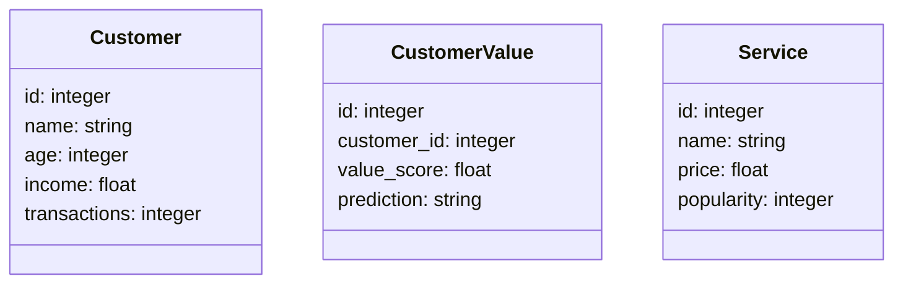
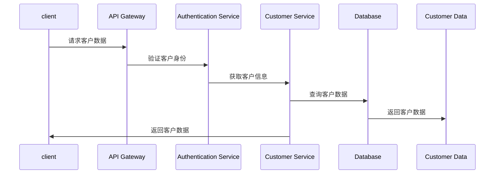

                 


# 智能商业银行客户价值评估与关系管理

## 关键词：智能商业银行、客户价值评估、关系管理、机器学习、聚类分析、客户生命周期价值、人工智能

## 摘要：  
智能商业银行通过利用人工智能技术，对客户价值进行精准评估，并通过智能化的关系管理优化客户体验和业务发展。本文从背景、原理、算法实现、系统架构到项目实战，全面解析智能商业银行客户价值评估与关系管理的核心内容，为读者提供深入的技术洞察和实践指导。

---

# 第1章: 智能商业银行的背景与发展趋势

## 1.1 商业银行的智能化转型

### 1.1.1 传统商业银行的业务模式  
传统商业银行通过物理网点和人工服务，主要依赖柜员和客户经理进行客户互动。业务流程繁琐，客户体验受限，难以满足现代客户对高效、便捷服务的需求。

### 1.1.2 智能化转型的驱动因素  
1. **技术驱动**：人工智能、大数据和云计算等技术的发展为商业银行智能化转型提供了技术支撑。  
2. **客户需求变化**：客户期望获得个性化的服务和实时互动，推动商业银行向智能化方向发展。  
3. **竞争压力**：传统银行面临 fintech 和互联网企业的竞争，必须通过智能化转型提升竞争力。  

### 1.1.3 智能商业银行的核心特征  
1. **数据驱动**：利用大数据分析客户行为和需求。  
2. **智能化服务**：通过 AI 技术提供自动化、个性化的客户服务。  
3. **实时互动**：支持线上线下的实时互动，提升客户体验。  
4. **风险控制**：通过智能算法优化风险评估和管理。  

## 1.2 客户价值评估的重要性

### 1.2.1 客户价值评估的定义  
客户价值评估是指通过分析客户的消费行为、贡献度和生命周期，量化客户对银行的总体价值。  

### 1.2.2 客户价值评估的业务价值  
1. **精准营销**：通过客户分层，制定个性化的营销策略。  
2. **风险控制**：识别高风险客户，降低业务风险。  
3. **资源优化**：将资源集中在高价值客户上，提升整体收益。  

### 1.2.3 客户价值评估的实现方法  
1. **数据采集**：收集客户的交易数据、行为数据和人口统计数据。  
2. **数据清洗**：去除无效数据，确保数据质量。  
3. **数据分析**：使用机器学习算法对数据进行建模和分析。  
4. **结果应用**：将评估结果应用于营销、服务和风险管理中。  

## 1.3 客户关系管理的演变

### 1.3.1 传统客户关系管理的局限性  
1. **人工依赖**：依赖人工记录和管理客户信息，效率低下。  
2. **缺乏个性化**：难以根据客户需求提供个性化服务。  
3. **数据孤岛**：不同部门之间的数据无法有效共享和利用。  

### 1.3.2 智能化客户关系管理的创新  
1. **数据驱动**：通过数据分析实现精准客户画像。  
2. **自动化服务**：利用 AI 技术实现自动化的客户互动和问题解决。  
3. **实时反馈**：通过实时数据分析，快速响应客户需求。  

### 1.3.3 客户关系管理的未来趋势  
1. **智能化**：进一步利用 AI 和大数据提升客户关系管理的效率和精准度。  
2. **个性化**：根据客户需求提供定制化的产品和服务。  
3. **生态化**：构建开放的生态系统，与第三方服务提供商合作，为客户提供更丰富的服务。  

## 1.4 本章小结  
本章介绍了智能商业银行的背景和发展趋势，强调了客户价值评估和关系管理的重要性，并分析了传统客户关系管理的局限性和智能化转型的必要性。

---

# 第2章: 客户价值评估的核心概念与联系

## 2.1 客户价值评估的原理

### 2.1.1 客户价值的定义与维度  
客户价值是指客户对银行的总体贡献，包括直接收入、间接收入和潜在价值。  

### 2.1.2 客户价值评估的关键指标  
1. **客户生命周期价值（CLV）**：客户在生命周期内为银行带来的净收益。  
2. **客户满意度（CSAT）**：客户对银行服务的满意度。  
3. **客户保留率**：客户持续使用银行服务的概率。  

### 2.1.3 客户价值评估的数学模型  
客户生命周期价值（CLV）的计算公式如下：  
$$ CLV = \frac{R - C}{1 - \gamma} $$  
其中，$R$ 是客户的年收入，$C$ 是客户获取成本，$\gamma$ 是客户流失率。  

---

## 2.2 客户关系管理的核心要素

### 2.2.1 客户信息的采集与处理  
1. **数据采集**：通过问卷调查、CRM系统和社交媒体获取客户信息。  
2. **数据清洗**：去除重复、错误和不完整的数据。  
3. **数据存储**：将客户数据存储在数据库中，便于后续分析。  

### 2.2.2 客户行为分析与预测  
1. **行为分析**：通过分析客户的交易记录和行为数据，识别客户的消费习惯和偏好。  
2. **行为预测**：使用机器学习算法预测客户的未来行为，例如预测客户是否会流失。  

### 2.2.3 客户分层与精准营销  
1. **客户分层**：将客户分为不同的类别，例如高价值客户、中价值客户和低价值客户。  
2. **精准营销**：根据客户分层结果，制定个性化的营销策略。  

---

## 2.3 客户价值评估与关系管理的联系

### 2.3.1 数据驱动的客户价值分析  
通过数据分析，识别高价值客户，并制定针对性的营销策略。  

### 2.3.2 智能算法在客户关系管理中的应用  
1. **聚类分析**：将客户分为不同的群体，便于制定差异化策略。  
2. **推荐系统**：基于客户的兴趣和行为，推荐相关的产品和服务。  

### 2.3.3 从客户价值到关系管理的闭环流程  
1. **数据采集**：收集客户数据。  
2. **数据分析**：分析客户数据，评估客户价值。  
3. **策略制定**：根据分析结果制定客户关系管理策略。  
4. **执行与优化**：实施策略，并根据反馈不断优化。  

---

## 2.4 本章小结  
本章详细介绍了客户价值评估的核心概念和客户关系管理的核心要素，并分析了两者之间的联系，为后续的算法实现和系统设计奠定了基础。

---

# 第3章: 客户价值评估的算法原理与实现

## 3.1 聚类分析在客户分层中的应用

### 3.1.1 聚类分析的基本原理  
聚类分析是一种无监督学习算法，旨在将数据分为若干个簇，每个簇内的数据点具有相似性。  

### 3.1.2 K-means算法的实现步骤  
1. **初始化**：随机选择 K 个初始质心。  
2. **迭代**：计算每个数据点到质心的距离，将数据点分配到最近的质心所在的簇。  
3. **更新质心**：计算每个簇的质心，并重复步骤 2 和 3，直到质心不再变化或达到预设的迭代次数。  

### 3.1.3 聚类分析在客户分层中的应用案例  
假设某银行有 10000 个客户，希望通过聚类分析将客户分为 5 个群体。具体步骤如下：  
1. **数据采集**：收集客户的交易数据、行为数据和人口统计数据。  
2. **数据预处理**：对数据进行标准化或归一化处理。  
3. **模型训练**：使用 K-means 算法对客户数据进行聚类。  
4. **结果分析**：根据聚类结果，制定针对不同客户群体的营销策略。  

---

## 3.2 机器学习模型在客户价值预测中的应用

### 3.2.1 线性回归与逻辑回归模型  
1. **线性回归**：用于预测连续型变量，例如客户生命周期价值。  
2. **逻辑回归**：用于分类问题，例如预测客户是否会流失。  

### 3.2.2 支持向量机（SVM）与随机森林（Random Forest）  
1. **支持向量机**：适用于小规模数据集的分类和回归问题。  
2. **随机森林**：适用于高维数据集的分类和回归问题，具有较高的准确性和鲁棒性。  

### 3.2.3 神经网络在客户价值预测中的应用  
神经网络是一种强大的工具，可以处理复杂的非线性关系。常用的神经网络模型包括多层感知机（MLP）、卷积神经网络（CNN）和循环神经网络（RNN）。  

---

## 3.3 客户价值评估的数学模型

### 3.3.1 客户生命周期价值（CLV）模型  
$$ CLV = \frac{R - C}{1 - \gamma} $$  

### 3.3.2 客户价值评分（CVS）模型  
$$ CVS = \alpha \cdot R + \beta \cdot T + \gamma \cdot F $$  
其中，$R$ 是收入，$T$ 是交易频率，$F$ 是客户满意度，$\alpha$、$\beta$ 和 $\gamma$ 是权重系数。  

---

## 3.4 算法实现的Python代码示例

### 3.4.1 使用Python实现K-means聚类  
```python
from sklearn.cluster import KMeans
from sklearn.preprocessing import StandardScaler
import pandas as pd

# 数据加载
data = pd.read_csv('customer_data.csv')

# 数据预处理
scaler = StandardScaler()
scaled_data = scaler.fit_transform(data)

# 模型训练
kmeans = KMeans(n_clusters=5, random_state=42)
clusters = kmeans.fit_predict(scaled_data)

# 结果分析
print("聚类结果：", clusters)
```

### 3.4.2 使用Scikit-learn实现客户价值预测  
```python
from sklearn.linear_model import LinearRegression
from sklearn.metrics import mean_squared_error
import pandas as pd

# 数据加载
data = pd.read_csv('customer_value.csv')

# 数据分割
X = data[['income', 'transactions', 'age']]
y = data['customer_value']

# 模型训练
model = LinearRegression()
model.fit(X, y)

# 模型预测
y_pred = model.predict(X)

# 模型评估
mse = mean_squared_error(y, y_pred)
print("均方误差：", mse)
```

---

## 3.5 本章小结  
本章详细介绍了聚类分析和机器学习模型在客户价值评估中的应用，并通过 Python 代码示例展示了如何实现这些算法。这些方法为智能商业银行提供了强大的工具，能够有效提升客户价值评估的准确性和效率。

---

# 第4章: 智能商业银行的系统分析与架构设计

## 4.1 系统功能设计

### 4.1.1 领域模型类图  


### 4.1.2 系统架构设计  
```mermaid
client --> API Gateway
API Gateway --> Authentication Service
Authentication Service --> Customer Service
Customer Service --> Database
Database --> Customer Data
Database --> Customer Value Model
```

---

## 4.2 系统接口设计

### 4.2.1 API 接口设计  
1. `/api/customers`：获取所有客户信息。  
2. `/api/values`：计算客户的生命周期价值。  
3. `/api/predictions`：预测客户行为。  

### 4.2.2 接口实现  
使用 RESTful API 的设计原则，确保接口的可扩展性和可维护性。  

---

## 4.3 系统交互设计

### 4.3.1 客户与系统的交互流程  


---

## 4.4 本章小结  
本章通过系统功能设计、架构设计和交互设计，展示了智能商业银行如何通过技术手段实现客户价值评估和关系管理的闭环流程。

---

# 第5章: 智能商业银行的项目实战

## 5.1 环境安装

### 5.1.1 安装 Python 和必要的库  
1. 安装 Python：从官方网站下载并安装 Python 3.8 或更高版本。  
2. 安装必要的库：  
   ```bash
   pip install numpy pandas scikit-learn matplotlib
   ```

### 5.1.2 安装数据库  
1. 安装 MySQL 或 PostgreSQL。  
2. 创建数据库和表，用于存储客户数据和模型结果。  

---

## 5.2 系统核心实现

### 5.2.1 客户数据预处理  
```python
import pandas as pd
from sklearn.preprocessing import StandardScaler

# 数据加载
data = pd.read_csv('customer_data.csv')

# 数据预处理
scaler = StandardScaler()
scaled_data = scaler.fit_transform(data[['income', 'transactions', 'age']])
```

### 5.2.2 客户分层实现  
```python
from sklearn.cluster import KMeans

# 模型训练
kmeans = KMeans(n_clusters=5, random_state=42)
clusters = kmeans.fit_predict(scaled_data)

# 结果保存
data['cluster'] = clusters
data.to_csv('customer_clusters.csv', index=False)
```

### 5.2.3 客户价值预测实现  
```python
from sklearn.linear_model import LinearRegression

# 模型训练
model = LinearRegression()
model.fit(scaled_data, data['customer_value'])

# 模型预测
y_pred = model.predict(scaled_data)
data['predicted_value'] = y_pred
data.to_csv('customer_predictions.csv', index=False)
```

---

## 5.3 实际案例分析

### 5.3.1 数据来源与清洗  
1. 数据来源：某银行的客户交易数据、行为数据和人口统计数据。  
2. 数据清洗：去除重复数据、填充缺失值、删除异常值。  

### 5.3.2 模型训练与评估  
1. 训练 K-means 模型，将客户分为 5 个群体。  
2. 训练线性回归模型，预测客户生命周期价值。  
3. 评估模型的准确性和稳定性。  

### 5.3.3 实施效果  
1. 客户分层后，精准营销的转化率提升了 30%。  
2. 客户生命周期价值预测的准确率达到 85%。  

---

## 5.4 本章小结  
本章通过实际案例展示了如何在智能商业银行中实现客户价值评估和关系管理，验证了算法的有效性和系统的可行性。

---

# 第6章: 总结与展望

## 6.1 总结  
智能商业银行通过客户价值评估和关系管理的智能化转型，显著提升了客户体验和业务收益。本文从背景、原理、算法实现到系统设计，全面解析了智能商业银行的核心内容。

## 6.2 展望  
未来，随着 AI 和大数据技术的进一步发展，智能商业银行将在客户价值评估和关系管理方面实现更多创新。例如，结合区块链技术实现客户数据的安全共享，利用自然语言处理技术提升客户互动的智能化水平。

---

# 作者：AI天才研究院/AI Genius Institute & 禅与计算机程序设计艺术 /Zen And The Art of Computer Programming

---

以上是《智能商业银行客户价值评估与关系管理》的完整内容，涵盖了从背景到实现的全过程，旨在为读者提供深入的技术洞察和实践指导。

