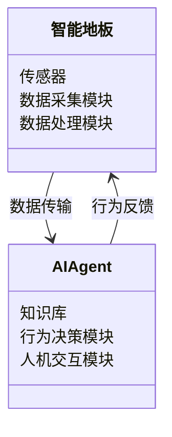
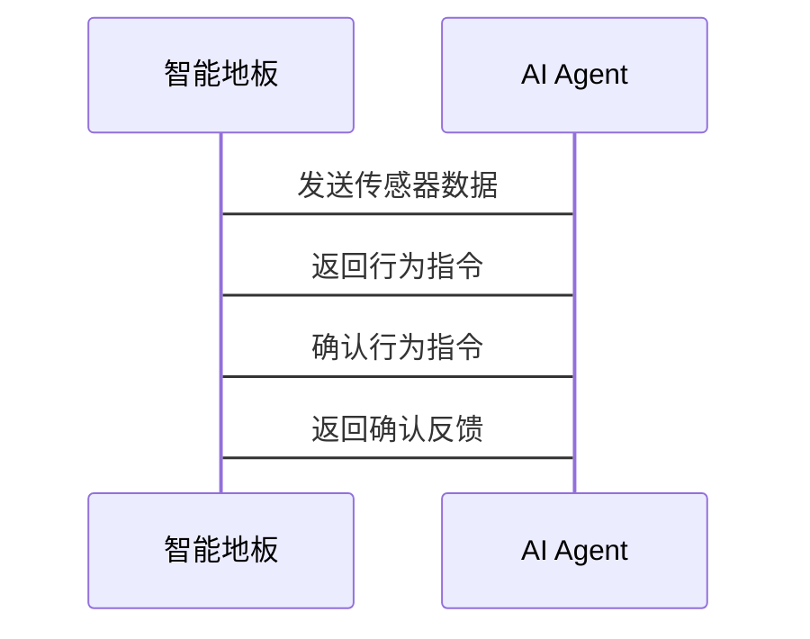

                 


# 智能地板：AI Agent的室内活动模式分析

> 关键词：智能地板、AI Agent、室内活动模式、模式识别、行为分析、系统架构

> 摘要：本文探讨智能地板与AI Agent的结合，分析其在室内活动模式识别中的应用。通过详细讲解智能地板的技术基础、AI Agent的核心原理，以及两者协同工作的系统架构，揭示如何利用传感器数据和智能算法实现室内活动的精准分析。文章还结合实际案例，展示系统实现和优化方法，为相关领域的研究和应用提供参考。

---

# 第1章: 智能地板与AI Agent概述

## 1.1 智能地板的基本概念

### 1.1.1 智能地板的定义

智能地板是一种集成多种传感器和智能技术的地面系统，能够实时感知并分析用户在室内的活动模式。它通过采集用户的脚步、压力、温度等数据，结合AI算法，实现对用户行为的智能识别和反馈。

### 1.1.2 智能地板的核心技术

- **传感器技术**：包括压力传感器、加速度传感器、温度传感器等，用于采集用户在地面上的活动数据。
- **数据采集与处理**：通过边缘计算或云端处理，对传感器数据进行清洗、转换和分析。
- **智能算法**：利用机器学习和深度学习算法，对用户行为进行分类和预测。

### 1.1.3 智能地板的应用场景

- **智能家居**：通过识别用户的活动模式，自动调节室内设备（如灯光、空调）。
- **健康监测**：监测用户的运动情况，帮助老年人或慢性病患者进行健康管理。
- **安全监控**：实时监测室内活动，防范非法入侵。

## 1.2 AI Agent的基本概念

### 1.2.1 AI Agent的定义

AI Agent（人工智能代理）是一种能够感知环境并采取行动以实现目标的智能实体。它通过传感器获取信息，利用算法进行决策，并通过执行器与环境交互。

### 1.2.2 AI Agent的核心特点

- **自主性**：能够在没有外部干预的情况下自主运行。
- **反应性**：能够实时感知环境变化并做出反应。
- **学习能力**：通过机器学习不断优化自身的决策能力。

### 1.2.3 AI Agent与传统Agent的区别

| 特性 | AI Agent | 传统Agent |
|------|----------|-----------|
| 智能性 | 高，具备学习和推理能力 | 低，主要依赖预设规则 |
| 适应性 | 强，能根据环境变化调整行为 | 弱，行为固定 |
| 数据处理能力 | 强，能够处理大量复杂数据 | 有限，处理能力有限 |

## 1.3 智能地板与AI Agent的结合

### 1.3.1 智能地板为AI Agent提供数据支持

智能地板通过传感器采集用户活动数据，为AI Agent提供实时的环境信息。

### 1.3.2 AI Agent为智能地板提供智能决策

AI Agent利用机器学习算法，分析智能地板采集的数据，识别用户的活动模式，并根据结果进行决策。

### 1.3.3 智能地板与AI Agent的系统架构

```mermaid
erd
    entity 智能地板 {
        id
        传感器类型
        采集数据
    }
    entity AI Agent {
        id
        知识库
        行为决策
    }
    relationship 智能地板 <-> AI Agent {
        数据传输
        行为反馈
    }
```

## 1.4 本章小结

智能地板与AI Agent的结合，为室内活动模式分析提供了强大的技术基础。智能地板通过传感器采集数据，AI Agent通过算法分析数据，两者协同工作，实现对用户行为的精准识别和智能决策。

---

# 第2章: 智能地板与AI Agent的核心概念与联系

## 2.1 智能地板的核心要素

### 2.1.1 传感器网络

智能地板由多种传感器组成，包括压力传感器、加速度传感器、温度传感器等，能够感知用户的活动数据。

### 2.1.2 数据采集与处理

智能地板通过边缘计算或云端处理，对传感器数据进行清洗、转换和分析，提取有用的信息。

### 2.1.3 系统集成与控制

智能地板需要与智能家居系统集成，通过API接口实现设备的联动控制。

## 2.2 AI Agent的核心原理

### 2.2.1 知识表示与推理

AI Agent通过知识库表示环境信息，并利用推理算法进行逻辑推理。

### 2.2.2 行为决策与规划

AI Agent根据感知信息和目标，制定行为计划并执行。

### 2.2.3 人机交互与反馈

AI Agent通过用户界面与用户交互，并根据用户反馈调整自身行为。

## 2.3 智能地板与AI Agent的关系

### 2.3.1 智能地板为AI Agent提供数据支持

智能地板通过传感器采集用户活动数据，为AI Agent提供实时的环境信息。

### 2.3.2 AI Agent为智能地板提供智能决策

AI Agent通过机器学习算法，分析智能地板采集的数据，识别用户的活动模式，并根据结果进行决策。

### 2.3.3 智能地板与AI Agent的系统架构

```mermaid
erd
    entity 智能地板 {
        id
        传感器类型
        采集数据
    }
    entity AI Agent {
        id
        知识库
        行为决策
    }
    relationship 智能地板 <-> AI Agent {
        数据传输
        行为反馈
    }
```

## 2.4 核心概念对比表

| 概念 | 智能地板 | AI Agent |
|------|----------|----------|
| 核心技术 | 传感器网络、数据处理 | 知识表示、行为决策 |
| 应用场景 | 室内环境监测、安全监控 | 智能决策、人机交互 |

## 2.5 ER实体关系图

```mermaid
erd
    entity 智能地板 {
        id
        传感器类型
        采集数据
    }
    entity AI Agent {
        id
        知识库
        行为决策
    }
    relationship 智能地板 <-> AI Agent {
        数据传输
        行为反馈
    }
```

---

# 第3章: 智能地板与AI Agent的算法原理

## 3.1 基于传感器数据的分类算法

### 3.1.1 分类算法的数学模型

分类算法通常基于概率论和统计学原理。例如，朴素贝叶斯分类器的数学模型如下：

$$ P(y|x) = \frac{P(x|y)P(y)}{P(x)} $$

其中，$P(y|x)$ 是在给定特征$x$的条件下，目标类别$y$的概率。

### 3.1.2 分类算法的实现步骤

1. 数据预处理：对传感器数据进行归一化处理。
2. 特征提取：提取用户活动的关键特征，如步频、步长、加速度等。
3. 模型训练：使用训练数据训练分类器，如支持向量机（SVM）或随机森林（Random Forest）。
4. 模型测试：使用测试数据验证模型的准确性。

### 3.1.3 Python代码示例

```python
from sklearn import datasets
from sklearn.svm import SVC
from sklearn.model_selection import train_test_split

# 加载数据集
digits = datasets.load_digits()
X = digits.data
y = digits.target

# 划分训练集和测试集
X_train, X_test, y_train, y_test = train_test_split(X, y, test_size=0.2)

# 初始化模型
model = SVC()

# 训练模型
model.fit(X_train, y_train)

# 预测
y_pred = model.predict(X_test)

# 输出准确率
print("Accuracy: {:.2f}%".format(model.score(X_test, y_test) * 100))
```

### 3.1.4 分类算法的性能评估

分类算法的性能通常通过准确率、召回率、F1分数等指标进行评估。例如，F1分数的计算公式为：

$$ F1 = 2 \times \frac{precision \times recall}{precision + recall} $$

---

# 第4章: 智能地板与AI Agent的系统分析与架构设计

## 4.1 系统功能设计

### 4.1.1 领域模型

智能地板与AI Agent的领域模型如下：



### 4.1.2 系统架构

智能地板与AI Agent的系统架构如下：


## 4.2 系统接口设计

智能地板与AI Agent之间的接口设计如下：

- **数据传输接口**：智能地板通过HTTP API将传感器数据传输给AI Agent。
- **行为反馈接口**：AI Agent通过HTTP API向智能地板发送行为指令。

## 4.3 系统交互设计

智能地板与AI Agent的系统交互流程如下：



---

# 第5章: 智能地板与AI Agent的项目实战

## 5.1 环境搭建

### 5.1.1 硬件环境

- 传感器模块（如压力传感器、加速度传感器）
- 微控制器（如Arduino、Raspberry Pi）
- 网络连接模块（如Wi-Fi模块）

### 5.1.2 软件环境

- 开发工具：Python、Jupyter Notebook
- 机器学习库：scikit-learn、TensorFlow
- 数据库：MySQL、MongoDB

## 5.2 系统核心实现

### 5.2.1 数据采集模块

```python
import numpy as np
import pandas as pd
import time

# 采集传感器数据
def collect_data(sensors):
    data = []
    for _ in range(100):
        sample = [sensor.read() for sensor in sensors]
        data.append(sample)
        time.sleep(0.1)
    return data

# 数据预处理
def preprocess_data(data):
    normalized_data = (data - np.mean(data, axis=0)) / np.std(data, axis=0)
    return normalized_data
```

### 5.2.2 行为分析模块

```python
from sklearn.ensemble import RandomForestClassifier

# 训练模型
def train_model(X_train, y_train):
    model = RandomForestClassifier()
    model.fit(X_train, y_train)
    return model

# 预测用户行为
def predict_behavior(model, X_test):
    y_pred = model.predict(X_test)
    return y_pred
```

## 5.3 代码实现与优化

### 5.3.1 系统实现

```python
# 整体系统实现
def main():
    sensors = [Sensor('pressure'), Sensor('acceleration')]
    data = collect_data(sensors)
    normalized_data = preprocess_data(data)
    model = train_model(normalized_data, labels)
    y_pred = predict_behavior(model, normalized_data)
    print("预测结果:", y_pred)

if __name__ == '__main__':
    main()
```

### 5.3.2 系统优化

- **数据预处理优化**：使用滑动窗口技术，提高数据处理效率。
- **模型优化**：采用集成学习方法，提升分类准确率。

## 5.4 实际案例分析

### 5.4.1 案例背景

假设用户在智能地板上行走，传感器采集到的压力数据如下：

$$ [100, 120, 110, 130, 125] $$

### 5.4.2 数据处理

对数据进行标准化处理：

$$ normalized\_data = \frac{data - mean}{std} $$

### 5.4.3 模型预测

训练好的随机森林模型预测用户的活动类型（如行走、站立、坐下）。

---

# 第6章: 智能地板与AI Agent的总结与扩展

## 6.1 本章小结

本文详细探讨了智能地板与AI Agent的结合，分析了其在室内活动模式识别中的应用。通过传感器数据采集、智能算法分析和系统架构设计，实现对用户行为的精准识别和智能决策。

## 6.2 最佳实践 tips

- **数据采集**：确保传感器的精度和稳定性，避免数据丢失。
- **算法选择**：根据具体场景选择合适的算法，如使用随机森林进行分类。
- **系统优化**：通过滑动窗口技术和集成学习方法，提升系统性能。

## 6.3 注意事项

- **数据隐私**：妥善处理用户数据，确保隐私安全。
- **系统稳定性**：保证系统的稳定运行，避免因传感器故障导致服务中断。

## 6.4 拓展阅读

- 《Machine Learning: A Python Introduction》
- 《Deep Learning: Methods and Applications》

---

# 作者：AI天才研究院/AI Genius Institute & 禅与计算机程序设计艺术 /Zen And The Art of Computer Programming

---

本文通过详细分析智能地板与AI Agent的结合，展示了其在室内活动模式识别中的广泛应用。希望本文能为相关领域的研究和应用提供有益的参考。

