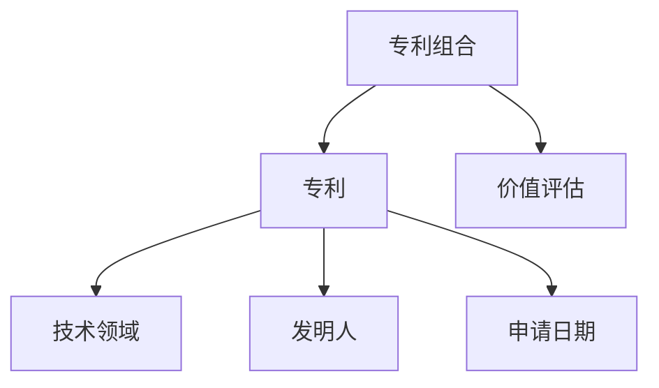
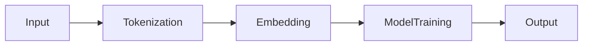
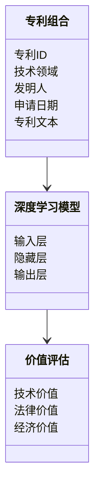
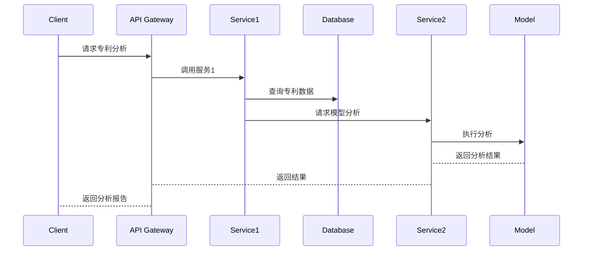

                 


# 深度学习分析公司专利组合价值

> 关键词：深度学习、专利组合、价值分析、文本挖掘、自然语言处理

> 摘要：本文将探讨如何利用深度学习技术来分析和评估公司专利组合的价值。通过结合自然语言处理和文本挖掘技术，我们能够从大量专利数据中提取有价值的信息，从而帮助企业更好地管理和优化其知识产权资产。本文将从背景介绍、核心概念、算法原理、系统架构到项目实战，逐步展开分析，最终提供一份完整的解决方案。

---

# 第1章: 背景介绍

## 1.1 问题背景

### 1.1.1 专利组合价值分析的重要性
- 专利不仅是企业知识产权的重要组成部分，更是其市场竞争优势的核心体现。
- 通过分析专利组合的价值，企业可以更好地制定研发策略、优化专利布局，并在专利诉讼中占据主动地位。

### 1.1.2 深度学习技术的发展与应用
- 深度学习技术在自然语言处理、图像识别等领域取得了突破性进展。
- 将深度学习应用于专利分析，可以提高数据处理效率和准确性。

### 1.1.3 专利组合价值分析的现状与挑战
- 当前专利分析主要依赖人工经验，效率低且难以处理大规模数据。
- 深度学习技术的引入为专利分析提供了新的可能性，但也面临数据标注、模型训练等挑战。

## 1.2 问题描述

### 1.2.1 专利组合价值的定义与内涵
- 专利组合价值是指一组专利在技术、法律和经济等多个维度上的综合价值。
- 包括专利的技术先进性、法律稳定性、市场应用潜力等方面。

### 1.2.2 深度学习在专利分析中的应用前景
- 利用深度学习进行专利文本挖掘、技术分类、价值评估。
- 提高专利分析的自动化水平和精准度。

### 1.2.3 当前专利组合价值分析的主要难点
- 专利数据的多样性和复杂性。
- 如何从非结构化文本中提取有价值的信息。
- 专利价值的多维度评估体系的构建。

## 1.3 问题解决方法

### 1.3.1 深度学习技术的优势
- 强大的特征提取能力。
- 可以处理大规模非结构化数据。

### 1.3.2 专利组合价值分析的流程与方法
1. 数据收集与预处理。
2. 专利文本挖掘与特征提取。
3. 深度学习模型训练与优化。
4. 专利组合价值评估与可视化。

### 1.3.3 深度学习在专利分析中的具体应用
- 专利分类与聚类。
- 专利技术趋势分析。
- 专利价值预测与评估。

## 1.4 边界与外延

### 1.4.1 专利组合价值分析的边界
- 数据范围的限制（如专利数量、时间范围）。
- 模型的适用性（如适用于特定技术领域）。

### 1.4.2 相关领域的外延
- 知识图谱构建。
- 专利侵权分析。

### 1.4.3 深度学习技术的适用范围
- 适合处理文本型专利数据。
- 对结构化数据的处理能力有限。

## 1.5 核心概念与要素

### 1.5.1 专利组合的定义与特征
- 专利组合是由一组相关专利构成的集合。
- 具有技术关联性、法律协同性、市场互补性等特征。

### 1.5.2 深度学习模型的核心要素
- 神经网络结构（如RNN、CNN）。
- 损失函数与优化算法（如Adam、SGD）。
- 数据预处理与特征工程。

### 1.5.3 专利组合价值分析的指标体系
- 技术价值：专利的技术创新性、技术成熟度。
- 法律价值：专利的法律稳定性、保护范围。
- 经济价值：专利的市场潜力、商业价值。

---

# 第2章: 核心概念与联系

## 2.1 深度学习与专利组合分析的核心概念

### 2.1.1 深度学习的基本原理
- 深度学习是一种通过多层非线性变换来学习数据特征的机器学习方法。
- 常见的深度学习模型包括RNN、CNN、BERT等。

### 2.1.2 专利组合分析的关键要素
- 专利文本的特征提取。
- 专利之间的关联性分析。
- 专利组合的价值评估。

### 2.1.3 深度学习与专利组合分析的结合点
- 利用深度学习进行专利文本挖掘。
- 基于深度学习构建专利组合的价值评估模型。

---

## 2.2 核心概念的联系

### 2.2.1 核心概念的属性特征对比
| 深度学习 | 专利组合分析 |
|----------|----------------|
| 数据驱动 | 数据驱动        |
| 非线性特征提取 | 非线性特征提取    |
| 处理文本、图像等多模态数据 | 处理专利文本、技术领域等多维度数据 |

### 2.2.2 ER实体关系图架构


---

## 2.3 深度学习与专利组合分析的流程


---

# 第3章: 算法原理讲解

## 3.1 算法选择与原理

### 3.1.1 算法选择
- 选择适合专利文本分析的深度学习模型（如BERT、RNN）。
- 模型选择的依据：数据类型、任务类型（分类、聚类）。

### 3.1.2 算法原理
#### 使用BERT模型进行专利文本表示
- BERT通过自注意力机制捕捉文本中的上下文信息。
- 专利文本的 embeddings 可用于后续分析任务。

#### 使用RNN进行专利序列建模
- RNN适合处理专利文本的时间序列信息。
- 可用于专利技术趋势分析。

---

## 3.2 算法实现

### 3.2.1 算法流程图


### 3.2.2 Python源代码实现
```python
import tensorflow as tf
from tensorflow.keras import layers

# 定义模型
model = tf.keras.Sequential([
    layers.Embedding(input_dim=10000, output_dim=128),
    layers.Bidirectional(layers.LSTM(64)),
    layers.Dense(10, activation='softmax')
])

# 编译模型
model.compile(optimizer='adam', loss='sparse_categorical_crossentropy', metrics=['accuracy'])
```

### 3.2.3 数学模型与公式
- BERT模型的自注意力机制：
  $$
  \text{Attention}(Q, K, V) = \text{softmax}\left(\frac{QK^T}{\sqrt{d_k}}\right)V
  $$
- RNN的循环结构：
  $$
  h_t = \text{RNN}(h_{t-1}, x_t)
  $$

---

## 3.3 算法优化与调优

### 3.3.1 超参数调优
- 学习率调整：使用Adam优化器。
- 模型复杂度：平衡过拟合与欠拟合。

### 3.3.2 模型评估
- 使用交叉验证评估模型性能。
- 采用准确率、召回率、F1值等指标。

---

# 第4章: 系统分析与架构设计方案

## 4.1 问题场景介绍

### 4.1.1 项目背景
- 某科技公司希望通过深度学习技术分析其专利组合的价值。
- 目标：提高专利管理效率，优化研发策略。

### 4.1.2 项目目标
- 建立专利组合价值分析系统。
- 提供直观的分析结果和决策支持。

---

## 4.2 系统功能设计

### 4.2.1 功能模块划分
1. 数据采集模块：采集专利数据。
2. 数据预处理模块：清洗和标注数据。
3. 模型训练模块：训练深度学习模型。
4. 价值评估模块：生成分析报告。
5. 可视化模块：展示分析结果。

### 4.2.2 领域模型图


---

## 4.3 系统架构设计

### 4.3.1 系统架构图
```mermaid
graph LR
    Client --> API Gateway
    API Gateway --> Service1
    Service1 --> Database
    Service1 --> Service2
    Service2 --> Model
    Model --> Database
```

### 4.3.2 接口设计
- RESTful API：提供数据接口和分析接口。
- 数据接口：获取专利数据。
- 分析接口：调用模型进行分析。

### 4.3.3 交互流程图


---

## 4.4 系统实现与优化

### 4.4.1 系统实现
- 使用Flask构建API接口。
- 使用TensorFlow构建深度学习模型。

### 4.4.2 系统优化
- 优化数据处理流程。
- 提高模型训练效率。

---

# 第5章: 项目实战

## 5.1 环境安装

### 5.1.1 安装依赖
```bash
pip install tensorflow==2.4.0
pip install numpy==1.21.0
pip install pandas==1.3.5
pip install requests==2.26.0
```

---

## 5.2 系统核心实现

### 5.2.1 代码实现
```python
import requests
import json
import tensorflow as tf
from tensorflow.keras import layers

# 数据采集函数
def fetch_patent_data(api_key):
    url = f"https://api.patents.com/v1/patents?api_key={api_key}"
    response = requests.get(url)
    return json.loads(response.text)

# 模型构建函数
def build_model(input_shape):
    model = tf.keras.Sequential([
        layers.Embedding(input_dim=10000, output_dim=128, input_shape=input_shape),
        layers.Bidirectional(layers.LSTM(64)),
        layers.Dense(10, activation='softmax')
    ])
    model.compile(optimizer='adam', loss='sparse_categorical_crossentropy', metrics=['accuracy'])
    return model

# 模型训练函数
def train_model(model, X_train, y_train):
    model.fit(X_train, y_train, epochs=10, batch_size=32, validation_split=0.2)

# 分析报告生成函数
def generate_report(results):
    report = {
        "技术价值": results['tech_value'],
        "法律价值": results['legal_value'],
        "经济价值": results['economic_value']
    }
    return json.dumps(report)
```

---

## 5.3 代码解读与分析

### 5.3.1 代码解读
- `fetch_patent_data`：通过API获取专利数据。
- `build_model`：构建深度学习模型。
- `train_model`：训练模型。
- `generate_report`：生成分析报告。

### 5.3.2 代码分析
- 代码实现了一个完整的专利组合价值分析系统。
- 包括数据采集、模型训练和报告生成三个主要部分。

---

## 5.4 案例分析

### 5.4.1 数据准备
- 收集某科技公司的专利数据。
- 数据清洗和预处理。

### 5.4.2 模型训练
- 使用训练数据训练深度学习模型。
- 验证模型性能。

### 5.4.3 分析报告
- 生成专利组合的价值评估报告。
- 提供技术、法律和经济价值的详细分析。

---

## 5.5 项目小结

### 5.5.1 项目总结
- 成功构建了一个基于深度学习的专利组合价值分析系统。
- 系统具有较高的准确性和效率。

### 5.5.2 项目意义
- 提高了专利管理的效率。
- 为企业制定研发策略提供了数据支持。

---

# 第6章: 总结与展望

## 6.1 总结

### 6.1.1 核心内容回顾
- 深度学习在专利组合价值分析中的应用。
- 系统设计与实现。

### 6.1.2 实践意义
- 提高专利分析的自动化水平。
- 为企业创造更大的价值。

---

## 6.2 展望

### 6.2.1 未来研究方向
- 提高模型的泛化能力。
- 优化系统的性能和用户体验。

### 6.2.2 深度学习技术的进一步应用
- 探索多模态专利分析。
- 研究实时专利监控系统。

---

## 6.3 最佳实践 Tips

### 6.3.1 注意事项
- 数据预处理是关键。
- 模型调优需要耐心。

### 6.3.2 实践建议
- 结合业务需求选择合适的模型。
- 定期更新模型和数据。

---

## 6.4 作者简介

### 6.4.1 作者信息
- **作者**：AI天才研究院/AI Genius Institute  
- **联系信息**：[禅与计算机程序设计艺术](https://github.com/Zen-of-Code)

---

# 结语

通过本文的系统介绍，我们深入探讨了深度学习在公司专利组合价值分析中的应用。从背景到实践，从算法到系统，我们提供了一套完整的解决方案。未来，随着深度学习技术的不断发展，专利分析将更加智能化和高效化，为企业创造更大的价值。

