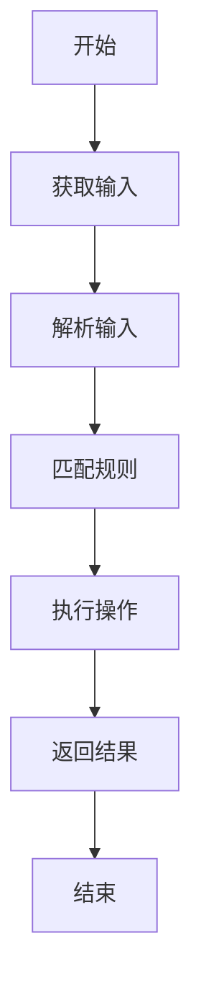
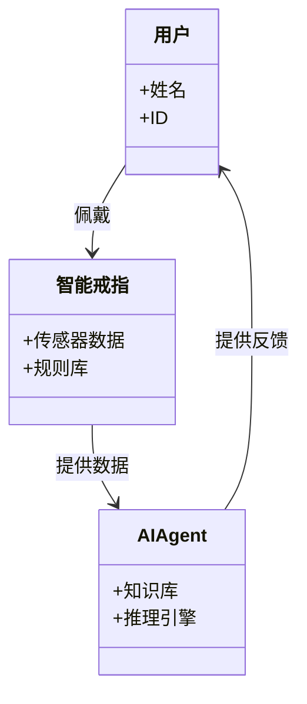
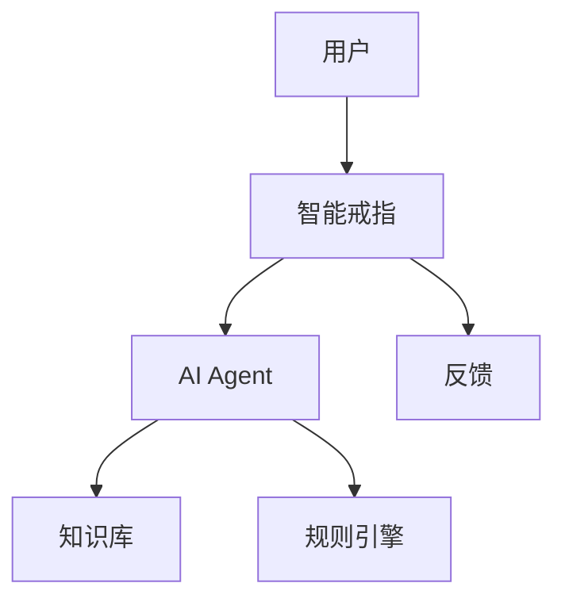
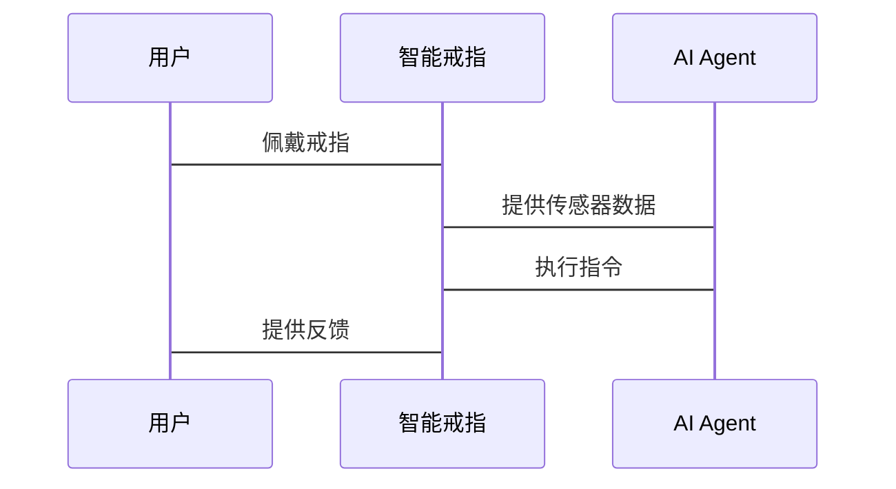

                 


# AI Agent在智能戒指中的日常活动追踪

> 关键词：AI Agent, 智能戒指, 日常活动追踪, 人工智能, 物联网

> 摘要：本文将深入探讨AI Agent在智能戒指中的应用，分析其在日常活动追踪中的核心作用。通过系统化的讲解，从基本概念到算法原理，再到实际应用，全面解析AI Agent如何通过智能戒指实现高效、精准的日常活动追踪。本文将涵盖AI Agent的核心概念、算法原理、系统架构设计、项目实战以及最佳实践等内容，为读者提供全面的技术视角。

---

# 第一部分: AI Agent与智能戒指概述

# 第1章: AI Agent与智能戒指的背景介绍

## 1.1 AI Agent的基本概念

### 1.1.1 AI Agent的定义与特点

AI Agent（人工智能代理）是一种能够感知环境、自主决策并执行任务的智能实体。它具备以下特点：
- **自主性**：能够独立执行任务，无需外部干预。
- **反应性**：能够实时感知环境并做出反应。
- **目标导向**：基于目标进行决策和行动。
- **学习能力**：通过数据和经验不断优化自身性能。

### 1.1.2 AI Agent的核心功能与应用场景

AI Agent的核心功能包括：
- **感知与识别**：通过传感器或数据源获取信息。
- **推理与决策**：基于感知信息进行分析和决策。
- **执行与反馈**：根据决策执行操作并获取反馈。

应用场景广泛，包括智能家居、医疗健康、交通管理等领域。

### 1.1.3 AI Agent与智能戒指的结合

智能戒指作为一种可穿戴设备，具备小型化、便携化的特点，非常适合集成AI Agent技术。AI Agent在智能戒指中的应用主要体现在日常活动追踪、健康监测、交互控制等方面。

---

## 1.2 智能戒指的基本结构

### 1.2.1 智能戒指的硬件组成

智能戒指的硬件主要包括：
- **传感器**：如加速度传感器、心率传感器、温度传感器等。
- **通信模块**：如蓝牙、Wi-Fi模块，用于与手机或其他设备通信。
- **处理器**：用于数据处理和算法执行。
- **电池**：提供持续的电力支持。

### 1.2.2 智能戒指的软件架构

智能戒指的软件架构通常包括：
- **数据采集层**：负责采集传感器数据。
- **数据处理层**：对采集的数据进行预处理和分析。
- **决策层**：基于处理后的数据进行推理和决策。
- **执行层**：根据决策结果执行相应的操作。

### 1.2.3 智能戒指的功能模块

智能戒指的功能模块包括：
- **活动监测**：记录用户的日常活动数据。
- **健康监测**：监测用户的生理指标，如心率、体温等。
- **交互控制**：通过手势或语音指令进行设备控制。

---

## 1.3 日常活动追踪的背景与需求

### 1.3.1 日常活动追踪的重要性

日常活动追踪是健康管理的重要组成部分，能够帮助用户了解自己的生活习惯，优化健康状态。例如，监测用户的运动量、睡眠质量、坐姿等。

### 1.3.2 智能戒指在日常活动追踪中的优势

智能戒指的优势在于其便捷性和实时性：
- **便捷性**：用户无需额外佩戴其他设备，戒指本身即可完成数据采集。
- **实时性**：能够实时监测用户的活动状态，并及时反馈数据。

### 1.3.3 用户需求与应用场景

用户需求主要集中在：
- **健康管理**：通过数据追踪了解自身健康状况。
- **行为矫正**：通过数据反馈改善不良生活习惯。
- **运动辅助**：提供运动数据分析和建议。

应用场景包括个人健康监测、运动辅助、远程医疗等。

---

## 1.4 本章小结

本章主要介绍了AI Agent的基本概念、智能戒指的硬件和软件架构，以及日常活动追踪的重要性和应用场景。AI Agent与智能戒指的结合为日常活动追踪提供了新的技术手段，能够实现更高效、更精准的监测和管理。

---

# 第二部分: AI Agent的核心概念与原理

# 第2章: AI Agent的核心概念与联系

## 2.1 AI Agent的核心概念

### 2.1.1 AI Agent的定义与分类

AI Agent可以根据功能和应用场景进行分类：
- **知识型AI Agent**：基于知识库进行推理和决策。
- **学习型AI Agent**：通过机器学习算法不断优化自身性能。
- **混合型AI Agent**：结合知识型和学习型的特点。

### 2.1.2 AI Agent的行为模式与决策机制

AI Agent的行为模式主要包括：
- **反应式行为**：基于当前感知信息进行即时反应。
- **目标导向行为**：基于预设目标进行规划和执行。
- **学习型行为**：通过学习不断优化自身的决策能力。

决策机制通常包括：
- **基于规则的决策**：通过预设的规则进行判断和选择。
- **基于概率的决策**：通过概率模型进行决策。
- **基于强化学习的决策**：通过奖励机制优化决策策略。

### 2.1.3 AI Agent的感知与交互能力

AI Agent的感知能力主要依赖于传感器和数据源，交互能力则依赖于通信模块和用户界面。通过感知环境信息，AI Agent能够实现与用户的有效互动。

---

## 2.2 AI Agent与智能戒指的关系

### 2.2.1 AI Agent在智能戒指中的角色

AI Agent在智能戒指中扮演“智能大脑”的角色，负责数据处理、推理和决策。

### 2.2.2 智能戒指对AI Agent的硬件支持

智能戒指为AI Agent提供了硬件支持，包括传感器、处理器和通信模块等。

### 2.2.3 AI Agent与智能戒指的协同工作

AI Agent通过智能戒指的传感器获取数据，经过处理和推理后，向智能戒指发送指令，实现对用户日常活动的监测和管理。

---

## 2.3 AI Agent的核心要素

### 2.3.1 知识库与推理引擎

知识库是AI Agent进行推理的基础，推理引擎负责根据知识库中的信息进行逻辑推理。

### 2.3.2 学习与自适应能力

AI Agent需要具备学习能力，能够通过数据和经验不断优化自身的性能。

### 2.3.3 通信与交互接口

AI Agent需要与智能戒指和其他设备进行通信，实现数据的传输和交互。

---

## 2.4 AI Agent的实体关系图

```mermaid
er
actor: 用户
agent: AI Agent
smart_ring: 智能戒指
activity: 日常活动
```

---

## 2.5 本章小结

本章详细讲解了AI Agent的核心概念、行为模式、决策机制以及与智能戒指的关系。AI Agent作为智能戒指的“大脑”，通过感知和推理实现对用户日常活动的监测和管理。

---

# 第三部分: AI Agent的算法原理与实现

# 第3章: AI Agent的算法原理

## 3.1 基于规则的推理算法

### 3.1.1 基于规则的推理机制

基于规则的推理是一种简单但有效的推理方法。规则通常由“条件”和“动作”两部分组成。例如，当检测到用户连续久坐（条件），则提醒用户起身活动（动作）。

### 3.1.2 规则库的构建与管理

规则库的构建需要考虑以下几点：
- **规则的表达**：规则需要清晰、简洁地表达。
- **规则的优先级**：多个规则可能同时触发，需要设定优先级。
- **规则的动态更新**：根据用户反馈或数据变化，动态更新规则。

### 3.1.3 规则匹配与执行流程

规则匹配的流程如下：
1. 获取传感器数据。
2. 将数据与规则库中的条件进行匹配。
3. 找到匹配的规则。
4. 执行匹配规则中的动作。

---

## 3.2 基于机器学习的推理算法

### 3.2.1 机器学习的基本原理

机器学习是一种数据驱动的算法，通过训练数据学习特征，实现对新数据的预测或分类。

### 3.2.2 常见的机器学习算法

常用的机器学习算法包括：
- **支持向量机（SVM）**：适用于分类问题。
- **随机森林**：适用于分类和回归问题。
- **神经网络**：适用于复杂问题。

### 3.2.3 在AI Agent中的应用

在AI Agent中，机器学习算法可以用于用户行为识别、异常检测等任务。

---

## 3.3 基于强化学习的优化算法

### 3.3.1 强化学习的基本原理

强化学习是一种通过试错机制优化决策策略的算法。智能体通过与环境互动，学习最优策略。

### 3.3.2 在AI Agent中的应用

在AI Agent中，强化学习可以用于优化活动监测的准确率、提升用户体验等。

---

## 3.4 算法流程图



---

## 3.5 算法实现的数学模型

### 3.5.1 基于规则的推理模型

规则匹配的逻辑可以用简单的逻辑表达式表示：
$$
\text{如果条件} \quad p \quad \text{满足，那么执行动作} \quad q
$$

### 3.5.2 基于机器学习的分类模型

以支持向量机为例，其数学模型可以表示为：
$$
y = \text{sign}(w \cdot x + b)
$$
其中，\( w \) 是权重向量，\( x \) 是输入向量，\( b \) 是偏置项，\( y \) 是输出类别。

---

## 3.6 本章小结

本章详细讲解了AI Agent的三种推理算法，包括基于规则的推理、基于机器学习的推理和基于强化学习的推理。每种算法都有其适用场景和优缺点，需要根据具体需求选择合适的算法。

---

# 第四部分: 系统分析与架构设计方案

# 第4章: 系统分析与架构设计

## 4.1 问题场景介绍

智能戒指需要实现日常活动监测功能，包括监测用户的运动状态、坐姿、心率等。

## 4.2 项目介绍

本项目旨在开发一款具备AI Agent功能的智能戒指，实现对用户日常活动的精准监测和管理。

## 4.3 系统功能设计

### 4.3.1 领域模型



### 4.3.2 系统架构设计



### 4.3.3 系统接口设计

- **输入接口**：传感器数据输入。
- **输出接口**：反馈用户指令。
- **通信接口**：与手机或其他设备通信。

### 4.3.4 系统交互设计



---

## 4.4 本章小结

本章详细描述了智能戒指日常活动监测系统的架构设计，包括系统功能模块、交互流程等。系统架构设计是实现AI Agent功能的基础，需要合理规划各个模块之间的关系。

---

# 第五部分: 项目实战

# 第5章: 项目实战

## 5.1 环境安装与配置

### 5.1.1 硬件环境

- 智能戒指开发板。
- 传感器模块（如加速度传感器、心率传感器）。
- 开发工具：如Arduino IDE。

### 5.1.2 软件环境

- 操作系统：Windows/MacOS/Linux。
- 开发语言：Python/Arduino。
- 库和框架：如TensorFlow（用于机器学习）、规则引擎框架。

---

## 5.2 系统核心实现

### 5.2.1 AI Agent的核心代码

```python
class AI_Agent:
    def __init__(self, knowledge_base):
        self.knowledge_base = knowledge_base
        self.rule_engine = RuleEngine()
    
    def process_data(self, data):
        # 匹配规则
        matched_rule = self.rule_engine.match_rule(data)
        if matched_rule:
            return matched_rule.action
        else:
            return None
```

### 5.2.2 智能戒指的数据采集代码

```python
class SmartRing:
    def __init__(self):
        self.accelerometer = AccelerometerSensor()
        self.heart_rate = HeartRateSensor()
    
    def collect_data(self):
        acc_data = self.accelerometer.read()
        heart_data = self.heart_rate.read()
        return {
            'acceleration': acc_data,
            'heart_rate': heart_data
        }
```

---

## 5.3 代码应用解读与分析

### 5.3.1 AI Agent的规则匹配逻辑

AI Agent通过规则引擎匹配传感器数据，执行相应的动作。例如，当检测到用户久坐，AI Agent会提醒用户起身活动。

### 5.3.2 智能戒指的数据采集与传输

智能戒指通过传感器采集数据，传输给AI Agent进行处理，AI Agent根据处理结果向智能戒指发送指令。

---

## 5.4 实际案例分析

### 5.4.1 案例背景

用户佩戴智能戒指，希望监测自己的运动状态和心率。

### 5.4.2 系统实现

智能戒指采集用户的运动数据和心率数据，传输给AI Agent。AI Agent通过规则引擎匹配数据，判断用户的运动状态和心率是否正常。

### 5.4.3 系统反馈

如果用户的心率异常，AI Agent会提醒用户休息；如果用户久坐，AI Agent会提醒用户起身活动。

---

## 5.5 项目小结

本章通过实际案例分析，详细讲解了AI Agent在智能戒指中的实现过程，包括环境配置、核心代码实现、系统交互流程等。通过实际操作，读者可以更好地理解AI Agent在日常活动监测中的应用。

---

# 第六部分: 最佳实践与总结

# 第6章: 最佳实践与总结

## 6.1 最佳实践

### 6.1.1 系统设计中的注意事项

- **数据隐私**：确保用户数据的安全性和隐私性。
- **算法优化**：根据实际需求选择合适的算法，避免过度复杂。
- **用户体验**：设计友好的用户界面和交互流程。

### 6.1.2 系统维护与优化

- **数据更新**：定期更新规则库和知识库。
- **系统升级**：根据用户反馈和技术发展，优化系统性能。
- **故障处理**：建立完善的故障诊断和处理机制。

---

## 6.2 小结

通过本文的详细讲解，读者可以全面了解AI Agent在智能戒指中的应用，从基本概念到算法实现，再到系统设计和项目实战，每一步都有详细的指导和解读。

---

## 6.3 注意事项

- **数据安全**：确保用户数据不被泄露或滥用。
- **算法选择**：根据具体需求选择合适的算法，避免使用过度复杂的算法。
- **用户体验**：设计简洁易用的用户界面和交互流程。

---

## 6.4 拓展阅读

- **AI Agent与物联网**：探索AI Agent在物联网中的更多应用场景。
- **强化学习算法**：深入学习强化学习算法的实现与优化。
- **智能戒指开发**：学习智能戒指的硬件开发和软件实现。

---

# 作者

作者：AI天才研究院/AI Genius Institute & 禅与计算机程序设计艺术 /Zen And The Art of Computer Programming

