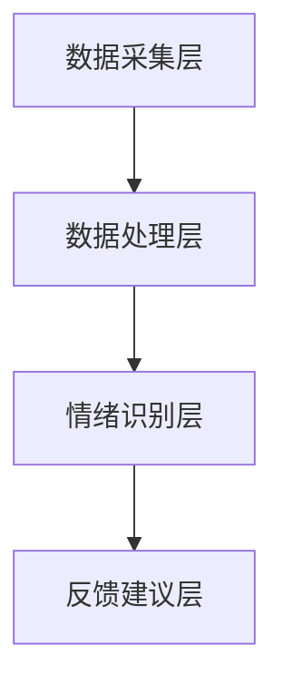
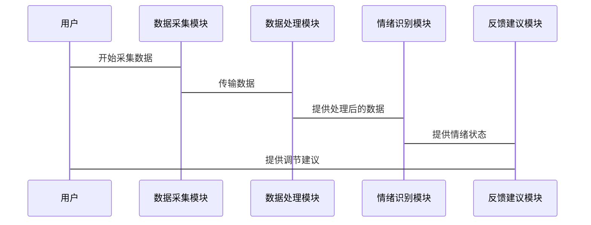

                 


# AI Agent在智能手环中的情绪管理助手

> 关键词：AI Agent，情绪管理，智能手环，情绪识别，可穿戴设备，人工智能

> 摘要：本文探讨了AI Agent在智能手环中的情绪管理助手的应用，详细分析了情绪管理的重要性、AI Agent的基本概念、情绪识别的原理、算法实现、系统架构设计以及实际项目案例。通过结合理论与实践，展示了AI Agent在智能手环中如何帮助用户实现高效的情绪管理，为未来的智能健康助手提供了新的思路。

---

# 第一部分: AI Agent与情绪管理助手的背景介绍

## 第1章: 情绪管理与AI Agent概述

### 1.1 情绪管理的重要性

#### 1.1.1 情绪管理的核心概念
情绪管理是通过识别、理解和调节情绪状态，以达到心理健康的手段。它帮助个体更好地应对压力、改善人际关系、提高工作效率。在现代社会，随着生活节奏的加快，情绪管理的需求日益增加。

#### 1.1.2 情绪管理在智能设备中的应用价值
智能设备（如智能手环）可以通过传感器采集生理数据（如心率、皮肤温度、运动数据等），结合AI技术分析情绪状态，为用户提供实时的情绪反馈和调节建议。

#### 1.1.3 AI Agent在情绪管理中的角色定位
AI Agent（人工智能代理）是一种能够感知环境、自主决策并执行任务的智能体。在情绪管理中，AI Agent可以作为用户的助手，实时监测情绪变化，提供个性化的情绪调节方案。

### 1.2 AI Agent的基本概念

#### 1.2.1 AI Agent的定义与特点
AI Agent是一种智能实体，能够通过感知环境、学习数据、执行任务来实现特定目标。其特点包括自主性、反应性、社会性、持续学习能力等。

#### 1.2.2 AI Agent的核心功能与优势
- **核心功能**：感知环境、数据处理、决策制定、任务执行。
- **优势**：能够实时响应、持续学习、提供个性化服务。

#### 1.2.3 AI Agent与传统情绪管理工具的对比
传统情绪管理工具（如日记、问卷）依赖人工输入，效率低、实时性差。AI Agent则能够实时监测、主动反馈，显著提升了情绪管理的效果。

### 1.3 智能手环中的情绪管理助手

#### 1.3.1 智能手环的功能与应用场景
智能手环通过传感器采集生理数据，结合AI算法，能够实现健康监测、运动记录、睡眠分析等功能。在情绪管理中，它通过实时监测生理数据，分析情绪波动。

#### 1.3.2 情绪管理助手在智能手环中的实现方式
情绪管理助手通过以下步骤实现：
1. **数据采集**：采集心率、皮肤温度、加速度等数据。
2. **数据处理**：分析数据，识别情绪状态。
3. **反馈建议**：根据情绪状态，提供调节建议。

#### 1.3.3 情绪管理助手的用户需求分析
用户需求包括：
- **实时监测**：随时了解情绪状态。
- **个性化建议**：根据情绪波动提供调节方法。
- **数据可视化**：通过图表展示情绪变化趋势。

---

## 第2章: 情绪识别与AI Agent的结合

### 2.1 情绪识别的基本原理

#### 2.1.1 情绪识别的主要方法
- **生理数据法**：通过心率、皮肤温度等生理指标分析情绪。
- **行为数据法**：通过用户的运动模式、睡眠质量等行为数据推断情绪状态。
- **语言分析法**：通过语音语调、文本内容分析情绪。

#### 2.1.2 情绪识别的常见技术手段
- **时间序列分析**：分析生理数据的时间序列变化。
- **机器学习算法**：如支持向量机（SVM）、随机森林（Random Forest）等。
- **深度学习模型**：如LSTM（长短期记忆网络）用于时间序列预测。

#### 2.1.3 情绪识别的优缺点分析
- **优点**：能够实时监测情绪变化，提供个性化建议。
- **缺点**：受数据质量和环境干扰的影响，准确性有待提升。

### 2.2 AI Agent在情绪识别中的应用

#### 2.2.1 AI Agent如何实现情绪识别
AI Agent通过以下步骤实现情绪识别：
1. **数据采集**：从智能手环获取生理数据。
2. **数据预处理**：对数据进行清洗、归一化处理。
3. **特征提取**：提取情绪相关的特征。
4. **模型训练**：使用机器学习或深度学习模型训练情绪识别模型。
5. **实时预测**：根据实时数据预测情绪状态。

#### 2.2.2 AI Agent与情绪识别技术的结合方式
AI Agent通过以下方式与情绪识别技术结合：
- **实时监测**：AI Agent持续监测用户的生理数据，实时预测情绪状态。
- **反馈调节**：根据情绪状态，AI Agent主动提供调节建议。

#### 2.2.3 AI Agent在情绪识别中的优势
- **实时性**：能够实时监测情绪变化。
- **个性化**：根据用户数据提供个性化建议。
- **高效性**：通过AI算法快速分析数据，提供反馈。

### 2.3 情绪识别在智能手环中的应用

#### 2.3.1 情绪识别在智能手环中的应用场景
- **情绪监测**：实时监测用户情绪状态，记录情绪变化趋势。
- **情绪预警**：当情绪波动较大时，及时发出预警。
- **情绪调节**：根据情绪状态，提供放松训练、音乐推荐等调节方法。

#### 2.3.2 情绪识别在智能手环中的实现案例
例如，某款智能手环通过心率变异性和皮肤温度变化，结合LSTM模型，预测用户的情绪状态，并提供相应的调节建议。

---

## 第3章: AI Agent在智能手环中的系统架构设计

### 3.1 系统功能设计

#### 3.1.1 系统功能模块
- **数据采集模块**：采集心率、皮肤温度、加速度等数据。
- **数据处理模块**：清洗、归一化处理数据。
- **情绪识别模块**：通过机器学习或深度学习模型识别情绪状态。
- **反馈建议模块**：根据情绪状态提供调节建议。

#### 3.1.2 系统功能流程
1. 数据采集模块实时采集生理数据。
2. 数据处理模块对数据进行预处理。
3. 情绪识别模块分析数据，识别情绪状态。
4. 反馈建议模块根据情绪状态，提供调节建议。

### 3.2 系统架构设计

#### 3.2.1 系统架构分层
- **数据采集层**：负责采集生理数据。
- **数据处理层**：负责数据预处理和特征提取。
- **情绪识别层**：负责情绪识别和预测。
- **反馈建议层**：负责生成调节建议。

#### 3.2.2 系统架构图


### 3.3 系统接口设计

#### 3.3.1 系统接口
- **数据采集接口**：与智能手环传感器通信。
- **数据处理接口**：与数据处理模块交互。
- **情绪识别接口**：与情绪识别模块交互。
- **反馈建议接口**：与用户交互，提供调节建议。

#### 3.3.2 系统接口交互流程
1. 数据采集接口接收传感器数据。
2. 数据处理接口对数据进行预处理。
3. 情绪识别接口调用模型进行情绪识别。
4. 反馈建议接口根据情绪状态生成调节建议。

### 3.4 系统交互设计

#### 3.4.1 系统交互流程
1. 用户佩戴智能手环，开始采集生理数据。
2. 数据处理模块对数据进行清洗和归一化处理。
3. 情绪识别模块调用模型，预测情绪状态。
4. 反馈建议模块根据情绪状态，生成调节建议。

#### 3.4.2 系统交互图


---

## 第4章: AI Agent在智能手环中的项目实战

### 4.1 项目背景与目标

#### 4.1.1 项目背景
随着智能手环的普及，用户对情绪管理的需求日益增加。本项目旨在通过AI Agent实现智能手环的情绪管理功能，帮助用户实时监测情绪状态，提供个性化调节建议。

#### 4.1.2 项目目标
- 实现情绪识别功能。
- 提供个性化情绪调节建议。
- 实现系统实时反馈。

### 4.2 项目环境与工具

#### 4.2.1 环境安装
- **硬件**：智能手环、开发板。
- **软件**：Python、TensorFlow、Keras、Jupyter Notebook。

#### 4.2.2 工具安装
- 安装Python环境：`pip install python`
- 安装TensorFlow：`pip install tensorflow`
- 安装Keras：`pip install keras`

### 4.3 系统核心实现

#### 4.3.1 数据采集模块实现
```python
import pandas as pd
import numpy as np

# 采集数据
def collect_data():
    data = pd.DataFrame({
        'heart_rate': [70, 75, 80, 85, 90],
        'skin_temp': [36, 36.5, 37, 37.5, 38],
        'acceleration': [10, 15, 20, 25, 30]
    })
    return data

data = collect_data()
print(data)
```

#### 4.3.2 数据处理模块实现
```python
def preprocess_data(data):
    # 数据清洗
    data = data.dropna()
    # 数据归一化
    data = (data - data.min()) / (data.max() - data.min())
    return data

processed_data = preprocess_data(data)
print(processed_data)
```

#### 4.3.3 情绪识别模块实现
```python
from tensorflow.keras.models import Sequential
from tensorflow.keras.layers import LSTM, Dense

# 构建LSTM模型
model = Sequential()
model.add(LSTM(64, input_shape=(None, 3)))
model.add(Dense(1, activation='sigmoid'))
model.compile(loss='binary_crossentropy', optimizer='adam', metrics=['accuracy'])

# 训练模型
model.fit(processed_data, labels, epochs=10, batch_size=32)
```

#### 4.3.4 反馈建议模块实现
```python
def generate_feedback(emotion_state):
    if emotion_state == 'happy':
        return "您可以继续保持良好的心情，建议进行适量运动。"
    elif emotion_state == 'stressed':
        return "建议您进行深呼吸练习，放松心情。"
    else:
        return "当前情绪稳定，继续保持。"

feedback = generate_feedback(emotion_state)
print(feedback)
```

### 4.4 项目案例分析

#### 4.4.1 案例背景
用户A佩戴智能手环，系统采集心率、皮肤温度、加速度数据。

#### 4.4.2 数据处理与分析
数据经过清洗和归一化处理，输入LSTM模型进行情绪识别。

#### 4.4.3 系统反馈
系统识别用户情绪为“stressed”，并提供深呼吸练习建议。

### 4.5 项目小结

#### 4.5.1 项目总结
本项目通过AI Agent实现了智能手环的情绪管理功能，能够实时监测情绪状态，并提供个性化调节建议。

#### 4.5.2 项目优势
- 实时监测情绪变化。
- 提供个性化调节建议。
- 系统架构清晰，易于扩展。

#### 4.5.3 项目不足
- 数据准确性受环境干扰影响。
- 情绪识别模型的准确率有待提高。

---

## 第5章: 总结与展望

### 5.1 总结

#### 5.1.1 核心内容回顾
本文详细探讨了AI Agent在智能手环中的情绪管理助手的应用，从理论到实践，展示了如何通过AI技术实现情绪识别和调节。

#### 5.1.2 最佳实践 tips
- 数据采集：确保数据的准确性和完整性。
- 模型选择：根据需求选择合适的算法。
- 系统设计：注重模块化设计，便于扩展和维护。

### 5.2 小结

#### 5.2.1 核心内容总结
AI Agent通过实时监测生理数据，分析情绪状态，提供个性化调节建议，帮助用户实现高效的情绪管理。

#### 5.2.2 注意事项
- 数据隐私：确保用户数据的安全性。
- 系统稳定性：保证系统的稳定运行。
- 用户体验：注重用户体验设计。

### 5.3 展望

#### 5.3.1 未来发展方向
- **数据融合**：结合更多生理数据和行为数据，提高情绪识别的准确性。
- **实时反馈**：实现更实时的情绪调节反馈。
- **个性化服务**：根据用户的个性化需求，提供定制化的调节方案。

#### 5.3.2 拓展阅读
- **推荐书籍**：《Deep Learning》、《Artificial Intelligence: A Modern Approach》
- **推荐文章**：《AI在健康领域的应用》、《可穿戴设备与情绪管理》

---

# 作者

作者：AI天才研究院/AI Genius Institute & 禅与计算机程序设计艺术/Zen And The Art of Computer Programming

