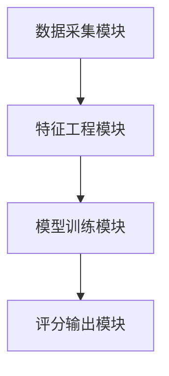
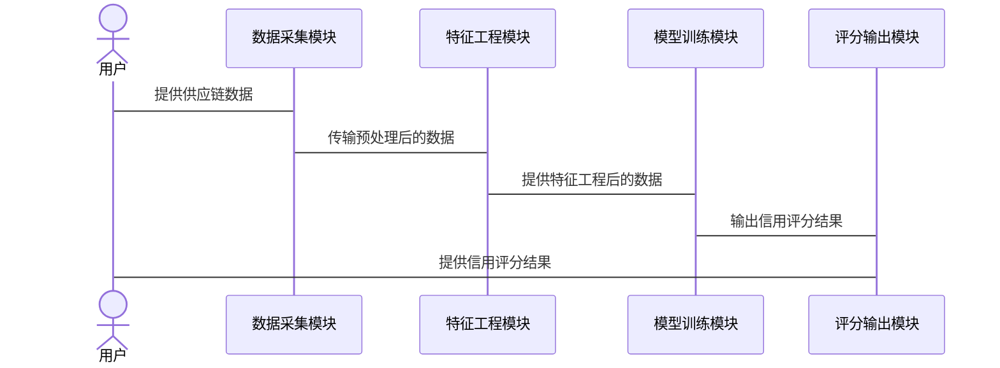

                 


# AI驱动的供应链金融信用评分模型

> 关键词：供应链金融、信用评分、人工智能、机器学习、深度学习

> 摘要：供应链金融是现代经济体系中的重要组成部分，而信用评分模型在供应链金融中起着关键作用。传统的信用评分模型存在数据维度有限、模型复杂度低、难以处理非结构化数据等局限性。随着人工智能技术的发展，基于AI的信用评分模型逐渐成为供应链金融领域的重要研究方向。本文将从供应链金融的背景与挑战出发，详细探讨AI驱动的信用评分模型的核心概念、算法原理、系统架构设计、项目实战以及最佳实践，为读者提供一个全面而深入的分析。

---

## 第1章: 供应链金融的背景与挑战

### 1.1 供应链金融的基本概念

#### 1.1.1 供应链金融的定义
供应链金融是指通过整合供应链上下游的企业，为核心企业提供融资服务，以优化供应链的资金流动效率。它不仅帮助企业解决资金短缺问题，还能提升供应链的整体竞争力。

#### 1.1.2 供应链金融的核心要素
- **核心企业**：供应链中的主导企业，通常为制造商或大型零售商。
- **上游供应商**：为核心企业提供原材料或零部件的企业。
- **下游经销商**：将核心企业的产品销售给最终消费者的渠道。
- **金融机构**：提供融资服务的银行或其他金融机构。

#### 1.1.3 供应链金融的业务流程
1. **需求分析**：金融机构根据企业的财务状况和供应链中的交易数据，评估企业的信用风险。
2. **融资申请**：企业基于供应链中的交易需求提出融资申请。
3. **信用评估**：金融机构通过信用评分模型评估企业的信用状况，决定是否批准融资。
4. **融资执行**：根据评估结果，为企业提供相应的融资支持。
5. **监控与管理**：金融机构持续监控企业的经营状况和偿债能力，确保融资安全。

### 1.2 供应链金融中的信用评分问题

#### 1.2.1 信用评分的重要性
信用评分是供应链金融中的关键环节，它决定了企业是否能够获得融资以及融资的条件。一个准确的信用评分模型能够有效降低金融机构的风险，同时提高供应链的整体效率。

#### 1.2.2 传统信用评分的局限性
- **数据维度有限**：传统模型主要依赖财务报表数据，难以充分利用供应链中的交易数据和非结构化数据。
- **模型复杂度低**：传统模型通常基于线性回归或简单的逻辑回归，难以捕捉复杂的信用风险因素。
- **数据获取难度大**：供应链中的交易数据分散在不同企业之间，获取和整合这些数据具有一定的挑战性。

#### 1.2.3 AI驱动信用评分的优势
- **数据处理能力**：AI技术能够处理结构化数据和非结构化数据，如文本、图像和时间序列数据。
- **模型复杂度高**：基于机器学习和深度学习的模型能够捕捉复杂的信用风险特征，提供更精准的评分结果。
- **实时性**：AI驱动的模型可以实时处理数据，提供动态的信用评分，适应供应链中的快速变化。

### 1.3 供应链金融与AI技术的结合

#### 1.3.1 AI在供应链金融中的应用场景
- **信用评分**：通过AI技术分析供应链中的交易数据，评估企业的信用状况。
- **风险预警**：基于历史数据和实时数据，预测供应链中的潜在风险。
- **智能决策**：利用AI技术辅助金融机构做出融资决策，优化资源配置。

#### 1.3.2 信用评分模型的智能化发展
AI技术的引入使得信用评分模型更加智能化，能够处理更复杂的数据和场景，提供更精准的评分结果。

#### 1.3.3 供应链金融的未来趋势
随着AI技术的不断发展，供应链金融将更加智能化和数据驱动化，信用评分模型将成为供应链金融的核心技术之一。

---

## 第2章: AI驱动信用评分模型的核心概念

### 2.1 信用评分模型的基本原理

#### 2.1.1 信用评分的定义
信用评分是通过一定的数学模型，根据企业的信用历史、财务状况、经营能力等多方面因素，量化企业的信用风险，得出一个评分结果。

#### 2.1.2 信用评分的核心要素
- **信用历史**：企业的还款记录、违约历史等。
- **财务状况**：企业的收入、利润、资产负债情况等。
- **经营能力**：企业的市场地位、供应链稳定性、管理能力等。
- **外部环境**：宏观经济环境、行业发展趋势等。

#### 2.1.3 信用评分的评价标准
- **评分范围**：通常在0到100分之间，分数越高代表信用风险越低。
- **评分等级**：根据评分结果将企业划分为不同的信用等级，如AAA、AA、A、BBB、BB、B、CCC、CC、C、D等。

### 2.2 AI驱动信用评分的核心技术

#### 2.2.1 机器学习在信用评分中的应用
- **监督学习**：使用有标签的数据训练模型，预测企业的信用评分。
- **无监督学习**：通过聚类分析发现潜在的信用风险。
- **集成学习**：结合多种模型的优势，提高评分的准确性。

#### 2.2.2 深度学习在信用评分中的优势
- **非线性特征提取**：深度学习模型能够自动提取复杂的非线性特征，提高模型的表达能力。
- **处理非结构化数据**：深度学习模型可以处理文本、图像等非结构化数据，丰富模型的输入维度。
- **模型泛化能力**：深度学习模型具有较强的泛化能力，能够适应不同的数据分布。

#### 2.2.3 自然语言处理在供应链数据中的应用
- **文本数据处理**：利用NLP技术处理供应链中的合同、协议等文本数据，提取有用的信息。
- **情感分析**：分析文本中的情感倾向，评估企业的信誉和风险。

### 2.3 供应链金融中的数据流与信息流

#### 2.3.1 数据来源与特征提取
- **结构化数据**：财务报表、交易记录、合同数据等。
- **非结构化数据**：文本数据、图像数据、视频数据等。
- **特征提取**：从数据中提取有用的特征，如企业规模、盈利能力、供应链稳定性等。

#### 2.3.2 数据预处理与特征工程
- **数据清洗**：处理缺失值、异常值等。
- **特征选择**：选择对信用评分影响较大的特征。
- **特征工程**：对特征进行变换或组合，提高模型的性能。

#### 2.3.3 数据流与信息流的关联性分析
- **数据流**：数据从供应链中的各个环节流动，形成企业的信用记录。
- **信息流**：信息在供应链中的传递和共享，影响企业的信用评分。

---

## 第3章: 供应链金融信用评分模型的构建与优化

### 3.1 数据采集与特征工程

#### 3.1.1 数据来源与采集方法
- **内部数据**：核心企业的财务数据、交易记录等。
- **外部数据**：公开的企业信息、行业数据、宏观经济数据等。

#### 3.1.2 数据清洗与预处理
- **缺失值处理**：使用均值、中位数或插值方法填补缺失值。
- **异常值处理**：通过统计方法或机器学习方法检测并处理异常值。
- **数据标准化**：对数据进行标准化或归一化处理，确保模型的输入一致。

#### 3.1.3 特征选择与工程
- **特征选择**：使用相关性分析、逐步回归等方法选择重要特征。
- **特征工程**：对特征进行变换，如对数变换、主成分分析等，提高模型的性能。

### 3.2 算法选择与模型训练

#### 3.2.1 常见信用评分算法对比
| 算法名称       | 优势                           | 劣势                           |
|----------------|--------------------------------|--------------------------------|
| 逻辑回归       | 解释性强，易于实现             | 非线性关系处理能力有限         |
| 随机森林       | 抗过拟合能力强，特征重要性分析   | 对数据分布假设较为严格         |
| 支持向量机（SVM）| 对小样本数据表现良好           | 对高维数据处理能力有限         |
| 神经网络       | 非线性表达能力强               | 训练时间长，需要大量数据         |

#### 3.2.2 基于机器学习的信用评分模型
- **模型训练**：使用训练数据训练模型，评估模型的性能。
- **模型调优**：通过网格搜索、随机搜索等方法优化模型参数。
- **模型评估**：使用测试数据评估模型的准确率、召回率、F1分数等指标。

#### 3.2.3 深度学习模型的应用与优化
- **神经网络结构**：设计适合信用评分任务的神经网络结构，如多层感知机（MLP）、卷积神经网络（CNN）、循环神经网络（RNN）等。
- **模型优化**：使用正则化、早停等技术防止过拟合。
- **模型解释性**：通过可视化工具（如t-SNE）分析模型的决策边界，提高模型的可解释性。

### 3.3 模型评估与优化

#### 3.3.1 模型评估指标
- **准确率（Accuracy）**：正确预测的比例。
- **召回率（Recall）**：实际为正类但被正确分类的比例。
- **F1分数**：准确率和召回率的调和平均数，综合考虑分类的精确性和召回率。

#### 3.3.2 模型调优与参数优化
- **参数选择**：通过网格搜索或随机搜索选择最佳模型参数。
- **交叉验证**：使用交叉验证评估模型的泛化能力，防止过拟合。

#### 3.3.3 模型的鲁棒性与可解释性
- **鲁棒性**：模型在不同数据集上的表现一致性。
- **可解释性**：模型的决策过程是否透明，便于理解和解释。

---

## 第4章: 基于AI的信用评分模型实现

### 4.1 系统架构设计

#### 4.1.1 系统功能模块
- **数据采集模块**：负责从供应链中的各个环节采集数据。
- **特征工程模块**：对采集的数据进行预处理和特征提取。
- **模型训练模块**：使用机器学习或深度学习算法训练信用评分模型。
- **评分输出模块**：根据训练好的模型，输出企业的信用评分结果。

#### 4.1.2 系统架构图


#### 4.1.3 系统接口设计
- **输入接口**：接收来自供应链各环节的数据。
- **输出接口**：输出企业的信用评分结果。

#### 4.1.4 系统交互流程


### 4.2 项目实战

#### 4.2.1 环境安装
- **Python**：安装Python 3.x。
- **库依赖**：安装numpy、pandas、scikit-learn、xgboost、keras、tensorflow等库。

#### 4.2.2 数据预处理与特征工程

```python
import pandas as pd
import numpy as np

# 数据加载
df = pd.read_csv('supply_chain_data.csv')

# 数据清洗
df.dropna(inplace=True)
df = df.drop_duplicates()

# 特征选择
selected_features = ['revenue', 'profit', 'assets', 'liabilities']
df = df[selected_features]

# 数据标准化
from sklearn.preprocessing import StandardScaler
scaler = StandardScaler()
df_scaled = scaler.fit_transform(df)
```

#### 4.2.3 模型训练与评估

```python
from sklearn.model_selection import train_test_split
from sklearn.linear_model import LogisticRegression
from sklearn.metrics import accuracy_score, recall_score, f1_score

# 数据分割
X_train, X_test, y_train, y_test = train_test_split(df_scaled, target, test_size=0.2, random_state=42)

# 模型训练
model = LogisticRegression()
model.fit(X_train, y_train)

# 模型预测
y_pred = model.predict(X_test)

# 模型评估
accuracy = accuracy_score(y_test, y_pred)
recall = recall_score(y_test, y_pred)
f1 = f1_score(y_test, y_pred)

print(f"Accuracy: {accuracy}")
print(f"Recall: {recall}")
print(f"F1 Score: {f1}")
```

#### 4.2.4 模型优化与部署

```python
from sklearn.ensemble import RandomForestClassifier
from sklearn.model_selection import GridSearchCV

# 参数选择
param_grid = {
    'n_estimators': [100, 200],
    'max_depth': [None, 10, 20],
    'min_samples_split': [2, 5, 10]
}

# 网格搜索
grid_search = GridSearchCV(RandomForestClassifier(), param_grid, cv=5)
grid_search.fit(X_train, y_train)

# 最佳模型
best_model = grid_search.best_estimator_
print(f"Best Parameters: {grid_search.best_params_}")
```

---

## 第5章: 最佳实践与总结

### 5.1 最佳实践

#### 5.1.1 数据质量管理
- 确保数据的准确性和完整性，避免数据偏差。
- 定期更新数据，保持模型的实时性。

#### 5.1.2 模型解释性
- 使用可解释性工具（如SHAP值）分析模型的决策过程。
- 提供清晰的解释，帮助用户理解评分结果。

#### 5.1.3 模型监控与维护
- 定期监控模型的性能，及时发现并修复问题。
- 根据新的数据和业务需求，不断优化模型。

### 5.2 总结

本文详细探讨了AI驱动的供应链金融信用评分模型的核心概念、算法原理、系统架构设计和项目实战。通过结合机器学习和深度学习技术，AI驱动的信用评分模型能够更精准地评估企业的信用状况，优化供应链金融的效率和安全性。未来，随着技术的不断发展，信用评分模型将更加智能化和数据驱动化，为供应链金融的发展注入新的活力。

---

## 作者：AI天才研究院/AI Genius Institute & 禅与计算机程序设计艺术 /Zen And The Art of Computer Programming

---

希望这篇文章能满足您的要求！如果需要进一步的修改或补充，请随时告诉我。

