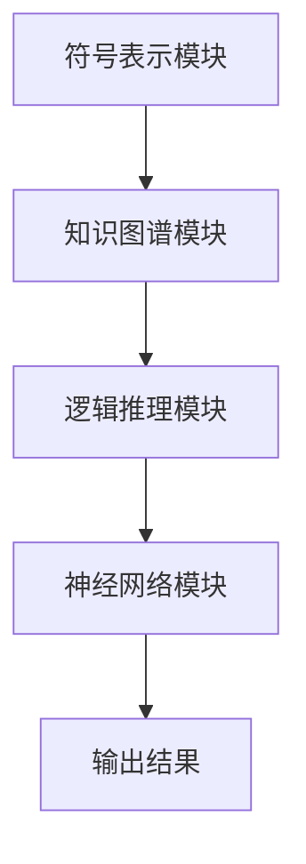
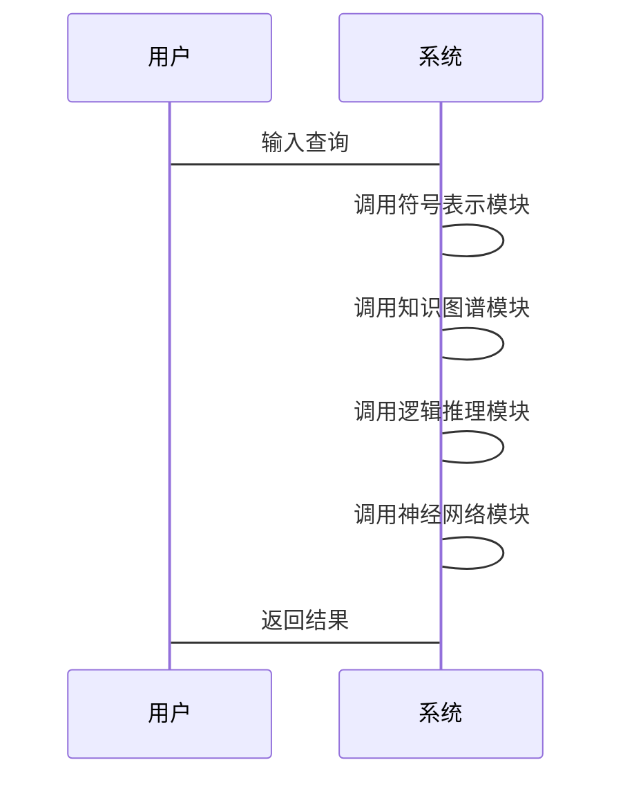

                 


# 基于神经符号AI的AI Agent常识推理增强

> **关键词**：神经符号AI、AI Agent、常识推理、符号表示、逻辑推理、知识图谱、神经网络

> **摘要**：本文深入探讨了基于神经符号AI的AI Agent常识推理增强方法，结合符号表示、逻辑推理与知识图谱，提出了神经符号AI在AI Agent中的实现方案，详细分析了神经符号AI的算法原理与系统架构设计，并通过具体案例展示了其实现与应用。

---

## 第1章 神经符号AI与AI Agent概述

### 1.1 神经符号AI的基本概念
神经符号AI（Neural-Symbolic AI）是人工智能领域的一个新兴方向，它结合了符号逻辑与神经网络的优势，试图将符号表示与深度学习模型相结合，以实现更强大的推理能力。

#### 1.1.1 符号AI与神经网络的结合
- 符号AI通过规则和逻辑进行推理，但缺乏对复杂数据的处理能力。
- 神经网络擅长处理非结构化数据，但难以解释推理过程。
- 神经符号AI通过结合二者，实现了数据驱动与逻辑推理的统一。

#### 1.1.2 神经符号AI的核心特点
- **可解释性**：结合符号逻辑，提高模型的可解释性。
- **通用性**：适用于多种任务，如推理、分类、生成。
- **自适应性**：能够通过神经网络学习动态调整符号表示。

#### 1.1.3 AI Agent的基本概念与功能
- AI Agent是一个智能主体，能够感知环境、执行任务、与人交互。
- 其核心功能包括感知、推理、决策与执行。

### 1.2 神经符号AI在AI Agent中的应用
神经符号AI为AI Agent提供了更强大的常识推理能力，使其能够更好地理解上下文、处理复杂任务。

#### 1.2.1 神经符号AI的优势
- **结合符号与数值信息**：能够处理结构化与非结构化数据。
- **动态推理能力**：能够根据实时信息进行推理和调整。
- **跨任务通用性**：适用于多种任务，如问答系统、对话生成等。

#### 1.2.2 AI Agent在智能系统中的角色
- **任务执行者**：通过推理完成复杂任务。
- **知识整合者**：将结构化知识与非结构化数据结合。
- **人机交互者**：通过自然语言与人类交互。

#### 1.2.3 神经符号AI对AI Agent推理能力的提升
- 提高了AI Agent对常识的理解能力。
- 增强了AI Agent的动态推理能力。
- 提升了AI Agent的可解释性。

### 1.3 本章小结
本章介绍了神经符号AI的基本概念及其在AI Agent中的应用，为后续内容奠定了基础。

---

## 第2章 符号表示与知识图谱

### 2.1 符号表示的基本原理
符号表示是神经符号AI的核心技术之一，它将知识以符号形式表示，为推理提供基础。

#### 2.1.1 符号表示的定义
符号表示是将实体、概念等用符号或符号串表示的方法。

#### 2.1.2 符号表示的类型与特点
- **谓词逻辑表示**：通过谓词和逻辑连接词表示知识。
- **框架表示**：通过槽位和填充方式表示知识。
- **语义网络表示**：通过节点与边表示实体及其关系。

#### 2.1.3 符号表示在AI Agent中的作用
- **知识存储**：将常识、领域知识存储为符号形式。
- **推理基础**：为逻辑推理提供符号化输入。

### 2.2 知识图谱构建与应用
知识图谱是一种结构化的知识表示形式，广泛应用于神经符号AI。

#### 2.2.1 知识图谱的定义与构建方法
- **知识图谱**：由实体、关系与属性组成的图结构。
- **构建方法**：包括数据抽取、实体识别、关系抽取等步骤。

#### 2.2.2 知识图谱的存储与表示
- **存储方式**：使用图数据库或关系型数据库。
- **表示方式**：使用RDF（资源描述框架）或JSON-LD。

#### 2.2.3 知识图谱在神经符号AI中的应用
- **增强符号表示**：通过知识图谱丰富符号表示的内容。
- **支持逻辑推理**：利用知识图谱进行路径推理与属性推理。

### 2.3 符号表示与知识图谱的关系
符号表示与知识图谱是相辅相成的关系。

#### 2.3.1 符号表示与知识图谱的联系
- 知识图谱为符号表示提供结构化知识。
- 符号表示为知识图谱提供灵活的表示方式。

#### 2.3.2 符号表示对知识图谱的增强作用
- 提供语义信息，使知识图谱更智能化。
- 支持动态更新，使知识图谱更具适应性。

#### 2.3.3 神经符号AI中符号表示与知识图谱的结合
- 神经符号AI通过符号表示与知识图谱的结合，实现了知识的存储与推理。

### 2.4 本章小结
本章详细介绍了符号表示与知识图谱的基本原理及其在神经符号AI中的应用。

---

## 第3章 逻辑推理与神经符号AI

### 3.1 逻辑推理的基本原理
逻辑推理是神经符号AI的核心能力之一。

#### 3.1.1 逻辑推理的定义与分类
- **逻辑推理**：根据已知事实和规则，推导新的结论。
- **分类**：包括演绎推理、归纳推理与 abduction推理。

#### 3.1.2 逻辑推理在AI Agent中的应用
- **问题解决**：通过推理找到解决方案。
- **决策支持**：通过推理提供决策依据。

#### 3.1.3 逻辑推理的数学模型
- **谓词逻辑**：通过谓词和逻辑连接词表示推理规则。
- **规则推理**：基于规则库进行推理。

### 3.2 神经符号AI中的逻辑推理
神经符号AI通过结合神经网络与逻辑推理，实现了强大的推理能力。

#### 3.2.1 神经符号AI中的逻辑推理方法
- **基于符号的逻辑推理**：直接应用逻辑规则进行推理。
- **基于神经网络的逻辑推理**：通过神经网络学习推理规则。

#### 3.2.2 神经符号AI中的逻辑推理模型
- **神经符号逻辑网络**：结合神经网络与逻辑推理的模型。
- **符号增强的神经网络**：通过符号表示增强神经网络的推理能力。

#### 3.2.3 神经符号AI中逻辑推理的优势
- **结合符号与数值信息**：能够处理复杂数据。
- **动态推理能力**：能够根据实时信息进行推理。

### 3.3 神经符号AI中的逻辑推理与符号表示的结合
神经符号AI通过符号表示与逻辑推理的结合，实现了常识推理的增强。

#### 3.3.1 符号表示对逻辑推理的增强作用
- **提供结构化知识**：支持逻辑推理的进行。
- **支持动态更新**：使逻辑推理更加灵活。

#### 3.3.2 神经符号AI中逻辑推理与符号表示的协同关系
- **符号表示为逻辑推理提供输入**。
- **逻辑推理为符号表示提供推理结果**。

#### 3.3.3 神经符号AI中逻辑推理的应用案例
- **问答系统**：通过逻辑推理回答复杂问题。
- **对话生成**：通过逻辑推理生成合理的对话内容。

### 3.4 本章小结
本章详细介绍了逻辑推理的基本原理及其在神经符号AI中的应用，探讨了神经符号AI中逻辑推理与符号表示的结合。

---

## 第4章 神经符号AI的算法原理与实现

### 4.1 神经符号AI的基本算法
神经符号AI的实现依赖于多种算法的结合。

#### 4.1.1 基于符号表示的神经网络算法
- **符号嵌入**：将符号表示映射为向量。
- **符号增强的神经网络**：通过符号嵌入增强神经网络的表示能力。

#### 4.1.2 神经符号AI中的注意力机制
- **注意力机制**：通过注意力权重关注重要的符号信息。
- **符号增强的注意力网络**：结合符号信息与注意力机制。

#### 4.1.3 神经符号AI中的推理网络
- **推理网络**：通过神经网络进行逻辑推理。
- **符号增强的推理网络**：结合符号信息进行推理。

### 4.2 神经符号AI的数学模型
神经符号AI的数学模型是其算法实现的核心。

#### 4.2.1 符号表示的数学建模
- **符号嵌入**：将符号表示映射为向量，表示为：
  $$ e(s) \in \mathbb{R}^d $$
  其中，$s$是符号，$d$是嵌入维度。

#### 4.2.2 神经符号AI中的逻辑推理模型
- **推理网络**：通过神经网络对符号表示进行变换，表示为：
  $$ f(x) = \sigma(Wx + b) $$
  其中，$W$是权重矩阵，$b$是偏置向量，$\sigma$是激活函数。

#### 4.2.3 神经符号AI中的知识图谱表示模型
- **知识图谱嵌入**：通过图嵌入方法将知识图谱表示为向量，表示为：
  $$ e(h, r, t) = (e(h), e(r), e(t)) $$
  其中，$h$是头节点，$r$是关系，$t$是尾节点。

### 4.3 本章小结
本章详细介绍了神经符号AI的基本算法及其数学模型，为后续的系统实现奠定了基础。

---

## 第5章 神经符号AI的系统架构设计与实现

### 5.1 神经符号AI的系统架构设计
系统架构设计是实现神经符号AI的关键步骤。

#### 5.1.1 系统功能模块
- **符号表示模块**：负责符号的表示与嵌入。
- **知识图谱模块**：负责知识图谱的构建与存储。
- **逻辑推理模块**：负责逻辑推理的实现。
- **神经网络模块**：负责神经网络的训练与推理。

#### 5.1.2 系统架构图
以下是神经符号AI的系统架构图：



#### 5.1.3 系统接口设计
- **符号表示接口**：提供符号表示与嵌入的功能。
- **知识图谱接口**：提供知识图谱的构建与查询功能。
- **逻辑推理接口**：提供逻辑推理的功能。
- **神经网络接口**：提供神经网络的训练与推理功能。

#### 5.1.4 系统交互流程图
以下是系统交互流程图：



### 5.2 神经符号AI的实现
以下是神经符号AI的实现代码示例：

```python
class NeuralSymbolicAI:
    def __init__(self):
        self.symbol_embedding = SymbolEmbedding()
        self.knowledge_graph = KnowledgeGraph()
        self.reasoning_module = ReasoningModule()
        self.neural_network = NeuralNetwork()

    def process_query(self, query):
        # 调用符号表示模块
        symbols = self.symbol_embedding.embed(query)
        # 调用知识图谱模块
        knowledge = self.knowledge_graph.retrieve(symbols)
        # 调用逻辑推理模块
        result = self.reasoning_module.reason(knowledge)
        # 调用神经网络模块
        output = self.neural_network.predict(result)
        return output
```

### 5.3 本章小结
本章详细介绍了神经符号AI的系统架构设计与实现过程，展示了各模块的交互与协作。

---

## 第6章 神经符号AI的项目实战与案例分析

### 6.1 项目实战
以下是神经符号AI的项目实战示例：

#### 6.1.1 环境安装
安装必要的依赖库：

```bash
pip install numpy
pip install tensorflow
pip install networkx
```

#### 6.1.2 核心代码实现
以下是核心代码实现：

```python
import numpy as np
import tensorflow as tf
import networkx as nx

class SymbolEmbedding:
    def __init__(self, vocab_size, embedding_dim):
        self.vocab_size = vocab_size
        self.embedding_dim = embedding_dim
        self.embedding = tf.keras.layers.Embedding(vocab_size, embedding_dim)

    def embed(self, symbols):
        # 将符号映射为嵌入向量
        return self.embedding(tf.constant(symbols, dtype=tf.int32))

class KnowledgeGraph:
    def __init__(self):
        self.graph = nx.Graph()

    def add_edge(self, head, tail):
        self.graph.add_edge(head, tail)

    def retrieve(self, symbols):
        # 根据符号查询知识图谱
        return self.graph.subgraph(symbols)

class ReasoningModule:
    def __init__(self):
        self.model = tf.keras.Sequential([
            tf.keras.layers.Dense(64, activation='relu'),
            tf.keras.layers.Dense(1, activation='sigmoid')
        ])

    def reason(self, knowledge):
        # 通过逻辑推理模块进行推理
        return self.model.predict(knowledge)

class NeuralNetwork:
    def __init__(self):
        self.model = tf.keras.Sequential([
            tf.keras.layers.Dense(64, activation='relu'),
            tf.keras.layers.Dense(1, activation='sigmoid')
        ])

    def predict(self, input):
        # 通过神经网络进行预测
        return self.model.predict(input)

class NeuralSymbolicAI:
    def __init__(self):
        self.symbol_embedding = SymbolEmbedding(1000, 64)
        self.knowledge_graph = KnowledgeGraph()
        self.reasoning_module = ReasoningModule()
        self.neural_network = NeuralNetwork()

    def process_query(self, query):
        symbols = query.split()
        embedded = self.symbol_embedding.embed(symbols)
        knowledge = self.knowledge_graph.retrieve(symbols)
        result = self.reasoning_module.reason(knowledge)
        output = self.neural_network.predict(result)
        return output
```

#### 6.1.3 案例分析与结果解读
以下是一个具体案例的分析与结果解读：

**案例**：问答系统中的常识推理。
- **输入查询**：What is the capital of France?
- **符号表示**：将问题分解为符号表示。
- **知识图谱查询**：在知识图谱中找到France的首都。
- **逻辑推理**：通过逻辑推理确认首都为Paris。
- **神经网络预测**：神经网络生成最终答案。

**结果解读**：
- **符号表示**：将问题分解为符号表示，如`[What, is, the, capital, of, France]`。
- **知识图谱查询**：在知识图谱中找到France的首都，如`France → Paris`。
- **逻辑推理**：通过逻辑推理确认首都为Paris。
- **神经网络预测**：神经网络生成最终答案`Paris`。

### 6.2 本章小结
本章通过具体案例展示了神经符号AI的实现与应用，详细分析了项目的实战过程。

---

## 第7章 总结与展望

### 7.1 总结
本文详细探讨了基于神经符号AI的AI Agent常识推理增强方法，结合符号表示、逻辑推理与知识图谱，提出了神经符号AI在AI Agent中的实现方案，详细分析了神经符号AI的算法原理与系统架构设计，并通过具体案例展示了其实现与应用。

### 7.2 未来展望
未来的研究方向包括：
- **更复杂的符号表示方法**：探索更高效的符号表示方式。
- **更强大的逻辑推理模型**：开发更强大的逻辑推理算法。
- **更智能的知识图谱构建**：研究更智能的知识图谱构建方法。
- **更高效的神经符号AI实现**：探索更高效的神经符号AI实现方法。

---

## 作者信息

作者：AI天才研究院/AI Genius Institute & 禅与计算机程序设计艺术 /Zen And The Art of Computer Programming

