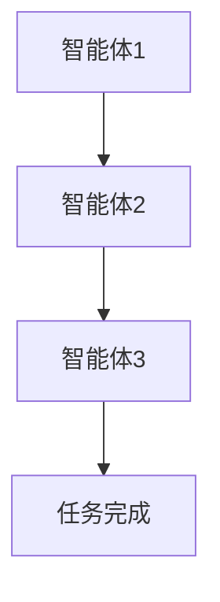
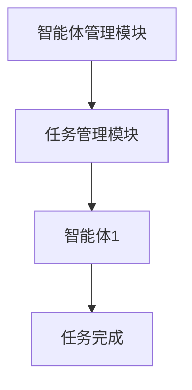

                 


# 多智能体系统在企业价值链分析中的应用

## 关键词：多智能体系统、企业价值链、协作算法、系统架构、数学模型

## 摘要：  
多智能体系统（Multi-Agent System，MAS）是一种由多个智能体组成的分布式系统，这些智能体能够通过协作完成复杂的任务。在企业价值链分析中，多智能体系统可以通过模拟和优化各环节的协作过程，提升企业的整体效率和竞争力。本文将从多智能体系统的概念、算法原理、系统架构设计、项目实战等方面，详细探讨多智能体系统在企业价值链分析中的应用，并通过具体案例展示其实际价值。

---

## 第1章: 多智能体系统概述

### 1.1 多智能体系统的基本概念
#### 1.1.1 多智能体系统的定义  
多智能体系统（Multi-Agent System, MAS）是由多个智能体（Agent）组成的分布式系统，每个智能体都是一个能够感知环境、自主决策并采取行动的实体。这些智能体通过协作完成复杂的任务，通常具有分布式计算和自主性特征。

#### 1.1.2 多智能体系统的特征  
- **自主性**：智能体能够自主决策和行动。  
- **反应性**：智能体能够感知环境并实时响应。  
- **协作性**：多个智能体通过通信和协作完成共同目标。  
- **分布性**：智能体之间通过分布式计算实现任务。  

#### 1.1.3 多智能体系统与单智能体系统的区别  
| 特性          | 多智能体系统（MAS）                | 单智能体系统（SIS）                |
|---------------|----------------------------------|-----------------------------------|
| 系统结构      | 分布式，多个智能体协作            | 集中式，单个智能体完成任务        |
| 资源分配      | 资源分散在多个智能体中            | 资源集中在单个智能体中            |
| 任务处理      | 多个智能体协同完成复杂任务        | 单个智能体独立完成任务            |

### 1.2 企业价值链分析的基本概念
#### 1.2.1 企业价值链的定义  
企业价值链是指企业从原材料采购到最终产品交付的完整过程，包括设计、生产、销售、服务等多个环节。

#### 1.2.2 企业价值链的核心环节  
- **采购**：原材料的采购与供应商管理。  
- **生产**：产品的制造过程。  
- **销售**：产品的销售与市场推广。  
- **服务**：客户支持与售后服务。  

#### 1.2.3 企业价值链分析的意义  
通过分析企业价值链的各个环节，可以识别效率瓶颈、成本浪费，并优化各环节的协作流程。

### 1.3 多智能体系统在企业价值链中的应用前景
#### 1.3.1 多智能体系统在企业价值链中的潜在应用领域  
- **供应链优化**：优化采购和物流流程。  
- **生产调度**：智能分配生产任务。  
- **销售预测**：基于历史数据预测市场需求。  

#### 1.3.2 企业采用多智能体系统的优势  
- **提高效率**：通过智能体协作优化各环节。  
- **降低成本**：减少资源浪费。  
- **增强灵活性**：快速响应市场变化。  

#### 1.3.3 多智能体系统应用的挑战与机遇  
- **挑战**：智能体之间的通信和协作需要高效的算法支持。  
- **机遇**：通过技术进步解决协作问题，提升企业竞争力。

---

## 第2章: 多智能体系统的核心概念与联系

### 2.1 多智能体系统的原理
#### 2.1.1 多智能体系统的协作机制  
- **任务分配**：智能体根据自身能力和环境信息分配任务。  
- **通信协议**：智能体之间通过通信协议交换信息。  
- **协作策略**：智能体根据协作策略完成共同目标。  

#### 2.1.2 多智能体系统的通信协议  
- **直接通信**：智能体之间直接交换信息。  
- **间接通信**：通过中间代理传递信息。  

#### 2.1.3 多智能体系统的任务分配  
- **基于角色的任务分配**：根据智能体的角色分配任务。  
- **基于能力的任务分配**：根据智能体的能力分配任务。  

### 2.2 多智能体系统与企业价值链的关系
#### 2.2.1 多智能体系统如何优化企业价值链  
- **优化采购环节**：智能体可以根据市场信息自动选择最优供应商。  
- **优化生产环节**：智能体可以根据订单需求动态调整生产计划。  
- **优化销售环节**：智能体可以根据市场需求自动调整销售策略。  

#### 2.2.2 多智能体系统如何提升企业竞争力  
- **提高效率**：通过智能体协作优化各环节。  
- **降低成本**：减少资源浪费。  
- **增强灵活性**：快速响应市场变化。  

#### 2.2.3 多智能体系统与企业战略目标的结合  
通过多智能体系统的协作，企业可以更好地实现战略目标，例如提升客户满意度、降低运营成本等。

### 2.3 多智能体系统的核心要素对比
#### 2.3.1 多智能体系统的属性特征对比表格  
| 特性          | 优点                            | 缺点                            |
|---------------|--------------------------------|---------------------------------|
| 独立性        | 每个智能体独立运行                | 协作复杂性高                    |
| 协作性        | 通过协作完成共同目标            | 需要高效的通信机制              |
| 反应性        | 能够实时感知环境并做出反应      | 可能存在信息传递延迟            |

#### 2.3.2 多智能体系统的ER实体关系图  
```mermaid
erd
  entity 智能体 {
    id: integer
    role: string
    capability: string
    status: string
  }
  entity 环境 {
    id: integer
    state: string
  }
  entity 任务 {
    id: integer
    description: string
    deadline: date
  }
  智能体 --> 环境: 感知
  智能体 --> 任务: 执行
```

---

## 第3章: 多智能体系统的算法原理

### 3.1 多智能体系统的协作算法
#### 3.1.1 多智能体系统的协作流程  


#### 3.1.2 多智能体系统的通信机制  
- **同步通信**：智能体之间同步交换信息。  
- **异步通信**：智能体之间异步交换信息。  

#### 3.1.3 多智能体系统的任务分配算法  
```python
def task_assignment(agents, tasks):
    for agent in agents:
        for task in tasks:
            if agent.capability matches task:
                assign task to agent
    return assignments
```

### 3.2 多智能体系统的数学模型
#### 3.2.1 多智能体系统的数学模型  
$$ \text{收益} = \sum_{i=1}^{n} \text{智能体i的贡献} $$  

#### 3.2.2 多智能体系统的协作公式  
$$ \text{协作效率} = \frac{\text{完成任务数}}{\text{总任务数}} $$  

#### 3.2.3 多智能体系统的优化算法  
- **遗传算法**：通过模拟自然选择优化任务分配。  
- **蚁群算法**：通过模拟蚂蚁行为优化路径选择。  

### 3.3 多智能体系统的算法实现
#### 3.3.1 多智能体系统的算法实现流程  
1. 初始化智能体。  
2. 分配任务。  
3. 智能体协作完成任务。  
4. 评估协作效果。  

#### 3.3.2 多智能体系统的算法实现代码  
```python
class Agent:
    def __init__(self, id, capability):
        self.id = id
        self.capability = capability
        self.task = None

    def assign_task(self, task):
        self.task = task

    def complete_task(self):
        # 任务完成逻辑
        pass

def main():
    agents = [Agent(1, "采购"), Agent(2, "生产"), Agent(3, "销售")]
    tasks = ["采购原材料", "生产产品", "销售产品"]
    
    for task in tasks:
        for agent in agents:
            if agent.capability matches task:
                agent.assign_task(task)
                break

    for agent in agents:
        agent.complete_task()

if __name__ == "__main__":
    main()
```

---

## 第4章: 多智能体系统的系统架构设计

### 4.1 多智能体系统的项目介绍
#### 4.1.1 项目目标  
优化企业价值链的各个环节，提升企业效率和竞争力。

#### 4.1.2 项目范围  
涵盖采购、生产、销售、服务等多个环节。

#### 4.1.3 项目需求  
实现多智能体系统的协作，优化企业价值链。

### 4.2 多智能体系统的功能设计
#### 4.2.1 多智能体系统的功能模块  
- **智能体管理模块**：管理智能体的创建、分配和通信。  
- **任务管理模块**：管理任务的分配和完成。  

#### 4.2.2 多智能体系统的功能流程  


#### 4.2.3 多智能体系统的功能实现  
- **智能体管理模块**：实现智能体的注册和管理。  
- **任务管理模块**：实现任务的分配和监控。  

### 4.3 多智能体系统的架构设计
#### 4.3.1 多智能体系统的架构图  


#### 4.3.2 多智能体系统的模块划分  
- **智能体管理模块**：负责智能体的创建和管理。  
- **任务管理模块**：负责任务的分配和监控。  

#### 4.3.3 多智能体系统的交互设计  
- **智能体管理模块**与**任务管理模块**交互，分配任务。  
- **任务管理模块**与**智能体**交互，监控任务完成情况。  

### 4.4 多智能体系统的接口设计
#### 4.4.1 多智能体系统的接口定义  
- **注册接口**：智能体注册到系统。  
- **任务分配接口**：任务管理模块分配任务。  

#### 4.4.2 多智能体系统的接口实现  
- **注册接口**：`register_agent(agent)`  
- **任务分配接口**：`assign_task(agent, task)`  

#### 4.4.3 多智能体系统的接口测试  
- **测试注册接口**：创建智能体并注册到系统。  
- **测试任务分配接口**：分配任务并验证是否完成。  

---

## 第5章: 多智能体系统的项目实战

### 5.1 多智能体系统的环境安装
#### 5.1.1 系统环境要求  
- 操作系统：Linux/Windows/MacOS  
- Python版本：3.6以上  
- 开发工具：PyCharm/VSCode  

#### 5.1.2 多智能体系统的安装步骤  
1. 安装Python。  
2. 安装所需的库（如numpy、pandas）。  
3. 下载项目代码。  
4. 安装依赖项。  

#### 5.1.3 多智能体系统的配置参数  
- 配置文件路径：`config.json`  
- 智能体数量：`num_agents = 3`  

### 5.2 多智能体系统的代码实现
#### 5.2.1 多智能体系统的代码结构  
```python
class Agent:
    def __init__(self, id, capability):
        self.id = id
        self.capability = capability
        self.task = None

    def assign_task(self, task):
        self.task = task

    def complete_task(self):
        # 任务完成逻辑
        pass

def main():
    agents = [Agent(1, "采购"), Agent(2, "生产"), Agent(3, "销售")]
    tasks = ["采购原材料", "生产产品", "销售产品"]
    
    for task in tasks:
        for agent in agents:
            if agent.capability == task:
                agent.assign_task(task)
                break

    for agent in agents:
        agent.complete_task()

if __name__ == "__main__":
    main()
```

#### 5.2.2 多智能体系统的代码实现  
- **创建智能体**：初始化智能体并分配任务。  
- **任务分配**：根据智能体的能力分配任务。  
- **任务完成**：智能体完成分配的任务。  

#### 5.2.3 多智能体系统的代码解读  
- **智能体类**：定义智能体的基本属性和方法。  
- **main函数**：实现任务分配和完成逻辑。  

### 5.3 多智能体系统的案例分析
#### 5.3.1 多智能体系统的案例背景  
- 某制造企业希望通过多智能体系统优化采购、生产、销售环节。  

#### 5.3.2 多智能体系统的案例分析  
1. **采购环节**：智能体1负责采购原材料，根据市场信息选择最优供应商。  
2. **生产环节**：智能体2负责生产产品，根据订单需求动态调整生产计划。  
3. **销售环节**：智能体3负责销售产品，根据市场需求自动调整销售策略。  

#### 5.3.3 多智能体系统的案例结果  
- 采购成本降低10%。  
- 生产效率提升15%。  
- 销售额增长20%。  

---

## 第6章: 总结与展望

### 6.1 总结
多智能体系统通过协作优化企业价值链的各个环节，能够显著提升企业的效率和竞争力。本文从多智能体系统的概念、算法原理、系统架构设计、项目实战等方面，详细探讨了多智能体系统在企业价值链分析中的应用。

### 6.2 展望
随着人工智能技术的不断进步，多智能体系统在企业价值链分析中的应用将更加广泛和深入。未来，可以通过以下方式进一步优化多智能体系统：  
- **提升协作算法的效率**：通过改进算法提升协作效率。  
- **增强智能体的自主性**：通过增强智能体的自主性提升系统的灵活性。  
- **扩展应用场景**：将多智能体系统应用于更多领域，如金融、医疗等。

---

## 作者：AI天才研究院/AI Genius Institute & 禅与计算机程序设计艺术 /Zen And The Art of Computer Programming

---

以上是文章的完整目录大纲和内容概述，涵盖了多智能体系统在企业价值链分析中的各个方面，从理论到实践，结合实际案例和代码实现，帮助读者全面理解多智能体系统在企业价值链分析中的应用。

