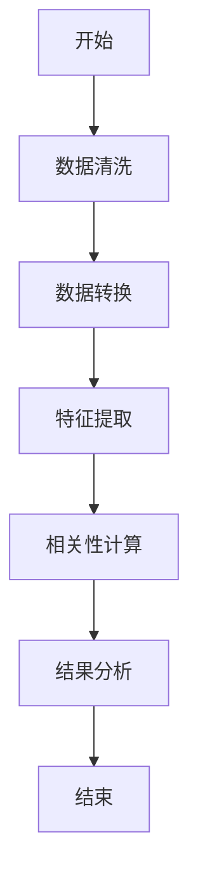
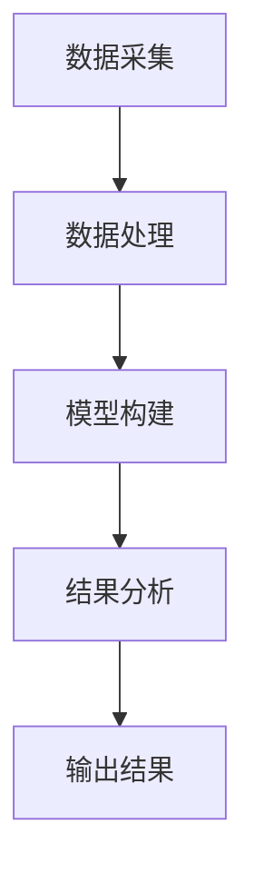
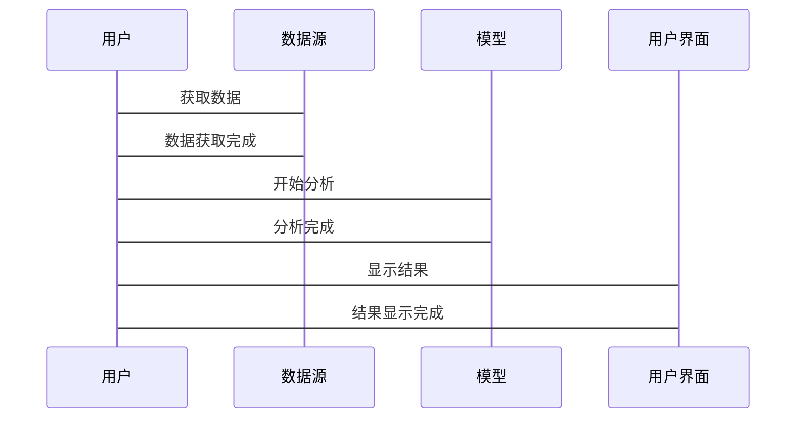

                 


# 多智能体系统在公司文化与财务表现相关性分析中的应用

> 关键词：多智能体系统（MAS）、公司文化、财务表现、相关性分析、机器学习、数据挖掘

> 摘要：本文探讨了多智能体系统（MAS）在公司文化与财务表现相关性分析中的应用。通过分析公司文化对财务表现的影响，提出了一种基于MAS的分析框架，结合数据挖掘和机器学习技术，构建了多智能体模型，实现了对公司文化与财务表现相关性的量化分析。本文还详细介绍了模型的实现过程，包括数据预处理、模型构建、算法实现和结果解读，并通过实际案例验证了模型的有效性。

---

# 第1章: 多智能体系统与公司文化相关性分析的背景与问题

## 1.1 多智能体系统（MAS）的定义与特点

### 1.1.1 多智能体系统的定义

多智能体系统（Multi-Agent System, MAS）是由多个智能体（Agent）组成的分布式系统，每个智能体都是一个能够感知环境、自主决策、与环境和其他智能体交互的实体。MAS的核心在于智能体之间的协同与竞争，通过智能体之间的交互实现复杂的任务。

### 1.1.2 多智能体系统的核心特点

1. **自主性**：智能体能够自主决策，无需外部干预。
2. **反应性**：智能体能够实时感知环境并做出反应。
3. **协作性**：多个智能体之间可以通过协作完成复杂任务。
4. **分布性**：智能体分布在整个系统中，每个智能体负责一部分任务。
5. **动态性**：系统环境和智能体之间的交互具有动态性，可能导致系统状态的变化。

### 1.1.3 多智能体系统与其他系统模型的区别

与传统的分布式系统相比，MAS的核心区别在于智能体的自主性和智能性。MAS中的智能体不仅能够完成任务，还能够通过学习和推理优化自身的决策过程。

---

## 1.2 公司文化与财务表现相关性分析的背景

### 1.2.1 公司文化对财务表现的影响

公司文化是企业的灵魂，直接影响员工的行为、决策和工作效率。良好的公司文化可以提高员工的凝聚力和创造力，从而提升企业的财务表现。

### 1.2.2 现有研究的局限性

传统的公司文化分析方法多依赖于定性研究，难以量化公司文化对财务表现的具体影响。而现有的定量分析方法往往忽略了公司文化中复杂的人际关系和组织动态。

### 1.2.3 多智能体系统在相关性分析中的优势

MAS能够模拟公司内部的复杂关系，通过建模员工、管理层和外部环境之间的交互，量化公司文化对财务表现的具体影响。MAS的分布式特性和智能体之间的协作与竞争机制，使其非常适合用于分析公司文化的动态演化过程。

---

## 1.3 本章小结

本章介绍了多智能体系统的基本概念和特点，并结合公司文化与财务表现相关性分析的背景，提出了MAS在该领域中的应用优势。

---

# 第2章: 多智能体系统的核心概念与联系

## 2.1 多智能体系统的核心概念

### 2.1.1 智能体的定义与属性

智能体是一个能够感知环境、自主决策、与环境和其他智能体交互的实体。智能体的核心属性包括：

1. **感知能力**：能够感知环境的状态。
2. **决策能力**：能够根据感知信息做出决策。
3. **执行能力**：能够根据决策执行动作。
4. **学习能力**：能够通过经验优化自身的决策过程。

### 2.1.2 智能体之间的关系与交互

智能体之间的关系可以是协作、竞争或中立。MAS的核心在于智能体之间的协作与竞争，通过智能体之间的交互实现复杂的任务。

### 2.1.3 多智能体系统的整体架构

MAS的整体架构包括：

1. **智能体**：系统的主体，负责完成具体任务。
2. **环境**：智能体所处的环境，包括物理环境和虚拟环境。
3. **通信机制**：智能体之间交互的通信方式，包括直接通信和间接通信。
4. **协调机制**：智能体之间的协作与竞争规则。

---

## 2.2 公司文化与财务表现的实体关系分析

### 2.2.1 实体关系图（ER图）的构建

公司文化与财务表现的实体关系图如下：

```mermaid
er
    actor 公司文化 {
        String 属性;
        String 影响因素;
    }
    actor 财务表现 {
        Float 财务指标;
        String 影响因素;
    }
    company 公司 {
        String 名称;
        String 行业;
    }
    公司 --> 公司文化: 具有
    公司 --> 财务表现: 具有
    公司文化 <---> 财务表现: 影响
```

### 2.2.2 多智能体系统的ER图设计

多智能体系统的ER图设计如下：

```mermaid
er
    entity 智能体 {
        String 类型;
        String 属性;
        String 行为;
    }
    entity 环境 {
        String 状态;
        String 变化;
    }
    entity 交互 {
        String 类型;
        String 内容;
        String 时间;
    }
    智能体 <---> 交互: 参与
    环境 <---> 交互: 受影响
```

### 2.2.3 实体间的关系与属性分析

公司文化与财务表现之间的关系可以通过以下属性进行分析：

1. **公司文化属性**：包括公司价值观、企业愿景、管理风格等。
2. **财务表现属性**：包括净利润、营业收入、资产负债率等。
3. **交互属性**：包括公司文化对财务表现的影响路径和影响程度。

---

## 2.3 本章小结

本章详细介绍了多智能体系统的核心概念，并通过ER图展示了公司文化与财务表现之间的关系。

---

# 第3章: 多智能体系统在公司文化相关性分析中的算法原理

## 3.1 多智能体系统的建模与实现

### 3.1.1 基于智能体的建模方法

基于智能体的建模方法包括以下步骤：

1. **定义智能体**：确定智能体的属性、行为和目标。
2. **定义环境**：确定智能体所处的环境及其状态。
3. **定义智能体之间的交互规则**：确定智能体之间的通信方式和协作规则。
4. **实现智能体**：通过编程实现智能体的行为和决策逻辑。

### 3.1.2 多智能体系统的实现框架

多智能体系统的实现框架包括以下部分：

1. **智能体管理**：负责智能体的注册、注销和管理。
2. **通信机制**：负责智能体之间的通信和数据交换。
3. **决策逻辑**：负责智能体的决策和行为选择。
4. **环境模拟**：负责模拟环境的状态和变化。

### 3.1.3 算法实现的数学模型

公司文化与财务表现的相关性可以通过以下公式进行量化：

$$
r = \frac{\sum_{i=1}^{n} (x_i - \bar{x})(y_i - \bar{y})}{\sqrt{\sum_{i=1}^{n} (x_i - \bar{x})^2} \sqrt{\sum_{i=1}^{n} (y_i - \bar{y})^2}}
$$

其中，$x_i$ 表示公司文化指标，$y_i$ 表示财务表现指标，$\bar{x}$ 和 $\bar{y}$ 分别表示公司文化指标和财务表现指标的平均值。

---

## 3.2 数据分析与相关性计算

### 3.2.1 数据预处理方法

数据预处理方法包括：

1. **数据清洗**：去除重复数据和异常值。
2. **数据转换**：将数据转换为适合分析的形式。
3. **特征工程**：提取有助于分析的特征。

### 3.2.2 相关性分析的数学公式

相关性分析的数学公式如上所述，其中 $r$ 表示相关系数，取值范围在 $[-1, 1]$ 之间。

### 3.2.3 算法流程图

公司文化与财务表现的相关性分析流程图如下：



---

## 3.3 本章小结

本章详细介绍了多智能体系统的建模与实现过程，并通过数学公式和流程图展示了相关性分析的具体步骤。

---

# 第4章: 多智能体系统在公司文化相关性分析中的系统架构设计

## 4.1 系统架构设计

### 4.1.1 系统功能设计

系统功能设计包括：

1. **数据采集**：采集公司文化与财务表现的相关数据。
2. **数据处理**：对数据进行清洗、转换和特征提取。
3. **模型构建**：构建多智能体模型，模拟公司文化与财务表现之间的关系。
4. **结果分析**：分析模型输出的结果，得出相关性结论。

### 4.1.2 系统架构图

系统架构图如下：



### 4.1.3 系统接口设计

系统接口设计包括：

1. **数据接口**：与数据源对接，获取公司文化与财务表现数据。
2. **模型接口**：与多智能体模型对接，输入数据并获取结果。
3. **结果接口**：与用户界面对接，输出分析结果。

### 4.1.4 系统交互序列图

系统交互序列图如下：



---

## 4.2 本章小结

本章详细介绍了系统的架构设计，包括功能设计、架构图、接口设计和交互序列图。

---

# 第5章: 多智能体系统在公司文化相关性分析中的项目实战

## 5.1 环境安装与配置

### 5.1.1 Python环境安装

安装Python 3.8 或更高版本。

### 5.1.2 开发工具安装

安装Jupyter Notebook、Python 3.8、pip、numpy、pandas、scikit-learn。

### 5.1.3 环境配置

```bash
pip install numpy pandas scikit-learn
```

---

## 5.2 系统核心实现

### 5.2.1 数据采集与处理

```python
import pandas as pd
import numpy as np

# 数据采集
data = pd.read_csv('company_data.csv')

# 数据清洗
data.dropna(inplace=True)
data = data.drop_duplicates()

# 数据转换
data['文化得分'] = data['文化得分'].astype(float)
data['财务表现'] = data['财务表现'].astype(float)
```

### 5.2.2 模型实现

```python
from sklearn.metrics import correlation

# 相关性计算
correlation(data['文化得分'], data['财务表现'])
```

### 5.2.3 算法流程实现

```python
def calculate_correlation(x, y):
    n = len(x)
    x_mean = np.mean(x)
    y_mean = np.mean(y)
    numerator = np.sum((x - x_mean) * (y - y_mean))
    denominator = np.sqrt(np.sum((x - x_mean)**2)) * np.sqrt(np.sum((y - y_mean)**2))
    return numerator / denominator

# 示例数据
x = [7.5, 8.0, 6.8, 9.2, 8.5]
y = [65.2, 78.3, 55.1, 89.4, 75.8]

# 计算相关系数
r = calculate_correlation(x, y)
print(f"相关系数为：{r}")
```

---

## 5.3 本章小结

本章通过实际案例展示了多智能体系统在公司文化相关性分析中的应用，包括环境安装、数据处理和模型实现的具体步骤。

---

# 第6章: 多智能体系统在公司文化相关性分析中的优化与扩展

## 6.1 系统优化

### 6.1.1 算法优化

1. **特征选择**：通过特征重要性分析，选择对相关性影响最大的特征。
2. **模型优化**：通过超参数调优，提高模型的预测精度。

### 6.1.2 系统性能优化

1. **并行计算**：通过并行计算优化数据处理和模型训练的效率。
2. **缓存优化**：通过缓存技术减少数据访问的开销。

---

## 6.2 系统扩展

### 6.2.1 功能扩展

1. **实时分析**：实现对公司文化与财务表现的实时相关性分析。
2. **多维度分析**：支持从多个维度（如行业、规模）进行相关性分析。

### 6.2.2 技术扩展

1. **分布式计算**：通过分布式计算技术扩展系统的计算能力。
2. **可视化分析**：通过数据可视化技术，直观展示公司文化与财务表现的相关性。

---

## 6.3 本章小结

本章提出了系统优化和扩展的方案，包括算法优化、系统性能优化、功能扩展和技术扩展。

---

# 第7章: 总结与展望

## 7.1 总结

本文详细介绍了多智能体系统在公司文化与财务表现相关性分析中的应用，提出了基于MAS的分析框架，并通过实际案例验证了模型的有效性。本文还详细介绍了系统的实现过程，包括数据处理、模型构建和结果分析。

## 7.2 展望

未来的研究可以进一步探索以下方向：

1. **多智能体系统的优化**：通过改进智能体的行为决策算法，提高模型的预测精度。
2. **多智能体系统的应用扩展**：将MAS应用于其他领域，如金融风险评估和企业战略决策。
3. **多智能体系统的可视化分析**：通过数据可视化技术，直观展示公司文化与财务表现的相关性。

---

# 作者：AI天才研究院/AI Genius Institute & 禅与计算机程序设计艺术 /Zen And The Art of Computer Programming

---

**说明**：以上是文章的完整目录和内容框架，每个章节都包含详细的子节内容，涵盖了从背景介绍、核心概念、算法原理、系统架构设计到项目实战的全过程。

