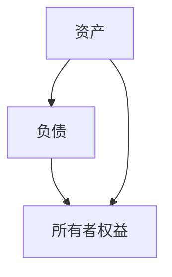

                 

# 彼得林奇对公司资产负债表的解读技巧

> 关键词：彼得林奇、资产负债表、财务分析、投资技巧、公司估值

> 摘要：本文详细解读了彼得·林奇如何通过分析公司资产负债表来评估公司财务健康状况和投资潜力。文章从资产负债表的基本概念、资产分析、负债分析、所有者权益分析、综合财务比率分析等方面展开，结合实际案例和数学模型，系统地阐述了彼得·林奇的财务分析方法和技巧。文章内容包括：背景介绍、核心概念与联系、算法原理、系统分析、项目实战、最佳实践等。

---

## 第1章: 公司资产负债表概述

### 1.1 资产负债表的基本概念

#### 1.1.1 资产负债表的定义与作用
- 资产负债表是公司财务报表的核心部分，反映公司在某一特定时点的资产、负债和所有者权益的状况。
- 通过资产负债表，投资者可以了解公司的财务健康状况，评估公司的偿债能力和经营效率。

#### 1.1.2 资产负债表的核心要素
- 资产：公司拥有的资源，包括流动资产（现金、应收账款、存货等）和非流动资产（固定资产、无形资产等）。
- 负债：公司欠款，包括流动负债（应付账款、短期借款等）和非流动负债（长期借款、债券等）。
- 所有者权益：公司净资产，等于资产减去负债。

#### 1.1.3 资产负债表的编制与披露要求
- 按照会计准则编制，确保数据真实、准确。
- 公司定期披露资产负债表，供投资者和债权人参考。

### 1.2 彼得·林奇的财务分析方法

#### 1.2.1 彼得·林奇的背景与投资理念
- 彼得·林奇是美国著名基金经理，以其独特的财务分析方法闻名。
- 他强调通过分析公司财务报表，尤其是资产负债表和利润表，来评估公司的投资价值。

#### 1.2.2 资产负债表在投资分析中的重要性
- 资产负债表是评估公司财务健康状况的核心工具。
- 通过分析资产负债表，投资者可以了解公司的资产结构、负债水平和所有者权益状况。

#### 1.2.3 彼得·林奇的财务分析框架
- 从资产、负债、所有者权益三方面入手，全面评估公司财务状况。
- 结合财务比率分析，判断公司盈利能力、偿债能力和成长潜力。

### 1.3 资产负债表的核心概念与联系

#### 1.3.1 资产、负债、所有者权益的概念对比
| 概念       | 定义                                                                 | 特点                     |
|------------|----------------------------------------------------------------------|--------------------------|
| 资产       | 公司拥有的资源，包括流动资产和非流动资产。                                | 可以用于公司运营和投资。 |
| 负债       | 公司欠款，包括流动负债和非流动负债。                                      | 需要偿还的债务。         |
| 所有者权益 | 公司净资产，等于资产减去负债。                                            | 表示公司资本的实力。     |

#### 1.3.2 资产负债表的ER实体关系图

#### 1.3.3 资产负债表的数学模型与公式
- 资产负债表的基本公式：
  $$ \text{资产} = \text{负债} + \text{所有者权益} $$
- 资产负债表的平衡关系：
  $$ \text{资产} - \text{负债} = \text{所有者权益} $$

---

## 第2章: 资产分析与解读技巧

### 2.1 资产的分类与定义

#### 2.1.1 流动资产的定义与特征
- 流动资产是指可以在一年内转化为现金的资产，包括现金、应收账款、存货等。
- 流动资产的流动性越高，公司应对短期债务的能力越强。

#### 2.1.2 非流动资产的定义与特征
- 非流动资产是指不能在一年内转化为现金的资产，包括固定资产、无形资产等。
- 非流动资产的流动性较低，但通常具有较高的价值。

#### 2.1.3 资产的流动性与周转率分析
- 流动性分析：通过流动比率（$$ \text{流动比率} = \frac{\text{流动资产}}{\text{流动负债}} $$）评估公司应对短期债务的能力。
- 周转率分析：通过存货周转率（$$ \text{存货周转率} = \frac{\text{成本 of goods sold}}{\text{平均存货}} $$）评估公司运营效率。

### 2.2 资产的结构分析

#### 2.2.1 资产结构的定义与重要性
- 资产结构是指公司流动资产和非流动资产的比例关系。
- 合理的资产结构可以降低公司的财务风险，提高运营效率。

#### 2.2.2 彼得·林奇的资产结构分析方法
- 通过分析流动资产和非流动资产的比例，判断公司资产的流动性风险。
- 重点关注存货和应收账款的占比，评估公司是否存在库存积压或账款回收困难的问题。

#### 2.2.3 资产结构与企业风险的关系
- 资产结构过于偏向流动资产可能导致公司资金闲置，影响投资回报。
- 资产结构过于偏向非流动资产可能导致公司流动性不足，面临财务风险。

### 2.3 资产质量分析

#### 2.3.1 资产质量的定义与评估指标
- 资产质量是指资产的变现能力、使用价值和管理效率。
- 评估资产质量的指标包括资产周转率、资产减值损失等。

#### 2.3.2 彼得·林奇的资产质量评估方法
- 通过分析资产周转率，评估公司资产的使用效率。
- 重点关注存货周转率和应收账款周转率，判断公司是否存在管理不善的问题。

#### 2.3.3 资产质量与企业盈利能力的关系
- 资产质量高，公司运营效率高，盈利能力强。
- 资产质量低，公司可能存在资源浪费，影响盈利能力。

### 2.4 资产分析的实战案例

#### 2.4.1 某公司资产结构分析实例
- 通过分析某公司的流动资产和非流动资产比例，判断其资产结构的合理性。
- 结合行业平均水平，评估公司是否存在流动性风险。

#### 2.4.2 案例分析中的资产质量评估
- 通过分析某公司的存货周转率和应收账款周转率，评估其资产质量。
- 结合公司经营环境和行业特点，判断资产质量的优劣。

### 2.5 本章小结

---

## 第3章: 负债分析与解读技巧

### 3.1 负债的分类与定义

#### 3.1.1 流动负债的定义与特征
- 流动负债是指公司在一年内需要偿还的债务，包括应付账款、短期借款等。
- 流动负债的偿还压力较大，影响公司的短期财务健康。

#### 3.1.2 非流动负债的定义与特征
- 非流动负债是指偿还期限超过一年的债务，包括长期借款、债券等。
- 非流动负债的偿还压力较小，但需要长期规划。

#### 3.1.3 负债的分类与比较
- 流动负债和非流动负债的分类对比：
  | 类别         | 定义                           | 特点                     |
  |--------------|--------------------------------|--------------------------|
  | 流动负债     | 一年内需要偿还的债务           | 偿还压力大，影响短期财务健康。 |
  | 非流动负债   | 一年以上需要偿还的债务         | 偿还压力小，影响长期财务健康。 |

### 3.2 负债的结构分析

#### 3.2.1 负债结构的定义与重要性
- 负债结构是指流动负债和非流动负债的比例关系。
- 合理的负债结构可以降低公司的财务风险，提高融资能力。

#### 3.2.2 彼得·林奇的负债结构分析方法
- 通过分析流动负债和非流动负债的比例，判断公司负债结构的合理性。
- 重点关注短期借款和长期借款的占比，评估公司是否存在短期偿债压力。

#### 3.2.3 负债结构与企业风险的关系
- 负债结构过于偏向流动负债可能导致公司短期偿债压力大，面临流动性风险。
- 负债结构过于偏向非流动负债可能导致公司融资成本高，影响资本结构优化。

### 3.3 负债质量分析

#### 3.3.1 负债质量的定义与评估指标
- 负债质量是指负债的期限、利率、偿付能力等。
- 评估负债质量的指标包括流动比率、速动比率等。

#### 3.3.2 彼得·林奇的负债质量评估方法
- 通过分析流动比率和速动比率，评估公司短期偿债能力。
- 重点关注流动负债中短期借款和应付账款的占比，判断公司是否存在偿债压力。

#### 3.3.3 负债质量与企业财务健康的关系
- 负债质量高，公司财务健康，融资能力强。
- 负债质量低，公司财务风险大，可能面临债务违约风险。

### 3.4 负债分析的实战案例

#### 3.4.1 某公司负债结构分析实例
- 通过分析某公司的流动负债和非流动负债比例，判断其负债结构的合理性。
- 结合行业平均水平，评估公司是否存在短期偿债压力。

#### 3.4.2 案例分析中的负债质量评估
- 通过分析某公司的流动比率和速动比率，评估其短期偿债能力。
- 结合公司经营环境和行业特点，判断负债质量的优劣。

### 3.5 本章小结

---

## 第4章: 所有者权益分析与解读技巧

### 4.1 所有者权益的定义与分类

#### 4.1.1 所有者权益的定义与特征
- 所有者权益是公司净资产，等于资产减去负债。
- 所有者权益包括股本、资本公积、盈余公积和未分配利润等。

#### 4.1.2 所有者权益的分类与比较
- 所有者权益的分类：
  | 类别         | 定义                           | 特点                     |
  |--------------|--------------------------------|--------------------------|
  | 股本         | 公司发行的普通股和优先股       | 公司的基本资本。         |
  | 资本公积     | 公司发行股票溢价形成的公积     | 补充公司资本。           |
  | 盈余公积     | 公司净利润形成的公积金         | 用于公司未来发展。       |
  | 未分配利润   | 尚未分配给股东的净利润         | 可用于未来分红或投资。   |

### 4.2 所有者权益的结构分析

#### 4.2.1 所有者权益结构的定义与重要性
- 所有者权益结构是指股本、资本公积、盈余公积和未分配利润的比例关系。
- 合理的权益结构可以优化资本结构，提高公司价值。

#### 4.2.2 彼得·林奇的所有者权益分析方法
- 通过分析所有者权益的构成，判断公司资本结构的合理性。
- 重点关注盈余公积和未分配利润的占比，评估公司未来的分红能力和投资能力。

#### 4.2.3 所有者权益结构与公司价值的关系
- 所有者权益结构合理，公司资本结构优化，价值高。
- 所有者权益结构不合理，公司可能面临资本不足或结构失衡的问题。

### 4.3 所有者权益质量分析

#### 4.3.1 所有者权益质量的定义与评估指标
- 所有者权益质量是指所有者权益的来源、分配和管理效率。
- 评估所有者权益质量的指标包括ROE（净资产收益率）、ROA（资产净利率）等。

#### 4.3.2 彼得·林奇的所有者权益质量评估方法
- 通过分析ROE和ROA，评估公司所有者权益的盈利能力。
- 重点关注净利润和所有者权益的关系，判断公司盈利能力是否稳定。

#### 4.3.3 所有者权益质量与公司成长性的关系
- 所有者权益质量高，公司盈利能力强，成长性好。
- 所有者权益质量低，公司盈利能力弱，成长性差。

### 4.4 所有者权益分析的实战案例

#### 4.4.1 某公司所有者权益结构分析实例
- 通过分析某公司所有者权益的构成，判断其权益结构的合理性。
- 结合行业平均水平，评估公司是否存在资本结构失衡的问题。

#### 4.4.2 案例分析中的所有者权益质量评估
- 通过分析某公司的ROE和ROA，评估其所有者权益的盈利能力。
- 结合公司经营环境和行业特点，判断所有者权益质量的优劣。

### 4.5 本章小结

---

## 第5章: 资产负债表的综合分析与财务比率分析

### 5.1 综合财务比率分析

#### 5.1.1 财务比率的定义与分类
- 财务比率是通过资产、负债和所有者权益的比值，评估公司财务状况的指标。
- 财务比率分为四类：流动性比率、偿债能力比率、运营效率比率和盈利能力比率。

#### 5.1.2 彼得·林奇的财务比率分析方法
- 通过计算流动比率、速动比率、存货周转率、应收账款周转率等指标，评估公司财务状况。
- 结合行业平均水平，判断公司财务比率的优劣。

#### 5.1.3 财务比率与公司价值的关系
- 财务比率高，公司财务健康，价值高。
- 财务比率低，公司财务风险大，价值低。

### 5.2 财务比率的数学模型与公式

#### 5.2.1 流动性比率
- 流动比率：
  $$ \text{流动比率} = \frac{\text{流动资产}}{\text{流动负债}} $$
- 速动比率：
  $$ \text{速动比率} = \frac{\text{速动资产}}{\text{流动负债}} $$

#### 5.2.2 偿债能力比率
- 负债比率：
  $$ \text{负债比率} = \frac{\text{负债}}{\text{资产}} $$
- 利息保障倍数：
  $$ \text{利息保障倍数} = \frac{\text{EBIT}}{\text{利息支出}} $$

#### 5.2.3 运营效率比率
- 存货周转率：
  $$ \text{存货周转率} = \frac{\text{成本 of goods sold}}{\text{平均存货}} $$
- 应收账款周转率：
  $$ \text{应收账款周转率} = \frac{\text{营业收入}}{\text{平均应收账款}} $$

#### 5.2.4 盈利能力比率
- 净资产收益率（ROE）：
  $$ \text{ROE} = \frac{\text{净利润}}{\text{所有者权益}} $$
- 资产净利率（ROA）：
  $$ \text{ROA} = \frac{\text{净利润}}{\text{资产}} $$

### 5.3 财务比率分析的实战案例

#### 5.3.1 某公司财务比率分析实例
- 通过计算某公司的流动比率、速动比率、存货周转率和应收账款周转率，评估其财务状况。
- 结合行业平均水平，判断公司财务比率的优劣。

#### 5.3.2 案例分析中的财务比率评估
- 通过分析某公司的ROE和ROA，评估其盈利能力。
- 结合公司经营环境和行业特点，判断公司财务比率的前景。

### 5.4 本章小结

---

## 第6章: 资产负债表分析的行业比较与投资策略

### 6.1 行业比较分析

#### 6.1.1 行业比较分析的定义与重要性
- 行业比较分析是指将某公司的财务状况与同行业其他公司进行比较，评估其行业地位。
- 行业比较分析有助于发现行业趋势和公司竞争优势。

#### 6.1.2 彼得·林奇的行业比较分析方法
- 通过比较同行业公司的资产负债表，评估公司的财务优势和劣势。
- 重点关注行业平均财务比率和公司财务比率的差异，判断公司行业地位。

#### 6.1.3 行业比较与公司投资价值的关系
- 行业比较分析可以帮助投资者发现低估的公司，提高投资收益。
- 行业比较分析可以识别行业风险，避免投资失败。

### 6.2 投资策略与资产负债表分析

#### 6.2.1 基于资产负债表的投资策略
- 通过分析资产负债表，寻找低估的公司，提高投资收益。
- 通过分析资产负债表，识别财务健康、成长性强的公司，降低投资风险。

#### 6.2.2 彼得·林奇的投资策略
- 重点关注公司资产负债表的稳健性，选择财务健康、成长性强的公司。
- 通过分析资产负债表，识别行业趋势和公司竞争优势，制定长期投资策略。

#### 6.2.3 资产负债表分析与投资组合管理
- 通过分析资产负债表，优化投资组合，降低投资风险。
- 通过分析资产负债表，及时调整投资策略，应对市场变化。

### 6.3 资产负债表分析的实战案例

#### 6.3.1 某行业公司资产负债表分析实例
- 通过比较某行业公司的资产负债表，评估公司的财务优势和劣势。
- 结合行业发展趋势，判断公司投资价值。

#### 6.3.2 案例分析中的投资策略制定
- 通过分析某公司的资产负债表，制定基于财务状况的投资策略。
- 结合公司经营环境和行业特点，调整投资组合，优化投资收益。

### 6.4 本章小结

---

## 第7章: 资产负债表分析的实战技巧与案例

### 7.1 资产负债表分析的实战技巧

#### 7.1.1 资产负债表分析的步骤与方法
- 收集公司财务报表，获取资产负债表数据。
- 分析资产、负债、所有者权益的结构和质量，评估公司财务健康状况。
- 计算财务比率，比较行业平均水平，判断公司投资价值。

#### 7.1.2 资产负债表分析的注意事项
- 注意公司财务报表的注释和附注，了解财务数据的背景和细节。
- 注意行业特点和公司经营环境，结合宏观经济发展趋势，评估公司财务状况。

#### 7.1.3 资产负债表分析的工具与资源
- 财务报表分析工具：Excel、财务分析软件等。
- 数据来源：公司财报、行业报告、财务分析网站等。

### 7.2 资产负债表分析的案例分析

#### 7.2.1 某公司资产负债表分析实例
- 收集某公司最近几年的资产负债表数据，分析其资产、负债、所有者权益的变化趋势。
- 计算关键财务比率，比较行业平均水平，评估公司财务状况。
- 结合公司经营环境和行业特点，判断公司投资价值。

#### 7.2.2 案例分析中的问题与解决方案
- 通过分析某公司资产负债表，发现其资产质量下降，负债结构不合理。
- 提出优化资产结构和负债结构的建议，帮助公司改善财务状况。

### 7.3 本章小结

---

## 第8章: 总结与展望

### 8.1 本章总结
- 本文系统地介绍了彼得·林奇如何通过分析公司资产负债表来评估公司财务健康状况和投资潜力。
- 通过详细讲解资产负债表的核心概念、资产分析、负债分析、所有者权益分析、综合财务比率分析和行业比较分析，帮助投资者掌握彼得·林奇的财务分析方法和技巧。

### 8.2 未来展望
- 随着金融市场的不断发展，资产负债表分析将更加重要。
- 未来，投资者需要更加关注公司财务报表的细节，结合宏观经济环境和行业发展趋势，制定更加科学的投资策略。

---

## 附录

### 附录A: 资产负债表术语表

### 附录B: 财务比率公式汇总

### 附录C: 财务分析工具推荐

### 附录D: 扩展阅读与参考文献

---

## 作者信息

作者：AI天才研究院/AI Genius Institute & 禅与计算机程序设计艺术 /Zen And The Art of Computer Programming

