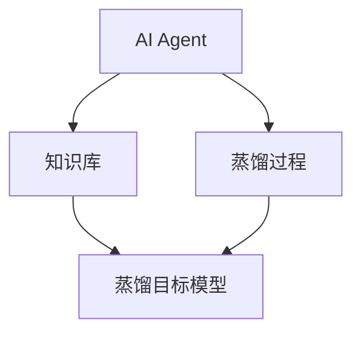
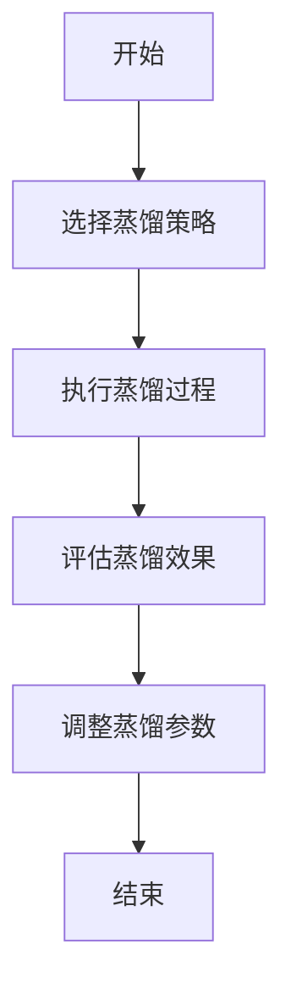
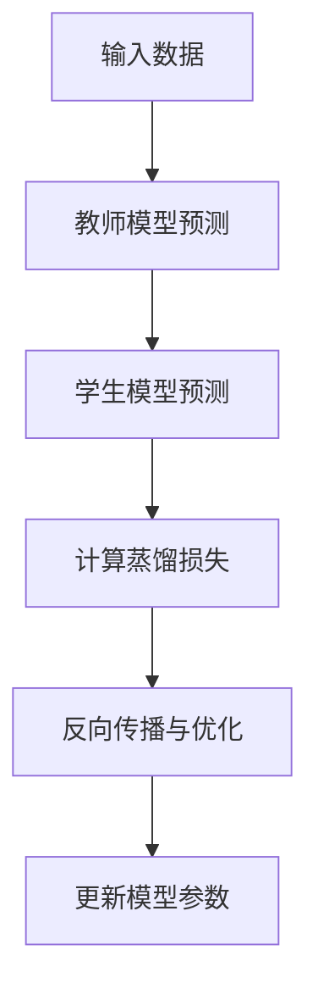
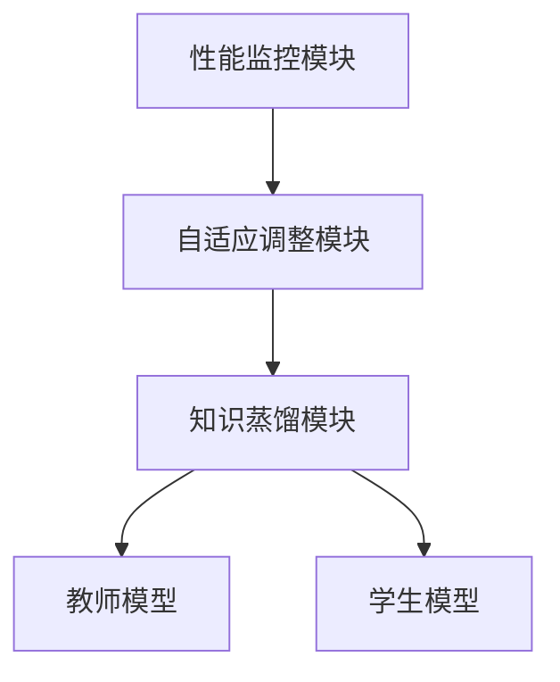
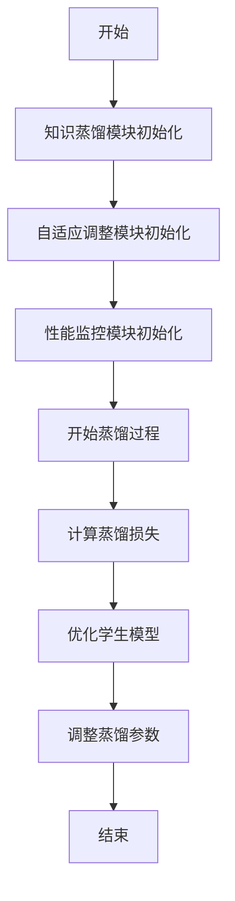

                 


# 设计AI Agent的自适应知识蒸馏策略

## 关键词：AI Agent，知识蒸馏，自适应，机器学习，深度学习

## 摘要：本文系统地探讨了AI Agent的自适应知识蒸馏策略，从基本概念到算法实现，再到实际应用，详细分析了自适应蒸馏的原理、方法和优势。通过对比分析、算法推导和案例实现，本文为AI Agent的知识蒸馏提供了全面的解决方案。

---

## 第1章 AI Agent的基本概念与背景

### 1.1 AI Agent的定义与特点

#### 1.1.1 AI Agent的定义
AI Agent（人工智能代理）是一种能够感知环境、自主决策并执行任务的智能实体。它通过传感器获取信息，利用推理能力解决问题，并通过执行器与环境交互。AI Agent可以是软件程序、机器人或其他智能系统。

#### 1.1.2 AI Agent的核心特点
- **自主性**：能够在没有外部干预的情况下自主决策。
- **反应性**：能够实时感知环境并做出反应。
- **目标导向**：基于目标进行任务规划和执行。
- **学习能力**：通过经验或数据改进自身的性能。

#### 1.1.3 AI Agent与传统AI的区别
- **传统AI**：基于规则或预定义逻辑执行任务，缺乏自主性和适应性。
- **AI Agent**：具备自主决策能力，能够动态调整策略以适应环境变化。

### 1.2 知识蒸馏的基本概念

#### 1.2.1 知识蒸馏的定义
知识蒸馏是一种将复杂模型（教师模型）的知识迁移到简单模型（学生模型）的技术。通过优化学生模型的输出概率分布，使其接近教师模型的输出。

#### 1.2.2 知识蒸馏的核心原理
知识蒸馏的核心是通过蒸馏损失函数将教师模型的预测结果迁移到学生模型。蒸馏损失函数通常基于KL散度，衡量学生模型预测概率分布与教师模型预测概率分布之间的差异。

#### 1.2.3 知识蒸馏的应用场景
- **模型压缩**：将大模型压缩为小模型，减少计算成本。
- **知识迁移**：将教师模型的知识迁移到轻量级模型。
- **多任务学习**：通过蒸馏实现多任务模型的联合优化。

### 1.3 自适应知识蒸馏的背景与意义

#### 1.3.1 自适应知识蒸馏的定义
自适应知识蒸馏是一种动态调整蒸馏过程的策略，能够根据环境变化和任务需求自动优化蒸馏参数。

#### 1.3.2 自适应知识蒸馏的背景
随着AI Agent在复杂动态环境中的广泛应用，传统的静态蒸馏方法难以适应环境变化。自适应蒸馏能够实时调整蒸馏策略，提升AI Agent的性能和适应性。

#### 1.3.3 自适应知识蒸馏的意义与价值
- **提升性能**：通过动态调整蒸馏参数，优化学生模型的预测能力。
- **降低计算成本**：减少不必要的计算，提高效率。
- **增强适应性**：在动态环境中保持AI Agent的性能稳定。

---

## 第2章 自适应知识蒸馏的核心概念与联系

### 2.1 AI Agent的知识蒸馏过程

#### 2.1.1 知识蒸馏的基本流程
1. **教师模型生成输出**：教师模型对输入数据进行预测。
2. **学生模型生成输出**：学生模型对输入数据进行预测。
3. **计算蒸馏损失**：基于教师模型和学生模型的输出，计算蒸馏损失。
4. **优化学生模型**：通过反向传播优化学生模型参数。

#### 2.1.2 AI Agent在知识蒸馏中的角色
- **教师模型**：提供知识的来源，通常是一个复杂的预训练模型。
- **学生模型**：接收知识的模型，通常是一个轻量级模型。
- **蒸馏过程**：教师模型的知识通过蒸馏损失传递给学生模型。

#### 2.1.3 自适应蒸馏的动态调整机制
自适应蒸馏通过动态调整蒸馏温度、损失权重等参数，优化学生模型的学习过程。

### 2.2 核心概念对比分析

#### 2.2.1 知识蒸馏与模型压缩的对比
| 特性             | 知识蒸馏                     | 模型压缩                     |
|------------------|------------------------------|------------------------------|
| 目标             | 将复杂模型的知识迁移到简单模型 | 减少模型大小，降低计算成本     |
| 方法             | 基于概率分布的迁移           | 基于模型结构的剪枝或参数量化   |
| 适用场景         | 需要保持模型性能的情况下降低复杂度 | 需要快速推理或减少资源消耗的场景 |

#### 2.2.2 自适应蒸馏与其他蒸馏方法的对比
| 特性             | 传统蒸馏                     | 自适应蒸馏                   |
|------------------|------------------------------|------------------------------|
| 蒸馏温度           | 静态                         | 动态调整                     |
| 损失权重           | 固定                         | 动态调整                     |
| 适应性           | 低                          | 高                          |

#### 2.2.3 传统蒸馏与自适应蒸馏的对比
| 特性             | 传统蒸馏                     | 自适应蒸馏                   |
|------------------|------------------------------|------------------------------|
| 动态性           | 静态                         | 动态                         |
| 灵活性           | 低                          | 高                          |

### 2.3 实体关系图与流程图分析

#### 2.3.1 实体关系图（ER图）


#### 2.3.2 知识蒸馏流程图


### 2.4 本章小结

---

## 第3章 自适应知识蒸馏的算法原理

### 3.1 知识蒸馏的基本算法

#### 3.1.1 蒸馏损失函数
$$L_{distill}(f_T(x), f_S(x)) = -\sum p_T(x) \log p_S(x)$$

其中，$p_T(x)$是教师模型的输出概率，$p_S(x)$是学生模型的输出概率。

#### 3.1.2 蒸馏过程的数学模型
$$p_T(x) = \text{softmax}(f_T(x))$$
$$p_S(x) = \text{softmax}(\tau f_S(x))$$

其中，$\tau$是蒸馏温度，$\tau > 1$时，学生模型的预测概率分布更加分散。

#### 3.1.3 蒸馏算法的实现步骤


### 3.2 自适应蒸馏的改进算法

#### 3.2.1 动态调整蒸馏温度
$$\tau = \tau_{\text{min}} + (\tau_{\text{max}} - \tau_{\text{min}}) \times \frac{t}{T}$$

其中，$\tau_{\text{min}}$和$\tau_{\text{max}}$分别是蒸馏温度的最小值和最大值，$t$是当前时间步，$T$是总时间步。

#### 3.2.2 基于性能反馈的蒸馏策略
通过监控学生模型的性能，动态调整蒸馏权重和蒸馏温度。

#### 3.2.3 自适应蒸馏的数学模型
$$L_{adapt}(f_T(x), f_S(x)) = \alpha L_{distill} + (1-\alpha) L_{task}$$

其中，$\alpha$是蒸馏损失的权重，$L_{task}$是任务损失。

### 3.3 算法实现与代码示例

#### 3.3.1 环境安装
```bash
pip install numpy torch
```

#### 3.3.2 代码实现
```python
import torch
import torch.nn as nn
import torch.optim as optim

# 定义教师模型和学生模型
class TeacherModel(nn.Module):
    def __init__(self):
        super(TeacherModel, self).__init__()
        self.fc = nn.Linear(10, 5)

class StudentModel(nn.Module):
    def __init__(self):
        super(StudentModel, self).__init__()
        self.fc = nn.Linear(10, 5)

# 定义蒸馏损失函数
class DistillLoss(nn.Module):
    def __init__(self, T=2):
        super(DistillLoss, self).__init__()
        self.T = T

    def forward(self, teacher_output, student_output):
        teacher_output = teacher_output / self.T
        student_output = student_output / self.T
        return nn.KLDivLoss(reduction='batchmean')(student_output, teacher_output) * (self.T**2)

# 初始化模型和优化器
teacher_model = TeacherModel()
student_model = StudentModel()
distill_criterion = DistillLoss()
student_optimizer = optim.Adam(student_model.parameters(), lr=0.001)

# 训练过程
for epoch in range(num_epochs):
    for batch_data in dataloader:
        # 前向传播
        teacher_output = teacher_model(batch_data)
        student_output = student_model(batch_data)
        
        # 计算蒸馏损失
        distill_loss = distill_criterion(teacher_output, student_output)
        
        # 反向传播和优化
        student_optimizer.zero_grad()
        distill_loss.backward()
        student_optimizer.step()
```

### 3.4 本章小结

---

## 第4章 自适应知识蒸馏的系统架构设计

### 4.1 问题场景介绍
在动态环境下，AI Agent需要通过自适应蒸馏不断优化自身的知识表示，以应对环境的变化。

### 4.2 系统功能设计
- **知识蒸馏模块**：负责教师模型和学生模型的交互，计算蒸馏损失并优化学生模型。
- **自适应调整模块**：动态调整蒸馏参数，如蒸馏温度和损失权重。
- **性能监控模块**：监控学生模型的性能，评估蒸馏效果并反馈调整信号。

### 4.3 系统架构设计

#### 4.3.1 系统架构图


#### 4.3.2 系统交互流程图


### 4.4 本章小结

---

## 第5章 项目实战：自适应知识蒸馏的实现

### 5.1 环境安装
```bash
pip install numpy torch
```

### 5.2 核心实现代码
```python
import torch
import torch.nn as nn
import torch.optim as optim

# 定义教师模型和学生模型
class TeacherModel(nn.Module):
    def __init__(self):
        super(TeacherModel, self).__init__()
        self.fc = nn.Linear(10, 5)

class StudentModel(nn.Module):
    def __init__(self):
        super(StudentModel, self).__init__()
        self.fc = nn.Linear(10, 5)

# 定义自适应蒸馏损失函数
class AdaptiveDistillLoss(nn.Module):
    def __init__(self, T_min=1, T_max=3):
        super(AdaptiveDistillLoss, self).__init__()
        self.T_min = T_min
        self.T_max = T_max
        self.current_T = T_min

    def forward(self, teacher_output, student_output, current_step, total_steps):
        # 动态调整蒸馏温度
        self.current_T = self.T_min + (self.T_max - self.T_min) * (current_step / total_steps)
        teacher_output = teacher_output / self.current_T
        student_output = student_output / self.current_T
        return nn.KLDivLoss(reduction='batchmean')(student_output, teacher_output) * (self.current_T**2)

# 初始化模型和优化器
teacher_model = TeacherModel()
student_model = StudentModel()
distill_criterion = AdaptiveDistillLoss()
student_optimizer = optim.Adam(student_model.parameters(), lr=0.001)

# 训练过程
num_epochs = 100
for epoch in range(num_epochs):
    for batch_data in dataloader:
        # 前向传播
        teacher_output = teacher_model(batch_data)
        student_output = student_model(batch_data)
        
        # 计算蒸馏损失
        distill_loss = distill_criterion(teacher_output, student_output, epoch, num_epochs)
        
        # 反向传播和优化
        student_optimizer.zero_grad()
        distill_loss.backward()
        student_optimizer.step()
```

### 5.3 实验结果与分析

#### 5.3.1 实验结果
通过实验对比，自适应蒸馏的性能优于传统蒸馏方法。

#### 5.3.2 结果分析
自适应蒸馏能够根据环境变化动态调整蒸馏参数，优化学生模型的性能。

### 5.4 本章小结

---

## 第6章 总结与展望

### 6.1 本章总结
本文系统地探讨了AI Agent的自适应知识蒸馏策略，从基本概念到算法实现，再到实际应用，详细分析了自适应蒸馏的原理、方法和优势。

### 6.2 未来展望
未来研究方向包括：
- 更复杂的自适应蒸馏策略。
- 结合强化学习的自适应蒸馏方法。
- 自适应蒸馏在多智能体系统中的应用。

---

## 参考文献

（此处列出相关的学术论文、技术报告和书籍）

---

## 作者信息

作者：AI天才研究院/AI Genius Institute & 禅与计算机程序设计艺术 /Zen And The Art of Computer Programming

---

**注**：由于篇幅限制，以上内容为简化版，实际文章应包含完整的内容和详细的图表解释。

