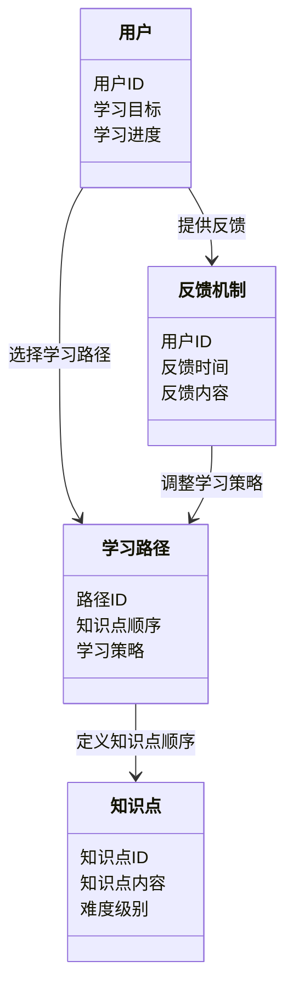
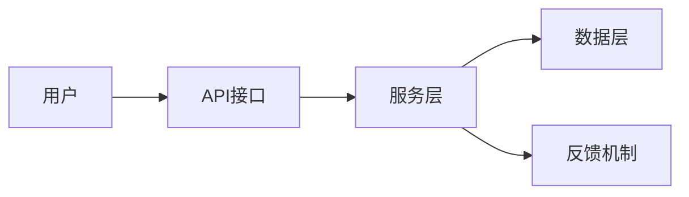
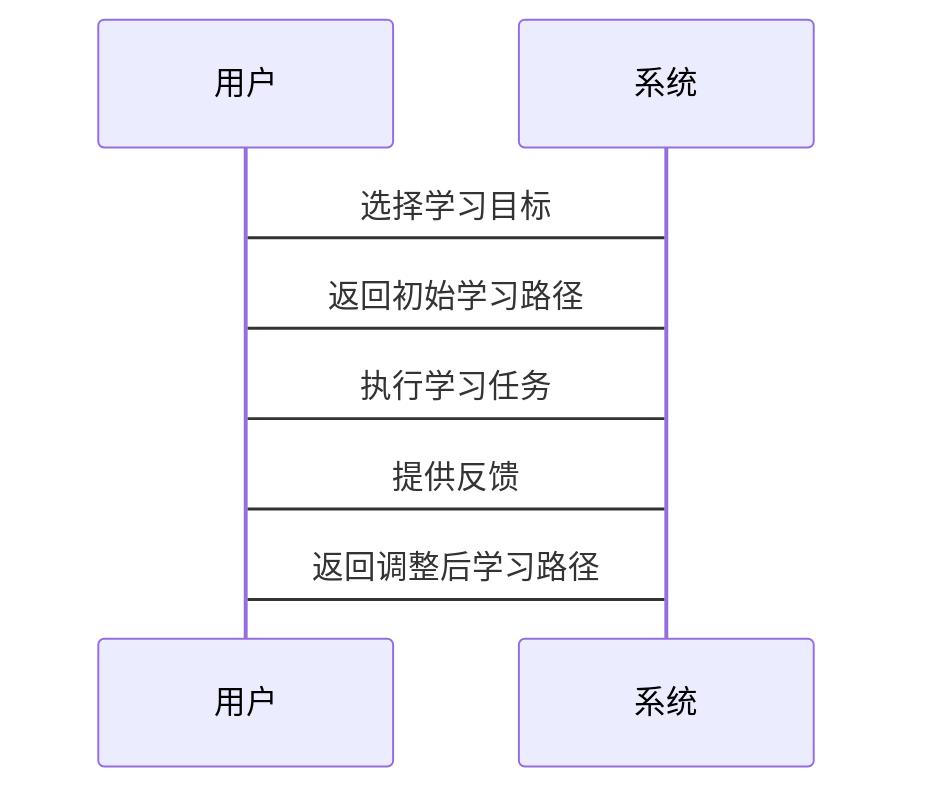

                 


# 设计AI Agent的自适应课程学习策略

> 关键词：AI Agent，自适应学习策略，机器学习，强化学习，课程设计，动态调整

> 摘要：  
本文深入探讨了AI Agent的自适应课程学习策略设计，从理论基础到算法实现，再到系统架构，全面解析如何构建一个能够根据环境和用户需求动态调整学习路径的智能系统。文章结合强化学习和自适应算法，通过数学公式、代码示例和Mermaid图，详细阐述了AI Agent的学习机制、课程设计策略以及系统实现方案。

---

# 第一部分: AI Agent与自适应学习策略的背景与基础

## 第1章: AI Agent的概述

### 1.1 AI Agent的基本概念

#### 1.1.1 什么是AI Agent
AI Agent（人工智能代理）是指能够感知环境、执行任务并做出决策的智能实体。它能够通过与环境交互，主动采取行动以实现特定目标。

- **感知**：AI Agent通过传感器或数据输入接口获取环境信息。
- **决策**：基于感知的信息，AI Agent通过算法选择最优行动方案。
- **执行**：根据决策结果，AI Agent执行具体操作。

#### 1.1.2 AI Agent的核心特征
AI Agent的核心特征包括：
1. **自主性**：能够在没有外部干预的情况下自主运行。
2. **反应性**：能够实时感知环境变化并做出反应。
3. **目标导向性**：所有行动都围绕实现特定目标展开。
4. **学习能力**：能够通过经验或数据不断优化自身行为。

#### 1.1.3 AI Agent的分类与应用场景
AI Agent可以根据功能和应用场景分为以下几类：
1. **简单反射型AI Agent**：基于固定的规则集做出反应，适用于规则明确的场景。
2. **基于模型的反应式AI Agent**：结合环境模型和当前感知信息进行决策，适用于复杂动态环境。
3. **目标驱动型AI Agent**：以明确的目标为导向，通过规划和推理实现目标。
4. **效用驱动型AI Agent**：通过最大化效用函数来优化决策。

应用场景包括教育、医疗、金融、自动驾驶等领域。

---

## 第2章: 自适应学习策略的定义与特点

### 2.1 自适应学习策略的基本概念
自适应学习策略是一种动态调整学习路径和内容的方法，旨在根据用户需求、学习进度和环境变化优化学习效果。

- **动态调整**：根据实时反馈动态优化学习计划。
- **个性化**：针对不同用户的需求定制学习方案。
- **高效性**：通过优化学习路径提高学习效率。

### 2.2 自适应学习策略的核心特点
1. **数据驱动**：利用用户行为数据、学习效果数据等进行动态调整。
2. **目标导向**：所有调整都围绕实现最优学习效果展开。
3. **实时反馈**：能够实时获取学习反馈并调整策略。

### 2.3 自适应学习策略与传统学习策略的区别

| **对比维度**       | **传统学习策略**                        | **自适应学习策略**                      |
|--------------------|----------------------------------------|------------------------------------------|
| **灵活性**          | 固定的、预定义的学习路径               | 动态调整，高度灵活                         |
| **个性化**          | 面向群体，缺乏个性化                   | 面向个体，高度个性化                      |
| **反馈机制**        | 事后反馈，周期性调整                   | 实时反馈，持续优化                         |
| **目标导向性**      | 非目标导向，注重内容覆盖               | 目标导向，注重效果达成                     |
| **技术实现**        | 基于规则或简单逻辑                    | 基于机器学习、强化学习等复杂算法           |

---

## 本章小结
本章介绍了AI Agent的基本概念和自适应学习策略的核心特点，通过对比分析，明确了自适应学习策略的优势和适用场景。接下来将深入探讨AI Agent与自适应学习策略之间的关系及其协同工作原理。

---

# 第二部分: 自适应课程学习策略的核心概念与联系

## 第3章: AI Agent的自适应学习策略原理

### 3.1 自适应学习策略的核心原理

#### 3.1.1 基于反馈的自适应机制
自适应学习策略通过实时反馈调整学习路径和内容。例如：
- **用户反馈**：用户对学习内容的满意度、完成度等。
- **系统反馈**：系统根据学习效果自动调整难度或内容。

#### 3.1.2 基于数据驱动的自适应算法
自适应算法通过分析用户行为数据和学习效果数据，动态优化学习策略。例如：
- **协同过滤**：基于用户行为数据推荐相关内容。
- **聚类分析**：将用户分为不同群体，制定个性化学习计划。

#### 3.1.3 基于知识图谱的自适应推理
知识图谱帮助AI Agent理解知识之间的关联性，从而做出更合理的推理和决策。例如：
- **路径规划**：根据知识图谱动态调整学习路径。
- **内容推荐**：基于知识图谱推荐相关知识点。

---

### 3.2 AI Agent与自适应学习策略的关系

#### 3.2.1 AI Agent作为自适应学习策略的执行者
AI Agent负责执行自适应学习策略，根据反馈调整学习路径和内容。

#### 3.2.2 自适应学习策略作为AI Agent的决策系统
自适应学习策略为AI Agent提供决策支持，帮助其做出最优选择。

#### 3.2.3 两者的协同工作流程
1. AI Agent感知环境和用户需求。
2. 自适应学习策略根据感知信息生成学习计划。
3. AI Agent执行学习计划。
4. 系统收集反馈并调整策略。

---

### 3.3 核心概念对比分析

#### 3.3.1 AI Agent与传统AI的区别
| **对比维度**       | **传统AI**                     | **AI Agent**                        |
|--------------------|--------------------------------|------------------------------------|
| **自主性**          | 非自主性，依赖外部控制          | 高度自主性，能够独立决策            |
| **实时性**          | 实时性较弱，多为离线处理        | 实时性强，能够快速响应环境变化       |
| **目标导向性**      | 目标明确，但缺乏动态调整能力    | 目标动态调整，能够根据环境变化优化目标 |

---

## 本章小结
本章深入探讨了自适应学习策略的核心原理及其与AI Agent的关系，通过对比分析明确了两者的协同工作方式。接下来将重点讲解自适应课程学习策略的算法原理和实现方案。

---

# 第三部分: 自适应课程学习策略的算法原理

## 第4章: 强化学习在自适应策略中的应用

### 4.1 强化学习的基本原理

#### 4.1.1 强化学习的定义与核心要素
强化学习是一种通过试错方法，基于环境反馈（奖励或惩罚）来优化决策策略的算法。其核心要素包括：
1. **状态（State）**：环境的当前情况。
2. **动作（Action）**：AI Agent采取的行动。
3. **奖励（Reward）**：环境对动作的反馈。
4. **策略（Policy）**：AI Agent选择动作的概率分布。

#### 4.1.2 奖励机制在自适应策略中的作用
奖励机制是强化学习的核心，用于指导AI Agent做出更优决策。例如：
- **正向奖励**：当AI Agent做出正确决策时，给予奖励。
- **负向奖励**：当AI Agent做出错误决策时，给予惩罚。

---

### 4.2 自适应策略的强化学习算法

#### 4.2.1 Q-Learning算法
Q-Learning是一种经典的强化学习算法，通过更新Q值表来优化决策策略。

- **Q值表更新公式**：
  $$ Q(s, a) = Q(s, a) + \alpha (r + \gamma \max Q(s', a') - Q(s, a)) $$
  其中：
  - $$ \alpha $$ 是学习率。
  - $$ \gamma $$ 是折扣因子。

- **实现步骤**：
  1. 初始化Q值表。
  2. 与环境交互，获取状态和奖励。
  3. 更新Q值表。
  4. 重复步骤2和3，直到收敛。

#### 4.2.2 Deep Q-Networks (DQN)算法
DQN算法通过深度神经网络近似Q值函数，能够处理高维状态空间。

- **神经网络结构**：
  - 输入层：接收状态信息。
  - 隐藏层：进行特征提取。
  - 输出层：输出所有可能动作的Q值。

- **目标网络**：为了稳定训练，DQN引入目标网络，定期更新主网络。

---

### 4.3 强化学习在自适应策略中的应用案例

#### 4.3.1 教育领域的应用
在教育领域，强化学习可以用于动态调整学习路径。例如：
- **状态**：学生的学习进度和知识掌握情况。
- **动作**：选择学习内容和任务。
- **奖励**：学习效果的提升程度。

---

## 本章小结
本章重点讲解了强化学习在自适应策略中的应用，通过Q-Learning和DQN算法的详细分析，展示了如何利用强化学习优化AI Agent的学习路径。接下来将从系统架构的角度，深入探讨自适应课程学习策略的实现方案。

---

# 第四部分: 系统分析与架构设计方案

## 第5章: 系统分析与架构设计

### 5.1 问题场景介绍
自适应课程学习策略的设计需要解决以下问题：
1. 如何动态调整学习路径。
2. 如何根据用户反馈优化学习策略。
3. 如何高效管理知识图谱和学习数据。

---

### 5.2 系统功能设计

#### 5.2.1 领域模型设计
领域模型是系统的核心逻辑框架，包括以下实体：
- **用户**：学习者。
- **知识点**：学习内容。
- **学习路径**：学习顺序。
- **反馈机制**：用户行为数据和学习效果数据。

通过Mermaid类图可以清晰展示实体之间的关系：



---

### 5.3 系统架构设计

#### 5.3.1 架构设计
系统架构采用分层设计，包括：
1. **数据层**：存储用户数据、知识点数据等。
2. **服务层**：提供核心业务逻辑，如路径规划、反馈处理等。
3. **接口层**：提供API接口，供前端调用。

通过Mermaid架构图可以清晰展示系统架构：



---

### 5.4 系统接口设计

#### 5.4.1 核心接口
1. `/api/path/planner`：路径规划接口。
2. `/api/feedback/handler`：反馈处理接口。
3. `/api/data/storer`：数据存储接口。

---

### 5.5 系统交互流程

#### 5.5.1 交互流程
1. 用户选择学习目标。
2. 系统根据目标生成初始学习路径。
3. 用户执行学习任务并提供反馈。
4. 系统根据反馈调整学习路径。

通过Mermaid序列图可以展示交互流程：



---

## 本章小结
本章从系统分析和架构设计的角度，详细阐述了自适应课程学习策略的实现方案。通过类图、架构图和序列图的展示，明确了系统各部分的协作关系。接下来将通过项目实战，详细讲解如何实现这一系统。

---

# 第五部分: 项目实战

## 第6章: 项目实战

### 6.1 环境安装与配置

#### 6.1.1 环境需求
1. Python 3.8+
2. TensorFlow 2.0+
3. Scikit-learn 1.0+
4. Mermaid图生成工具（可选）

---

### 6.2 核心代码实现

#### 6.2.1 强化学习算法实现

```python
import numpy as np
import random

class AI-Agent:
    def __init__(self, state_space, action_space):
        self.state_space = state_space
        self.action_space = action_space
        self.Q_table = np.zeros((state_space, action_space))

    def choose_action(self, state, epsilon=0.1):
        if random.random() < epsilon:
            return random.randint(0, self.action_space-1)
        else:
            return np.argmax(self.Q_table[state])

    def learn(self, state, action, reward, next_state):
        learning_rate = 0.1
        discount_factor = 0.9
        self.Q_table[state][action] += learning_rate * (reward + discount_factor * np.max(self.Q_table[next_state]) - self.Q_table[state][action])

# 示例使用
agent = AI-Agent(5, 3)
state = 0
action = agent.choose_action(state)
next_state = 1
reward = 1
agent.learn(state, action, reward, next_state)
```

---

#### 6.2.2 知识图谱构建与管理

```python
from sklearn.metrics.pairwise import cosine_similarity

class KnowledgeGraph:
    def __init__(self):
        self.graph = {}

    def add_node(self, node):
        if node not in self.graph:
            self.graph[node] = []

    def add_edge(self, node1, node2, weight=0.5):
        self.graph[node1].append((node2, weight))
        self.graph[node2].append((node1, weight))

    def get_neighbors(self, node):
        return self.graph[node]

    def compute_similarity(self, node1, node2):
        neighbors_node1 = self.get_neighbors(node1)
        neighbors_node2 = self.get_neighbors(node2)
        similarity = cosine_similarity([neighbors_node1, neighbors_node2])
        return similarity[0][1]

# 示例使用
kg = KnowledgeGraph()
kg.add_node("Math")
kg.add_node("Physics")
kg.add_edge("Math", "Physics", 0.8)
print(kg.compute_similarity("Math", "Physics"))  # 输出相似度
```

---

### 6.3 项目实现小结

---

## 本章小结
本章通过项目实战，详细讲解了自适应课程学习策略的实现过程，包括环境配置、核心算法实现和知识图谱管理。通过代码示例，读者可以清晰理解如何将理论应用于实践。

---

# 第六部分: 总结与展望

## 第7章: 总结与展望

### 7.1 本章总结
本文系统性地探讨了AI Agent的自适应课程学习策略设计，从理论基础到算法实现，再到系统架构，全面解析了如何构建一个动态调整学习路径的智能系统。通过强化学习算法和知识图谱管理，本文展示了自适应学习策略的强大潜力。

---

### 7.2 未来展望
1. **算法优化**：探索更高效的强化学习算法，如Actor-Critic算法。
2. **知识图谱深度学习**：结合图神经网络，提升知识图谱的推理能力。
3. **多模态学习**：结合视觉、听觉等多模态数据，优化学习体验。
4. **个性化服务**：进一步提升个性化学习策略的精度和效果。

---

## 作者：AI天才研究院/AI Genius Institute & 禅与计算机程序设计艺术 /Zen And The Art of Computer Programming

---

**本文通过系统性地分析AI Agent的自适应课程学习策略，从理论到实践，为读者提供了一套完整的解决方案。希望本文能够为相关领域的研究和应用提供有价值的参考。**

