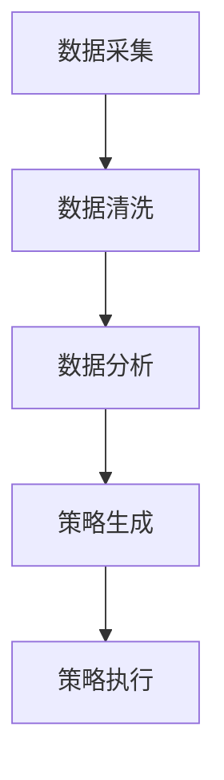
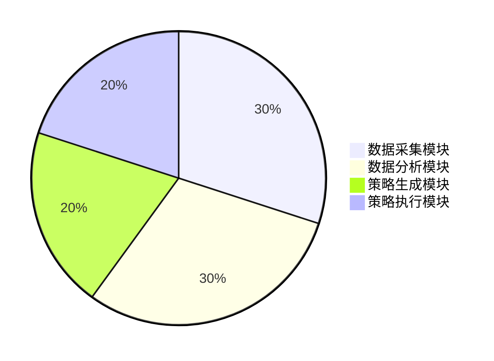
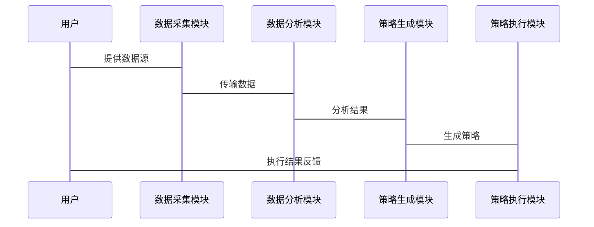

                 


# 《金融产品生命周期价值最大化策略生成器》

> **关键词**：金融产品生命周期、价值最大化、策略生成器、人工智能、机器学习、系统架构

> **摘要**：本文详细探讨了如何利用人工智能和机器学习技术，构建金融产品生命周期价值最大化策略生成器。通过分析金融产品的生命周期，提出了一种基于数学优化和机器学习的策略生成方法，并结合实际案例，展示了如何通过系统架构设计和算法实现，帮助金融机构实现产品价值的最大化。

---

# 第1章 金融产品生命周期概述

## 1.1 金融产品的定义与分类

### 1.1.1 金融产品的基本定义

金融产品是指在金融市场上交易的各类金融工具和服务，包括但不限于股票、债券、基金、保险产品、衍生品等。每类金融产品都有其独特的风险特征、收益结构和流动性。

### 1.1.2 金融产品的分类

金融产品可以根据不同的标准进行分类，常见的分类方式包括：

1. **按期限划分**：短期、中期、长期。
2. **按风险划分**：低风险、中风险、高风险。
3. **按收益类型划分**：固定收益、浮动收益。

### 1.1.3 金融产品的核心要素

金融产品的核心要素包括：

- **期限**：产品到期的时间。
- **收益率**：产品的预期收益。
- **风险等级**：产品的风险水平。
- **流动性**：产品在市场上的交易活跃度。

## 1.2 金融产品生命周期的概念

### 1.2.1 生命周期的阶段划分

金融产品的生命周期通常分为以下几个阶段：

1. **研发阶段**：产品设计、市场调研、风险评估。
2. **发行阶段**：产品上线、市场推广、客户认购。
3. **运行阶段**：产品运作、收益分配、风险管理。
4. **终止阶段**：产品到期、清算、总结评估。

### 1.2.2 各阶段的价值特征

- **研发阶段**：注重产品的可行性和市场需求。
- **发行阶段**：关注产品的市场接受度和销售情况。
- **运行阶段**：强调产品的收益实现和风险控制。
- **终止阶段**：评估产品的整体表现和经验总结。

### 1.2.3 生命周期管理的重要性

有效的生命周期管理可以帮助金融机构优化资源配置、提高产品创新能力、降低经营风险，从而实现产品价值的最大化。

---

## 1.3 价值最大化的目标与意义

### 1.3.1 价值最大化的定义

价值最大化是指在金融产品的整个生命周期中，通过科学的管理和策略优化，实现产品收益的最大化，同时控制风险和成本。

### 1.3.2 价值最大化的目标设定

- **提高产品收益率**：通过优化产品设计和策略执行，实现更高的收益。
- **降低产品成本**：通过高效管理流程和技术创新，减少不必要的支出。
- **控制产品风险**：通过风险评估和管理，确保产品在市场波动中的稳定性。

### 1.3.3 价值最大化对金融机构的意义

- **增强市场竞争力**：通过提供更高价值的产品，吸引更多的客户。
- **提高运营效率**：通过自动化和智能化管理，降低人工成本。
- **实现可持续发展**：通过优化资源配置，促进机构的长期发展。

## 1.4 本章小结

本章通过对金融产品的定义、分类和生命周期的分析，明确了金融产品生命周期管理的重要性，并提出了价值最大化的目标和意义。下一章将详细探讨当前金融市场环境下，金融机构在产品管理中面临的挑战和机遇。

---

# 第2章 金融产品生命周期价值最大化的问题背景

## 2.1 当前金融市场环境分析

### 2.1.1 全球化与金融创新的推动

全球化使得金融市场更加国际化，投资者的需求更加多样化。金融创新不断涌现，如区块链、人工智能等技术的应用，为金融机构提供了新的发展机遇。

### 2.1.2 数字化转型对金融行业的影响

数字化转型正在改变金融行业的运作方式，从客户服务到产品管理，都需要依赖先进的技术手段。例如，大数据分析可以帮助机构更好地理解客户需求，人工智能可以提高投资决策的效率。

### 2.1.3 金融科技的竞争压力

金融科技公司（Fintech）的崛起对传统金融机构提出了严峻挑战。这些公司凭借技术创新和灵活的业务模式，正在抢占传统金融机构的市场份额。

## 2.2 传统金融产品管理的局限性

### 2.2.1 传统管理方法的不足

- **人工决策的低效性**：传统管理依赖人工判断，效率低下且容易出错。
- **缺乏数据支持**：缺乏系统的数据收集和分析，难以做出科学决策。
- **难以应对市场变化**：面对快速变化的市场环境，传统方法难以快速响应。

### 2.2.2 人工决策的局限性

- **主观性**：决策容易受到个人经验和偏见的影响。
- **信息滞后**：人工分析往往滞后于市场变化，影响决策的及时性。
- **成本高**：人工管理需要大量的人力和时间投入，增加了运营成本。

### 2.2.3 市场变化的快速响应需求

金融市场变化迅速，投资者需求多样，金融机构需要能够快速响应市场变化，提供个性化的产品和服务。传统管理方法难以满足这些需求。

## 2.3 价值最大化策略生成器的提出

### 2.3.1 问题的提出与解决思路

面对传统管理的局限性和市场变化的挑战，金融机构需要一种高效、智能的策略生成方法。通过引入人工智能和大数据技术，可以实现产品生命周期的自动化管理，提高决策的科学性和及时性。

### 2.3.2 策略生成器的核心目标

策略生成器旨在通过分析金融产品的生命周期数据，优化产品设计和运营策略，实现产品价值的最大化。

### 2.3.3 技术实现的可能性与可行性

- **技术可行性**：人工智能和大数据技术已经成熟，可以支持策略生成器的开发。
- **数据支持**：金融机构积累了大量的历史数据，可以为策略生成提供丰富的数据来源。
- **市场需求**：金融机构对高效管理工具的需求强烈，策略生成器有广阔的应用前景。

## 2.4 本章小结

本章分析了当前金融市场环境对金融机构的挑战，指出了传统管理方法的局限性，并提出了价值最大化策略生成器的必要性和可行性。下一章将深入探讨策略生成器的核心概念和原理。

---

# 第3章 策略生成器的核心概念与原理

## 3.1 策略生成器的基本概念

### 3.1.1 策略生成器的定义

策略生成器是一种基于人工智能和大数据技术的系统，旨在通过对金融产品的生命周期数据进行分析，生成优化的管理策略，帮助金融机构实现产品价值的最大化。

### 3.1.2 策略生成器的核心功能

- **数据采集**：收集产品生命周期的各类数据，包括市场数据、产品数据、客户数据等。
- **数据分析**：利用机器学习算法对数据进行分析，识别市场趋势和产品特征。
- **策略生成**：根据分析结果，生成优化的产品设计和运营策略。
- **策略执行**：将生成的策略应用于实际操作中，并实时监控执行效果。

### 3.1.3 策略生成器的输入输出关系

- **输入**：市场数据、产品数据、客户数据、历史数据等。
- **输出**：优化的产品设计、风险控制策略、收益最大化方案等。

## 3.2 核心概念的属性对比

### 3.2.1 不同金融产品的核心要素对比（表格）

| 产品类型 | 期限 | 收益率 | 风险等级 | 流动性 |
|----------|------|--------|----------|--------|
| 股票     | 短期 | 浮动   | 高       | 高     |
| 债券     | 中期 | 固定   | 中       | 中     |
| 基金     | 长期 | 浮动   | 低       | 低     |

### 3.2.2 生命周期阶段的价值特征对比（表格）

| 阶段       | 核心目标                     | 关键指标                     |
|------------|------------------------------|------------------------------|
| 研发阶段    | 确定产品可行性               | 市场需求、风险评估           |
| 发行阶段    | 提高市场接受度               | 销售量、客户反馈             |
| 运行阶段    | 实现收益最大化               | 收益率、风险控制             |
| 终止阶段    | 总结经验                     | 产品表现、客户满意度         |

### 3.2.3 策略生成器的核心要素组成

- **数据源**：市场数据、产品数据、客户数据。
- **分析模型**：机器学习算法、数学优化模型。
- **策略生成模块**：优化策略的设计和执行。
- **监控系统**：实时监控策略执行效果。

## 3.3 本章小结

本章通过对比分析不同金融产品和生命周期阶段的特点，明确了策略生成器的核心概念和功能。下一章将详细讲解策略生成器的算法原理和实现方法。

---

# 第4章 策略生成器的算法原理

## 4.1 算法原理概述

策略生成器的算法主要基于机器学习和数学优化技术。通过分析历史数据和市场趋势，算法可以预测产品的市场表现，并生成优化的管理策略。

## 4.2 算法实现步骤

### 4.2.1 数据预处理

- 数据清洗：去除无效数据，处理缺失值。
- 数据标准化：将数据标准化到统一的范围内。

### 4.2.2 模型训练

- 使用机器学习算法（如随机森林、神经网络）对数据进行训练，建立预测模型。

### 4.2.3 策略生成

- 根据模型预测结果，生成优化的产品设计和运营策略。

### 4.2.4 策略执行

- 将生成的策略应用于实际操作，并实时监控执行效果。

## 4.3 算法的数学模型和公式

### 4.3.1 预测模型

常用的预测模型包括线性回归、支持向量机（SVM）、随机森林等。以下是一个简单的线性回归模型：

$$ y = \beta_0 + \beta_1x + \epsilon $$

其中，$y$ 是预测目标，$x$ 是自变量，$\beta_0$ 和 $\beta_1$ 是模型参数，$\epsilon$ 是误差项。

### 4.3.2 优化模型

优化模型通常采用数学规划方法，如线性规划和非线性规划。以下是一个简单的收益最大化优化模型：

$$ \max \sum_{i=1}^{n} r_i x_i $$

$$ \text{subject to} \quad \sum_{i=1}^{n} x_i \leq C $$

其中，$r_i$ 是第 $i$ 个产品的收益率，$x_i$ 是投资比例，$C$ 是总预算。

## 4.4 算法实现的Python代码示例

```python
import pandas as pd
from sklearn.ensemble import RandomForestRegressor

# 数据加载与预处理
data = pd.read_csv('financial_data.csv')
data = data.dropna()  # 去除缺失值
data = (data - data.min()) / (data.max() - data.min())  # 标准化

# 特征与目标分离
X = data.drop('target', axis=1)
y = data['target']

# 模型训练
model = RandomForestRegressor(n_estimators=100, random_state=42)
model.fit(X, y)

# 预测与策略生成
predictions = model.predict(X)
# 根据预测结果生成优化策略
#（此处可以进一步优化策略）
```

## 4.5 算法的案例分析

假设我们有一个股票投资组合优化的问题，可以通过策略生成器生成最优的投资策略。例如，通过分析历史数据，模型预测某股票未来三个月的收益率为12%，波动率为8%。根据这些数据，策略生成器可以建议投资者增加对该股票的投资比例。

## 4.6 本章小结

本章详细讲解了策略生成器的算法原理和实现步骤，通过数学模型和Python代码示例，展示了如何利用机器学习技术优化金融产品的管理策略。下一章将探讨系统架构设计和实际应用案例。

---

# 第5章 系统分析与架构设计

## 5.1 系统功能设计

### 5.1.1 系统目标

系统的目标是通过整合金融产品的生命周期数据，利用人工智能技术生成优化的管理策略，帮助金融机构实现产品价值的最大化。

### 5.1.2 系统功能模块

- **数据采集模块**：负责采集市场数据、产品数据、客户数据等。
- **数据分析模块**：对数据进行清洗、转换和分析，建立预测模型。
- **策略生成模块**：根据分析结果，生成优化的管理策略。
- **策略执行模块**：将策略应用于实际操作，并实时监控执行效果。

### 5.1.3 系统功能流程图



### 5.1.4 系统功能需求

- **数据采集**：支持多种数据源的接入，如API接口、数据库等。
- **数据分析**：支持多种机器学习算法，如随机森林、神经网络等。
- **策略生成**：能够根据分析结果，生成个性化的管理策略。
- **策略执行**：支持策略的自动执行，并实时监控执行效果。

## 5.2 系统架构设计

### 5.2.1 系统架构图



### 5.2.2 系统分层设计

- **数据层**：负责数据的存储和管理。
- **计算层**：负责数据的分析和计算。
- **应用层**：负责策略的生成和执行。

### 5.2.3 系统接口设计

- **输入接口**：支持多种数据格式的输入，如CSV、JSON等。
- **输出接口**：能够将分析结果输出为可读的报告或直接应用于系统操作。

### 5.2.4 系统交互流程图



## 5.3 本章小结

本章通过系统功能设计和架构设计，展示了策略生成器的实现方式和应用流程。下一章将结合实际案例，详细讲解策略生成器的项目实战。

---

# 第6章 项目实战与案例分析

## 6.1 环境安装与配置

### 6.1.1 安装Python

```bash
# 安装Python
sudo apt-get install python3 python3-pip
```

### 6.1.2 安装依赖库

```bash
# 安装Pandas、Scikit-learn等库
pip install pandas scikit-learn
```

## 6.2 系统核心代码实现

### 6.2.1 数据采集模块

```python
import pandas as pd
import requests

def fetch_data(api_key):
    url = f"https://api.example.com/financial_data?api_key={api_key}"
    response = requests.get(url)
    data = response.json()
    df = pd.DataFrame(data)
    return df
```

### 6.2.2 数据分析模块

```python
from sklearn.ensemble import RandomForestRegressor

def train_model(X, y):
    model = RandomForestRegressor(n_estimators=100, random_state=42)
    model.fit(X, y)
    return model
```

### 6.2.3 策略生成模块

```python
def generate_strategy(model, X):
    predictions = model.predict(X)
    # 生成优化策略
    strategy = []
    for pred in predictions:
        if pred > 0.7:
            strategy.append('增加投资')
        elif pred < 0.3:
            strategy.append('减少投资')
        else:
            strategy.append('保持不变')
    return strategy
```

### 6.2.4 策略执行模块

```python
def execute_strategy(strategy, portfolio):
    for action in strategy:
        if action == '增加投资':
            portfolio.add_investment()
        elif action == '减少投资':
            portfolio.reduce_investment()
```

## 6.3 案例分析与详细解读

假设我们有一个股票投资组合优化的案例，通过策略生成器生成最优的投资策略。以下是一个具体的实现步骤：

1. **数据采集**：通过API接口获取历史股价数据。
2. **数据清洗**：去除缺失值和异常值。
3. **模型训练**：使用随机森林算法训练预测模型。
4. **策略生成**：根据模型预测结果生成投资策略。
5. **策略执行**：将生成的策略应用于实际投资组合，并实时监控执行效果。

## 6.4 本章小结

本章通过实际案例，详细讲解了策略生成器的项目实战和代码实现。下一章将总结最佳实践和注意事项。

---

# 第7章 最佳实践与总结

## 7.1 小结

通过本篇文章的详细讲解，我们了解了金融产品生命周期价值最大化策略生成器的核心概念和实现方法。策略生成器通过整合金融产品的生命周期数据，利用人工智能和大数据技术，帮助金融机构实现产品价值的最大化。

## 7.2 注意事项

- **数据质量**：数据的质量直接影响模型的预测结果，需要确保数据的准确性和完整性。
- **模型选择**：根据具体问题选择合适的算法，避免盲目使用复杂模型。
- **风险控制**：在策略生成和执行过程中，需要注意风险控制，确保策略的稳健性。

## 7.3 拓展阅读

- **相关书籍**：《机器学习实战》、《金融数据分析与建模》
- **技术博客**：FinTech Weekly、Quantitative Research Blog
- **在线课程**：Coursera上的《金融数据分析》课程

---

# 作者信息

**作者**：AI天才研究院/AI Genius Institute  
**联系邮箱**：contact@aiguru.com  
**个人简介**：专注于人工智能与金融领域的交叉研究，致力于通过技术创新推动金融行业的发展。

