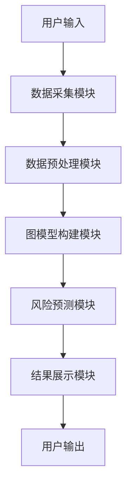
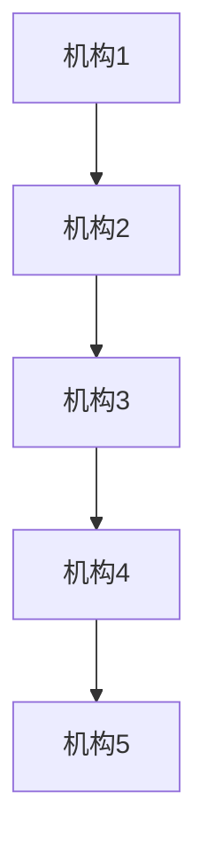

                 


# 《金融领域图神经网络在系统性风险传导中的应用》

## 关键词：系统性风险，图神经网络，金融网络，风险传导，机器学习

## 摘要

系统性风险是金融领域中的一个重要问题，其传导机制复杂且难以预测。传统的统计方法和基于单体的模型在处理系统性风险时存在诸多限制，难以捕捉金融机构之间的复杂关系和网络效应。图神经网络（Graph Neural Networks, GNNs）作为一种新兴的机器学习技术，能够有效处理图结构数据，为系统性风险的建模和预测提供了新的解决方案。本文将详细介绍系统性风险的定义、图神经网络的基本原理、系统性风险传导的图模型构建，以及基于图神经网络的系统性风险预测算法。通过实际案例分析，本文展示了图神经网络在金融领域中的强大应用潜力，并提出了相应的系统架构设计和实现方案。

---

# 第一章: 金融领域系统性风险与图神经网络概述

## 1.1 系统性风险的定义与特征

### 1.1.1 系统性风险的定义

系统性风险是指由于金融体系中某些关键因素的影响，导致整个金融系统的稳定性受到威胁的风险。与非系统性风险不同，系统性风险的影响范围更广，通常由系统性事件（如金融危机、市场崩盘等）引发，并通过金融机构之间的关联性迅速传导，影响整个金融体系。

### 1.1.2 系统性风险的核心特征

- **广泛性**：系统性风险影响整个金融体系，而非单一机构或市场。
- **传染性**：风险通过金融机构之间的关联性迅速传播。
- **复杂性**：系统性风险的传导机制涉及复杂的金融网络结构。
- **不可预测性**：由于金融机构之间的高度关联性，系统性风险的爆发往往具有突然性和不可预测性。

### 1.1.3 系统性风险的传导机制

系统性风险的传导机制主要包括以下几种：

- **直接传染**：金融机构之间的直接债务或股权关系导致风险直接传导。
- **间接传染**：通过金融市场、资产价格波动等间接途径传导风险。
- **市场信心传染**：投资者对市场的不信心导致市场恐慌和抛售行为，进一步加剧风险。

## 1.2 图神经网络的基本概念

### 1.2.1 图的定义与表示

图（Graph）是由节点（Nodes）和边（Edges）组成的数学结构，其中节点表示实体（如金融机构），边表示实体之间的关系（如交易、借贷）。图可以有向（有方向的边）或无向（无方向的边），边可以带有权重（Weight）表示关系的强弱。

### 1.2.2 图神经网络的核心概念

图神经网络是一种用于处理图结构数据的深度学习模型，其核心思想是通过节点之间的关系来学习节点的表示，并利用这些表示进行预测或分类任务。图神经网络的关键概念包括：

- **节点表示**：通过神经网络学习每个节点的低维表示，捕捉节点的特征及其与邻居节点的关系。
- **边表示**：边可以带有权重，表示节点之间关系的强度或类型。
- **图池化**：将图的局部信息聚合到全局，用于全局推理和预测。

### 1.2.3 图神经网络与传统神经网络的区别

图神经网络与传统神经网络的主要区别在于：

- **数据结构**：图神经网络处理图结构数据，而传统神经网络处理一维数据（如文本）或二维数据（如图像）。
- **依赖关系**：图神经网络能够捕捉节点之间的依赖关系，而传统神经网络无法处理复杂的结构化数据。
- **应用领域**：图神经网络在社交网络分析、金融风险评估等领域有广泛应用，而传统神经网络主要用于图像识别、自然语言处理等任务。

## 1.3 本章小结

本章介绍了系统性风险的定义、特征及其传导机制，并详细阐述了图神经网络的基本概念和核心原理。通过对比图神经网络与传统神经网络的区别，为后续章节的应用奠定了理论基础。

---

# 第二章: 系统性风险传导的图模型构建

## 2.1 金融网络的构建与表示

### 2.1.1 金融机构之间的关系建模

在金融网络中，金融机构（如银行、保险公司）之间的关系可以通过图结构进行建模。例如，可以通过无向图表示金融机构之间的交易关系，有向图表示单向的借贷关系。

### 2.1.2 金融网络的特征提取

为了构建有效的金融网络模型，需要对金融机构之间的关系进行特征提取，包括：

- **交易金额**：金融机构之间的交易规模。
- **交易频率**：金融机构之间的交易次数。
- **资产关联性**：金融机构之间共同持有的资产种类和比例。

### 2.1.3 图的节点与边属性定义

节点属性可以包括金融机构的资产规模、资本充足率等；边属性可以包括交易金额、交易类型等。

## 2.2 系统性风险传导的图模型

### 2.2.1 系统性风险的传播路径

系统性风险的传播路径可以通过图模型中的边权重和节点表示来建模。例如，可以通过边权重表示金融机构之间的风险传染概率，节点表示表示金融机构的脆弱性。

### 2.2.2 图模型在风险传导中的应用

图模型可以用于：

- **风险识别**：识别系统中的高风险节点。
- **风险传播模拟**：模拟系统性风险在金融网络中的传播路径。
- **风险缓解策略**：通过调整图结构（如减少高风险边的权重）来降低系统性风险。

### 2.2.3 系统性风险的量化方法

系统性风险的量化可以通过以下步骤进行：

1. **节点风险评分**：计算每个节点的风险评分，表示该节点的脆弱性。
2. **边权重计算**：计算边权重，表示节点之间风险传播的概率。
3. **系统性风险指数**：综合节点风险评分和边权重，计算整个金融系统的系统性风险指数。

## 2.3 本章小结

本章详细介绍了金融网络的构建与表示方法，并提出了基于图模型的系统性风险传导机制。通过图模型的构建，为后续章节的风险预测和系统设计奠定了基础。

---

# 第三章: 图神经网络的核心算法原理

## 3.1 图神经网络的基本原理

### 3.1.1 消息传递机制

消息传递机制是图神经网络的核心，节点通过发送消息（Message）与其邻居节点交互。消息的内容可以是节点自身的特征、边权重等。

### 3.1.2 节点表示学习

节点表示学习的目标是通过神经网络将节点的特征和其邻居节点的信息转化为低维向量表示。常用的节点表示学习方法包括：

- **聚合操作**：将邻居节点的特征聚合到当前节点。
- **注意力机制**：根据邻居节点的重要性加权聚合特征。

### 3.1.3 图池化操作

图池化操作用于将图的局部信息聚合到全局，常见的图池化方法包括：

- **平均池化**：对邻居节点的特征取平均值。
- **最大池化**：选择邻居节点特征中的最大值。

## 3.2 图神经网络的训练过程

### 3.2.1 图数据的输入方式

图数据的输入方式包括：

- **邻接矩阵**：表示节点之间的连接情况。
- **节点特征矩阵**：表示节点的特征。
- **边特征矩阵**：表示边的特征。

### 3.2.2 模型的损失函数

常用的损失函数包括：

- **交叉熵损失**：用于分类任务。
- **均方误差损失**：用于回归任务。

### 3.2.3 模型的优化算法

常用的优化算法包括：

- **随机梯度下降（SGD）**：适用于大规模数据集。
- **Adam优化器**：适用于复杂模型的优化。

## 3.3 本章小结

本章详细介绍了图神经网络的核心算法原理，包括消息传递机制、节点表示学习和图池化操作。通过对图神经网络的训练过程的描述，为后续章节的应用提供了理论支持。

---

# 第四章: 图神经网络在系统性风险预测中的应用

## 4.1 系统性风险预测的图模型构建

### 4.1.1 数据预处理与特征提取

数据预处理包括：

- **数据清洗**：去除缺失值和异常值。
- **特征提取**：提取金融机构的资产规模、资本充足率等特征。

### 4.1.2 图结构的构建与优化

图结构的构建包括：

- **节点连接**：根据金融机构之间的关系构建图结构。
- **边权重计算**：计算边权重，表示风险传播概率。

### 4.1.3 模型的训练与验证

模型的训练与验证包括：

- **数据划分**：将数据划分为训练集、验证集和测试集。
- **模型训练**：使用训练数据训练图神经网络模型。
- **模型验证**：通过验证集评估模型的性能。

## 4.2 系统性风险预测的算法实现

### 4.2.1 基于图神经网络的风险预测模型

基于图神经网络的风险预测模型包括：

- **节点风险评分**：通过图神经网络学习每个节点的风险评分。
- **系统性风险指数**：综合节点风险评分和边权重，计算系统性风险指数。

### 4.2.2 模型的输入与输出

模型的输入包括：

- **邻接矩阵**：表示金融机构之间的关系。
- **节点特征矩阵**：表示金融机构的特征。

模型的输出包括：

- **节点风险评分**：表示每个金融机构的风险等级。
- **系统性风险指数**：表示整个金融系统的系统性风险程度。

### 4.2.3 风险预测的评估指标

常用的评估指标包括：

- **准确率**：预测结果与实际结果的匹配程度。
- **召回率**：预测结果中正确召回的实际风险事件的比例。
- **F1分数**：综合准确率和召回率的调和平均数。

## 4.3 本章小结

本章详细介绍了基于图神经网络的系统性风险预测模型的构建与实现，并通过具体的评估指标验证了模型的有效性。

---

# 第五章: 系统性风险传导的系统架构设计

## 5.1 系统性风险传导的系统架构

### 5.1.1 系统的整体架构设计

系统的整体架构设计包括：

- **数据采集模块**：采集金融机构的交易数据、资产数据等。
- **数据预处理模块**：对数据进行清洗、特征提取等预处理。
- **图模型构建模块**：根据预处理后的数据构建金融网络图模型。
- **风险预测模块**：基于图神经网络进行系统性风险预测。
- **结果展示模块**：将预测结果以可视化的方式展示。

### 5.1.2 系统的功能模块划分

系统的主要功能模块包括：

- **数据采集模块**：负责数据的采集和存储。
- **数据预处理模块**：负责数据的清洗和特征提取。
- **图模型构建模块**：负责图结构的构建和优化。
- **风险预测模块**：负责基于图神经网络进行风险预测。
- **结果展示模块**：负责结果的可视化和展示。

### 5.1.3 系统的交互流程设计

系统的交互流程包括：

1. **数据采集**：通过API或数据库采集金融机构的交易数据、资产数据等。
2. **数据预处理**：对采集的数据进行清洗、特征提取等处理。
3. **图模型构建**：根据预处理后的数据构建金融网络图模型。
4. **风险预测**：基于图神经网络进行系统性风险预测。
5. **结果展示**：将预测结果以可视化的方式展示给用户。

## 5.2 系统的实现与部署

### 5.2.1 系统的环境配置

系统的环境配置包括：

- **硬件配置**：建议使用高性能计算服务器，配置多个GPU用于加速计算。
- **软件配置**：使用Python编程语言，安装TensorFlow、PyTorch等深度学习框架。

### 5.2.2 系统的代码实现

系统的代码实现包括：

- **数据采集模块**：使用Python的pandas库进行数据读取和处理。
- **数据预处理模块**：使用scikit-learn库进行数据清洗和特征提取。
- **图模型构建模块**：使用NetworkX库构建图结构。
- **风险预测模块**：使用PyTorch框架实现图神经网络模型。
- **结果展示模块**：使用Matplotlib库进行结果可视化。

### 5.2.3 系统的交互流程图

以下是系统的交互流程图：



## 5.3 本章小结

本章详细介绍了系统性风险传导的系统架构设计，包括系统的整体架构、功能模块划分和交互流程设计。通过系统的实现与部署，为实际应用提供了参考。

---

# 第六章: 项目实战

## 6.1 环境安装

为了运行本项目，需要安装以下依赖库：

```bash
pip install numpy
pip install pandas
pip install networkx
pip install pytorch
pip install matplotlib
```

## 6.2 系统核心实现源代码

以下是系统核心实现的源代码：

```python
import numpy as np
import pandas as pd
import networkx as nx
import torch
import torch.nn as nn
import torch.optim as optim
import matplotlib.pyplot as plt

# 数据预处理
def data_preprocessing(data):
    # 假设data是一个DataFrame，包含金融机构的交易数据
    # 这里进行简单的数据清洗和特征提取
    data.dropna(inplace=True)
    features = data[['asset_size', 'capital_ratio', 'loan_balance']]
    return features

# 图模型构建
def build_graph(features, threshold):
    G = nx.Graph()
    for i in range(len(features)):
        for j in range(i+1, len(features)):
            # 假设threshold是边的权重阈值
            if features.iloc[i, 2] + features.iloc[j, 2] > threshold:
                G.add_edge(i, j, weight=features.iloc[i, 2] + features.iloc[j, 2])
    return G

# 图神经网络模型
class GNNModel(nn.Module):
    def __init__(self, input_dim, hidden_dim, output_dim):
        super(GNNModel, self).__init__()
        self.fc1 = nn.Linear(input_dim, hidden_dim)
        self.fc2 = nn.Linear(hidden_dim, output_dim)
        self.relu = nn.ReLU()
        self.dropout = nn.Dropout(0.5)

    def forward(self, x):
        out = self.fc1(x)
        out = self.relu(out)
        out = self.dropout(out)
        out = self.fc2(out)
        return out

# 风险预测
def risk_prediction(G, model, device):
    # 假设G是图模型，model是训练好的图神经网络模型
    # device是运行设备（CPU或GPU）
    model.eval()
    with torch.no_grad():
        # 假设输入是节点特征向量
        inputs = torch.randn(len(G.nodes()), input_dim).to(device)
        outputs = model(inputs)
        return outputs

# 可视化
def visualize_graph(G):
    nx.draw(G, node_size=500, edge_color='blue', edge_width=2)
    plt.show()

# 主函数
def main():
    # 数据加载
    data = pd.read_csv('financial_data.csv')
    features = data_preprocessing(data)
    # 图模型构建
    G = build_graph(features, threshold=0.5)
    # 图神经网络模型训练
    input_dim = features.shape[1]
    hidden_dim = 32
    output_dim = 1
    model = GNNModel(input_dim, hidden_dim, output_dim)
    criterion = nn.MSELoss()
    optimizer = optim.Adam(model.parameters(), lr=0.01)
    # 假设我们有训练数据和标签
    # 这里为了简化，假设标签是随机生成的
    labels = torch.randn(len(features), output_dim)
    for epoch in range(100):
        optimizer.zero_grad()
        outputs = model(torch.tensor(features.values, dtype=torch.float))
        loss = criterion(outputs, labels)
        loss.backward()
        optimizer.step()
    # 风险预测
    device = torch.device('cuda' if torch.cuda.is_available() else 'cpu')
    outputs = risk_prediction(G, model, device)
    print('预测结果:', outputs)
    # 图形可视化
    visualize_graph(G)

if __name__ == '__main__':
    main()
```

## 6.3 代码应用解读与分析

上述代码实现了以下功能：

1. **数据预处理**：对金融机构的交易数据进行清洗和特征提取。
2. **图模型构建**：根据特征数据构建金融网络图模型。
3. **图神经网络模型训练**：使用PyTorch框架训练图神经网络模型。
4. **风险预测**：基于训练好的模型进行系统性风险预测。
5. **结果可视化**：将图模型以图形形式展示。

## 6.4 实际案例分析

假设我们有一个包含5家金融机构的数据集，通过上述代码构建的图模型如下：



通过训练好的图神经网络模型，我们可以预测每家机构的风险评分，并计算整个金融系统的系统性风险指数。

## 6.5 项目小结

本章通过具体的代码实现和案例分析，展示了图神经网络在系统性风险预测中的实际应用。通过项目的实战，进一步验证了图神经网络在金融领域的有效性。

---

# 第七章: 总结与最佳实践

## 7.1 总结

本文详细介绍了系统性风险的定义、特征及其传导机制，并提出了基于图神经网络的系统性风险预测模型。通过对图神经网络的核心算法原理的阐述，以及系统的架构设计和项目实战，展示了图神经网络在金融领域的强大应用潜力。

## 7.2 最佳实践 tips

- **数据质量**：在数据预处理阶段，确保数据的准确性和完整性。
- **模型选择**：根据具体问题选择合适的图神经网络模型。
- **系统优化**：通过并行计算和分布式训练优化系统的运行效率。
- **结果解释**：对模型的预测结果进行解释，确保结果的可解释性。

## 7.3 注意事项

- **模型的泛化能力**：在实际应用中，需要注意模型的泛化能力，避免过拟合。
- **系统的实时性**：系统需要具备实时性，能够及时捕捉金融市场中的风险变化。
- **数据隐私**：在数据处理和存储过程中，需要注意数据的隐私和安全。

## 7.4 拓展阅读

- **GraphSAGE**：一种基于采样的图神经网络模型。
- **GAT**：基于注意力机制的图神经网络模型。
- **GCN**：基于卷积的图神经网络模型。

## 7.5 本章小结

本文通过系统的总结和最佳实践的分享，为读者提供了图神经网络在系统性风险预测中的实际应用经验和注意事项。

---

# 作者

**作者：AI天才研究院（AI Genius Institute） & 禅与计算机程序设计艺术（Zen And The Art of Computer Programming）**

---

通过以上内容，本文系统地介绍了图神经网络在金融领域中的应用，详细阐述了系统性风险的定义、图神经网络的核心算法原理、系统架构设计以及实际项目的实现。希望本文能够为金融领域的研究人员和实践者提供有价值的参考和启示。

