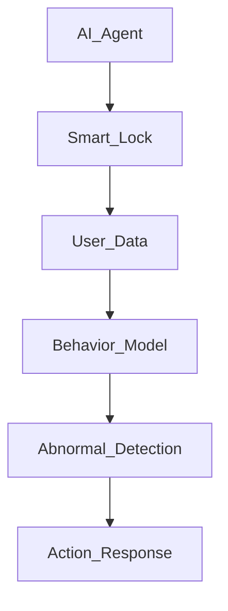
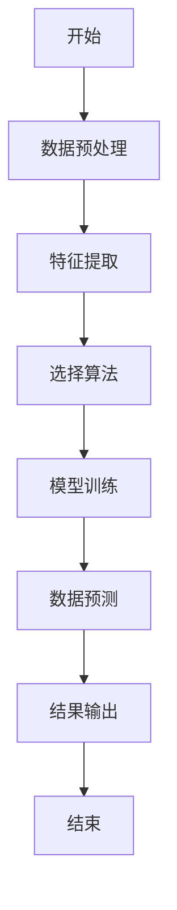
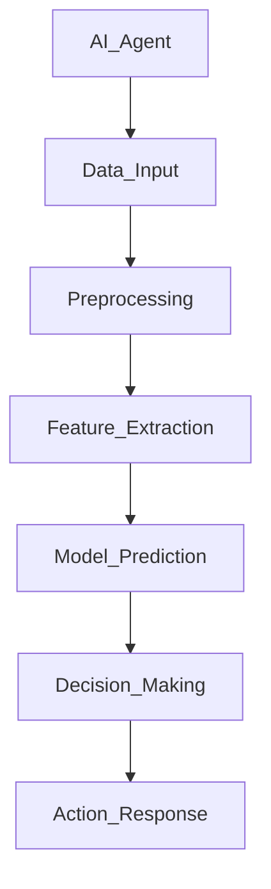
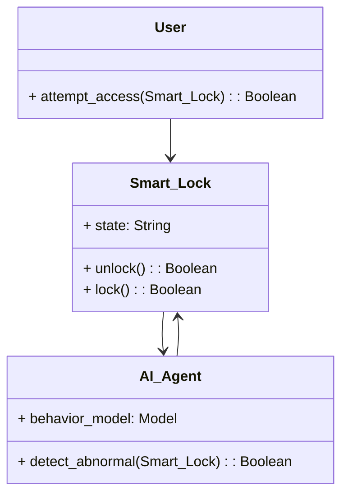
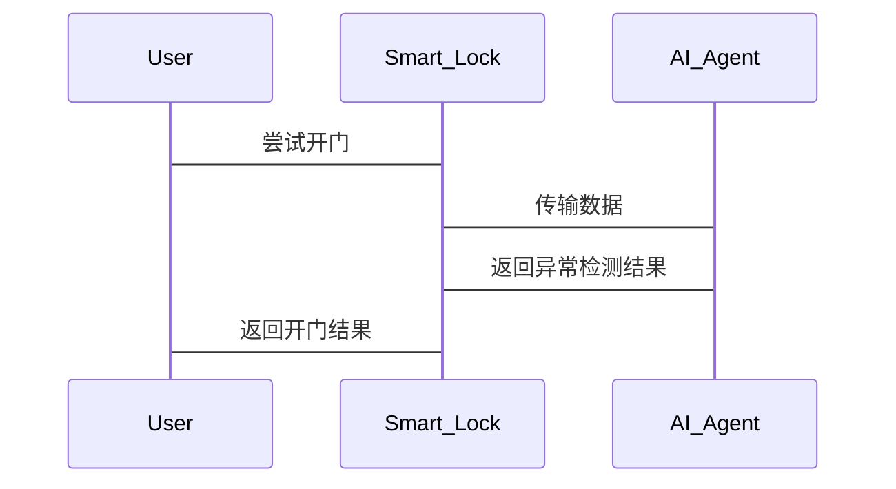
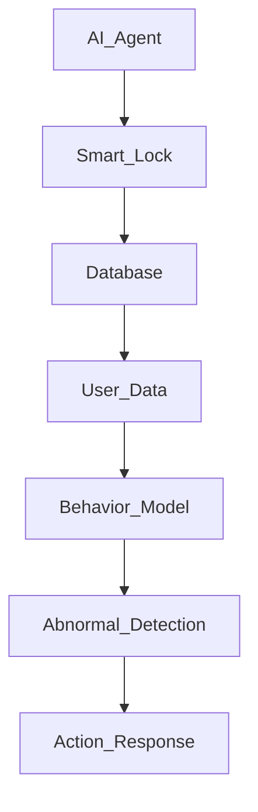

                 


# AI Agent在智能门锁中的异常使用检测

> 关键词：智能门锁, AI Agent, 异常使用检测, 机器学习, 深度学习

> 摘要：本文深入探讨了AI Agent在智能门锁中的异常使用检测应用。首先，我们从问题背景出发，分析了异常使用检测的必要性和AI Agent在智能门锁中的作用。接着，我们详细介绍了AI Agent的基本原理、算法实现以及数学模型，通过实际案例展示了AI Agent在智能门锁中的应用效果。最后，我们总结了AI Agent的优势，并展望了其未来的发展方向。

---

## 第1章: 异常使用检测的背景与问题

### 1.1 问题背景

#### 1.1.1 智能门锁的发展现状
智能门锁作为智能家居的重要组成部分，近年来发展迅速。传统的机械锁逐渐被电子锁和智能锁取代，用户可以通过指纹、密码、卡片或手机App等多种方式开门。然而，智能门锁的普及也带来了新的安全挑战。

#### 1.1.2 异常使用检测的必要性
智能门锁的便捷性也意味着可能存在被恶意攻击的风险。例如，暴力尝试密码、高频刷卡、未授权的访问尝试等行为，都可能对智能门锁的安全性造成威胁。因此，如何检测这些异常行为，保护用户的安全，成为智能门锁设计中的一个重要问题。

#### 1.1.3 AI Agent在智能门锁中的作用
AI Agent（人工智能代理）是一种能够感知环境、自主决策并执行任务的智能体。通过AI Agent，智能门锁可以实时分析用户的行为模式，识别异常使用行为，并采取相应的应对措施，例如发出警报或锁死门锁。

### 1.2 问题描述

#### 1.2.1 异常使用行为的定义
异常使用行为指的是不符合正常使用习惯的门锁操作。例如，短时间内多次输入错误密码、非法刷卡、强行破坏锁具等。

#### 1.2.2 异常使用行为的分类
异常使用行为可以分为以下几类：
- **暴力尝试**：短时间内多次输入错误密码或刷卡失败。
- **未授权访问**：使用非授权的卡片或密码尝试开门。
- **异常操作**：例如强行撬锁、破坏锁具等。

#### 1.2.3 异常使用检测的目标
异常使用检测的目标是通过AI Agent实时监测门锁的使用情况，识别异常行为，并采取相应的措施，例如锁死门锁、发出警报或通知用户。

### 1.3 问题解决

#### 1.3.1 AI Agent的核心作用
AI Agent通过学习用户的正常使用行为模式，能够快速识别异常行为，并在检测到异常时采取相应的措施。

#### 1.3.2 异常使用检测的实现路径
1. **数据采集**：收集用户的门锁使用数据，包括时间、方式、频率等。
2. **行为建模**：基于机器学习或深度学习算法，建立用户行为模型。
3. **异常识别**：通过对比当前行为与正常行为模型，识别异常行为。
4. **决策与反馈**：根据识别结果，采取相应的措施，例如锁死门锁或发送警报。

#### 1.3.3 AI Agent与智能门锁的结合方式
AI Agent可以嵌入智能门锁系统中，或者作为独立的监控系统与门锁进行数据交互。

### 1.4 边界与外延

#### 1.4.1 异常使用检测的边界条件
- 时间范围：例如，短时间内多次尝试输入错误密码。
- 行为模式：例如，非正常时间段的开门尝试。

#### 1.4.2 AI Agent的适用范围
- 智能门锁系统。
- 其他需要实时监测和异常检测的智能设备。

#### 1.4.3 异常使用检测的扩展应用场景
- 商业楼宇的门禁系统。
- 家庭智能安防系统。

### 1.5 核心概念与结构

#### 1.5.1 核心概念的定义
- **AI Agent**：一种能够感知环境、自主决策并执行任务的智能体。
- **智能门锁**：集成多种开门方式（如指纹、密码、刷卡）的电子锁具。

#### 1.5.2 核心概念的属性对比
| 属性       | AI Agent                  | 智能门锁                  |
|------------|---------------------------|---------------------------|
| 功能       | 感知环境、自主决策         | 控制门锁状态、记录使用数据 |
| 数据输入   | 用户行为数据、环境数据     | 指纹、密码、刷卡记录      |
| 输出       | 异常行为识别结果           | 开门、锁门状态             |
| 交互方式   | API接口、事件驱动         | 用户操作、系统反馈         |

#### 1.5.3 实体关系图



---

## 第2章: AI Agent的核心概念与原理

### 2.1 AI Agent的基本原理

#### 2.1.1 AI Agent的定义
AI Agent是一种能够感知环境、自主决策并执行任务的智能体。它能够通过传感器或其他数据源获取信息，并根据预设的目标和规则做出决策。

#### 2.1.2 AI Agent的核心特点
- **自主性**：能够自主决策。
- **反应性**：能够实时感知环境并做出反应。
- **学习能力**：能够通过机器学习不断优化自身的决策模型。

#### 2.1.3 AI Agent与传统算法的区别
AI Agent不仅仅是一个算法，它是一个能够独立运行的智能体，能够与环境进行交互，并根据反馈不断优化自身的行为。

### 2.2 智能门锁的原理

#### 2.2.1 智能门锁的工作流程
1. 用户通过指纹、密码或卡片等方式进行开门尝试。
2. 智能门锁验证用户身份。
3. 根据验证结果，门锁选择开门或锁门。

#### 2.2.2 智能门锁的主要组件
- **传感器**：指纹识别、刷卡模块。
- **控制器**：门锁控制模块。
- **通信模块**：与AI Agent的数据交互接口。

#### 2.2.3 智能门锁的数据流分析
1. 用户进行开门尝试。
2. 传感器采集用户数据。
3. 数据传输到AI Agent进行分析。
4. AI Agent根据分析结果发出指令。
5. 智能门锁根据指令执行开门或锁门操作。

### 2.3 AI Agent与智能门锁的关系

#### 2.3.1 AI Agent在智能门锁中的角色
AI Agent作为智能门锁的监控和决策系统，负责实时分析门锁的使用情况，并识别异常行为。

#### 2.3.2 AI Agent与智能门锁数据的关系
AI Agent通过收集智能门锁的使用数据，学习用户的正常行为模式，并基于此识别异常行为。

#### 2.3.3 AI Agent对智能门锁功能的增强
通过AI Agent，智能门锁能够实现智能化的异常检测和安全防护，提升整体安全性。

---

## 第3章: AI Agent的算法原理

### 3.1 异常检测算法概述

#### 3.1.1 异常检测的基本概念
异常检测是指通过分析数据，识别与正常数据模式不符的异常数据点。

#### 3.1.2 异常检测的主要方法
- **基于统计的方法**：如Z-score、概率密度估计。
- **基于机器学习的方法**：如支持向量机（SVM）、随机森林。
- **基于深度学习的方法**：如自动编码器、循环神经网络。

#### 3.1.3 异常检测的评价指标
- **准确率**：正确识别的异常行为数占总异常行为数的比例。
- **召回率**：识别到的异常行为数占实际异常行为数的比例。
- **F1分数**：准确率和召回率的调和平均数。

### 3.2 AI Agent的异常检测算法

#### 3.2.1 基于机器学习的异常检测
- 使用随机森林算法对用户行为进行分类，正常行为为负类，异常行为为正类。
- 通过训练模型，识别异常行为。

#### 3.2.2 基于深度学习的异常检测
- 使用循环神经网络（RNN）对时间序列数据进行建模，捕捉用户的使用行为模式。
- 通过对比当前行为与正常行为模式，识别异常行为。

#### 3.2.3 基于规则的异常检测
- 预定义一些规则，例如“5分钟内尝试输入错误密码超过3次”，则判定为异常行为。

### 3.3 算法流程图

#### 3.3.1 异常检测算法流程图



#### 3.3.2 AI Agent的决策流程图



### 3.4 数学模型与公式

#### 3.4.1 异常检测的统计模型
- Z-score公式：
  $$ Z = \frac{X - \mu}{\sigma} $$
  其中，$\mu$是均值，$\sigma$是标准差。

#### 3.4.2 异常检测的机器学习模型
- 支持向量机（SVM）的分类函数：
  $$ y = \text{sign}(w \cdot x + b) $$
  其中，$w$是权重向量，$x$是输入特征，$b$是偏置项。

#### 3.4.3 异常检测的深度学习模型
- 自动编码器的重构误差：
  $$ \text{Reconstruction Error} = ||x_{\text{input}} - x_{\text{reconstructed}}|| $$

---

## 第4章: AI Agent的系统分析与架构设计

### 4.1 系统功能设计

#### 4.1.1 领域模型


#### 4.1.2 系统架构设计


#### 4.1.3 系统交互流程图


### 4.2 系统架构设计

#### 4.2.1 系统架构图


#### 4.2.2 系统接口设计
- **AI Agent接口**：
  - 输入：用户行为数据
  - 输出：异常检测结果
- **Smart Lock接口**：
  - 输入：开门指令
  - 输出：开门结果

---

## 第5章: 项目实战

### 5.1 环境安装

```bash
pip install numpy scikit-learn tensorflow
```

### 5.2 系统核心实现

#### 5.2.1 AI Agent的核心代码

```python
import numpy as np
from sklearn.ensemble import IsolationForest

class AI_Agent:
    def __init__(self):
        self.model = IsolationForest(n_estimators=100, contamination=0.05)

    def train(self, X):
        self.model.fit(X)

    def predict(self, X):
        return self.model.predict(X)
```

#### 5.2.2 智能门锁的核心代码

```python
class Smart_Lock:
    def __init__(self):
        self.state = "locked"

    def unlock(self):
        self.state = "unlocked"
        return True

    def lock(self):
        self.state = "locked"
        return True

    def is_locked(self):
        return self.state == "locked"
```

### 5.3 案例分析与实现

#### 5.3.1 数据采集与预处理
```python
import pandas as pd

data = pd.read_csv("user_behavior.csv")
data_preprocessed = data.dropna()
```

#### 5.3.2 模型训练与预测
```python
agent = AI_Agent()
agent.train(data_preprocessed)
```

#### 5.3.3 异常行为识别
```python
new_data = pd.DataFrame([[1, 2, 3]])
prediction = agent.predict(new_data)
print("预测结果：", prediction)
```

---

## 第6章: 总结与展望

### 6.1 总结
AI Agent在智能门锁中的异常使用检测具有重要意义。通过实时监测用户行为，AI Agent能够快速识别异常行为，并采取相应的措施，提升智能门锁的安全性。

### 6.2 优势
- **实时性**：能够快速响应异常行为。
- **准确性**：通过机器学习模型，提高异常检测的准确性。
- **扩展性**：可以扩展到其他智能设备的安全检测。

### 6.3 展望
未来，随着AI技术的不断发展，AI Agent在智能门锁中的应用将更加广泛。例如，可以通过多模态数据（如视频监控、声音识别）进一步提升异常检测的准确性。此外，结合边缘计算技术，可以实现更高效的本地化异常检测。

---

作者：AI天才研究院/AI Genius Institute & 禅与计算机程序设计艺术 /Zen And The Art of Computer Programming

