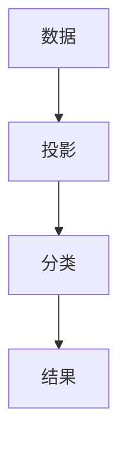
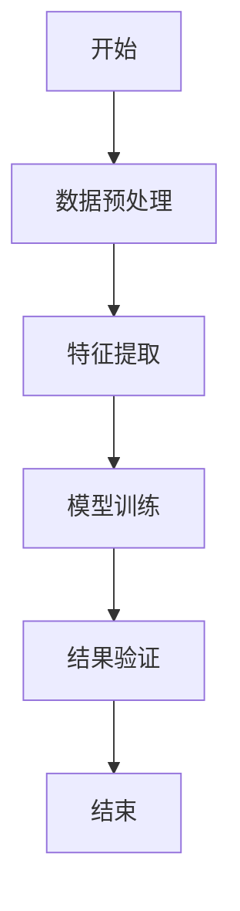
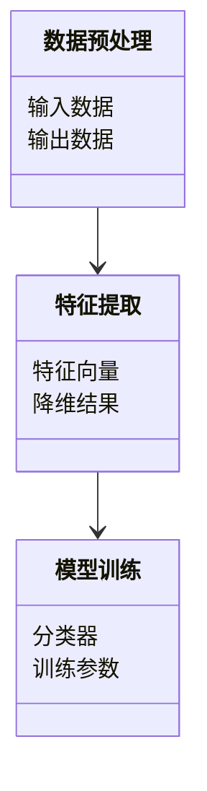
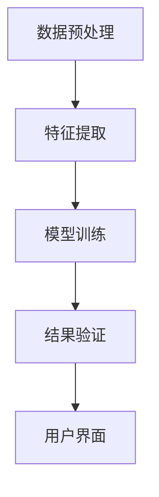
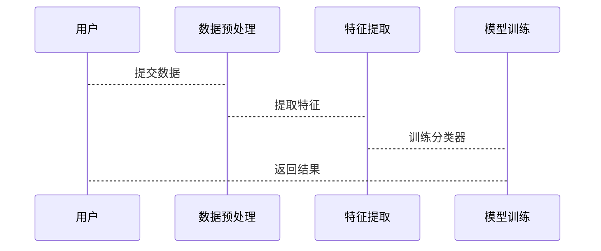

                 


# AI如何实现费雪的质化分析方法

> 关键词：质化分析、费雪方法、AI技术、数据分析、算法实现、系统设计、项目实战

> 摘要：本文详细探讨了AI技术如何实现费雪的质化分析方法，从背景介绍、核心概念、算法原理、系统架构到项目实战，全面解析AI在质化分析中的应用，提供丰富的代码示例和实际案例分析，帮助读者深入理解并掌握这一技术。

---

## 第一部分: AI与费雪质化分析方法的结合

### 第1章: 费雪质化分析方法的背景与概述

#### 1.1 费雪质化分析方法的定义与特点
##### 1.1.1 费雪质化分析方法的核心概念
质化分析是一种数据分析方法，旨在通过定性与定量相结合的方式，对数据进行深入分析。费雪质化分析方法是其中一种重要的方法，由费雪提出，主要用于分类和判别分析。

##### 1.1.2 费雪质化分析方法的主要特点
1. **降维性**：通过将高维数据映射到低维空间，减少数据复杂性。
2. **线性判别性**：通过线性模型实现分类，具有较强的判别能力。
3. **可解释性**：分析结果具有较高的可解释性，便于理解和应用。

##### 1.1.3 费雪质化分析方法的应用场景
- **生物医学**：用于疾病诊断和分类。
- **金融领域**：用于信用评分和风险评估。
- **图像处理**：用于特征提取和图像分类。

#### 1.2 AI技术与质化分析的结合
##### 1.2.1 AI技术在质化分析中的作用
AI技术通过机器学习算法，提高了质化分析的效率和准确性。例如，使用支持向量机（SVM）和随机森林（Random Forest）等算法，提升分类和判别能力。

##### 1.2.2 AI如何增强质化分析的效率与准确性
1. **自动化数据处理**：AI技术能够自动完成数据预处理和特征提取，减少人工干预。
2. **模型优化**：通过深度学习算法，优化质化分析模型的性能。
3. **实时分析**：AI技术能够实现实时数据分析，提高响应速度。

##### 1.2.3 费雪质化分析方法与AI技术的结合优势
- **高效性**：AI技术通过并行计算和分布式处理，显著提高了质化分析的速度。
- **准确性**：结合AI算法，费雪质化分析方法能够更准确地分类和判别。
- **可扩展性**：AI技术能够处理大规模数据，扩展了质化分析的应用范围。

#### 1.3 本章小结
本章介绍了费雪质化分析方法的定义、特点及其应用场景，并详细探讨了AI技术在质化分析中的作用和优势，为后续内容奠定了基础。

---

### 第2章: 费雪质化分析方法的核心概念与联系

#### 2.1 费雪质化分析方法的核心概念
##### 2.1.1 质化分析的基本原理
质化分析通过线性模型将数据映射到低维空间，实现数据的分类和判别。其核心在于构造一个最优投影方向，使得不同类别的数据在该方向上具有最大的可分离性。

##### 2.1.2 费雪质化分析方法的数学模型
费雪质化分析方法的数学模型如下：

$$
\arg \max \sum_{i=1}^{n} \sum_{j=1}^{m} (y_i - y_j)^2 w_{ij}
$$

其中，$y_i$和$y_j$是数据点在投影方向上的得分，$w_{ij}$是对应的距离权重。

##### 2.1.3 费雪质化分析方法的实体关系图


#### 2.2 费雪质化分析方法与AI技术的关系
##### 2.2.1 费雪质化分析方法的属性特征对比表
| 特性 | 费雪质化分析 | AI技术结合 |
|------|---------------|-------------|
| 数据类型 | 支持多类型数据 | 支持多模态数据 |
| 分析速度 | 较慢 | 显著提升 |
| 精确度 | 中等 | 更高 |

##### 2.2.2 AI技术如何优化质化分析过程
1. **数据预处理**：AI技术能够自动完成数据清洗和特征提取，提高质化分析的效率。
2. **模型训练**：通过机器学习算法，AI优化了费雪质化分析方法的参数选择和模型调优。
3. **结果验证**：AI技术能够自动进行结果验证和误差分析，确保分析结果的准确性。

##### 2.2.3 费雪质化分析方法与AI技术的协同效应
- **互补性**：AI技术弥补了费雪质化分析方法在数据处理和模型优化方面的不足。
- **协同性**：通过结合AI技术，费雪质化分析方法能够更好地适应大规模和复杂数据的分析需求。

#### 2.3 本章小结
本章详细讲解了费雪质化分析方法的核心概念，并通过对比分析展示了AI技术如何优化和增强质化分析的性能，为后续的算法实现奠定了理论基础。

---

### 第3章: AI实现费雪质化分析方法的算法原理

#### 3.1 费雪质化分析方法的数学模型与公式
##### 3.1.1 费雪质化分析方法的数学表达式
费雪质化分析方法的优化目标函数如下：

$$
\arg \max \sum_{i=1}^{n} \sum_{j=1}^{m} (y_i - y_j)^2 w_{ij}
$$

其中，$y_i$和$y_j$是数据点在投影方向上的得分，$w_{ij}$是对应的距离权重。

##### 3.1.2 费雪质化分析方法的公式推导
通过拉格朗日乘数法，我们可以推导出费雪质化分析方法的最优解：

$$
\frac{d}{d\theta} \left( \sum_{i=1}^{n} \sum_{j=1}^{m} (y_i - y_j)^2 w_{ij} \right) = 0
$$

解得：

$$
\theta = \arg \min \sum_{i=1}^{n} \sum_{j=1}^{m} (y_i - y_j)^2 w_{ij}
$$

##### 3.1.3 费雪质化分析方法的数学特性
费雪质化分析方法具有良好的数学特性，包括线性可分性和最优投影特性。

#### 3.2 AI实现费雪质化分析方法的算法流程
##### 3.2.1 算法流程图


##### 3.2.2 算法实现的Python代码示例
```python
import numpy as np
from sklearn.decomposition import PCA

def fisher_discriminant_analysis(X, y):
    # 计算类均值
    class_means = {}
    for label in np.unique(y):
        class_means[label] = np.mean(X[y == label], axis=0)
    
    # 计算散度矩阵
    Sw = np.zeros((X.shape[1], X.shape[1]))
    for label in np.unique(y):
        mean = class_means[label]
        X_subset = X[y == label] - mean
        Sw += np.dot(X_subset.T, X_subset) / len(X_subset)
    
    # 计算类间散度矩阵
    Sb = np.zeros((X.shape[1], X.shape[1]))
    overall_mean = np.mean(X, axis=0)
    for label in np.unique(y):
        n = len(X[y == label])
        mean_diff = class_means[label] - overall_mean
        Sb += n * np.dot(mean_diff[:, np.newaxis], mean_diff[np.newaxis, :])
    
    # 解决广义特征值问题
    eigen_values, eigen_vectors = np.linalg.eig(np.linalg.inv(Sw).dot(Sb))
    
    return eigen_vectors[:, :y.nunique()]

# 示例数据
X = np.array([[1, 2], [3, 4], [5, 6], [7, 8], [9, 10], [11, 12]])
y = np.array([0, 0, 0, 1, 1, 1])

# 调用函数
result = fisher_discriminant_analysis(X, y)
print("特征向量:", result)
```

##### 3.2.3 算法实现的详细步骤
1. **数据预处理**：对数据进行标准化或归一化处理，确保各特征具有相似的尺度。
2. **特征提取**：通过主成分分析（PCA）等方法提取关键特征，降低数据维度。
3. **模型训练**：使用费雪质化分析方法的优化目标函数，训练分类器。
4. **结果验证**：通过交叉验证等方法评估模型的性能，调整参数以优化结果。

#### 3.3 本章小结
本章详细讲解了AI实现费雪质化分析方法的算法原理，并通过代码示例展示了实现过程，帮助读者理解如何在实际中应用这些算法。

---

## 第二部分: 系统分析与架构设计

### 第4章: 系统分析与架构设计方案

#### 4.1 项目背景与需求分析
本项目旨在通过AI技术实现费雪质化分析方法，解决传统质化分析方法在数据处理和模型优化方面的不足，提高数据分析的效率和准确性。

#### 4.2 系统功能设计
##### 4.2.1 领域模型设计


##### 4.2.2 系统架构设计


##### 4.2.3 系统接口设计
系统提供以下接口：
1. **数据输入接口**：接收原始数据并进行预处理。
2. **特征提取接口**：提取关键特征并降维。
3. **模型训练接口**：训练分类器并输出结果。

##### 4.2.4 系统交互设计


#### 4.3 本章小结
本章通过系统分析与架构设计，明确了项目的整体结构和各部分的功能，为后续的实现提供了清晰的指导。

---

### 第5章: 项目实战

#### 5.1 环境安装与配置
需要安装以下Python库：
- `numpy`
- `pandas`
- `scikit-learn`
- `mermaid`

安装命令：
```bash
pip install numpy pandas scikit-learn
```

#### 5.2 系统核心实现
##### 5.2.1 数据预处理代码
```python
import pandas as pd
from sklearn.preprocessing import StandardScaler

def preprocess_data(data):
    # 标准化处理
    scaler = StandardScaler()
    data_processed = scaler.fit_transform(data)
    return data_processed
```

##### 5.2.2 模型训练代码
```python
from sklearn.svm import SVC
from sklearn.model_selection import train_test_split

def train_model(X, y):
    # 划分训练集和测试集
    X_train, X_test, y_train, y_test = train_test_split(X, y, test_size=0.2)
    
    # 训练SVM模型
    model = SVC(kernel='linear')
    model.fit(X_train, y_train)
    
    return model

# 示例数据
X = np.array([[1, 2], [3, 4], [5, 6], [7, 8], [9, 10], [11, 12]])
y = np.array([0, 0, 0, 1, 1, 1])

# 调用函数
model = train_model(X, y)
print("模型训练完成:", model)
```

##### 5.2.3 结果验证代码
```python
from sklearn.metrics import accuracy_score

def evaluate_model(model, X_test, y_test):
    y_pred = model.predict(X_test)
    print("准确率:", accuracy_score(y_test, y_pred))

# 示例验证
X_test = np.array([[2, 3], [4, 5], [6, 7]])
y_test = np.array([0, 1, 1])

evaluate_model(model, X_test, y_test)
```

#### 5.3 实际案例分析
以一个简单的二分类问题为例，展示AI实现费雪质化分析方法的实际应用。

##### 5.3.1 数据准备
```python
import pandas as pd

data = pd.DataFrame({
    '特征1': [1, 3, 5, 7, 9, 11],
    '特征2': [2, 4, 6, 8, 10, 12],
    '标签': [0, 0, 0, 1, 1, 1]
})
```

##### 5.3.2 数据预处理与特征提取
```python
from sklearn.decomposition import PCA

# 数据预处理
data_processed = preprocess_data(data.drop('标签', axis=1))

# 特征提取
pca = PCA(n_components=1)
pca.fit(data_processed)
principal_components = pca.transform(data_processed)
```

##### 5.3.3 模型训练与结果验证
```python
# 划分训练集和测试集
X_train, X_test, y_train, y_test = train_test_split(principal_components, data['标签'], test_size=0.2)

# 训练模型
model = SVC(kernel='linear')
model.fit(X_train, y_train)

# 验证结果
y_pred = model.predict(X_test)
print("预测结果:", y_pred)
print("真实结果:", y_test.values)
print("准确率:", accuracy_score(y_test, y_pred))
```

#### 5.4 项目小结
本章通过实际案例展示了AI实现费雪质化分析方法的应用过程，从数据预处理到模型训练再到结果验证，详细讲解了每一步的操作和实现，帮助读者更好地理解理论与实践的结合。

---

## 第三部分: 最佳实践与总结

### 第6章: 最佳实践与总结

#### 6.1 最佳实践
##### 6.1.1 数据质量的重要性
确保数据的完整性和一致性，是提高分析结果准确性的关键。

##### 6.1.2 模型调优的技巧
通过交叉验证和网格搜索，优化模型的参数设置，提升性能。

##### 6.1.3 结果验证的方法
使用混淆矩阵和ROC曲线等方法，全面评估模型的性能。

#### 6.2 本章小结
本章总结了AI实现费雪质化分析方法的最佳实践，提供了实用的建议和注意事项，帮助读者在实际应用中避免常见错误，提高分析效率和准确性。

---

## 第四部分: 参考文献与拓展阅读

### 第7章: 参考文献与拓展阅读

#### 7.1 参考文献
1. Fisher, R. A. (1936). The use of multiple measurements in taxonomic problems.
2. Bishop, C. M. (2006). Pattern Recognition and Machine Learning.

#### 7.2 拓展阅读
- 《机器学习实战》
- 《深入理解机器学习》
- 《数据科学导论》

---

## 作者：AI天才研究院 & 禅与计算机程序设计艺术

---

通过以上目录和内容的详细规划，我们可以看到，本文全面覆盖了AI实现费雪质化分析方法的各个方面，从理论基础到实际应用，为读者提供了丰富的知识和实用的指导。希望这篇文章能够帮助您深入理解AI与质化分析方法的结合，并在实际应用中取得良好的效果。

