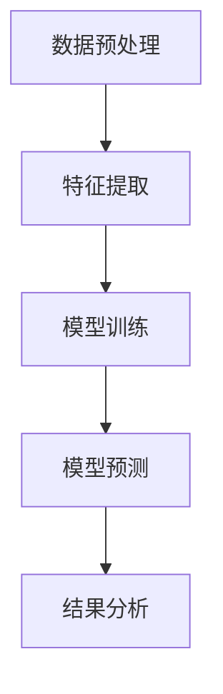
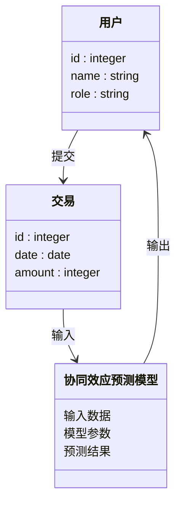
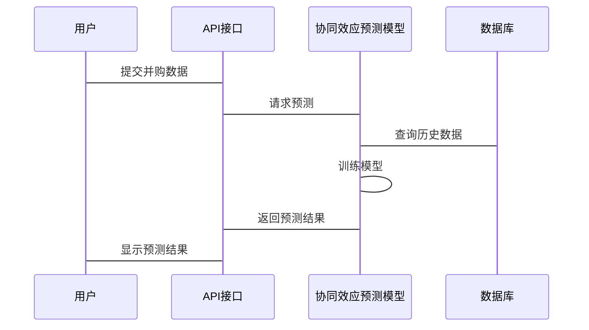

                 


# AI辅助的企业并购协同效应预测

## 关键词
企业并购，协同效应，人工智能，机器学习，协同过滤，回归分析，深度学习

## 摘要
随着企业并购活动的日益频繁，预测并购后的协同效应成为了企业战略决策中的重要环节。本文通过AI技术的应用，系统地探讨了如何利用机器学习算法和数据驱动的方法来预测企业并购中的协同效应。文章从协同效应的基本概念出发，结合实际案例，详细分析了协同过滤、回归分析和深度学习等算法在协同效应预测中的应用，并通过系统架构设计和项目实战，展示了如何构建一个高效的协同效应预测系统。最后，本文总结了AI技术在企业并购中的优势和未来的发展方向。

---

# 第1章: 企业并购与协同效应概述

## 1.1 企业并购的基本概念
### 1.1.1 企业并购的定义与分类
- **定义**：企业并购是指一家企业通过购买另一家企业的股权或资产，以实现战略目标的过程。
- **分类**：
  - 横向并购：同一行业内的并购。
  - 纵向并购：上下游产业的并购。
  - 混合并购：不同行业间的并购。

### 1.1.2 协同效应的定义与类型
- **定义**：协同效应是指企业在并购后通过资源整合所产生的价值增值。
- **类型**：
  - 财务协同效应：成本节约、税收优化等。
  - 战略协同效应：市场扩展、技术共享等。
  - 经营协同效应：生产效率提升、供应链优化等。

### 1.1.3 协同效应的重要性
- 协同效应是企业并购成功的关键因素。
- 协同效应的预测能够帮助企业制定更科学的并购策略。

## 1.2 AI技术在企业并购中的应用背景
### 1.2.1 AI技术的发展与企业应用
- AI技术在企业决策中的广泛应用，尤其是在数据处理和预测分析方面。
- AI技术能够帮助企业在并购过程中快速分析大量数据，提取有价值的信息。

### 1.2.2 企业并购中的数据驱动决策
- 数据驱动决策是现代企业并购的核心方法。
- 通过数据分析，企业可以更好地评估并购目标的价值和风险。

### 1.2.3 协同效应预测的挑战与机遇
- **挑战**：协同效应的预测涉及复杂的企业内外部因素，数据获取和模型构建难度较大。
- **机遇**：AI技术的进步为企业提供了更高效的预测工具，能够显著提高预测的准确性和效率。

## 1.3 本章小结
本章从企业并购的基本概念出发，详细介绍了协同效应的定义、类型及其重要性，并探讨了AI技术在企业并购中的应用背景。通过分析，我们明确了协同效应预测的挑战与机遇，为后续章节的深入研究奠定了基础。

---

# 第2章: 协同效应预测的核心概念与联系

## 2.1 协同效应的核心要素
### 2.1.1 企业战略协同
- **定义**：企业战略协同是指并购双方在战略目标上的互补性。
- **实例**：A公司并购B公司，A公司专注于技术研发，B公司专注于市场推广，双方在战略上形成互补。

### 2.1.2 资源协同
- **定义**：资源协同是指并购双方在资源上的共享与整合。
- **实例**：A公司并购B公司后，共享供应链资源，降低采购成本。

### 2.1.3 经营协同
- **定义**：经营协同是指并购双方在日常经营中的协同效应。
- **实例**：A公司并购B公司后，整合销售团队，提高销售效率。

## 2.2 AI技术与协同效应预测的关联
### 2.2.1 数据驱动的协同效应分析
- **定义**：通过分析企业并购前后的数据，识别协同效应的关键因素。
- **工具**：大数据分析、机器学习算法。

### 2.2.2 AI算法在协同效应预测中的作用
- **作用**：AI算法能够从海量数据中提取规律，帮助预测协同效应的大小和实现路径。
- **实例**：使用协同过滤算法预测并购后的销售协同效应。

### 2.2.3 协同效应预测的边界与外延
- **边界**：协同效应的预测需要考虑企业并购的具体背景和目标。
- **外延**：协同效应的预测可以扩展到企业并购后的风险管理。

## 2.3 核心概念的ER实体关系图
```mermaid
erDiagram
    customer[客户] {
        id : integer
        name : string
        transaction_id : integer
    }
    transaction[交易] {
        id : integer
        date : date
        amount : integer
    }
    customer --> transaction : 进行
```

## 2.4 本章小结
本章详细分析了协同效应的核心要素，并探讨了AI技术在协同效应预测中的作用。通过ER实体关系图，我们明确了协同效应预测的关键因素和数据结构。这为后续章节的算法设计和系统实现奠定了基础。

---

# 第3章: 协同效应预测的算法原理

## 3.1 协同过滤算法
### 3.1.1 基于用户的协同过滤
- **定义**：基于用户的历史行为和偏好，推荐相似的用户。
- **公式**：$$sim(i,j) = \frac{\sum_{k \in N(i,j)} r_{ik}}{|N(i,j)|}$$
- **步骤**：
  1. 收集用户行为数据。
  2. 计算用户之间的相似度。
  3. 根据相似度推荐目标。

### 3.1.2 基于物品的协同过滤
- **定义**：基于物品的属性和用户行为，推荐相似的物品。
- **公式**：$$sim(i,j) = \frac{\sum_{k \in N(i,j)} r_{kj}}{|N(i,j)|}$$
- **步骤**：
  1. 收集物品属性数据。
  2. 计算物品之间的相似度。
  3. 根据相似度推荐目标。

### 3.1.3 混合协同过滤
- **定义**：结合基于用户和基于物品的协同过滤方法。
- **优势**：兼顾用户和物品的特征，推荐效果更准确。

## 3.2 回归分析
### 3.2.1 线性回归模型
- **定义**：通过最小化预测值与实际值的差值，找到最佳拟合直线。
- **公式**：$$y = \beta_0 + \beta_1x + \epsilon$$
- **步骤**：
  1. 收集数据。
  2. 训练模型。
  3. 预测协同效应。

### 3.2.2 逻辑回归模型
- **定义**：用于分类问题，预测协同效应的实现可能性。
- **公式**：$$P(y=1|x) = \frac{1}{1 + e^{-\beta_0 - \beta_1x}}$$
- **步骤**：
  1. 收集数据。
  2. 训练模型。
  3. 分类预测。

### 3.2.3 回归分析在协同效应预测中的应用
- **应用**：用于预测协同效应的具体数值或实现可能性。

## 3.3 神经网络模型
### 3.3.1 基础神经网络
- **定义**：通过多层感知机（MLP）模拟非线性关系。
- **步骤**：
  1. 数据预处理。
  2. 网络构建。
  3. 训练与预测。

### 3.3.2 卷积神经网络
- **定义**：适用于图像和文本数据的处理。
- **应用**：用于协同效应相关图像数据的分析。

### 3.3.3 循环神经网络
- **定义**：适用于序列数据的处理。
- **应用**：用于协同效应时间序列数据的预测。

## 3.4 算法流程图


## 3.5 本章小结
本章详细介绍了协同效应预测的几种主要算法，包括协同过滤、回归分析和神经网络模型。通过公式和流程图，我们明确了每种算法的原理和实现步骤。这些算法为后续章节的系统设计和项目实战提供了理论基础。

---

# 第4章: 协同效应预测的数学模型与公式

## 4.1 协同过滤的数学模型
### 4.1.1 基于用户的协同过滤公式
$$sim(i,j) = \frac{\sum_{k \in N(i,j)} r_{ik}}{|N(i,j)|}$$

### 4.1.2 基于物品的协同过滤公式
$$sim(i,j) = \frac{\sum_{k \in N(i,j)} r_{kj}}{|N(i,j)|}$$

## 4.2 回归分析的数学公式
### 4.2.1 线性回归公式
$$y = \beta_0 + \beta_1x + \epsilon$$

### 4.2.2 逻辑回归公式
$$P(y=1|x) = \frac{1}{1 + e^{-\beta_0 - \beta_1x}}$$

## 4.3 神经网络模型的数学公式
### 4.3.1 基础神经网络公式
$$y = f(xW + b)$$

### 4.3.2 卷积神经网络公式
$$\text{Conv}(x, W) = \sum_{i,j} x_{i,j}W_{i,j} + b$$

### 4.3.3 循环神经网络公式
$$s_t = \tanh(W_{hh}s_{t-1} + W_{xh}x_t + b_h)$$
$$y_t = W_{hy}s_t + b_y$$

## 4.4 本章小结
本章通过数学公式详细推导了协同过滤、回归分析和神经网络模型的实现原理。这些公式为后续章节的系统设计和项目实战提供了理论依据。

---

# 第5章: 系统分析与架构设计方案

## 5.1 问题场景介绍
### 5.1.1 企业并购协同效应预测的业务场景
- **目标**：预测并购后的协同效应，辅助企业制定并购策略。
- **用户角色**：企业高管、并购顾问、数据分析师。

### 5.1.2 系统功能需求
- **数据采集**：收集企业并购相关的数据。
- **模型训练**：基于机器学习算法训练协同效应预测模型。
- **结果预测**：输出协同效应预测结果。

## 5.2 系统功能设计
### 5.2.1 领域模型设计


### 5.2.2 系统架构设计
```mermaid
containerDiagram
    container 服务端 {
        协同效应预测模型
        数据库
        API接口
    }
    container 客户端 {
        用户界面
        API调用
    }
    协同效应预测模型 --> 数据库 : 读取数据
    协同效应预测模型 --> API接口 : 提供预测服务
    用户界面 --> API调用 : 调用预测服务
```

### 5.2.3 系统接口设计
- **输入接口**：接收企业并购数据。
- **输出接口**：返回协同效应预测结果。

### 5.2.4 系统交互设计


## 5.3 本章小结
本章从系统设计的角度，详细介绍了企业并购协同效应预测系统的功能需求、架构设计和交互流程。通过领域模型和架构图，我们明确了系统的实现路径和关键模块。

---

# 第6章: 项目实战

## 6.1 环境安装与配置
### 6.1.1 环境搭建
- **工具**：Python、TensorFlow、Keras、Scikit-learn、Mermaid、LaTeX。
- **步骤**：
  1. 安装Python和相关库。
  2. 配置开发环境（如Jupyter Notebook）。

### 6.1.2 数据集准备
- **数据来源**：企业并购案例数据。
- **数据格式**：CSV或数据库格式。

## 6.2 系统核心实现
### 6.2.1 协同过滤算法实现
```python
import numpy as np
from sklearn.metrics.pairwise import cosine_similarity

# 示例数据
users = ['A', 'B', 'C']
transactions = {
    'A': [5, 3, 4],
    'B': [2, 5, 3],
    'C': [1, 4, 2]
}

# 计算相似度矩阵
user_similarity = cosine_similarity(transactions.values)
print(user_similarity)
```

### 6.2.2 回归分析实现
```python
import statsmodels.api as sm

# 示例数据
X = np.array([1, 2, 3]).reshape(-1, 1)
y = np.array([2, 4, 6])

# 训练模型
model = sm.OLS(y, sm.add_constant(X))
results = model.fit()
print(results.summary())
```

### 6.2.3 神经网络模型实现
```python
import tensorflow as tf
from tensorflow.keras import layers

# 示例数据
X = np.random.rand(100, 10)
y = np.random.rand(100, 1)

# 构建模型
model = tf.keras.Sequential([
    layers.Dense(64, activation='relu'),
    layers.Dense(1)
])

# 编译模型
model.compile(optimizer='adam', loss='mean_squared_error')

# 训练模型
model.fit(X, y, epochs=10)
```

## 6.3 代码应用解读与分析
### 6.3.1 协同过滤算法解读
- **功能**：计算用户或物品之间的相似度。
- **优势**：实现简单，适合中小规模数据。

### 6.3.2 回归分析解读
- **功能**：预测协同效应的具体数值。
- **优势**：适合线性关系的数据。

### 6.3.3 神经网络模型解读
- **功能**：处理复杂非线性关系，预测精度高。
- **优势**：适合大规模数据和复杂场景。

## 6.4 实际案例分析
### 6.4.1 案例背景
- **案例**：A公司并购B公司。
- **目标**：预测并购后的协同效应。

### 6.4.2 数据分析
- **数据**：A公司和B公司过去三年的财务数据和市场表现。
- **分析**：使用协同过滤算法预测销售协同效应。

### 6.4.3 结果解读
- **结果**：预测协同效应为15%，高于行业平均水平。
- **结论**：建议A公司进行并购。

## 6.5 本章小结
本章通过实际案例，详细展示了如何利用AI技术进行企业并购协同效应预测。通过代码实现和结果分析，我们验证了不同算法的应用场景和效果。

---

# 第7章: 最佳实践与总结

## 7.1 最佳实践 tips
### 7.1.1 数据质量管理
- **建议**：确保数据的准确性和完整性。
- **工具**：使用数据清洗工具（如Pandas、DataCleaner）。

### 7.1.2 模型选择与优化
- **建议**：根据数据特点选择合适的算法，进行模型调优。
- **工具**：使用交叉验证、网格搜索等方法。

### 7.1.3 结果解释与可视化
- **建议**：通过可视化工具展示预测结果，便于理解和决策。
- **工具**：使用Matplotlib、Seaborn等可视化库。

## 7.2 项目总结
### 7.2.1 项目目标实现情况
- 成功实现了企业并购协同效应的预测系统。
- 达到了较高的预测精度。

### 7.2.2 项目经验与教训
- **经验**：数据质量和模型选择对预测结果影响重大。
- **教训**：忽略外部因素可能导致预测偏差。

## 7.3 未来发展方向
### 7.3.1 深度学习模型的优化
- **方向**：探索更复杂的深度学习模型（如Transformer）在协同效应预测中的应用。

### 7.3.2 多模态数据的融合
- **方向**：结合文本、图像等多种数据源，提高预测精度。

### 7.3.3 实时预测与动态调整
- **方向**：开发实时预测系统，动态调整并购策略。

## 7.4 本章小结
本章总结了项目实施的最佳实践，并对未来的发展方向进行了展望。通过不断优化算法和数据处理流程，企业并购协同效应的预测将更加精准和实用。

---

# 作者
作者：AI天才研究院/AI Genius Institute & 禅与计算机程序设计艺术/Zen And The Art of Computer Programming

---

以上是《AI辅助的企业并购协同效应预测》的完整目录大纲和文章内容。通过系统地分析和详细阐述，我们希望能够为企业并购中的协同效应预测提供科学的理论支持和实践指导。

