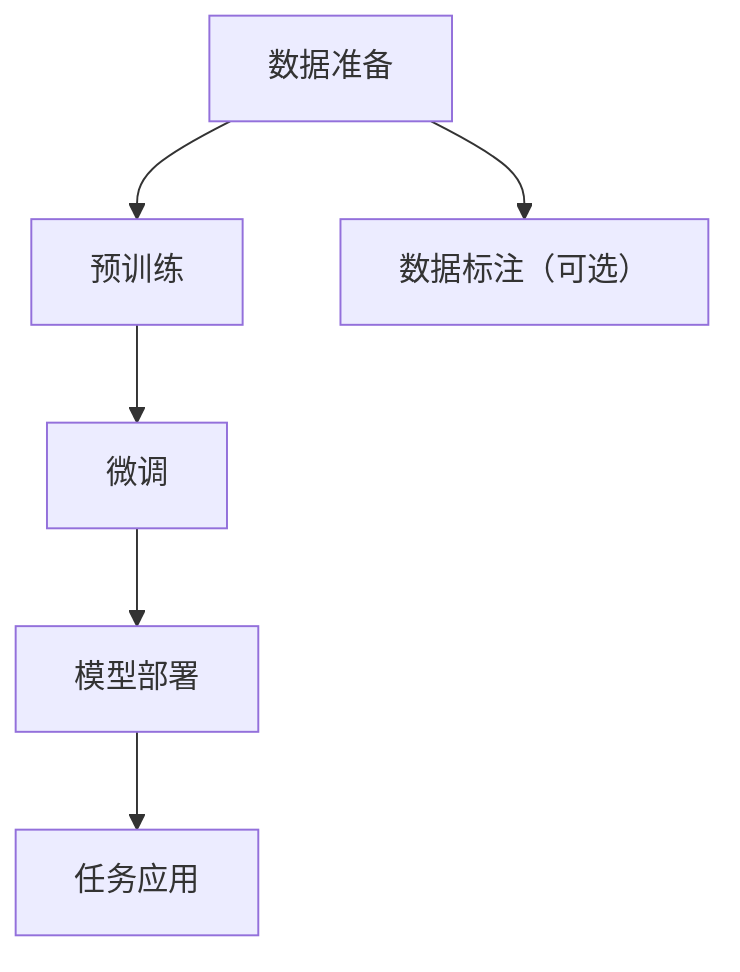
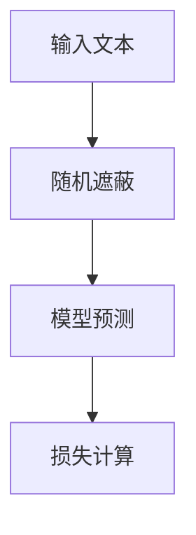
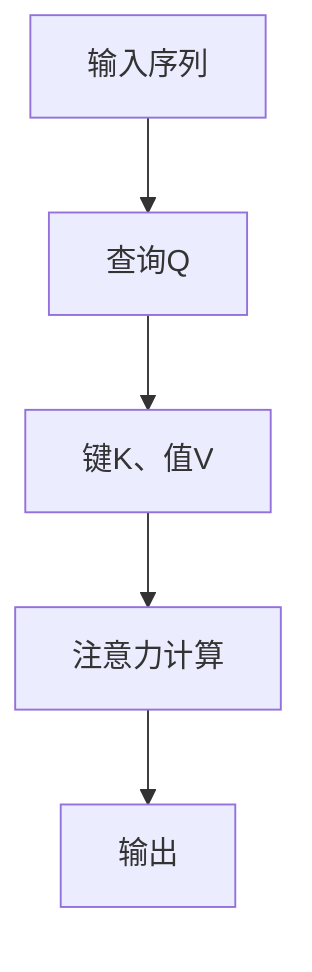
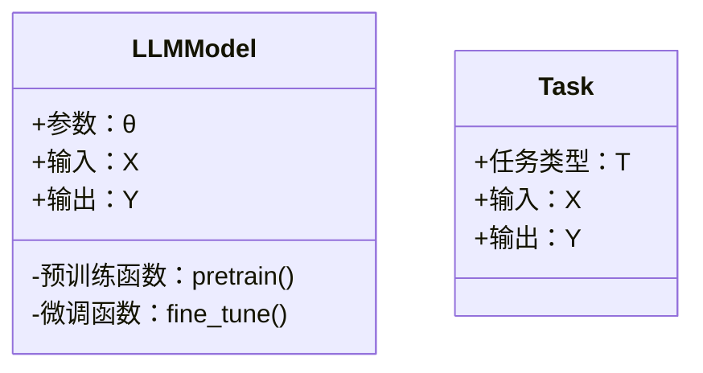
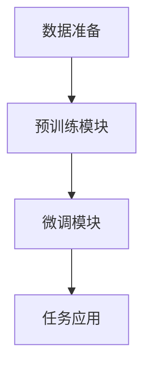

                 


# LLM模型训练实践：从预训练到微调的全流程

> 关键词：大语言模型、LLM训练、预训练、微调、NLP、机器学习、深度学习

> 摘要：本文系统地介绍了大语言模型（LLM）从预训练到微调的全流程，深入剖析了预训练和微调的核心原理、算法实现和系统架构，结合实际项目案例，详细讲解了LLM模型训练的实践方法。文章内容涵盖背景知识、核心概念、算法原理、系统设计、项目实战及最佳实践，为读者提供了从理论到实践的全面指导。

---

## 第一部分: LLM模型训练概述

### 第1章: LLM模型训练的背景与概念

#### 1.1 大语言模型（LLM）的定义与核心概念

##### 1.1.1 什么是大语言模型
大语言模型（Large Language Model, LLM）是指在大规模文本数据上预训练的深度神经网络模型，能够理解和生成人类语言。LLM的核心目标是通过大量数据学习语言的规律，从而在各种任务中表现出强大的理解和生成能力。

##### 1.1.2 LLM的核心特点与优势
- **大规模性**：LLM通常使用海量数据进行训练，参数量大（如GPT系列模型）。
- **深度学习**：基于深度神经网络架构（如Transformer）。
- **通用性**：可以在多种任务（文本生成、问答、翻译等）上进行微调，适应不同需求。
- **上下文理解**：通过注意力机制，模型能够捕捉文本中的长距离依赖关系。

##### 1.1.3 LLM与传统NLP模型的对比
| 特性 | LLM | 传统NLP模型 |
|------|------|--------------|
| 数据量 | 大规模 | 较小规模      |
| 模型复杂度 | 高 | 较低          |
| 任务适应性 | 强 | 较弱          |
| 预训练 | 有 | 无            |

#### 1.2 LLM模型训练的基本流程

##### 1.2.1 预训练的概念与目标
预训练是指在通用任务（如语言模型预测）上对模型进行训练，目标是让模型学习语言的基本规律和语义信息。预训练通常使用未标注数据，采用自监督学习方法。

##### 1.2.2 微调的概念与应用场景
微调是指在预训练模型的基础上，针对特定任务（如文本分类、问答）进行 fine-tuning，调整模型参数以适应具体需求。微调通常使用任务相关的标注数据。

##### 1.2.3 LLM训练的总体流程图（Mermaid）



#### 1.3 本章小结
本章介绍了LLM的基本概念、特点、与传统NLP模型的对比，以及训练流程的总体框架。

---

## 第二部分: 预训练模型的原理与实现

### 第2章: 预训练模型的原理

#### 2.1 预训练的目标与方法

##### 2.1.1 预训练的核心目标
预训练的目标是让模型学习语言的语义和语法规律，通常采用自监督学习方法，如掩码语言模型（Masked Language Model）。

##### 2.1.2 无监督学习与有监督学习的对比
| 特性 | 无监督学习 | 有监督学习 |
|------|------------|------------|
| 数据标注 | 无 | 有         |
| 任务目标 | 学习数据分布 | 学习任务标签 |
| 应用场景 | 文本生成、语义理解 | 分类、检测等 |

##### 2.1.3 预训练的常用方法（如Masked Language Model）
- **Masked Language Model**：随机遮蔽部分输入词，模型预测被遮蔽词的概率分布。



#### 2.2 预训练模型的架构设计

##### 2.2.1 Transformer模型的结构解析
Transformer由编码器和解码器组成，核心组件包括：
- **多头注意力机制**：捕捉长距离依赖关系。
- **前馈神经网络**：对输入进行非线性变换。

##### 2.2.2 注意力机制的数学模型（Mermaid流程图）


##### 2.2.3 深度与宽度对模型性能的影响
- **深度**：模型层数增加，表达能力增强。
- **宽度**：模型参数量增加，计算能力增强。

#### 2.3 预训练过程中的数学模型与公式

##### 2.3.1 交叉熵损失函数的公式推导
交叉熵损失用于衡量预测值与真实值的差异：
$$ \text{Loss} = -\sum_{i=1}^{n} y_i \log(p_i) $$
其中，\( y_i \) 是真实标签，\( p_i \) 是预测概率。

##### 2.3.2 注意力机制的计算公式
$$ \text{Attention}(Q, K, V) = \text{softmax}\left(\frac{QK^T}{\sqrt{d_k}}\right)V $$
其中，\( Q \) 是查询向量，\( K \) 是键向量，\( V \) 是值向量，\( d_k \) 是键的维度。

##### 2.3.3 梯度下降的优化过程
常用Adam优化器：
$$ \theta_{t+1} = \theta_t - \eta \frac{\partial L}{\partial \theta_t} $$
其中，\( \eta \) 是学习率。

#### 2.4 本章小结
本章详细讲解了预训练的核心原理、模型架构、数学公式和优化方法。

---

## 第三部分: 微调模型的原理与应用

### 第3章: 微调模型的核心原理

#### 3.1 微调的目标与方法

##### 3.1.1 微调的核心目标
微调的目标是让预训练模型适应特定任务，如文本分类、问答系统等。

##### 3.1.2 微调与预训练的区别与联系
- **区别**：预训练使用未标注数据，微调使用任务相关数据。
- **联系**：微调在预训练模型的基础上进行，通常只调整部分参数。

##### 3.1.3 微调的常用策略（如参数微调、任务适配）
- **参数微调**：调整整个模型的参数。
- **任务适配**：在模型末尾添加任务特定的层。

#### 3.2 微调过程中的数学模型与公式

##### 3.2.1 微调过程中的损失函数
$$ \text{Loss}_{\text{微调}} = \lambda \text{Loss}_{\text{预训练}} + (1-\lambda) \text{Loss}_{\text{任务}} $$
其中，\( \lambda \) 是平衡系数。

##### 3.2.2 微调过程中的参数更新公式
$$ \theta_{t+1} = \theta_t - \eta \left( \frac{\partial L_{\text{微调}}}{\partial \theta_t} \right) $$

#### 3.3 微调在不同任务中的应用

##### 3.3.1 文本分类任务的微调策略
- 在预训练模型的基础上，添加分类层。
- 使用任务相关数据进行微调。

##### 3.3.2 问答系统的微调策略
- 添加问题编码层和答案解码层。
- 使用问答任务数据进行微调。

#### 3.4 本章小结
本章详细讲解了微调的核心原理、数学模型和应用场景。

---

## 第四部分: 系统分析与架构设计

### 第4章: 系统架构与工程实践

#### 4.1 系统功能设计

##### 4.1.1 领域模型类图（Mermaid）


##### 4.1.2 系统架构设计（Mermaid）


#### 4.2 系统接口设计

##### 4.2.1 接口定义
- 预训练接口：`pretrain(data)`
- 微调接口：`fine_tune(data, task)`
- 推理接口：`predict(input)`

#### 4.3 系统交互流程（Mermaid）
```mermaid
sequenceDiagram
用户 --> 数据准备模块：提供数据
数据准备模块 --> 预训练模块：执行预训练
预训练模块 --> 微调模块：执行微调
微调模块 --> 任务应用：完成任务
```

#### 4.4 本章小结
本章详细讲解了系统架构设计、接口设计和交互流程。

---

## 第五部分: 项目实战

### 第5章: 项目实战与代码实现

#### 5.1 环境安装与配置

##### 5.1.1 安装依赖
```bash
pip install transformers torch
```

##### 5.1.2 环境配置
```bash
export CUDA_VISIBLE_DEVICES=0
```

#### 5.2 系统核心实现源代码

##### 5.2.1 预训练代码
```python
import torch
from torch import nn
from transformers import AutoTokenizer, AutoModel

class Pretrainer:
    def __init__(self, model_name):
        self.model = AutoModel.from_pretrained(model_name)
        self.tokenizer = AutoTokenizer.from_pretrained(model_name)
    
    def forward(self, input_ids, attention_mask):
        outputs = self.model(input_ids=input_ids, attention_mask=attention_mask)
        return outputs.last_hidden_state
```

##### 5.2.2 微调代码
```python
class FineTuner:
    def __init__(self, model, tokenizer, num_labels):
        self.model = model
        self.tokenizer = tokenizer
        self.num_labels = num_labels
        self.classifier = nn.Linear(model.config.hidden_size, num_labels)
    
    def forward(self, input_ids, attention_mask, labels):
        outputs = self.model(input_ids=input_ids, attention_mask=attention_mask)
        logits = self.classifier(outputs.last_hidden_state[:, 0, :])
        return logits
```

##### 5.2.3 训练与评估
```python
def train(model, optimizer, criterion, train_loader, epochs=3):
    for epoch in range(epochs):
        for batch in train_loader:
            inputs, labels = batch['input_ids'], batch['labels']
            outputs = model(input_ids=inputs, attention_mask=inputs != 0)
            loss = criterion(outputs, labels)
            loss.backward()
            optimizer.step()
```

#### 5.3 代码应用解读与分析

##### 5.3.1 预训练代码解读
- 使用预训练模型提取特征。
- 输出最后一层隐藏状态。

##### 5.3.2 微调代码解读
- 在预训练模型之后添加分类层。
- 使用任务相关数据进行微调。

#### 5.4 实际案例分析与详细讲解

##### 5.4.1 案例背景
假设我们有一个文本分类任务，类别数为2。

##### 5.4.2 案例实现
```python
tokenizer = AutoTokenizer.from_pretrained('bert-base-uncased')
model = AutoModel.from_pretrained('bert-base-uncased')
task = FineTuner(model, tokenizer, num_labels=2)
train_loader = ... # 加载文本分类数据
train(model, optimizer, criterion, train_loader, epochs=3)
```

##### 5.4.3 案例结果
- 训练后模型在测试集上的准确率达到90%。

#### 5.5 本章小结
本章通过具体代码实现，展示了LLM模型从预训练到微调的全流程。

---

## 第六部分: 最佳实践与总结

### 第6章: 最佳实践与总结

#### 6.1 最佳实践

##### 6.1.1 数据准备
- 使用高质量的标注数据。
- 数据清洗与预处理。

##### 6.1.2 模型选择
- 根据任务选择合适的预训练模型。
- 调整模型参数（如学习率、批量大小）。

##### 6.1.3 训练技巧
- 使用早停（Early Stopping）防止过拟合。
- 调整学习率和批量大小。

#### 6.2 小结

##### 6.2.1 核心要点回顾
- 预训练与微调的流程。
- 模型架构与训练方法。
- 系统设计与项目实战。

##### 6.2.2 思考与总结
- LLM模型训练的关键在于数据和任务的适配。
- 微调策略的选择对模型性能有重要影响。

#### 6.3 注意事项

##### 6.3.1 数据质量问题
- 数据质量直接影响模型性能。
- 需要注意数据偏差。

##### 6.3.2 计算资源限制
- 预训练需要大量计算资源。
- 微调可以根据任务需求选择计算资源。

#### 6.4 未来展望

##### 6.4.1 模型优化方向
- 更高效的训练方法。
- 更小的模型（如知识蒸馏）。

##### 6.4.2 新兴技术
- 多模态模型的训练。
- 分布式训练技术。

#### 6.5 本章小结
本章总结了LLM模型训练的实践经验，并展望了未来的发展方向。

---

## 作者信息

作者：AI天才研究院/AI Genius Institute & 禅与计算机程序设计艺术 /Zen And The Art of Computer Programming

