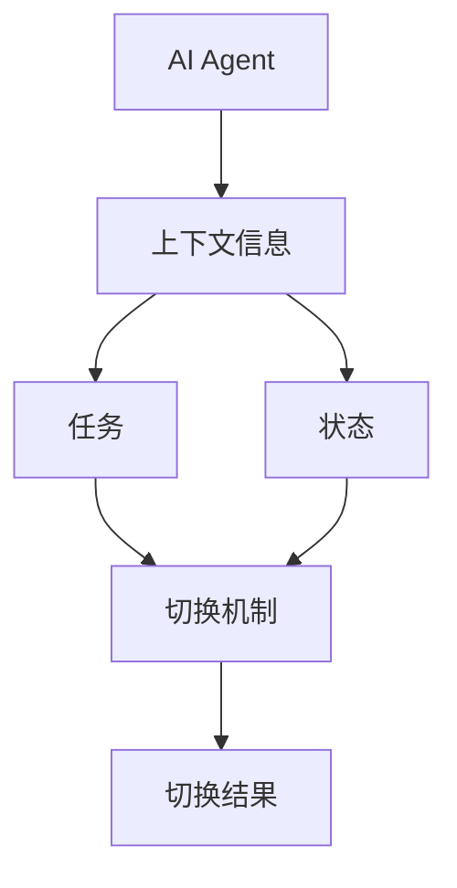
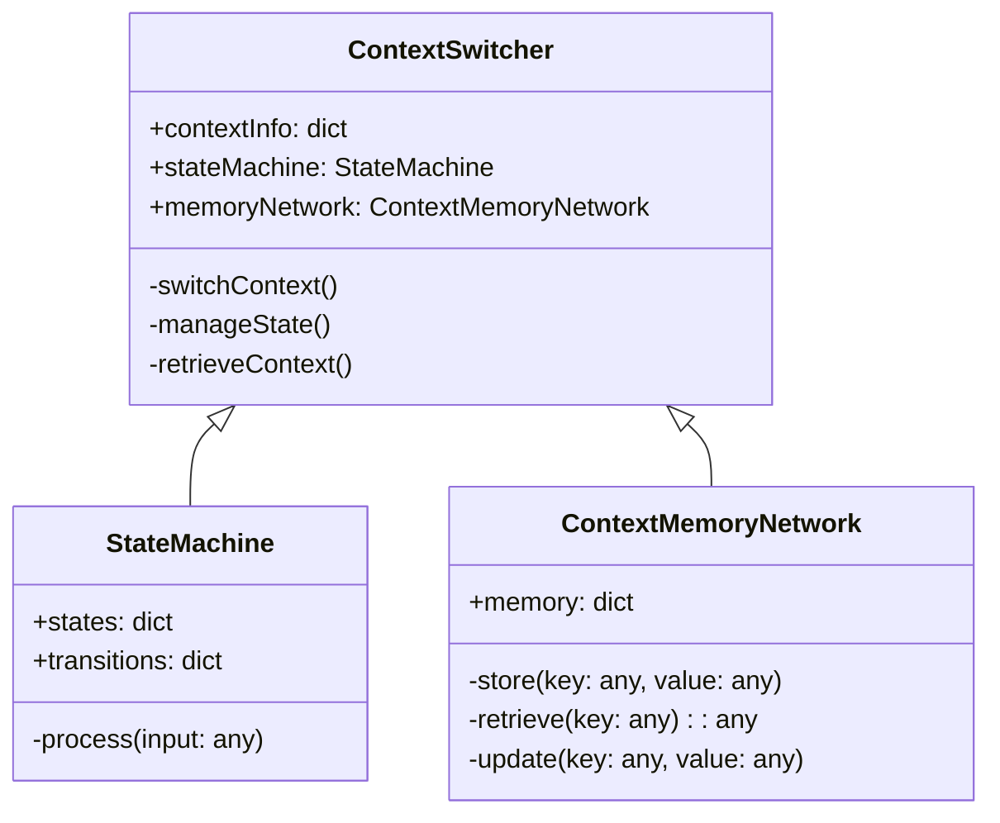
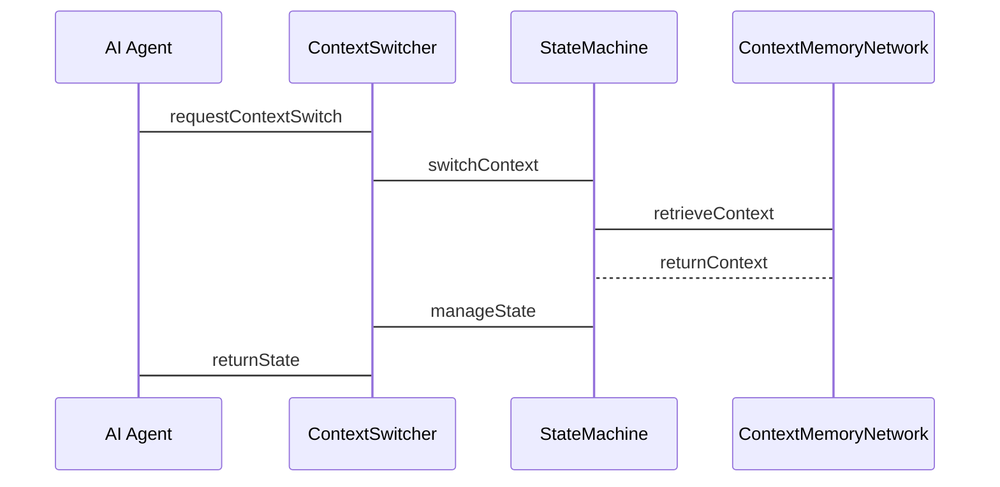

                 


# 上下文切换：让AI Agent更灵活地处理复杂场景

## 关键词：
上下文切换, AI Agent, 复杂场景, 状态管理, 记忆机制, 人工智能, 系统架构

## 摘要：
上下文切换是AI Agent在处理复杂场景时的关键能力，它允许AI在不同任务和上下文中灵活切换，从而提高处理效率和准确性。本文详细介绍了上下文切换的核心概念、算法原理、系统架构设计以及项目实战，通过实例分析展示了如何在实际应用中实现上下文切换，帮助AI Agent更好地应对复杂场景的挑战。

---

# 第一部分: 上下文切换的背景与核心概念

## 第1章: 上下文切换概述

### 1.1 什么是上下文切换
#### 1.1.1 上下文切换的定义
上下文切换是指AI Agent在处理不同任务或场景时，能够快速调整其处理逻辑和上下文信息，以应对复杂情况的能力。这种能力允许AI Agent在不同的上下文中切换，确保在每个场景中都能高效、准确地完成任务。

#### 1.1.2 上下文切换的必要性
在现实应用中，AI Agent需要处理的任务往往是多样且复杂的。例如，一个智能客服机器人可能需要在处理客户咨询的同时，还要协调内部资源、跟踪订单状态等。在这种情况下，上下文切换能够帮助AI Agent在不同任务之间无缝切换，避免信息丢失和处理错误。

#### 1.1.3 上下文切换的核心要素
上下文切换的核心要素包括：
1. **上下文信息**：包括任务相关的数据、状态和规则。
2. **切换机制**：用于在不同的上下文之间切换的逻辑和算法。
3. **状态管理**：确保AI Agent在切换上下文时保持正确的状态。

### 1.2 AI Agent与上下文切换的关系
#### 1.2.1 AI Agent的基本概念
AI Agent是一种智能体，能够感知环境、自主决策并执行任务。AI Agent可以是软件程序，也可以是物理机器人，其核心能力包括感知、推理、规划和执行。

#### 1.2.2 复杂场景对AI Agent的挑战
在复杂场景中，AI Agent需要处理多个任务和上下文信息。例如，在医疗领域，AI Agent可能需要同时处理病人的诊断、治疗方案和药品管理等任务。这些任务之间的关联性和依赖性要求AI Agent能够高效地进行上下文切换。

#### 1.2.3 上下文切换在AI Agent中的作用
上下文切换在AI Agent中的作用是确保其能够在不同的任务和场景之间无缝切换，同时保持上下文信息的准确性和一致性。这不仅提高了AI Agent的处理效率，还减少了错误的发生。

### 1.3 上下文切换的背景与问题背景
#### 1.3.1 当前AI Agent的局限性
尽管AI Agent在许多领域取得了显著的进展，但在处理复杂场景时仍然存在一些局限性。例如，AI Agent在处理多个任务时，可能会因为上下文信息的冲突而导致错误。

#### 1.3.2 上下文切换的提出背景
为了克服AI Agent在复杂场景中的局限性，上下文切换的概念应运而生。通过上下文切换，AI Agent能够在不同的任务和场景之间灵活切换，从而提高其处理复杂场景的能力。

#### 1.3.3 问题的边界与外延
上下文切换的问题边界包括：
1. **任务切换**：AI Agent需要在不同的任务之间切换。
2. **上下文管理**：AI Agent需要管理多个上下文信息。
3. **切换策略**：AI Agent需要选择合适的切换策略以确保高效切换。

上下文切换的外延包括：
1. **状态管理**：确保AI Agent在切换上下文时保持正确的状态。
2. **信息共享**：在不同的上下文之间共享信息。
3. **错误处理**：在切换上下文时处理可能出现的错误。

### 1.4 上下文切换的核心概念结构
#### 1.4.1 核心概念的组成
上下文切换的核心概念包括：
1. **上下文信息**：包括任务相关的数据、状态和规则。
2. **切换机制**：用于在不同的上下文之间切换的逻辑和算法。
3. **状态管理**：确保AI Agent在切换上下文时保持正确的状态。

#### 1.4.2 核心概念的属性特征对比
以下是核心概念的属性特征对比表：

| 概念         | 属性                | 特征对比          |
|--------------|---------------------|-------------------|
| 上下文信息    | 数据类型            | 文本、数值、结构化数据 |
|               | 信息粒度            | 细粒度、粗粒度    |
| 切换机制     | 切换条件            | 时间、事件、状态变化 |
|               | 切换方式            | 同步、异步        |
| 状态管理      | 状态表示            | 标识符、状态机模型  |
|               | 状态转移            | 状态机模型、规则驱动 |

#### 1.4.3 实体关系图（ER图）



---

# 第二部分: 上下文切换的核心原理与算法

## 第2章: 上下文切换的核心原理

### 2.1 上下文切换的原理概述
#### 2.1.1 状态管理机制
状态管理机制是上下文切换的核心，它确保AI Agent在切换上下文时保持正确的状态。状态管理机制包括状态表示、状态转移和状态恢复。

#### 2.1.2 上下文记忆机制
上下文记忆机制用于存储和管理上下文信息，确保AI Agent在切换上下文时能够快速访问所需的信息。记忆机制包括记忆存储、记忆检索和记忆更新。

#### 2.1.3 上下文切换的触发条件
上下文切换的触发条件包括：
1. **时间触发**：根据时间周期进行切换。
2. **事件触发**：根据特定事件进行切换。
3. **状态触发**：根据状态变化进行切换。

### 2.2 上下文切换的算法原理
#### 2.2.1 状态机模型
状态机模型是一种常用的上下文切换算法，它通过状态转移来实现上下文切换。状态机模型包括状态、转移、动作和事件。

#### 2.2.2 上下文记忆网络
上下文记忆网络是一种基于神经网络的上下文切换算法，它通过记忆网络存储上下文信息，并通过神经网络进行推理和切换。

#### 2.2.3 上下文切换的数学模型
上下文切换的数学模型包括状态转移概率、上下文相似度计算和切换策略优化。以下是状态转移概率的公式：

$$ P(s_{t+1} | s_t, a_t) $$

其中，$s_t$ 是当前状态，$a_t$ 是当前动作，$s_{t+1}$ 是下一状态。

### 2.3 上下文切换的算法实现

#### 2.3.1 状态机模型的实现
以下是状态机模型的Python代码实现：

```python
class StateMachine:
    def __init__(self):
        self.states = {}
        self.transitions = {}

    def add_state(self, name, function):
        self.states[name] = function

    def add_transition(self, from_state, to_state, condition, action):
        key = (from_state, to_state, condition)
        self.transitions[key] = action

    def process(self, current_state, input):
        for (from_state, to_state, condition), action in self.transitions.items():
            if from_state == current_state and condition(input):
                current_state = to_state
                action()
                return current_state
        return current_state
```

#### 2.3.2 上下文记忆网络的实现
以下是上下文记忆网络的Python代码实现：

```python
class ContextMemoryNetwork:
    def __init__(self, memory_size):
        self.memory = {}
        self.memory_size = memory_size

    def store(self, key, value):
        self.memory[key] = value

    def retrieve(self, key):
        return self.memory.get(key, None)

    def update(self, key, value):
        self.memory[key] = value
```

---

## 第3章: 上下文切换的系统分析与架构设计

### 3.1 系统功能设计
#### 3.1.1 领域模型类图
以下是领域模型类图：



#### 3.1.2 系统架构设计
以下是系统架构设计图：

```mermaid
graph TD
    A[AI Agent] --> B[ContextSwitcher]
    B --> C[StateMachine]
    B --> D[ContextMemoryNetwork]
    C --> E[SwitchContext()]
    D --> F[retrieveContext()]
```

#### 3.1.3 接口设计
以下是接口设计：

```python
interface IContextSwitcher:
    def switchContext(self, context):
        pass

    def manageState(self, state):
        pass

    def retrieveContext(self):
        pass
```

#### 3.1.4 系统交互序列图
以下是系统交互序列图：



---

## 第4章: 上下文切换的项目实战

### 4.1 项目概述
#### 4.1.1 项目背景
本项目旨在实现一个能够处理复杂场景的AI Agent，通过上下文切换技术，提高AI Agent的处理效率和准确性。

#### 4.1.2 项目目标
本项目的目标是：
1. 实现上下文切换功能。
2. 提供高效的上下文管理机制。
3. 优化AI Agent的处理效率。

#### 4.1.3 项目实现步骤
1. 安装开发环境。
2. 实现上下文切换算法。
3. 集成上下文管理模块。
4. 测试和优化系统。

### 4.2 核心代码实现
#### 4.2.1 上下文切换实现代码
```python
class ContextSwitcher:
    def __init__(self):
        self.contexts = {}
        self.current_context = None

    def switch_context(self, context_id):
        if context_id in self.contexts:
            self.current_context = context_id
            return True
        else:
            return False

    def get_current_context(self):
        return self.current_context
```

#### 4.2.2 上下文管理实现代码
```python
class ContextManager:
    def __init__(self):
        self.contexts = {}

    def store_context(self, context_id, data):
        self.contexts[context_id] = data

    def retrieve_context(self, context_id):
        return self.contexts.get(context_id, None)
```

### 4.3 案例分析
#### 4.3.1 案例背景
假设我们有一个智能客服机器人，需要处理多个客户的咨询。每个客户咨询属于不同的上下文，AI Agent需要在不同的客户之间切换。

#### 4.3.2 切换过程分析
1. AI Agent接收到客户A的咨询请求。
2. 上下文切换器切换到客户A的上下文。
3. AI Agent处理客户A的咨询。
4. AI Agent接收到客户B的咨询请求。
5. 上下文切换器切换到客户B的上下文。
6. AI Agent处理客户B的咨询。

#### 4.3.3 代码实现分析
```python
# 初始化上下文切换器和上下文管理器
context_switcher = ContextSwitcher()
context_manager = ContextManager()

# 存储客户A的上下文信息
context_manager.store_context("context_A", {"name": "客户A", "issue": "技术支持"})

# 存储客户B的上下文信息
context_manager.store_context("context_B", {"name": "客户B", "issue": "产品咨询"})

# 切换到客户A的上下文
context_switcher.switch_context("context_A")

# 处理客户A的咨询
print(context_switcher.get_current_context())  # 输出: context_A

# 切换到客户B的上下文
context_switcher.switch_context("context_B")

# 处理客户B的咨询
print(context_switcher.get_current_context())  # 输出: context_B
```

---

## 第5章: 上下文切换的最佳实践与小结

### 5.1 上下文切换的关键点
1. **状态管理**：确保上下文切换过程中状态的准确性和一致性。
2. **信息共享**：在不同的上下文之间共享必要的信息，避免信息孤岛。
3. **切换策略**：选择合适的切换策略，确保上下文切换的高效性。

### 5.2 最佳实践Tips
1. **使用状态机模型**：通过状态机模型实现上下文切换，确保状态的准确性和一致性。
2. **合理设计上下文信息**：根据实际需求设计上下文信息，避免信息冗余和不必要。
3. **优化切换策略**：根据具体场景优化切换策略，提高上下文切换的效率。

### 5.3 注意事项
1. **状态冲突**：在切换上下文时，可能会出现状态冲突，需要设计合理的冲突处理机制。
2. **信息丢失**：在切换上下文时，可能会导致信息丢失，需要设计合理的数据持久化机制。
3. **性能优化**：上下文切换可能会影响系统性能，需要进行合理的性能优化。

### 5.4 未来展望
上下文切换技术在AI Agent中的应用前景广阔。未来的研究方向包括：
1. **智能切换策略**：研究更智能的上下文切换策略，如基于机器学习的切换策略。
2. **自适应上下文管理**：研究自适应的上下文管理机制，能够根据环境变化自动调整上下文信息。
3. **跨平台应用**：研究上下文切换技术在不同平台上的应用，如移动应用、Web应用等。

### 5.5 拓展阅读
1. **《人工智能：一种现代的方法》**：这本书详细介绍了人工智能的基本概念和算法，对理解上下文切换技术有很好的帮助。
2. **《模式识别与机器学习》**：这本书详细介绍了模式识别和机器学习的基本理论，对理解上下文切换技术有很好的补充作用。
3. **《软件架构设计》**：这本书详细介绍了软件架构设计的基本理论和方法，对设计上下文切换系统有很好的指导作用。

---

# 第三部分: 总结

上下文切换是AI Agent在处理复杂场景中的关键能力。通过上下文切换，AI Agent能够在不同的任务和场景之间灵活切换，确保处理效率和准确性。本文详细介绍了上下文切换的核心概念、算法原理、系统架构设计以及项目实战，通过实例分析展示了如何在实际应用中实现上下文切换。未来，随着人工智能技术的不断发展，上下文切换技术将在更多领域得到应用，为AI Agent的能力提升提供更多的可能性。

---

作者：AI天才研究院/AI Genius Institute & 禅与计算机程序设计艺术 /Zen And The Art of Computer Programming

