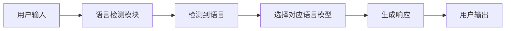
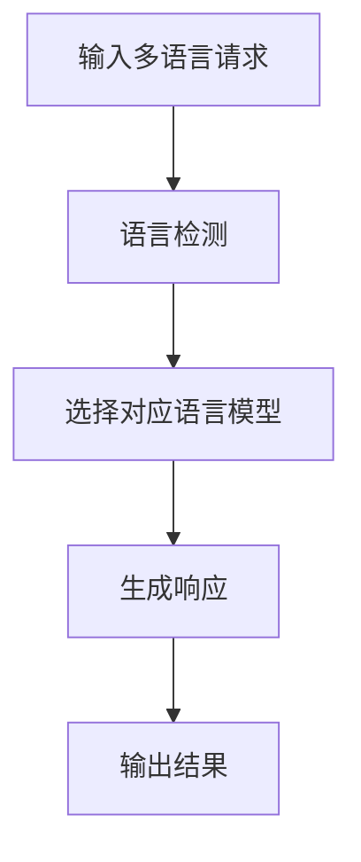
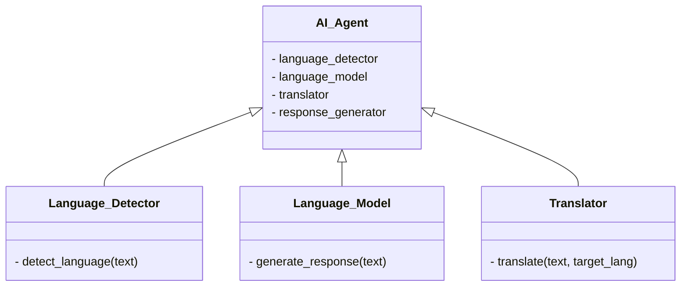
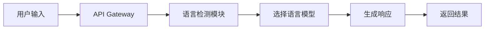
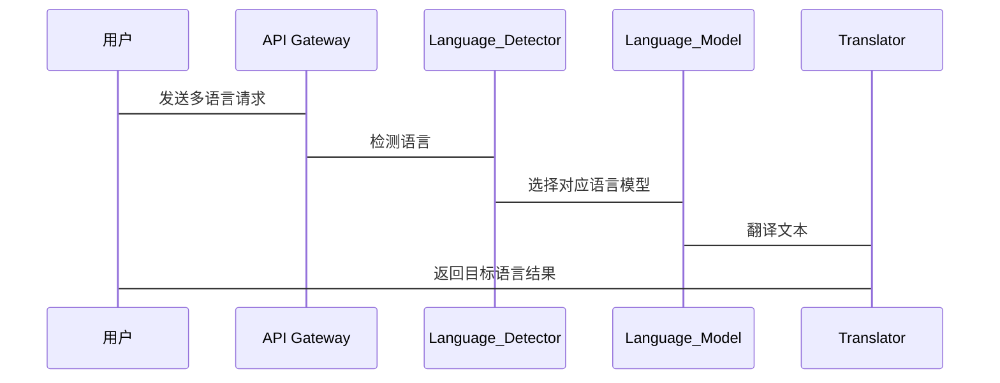

                 


```markdown
# 开发AI Agent的多语言切换能力：无缝国际化

## 关键词：AI Agent, 多语言切换, 无缝国际化, 自然语言处理, 多语言模型, 国际化标准, 语言切换

## 摘要：  
本文详细探讨了开发具备多语言切换能力的AI Agent的关键技术与实现方法。文章从背景介绍入手，分析了多语言切换能力的重要性及其在AI Agent中的应用场景。接着，深入讲解了多语言切换的核心概念、算法原理及系统架构设计，提供了基于Python的实现示例和实际案例分析。最后，总结了开发过程中的最佳实践和注意事项，为读者提供了全面的技术指导。

---

# 第一部分: AI Agent的多语言切换能力概述

## 第1章: 背景介绍

### 1.1 问题背景
#### 1.1.1 AI Agent的定义与核心功能
AI Agent（人工智能代理）是一种能够感知环境、执行任务并做出决策的智能实体。它通过与用户交互或外部系统的通信，实现信息处理、任务执行和结果反馈。AI Agent的核心功能包括信息检索、自然语言理解、决策制定和执行操作。

#### 1.1.2 多语言切换能力的重要性
在国际化应用场景中，AI Agent需要能够处理多种语言，以满足全球用户的需求。多语言切换能力使AI Agent能够理解并生成不同语言的文本，提升用户体验和应用范围。例如，在跨国企业中，AI Agent需要支持英语、中文、西班牙语等多种语言，以便与不同地区的用户进行有效沟通。

#### 1.1.3 国际化场景中的挑战与需求
国际化场景中，AI Agent的多语言切换能力面临以下挑战：
- 多语言模型的训练与优化
- 不同语言之间的语义转换
- 跨语言信息处理的准确性
- 多语言环境下的性能优化

需求包括：
- 支持多种语言的输入和输出
- 实现语言间的无缝切换
- 提供统一的接口和 API
- 确保多语言环境下的用户体验一致性

### 1.2 问题描述
#### 1.2.1 多语言切换的定义
多语言切换是指AI Agent能够根据输入语言自动识别并切换到对应的目标语言，同时保持功能的一致性和用户体验的连贯性。

#### 1.2.2 AI Agent在多语言环境中的应用场景
AI Agent在多语言环境中的应用场景包括：
- 跨国企业的内部沟通与协作
- 多语言客服系统
- 全球化电商平台的用户支持
- 多语言新闻自动翻译与发布

#### 1.2.3 当前技术的局限性与改进方向
当前技术在多语言切换能力方面存在以下局限性：
- 多语言模型的训练数据不足
- 跨语言信息处理的准确性有待提升
- 多语言切换的实时性与响应速度问题
- 不同语言之间的语义差异难以完全消除

改进方向包括：
- 加强多语言数据的收集与标注
- 优化跨语言模型的训练方法
- 提升多语言切换的实时性与响应速度
- 引入语境理解和文化适应性技术

### 1.3 问题解决
#### 1.3.1 多语言切换的核心目标
多语言切换的核心目标是实现AI Agent在多种语言环境下的无缝切换，确保语言处理的准确性和用户体验的一致性。

#### 1.3.2 AI Agent的多语言能力实现路径
AI Agent的多语言能力实现路径包括：
1. 数据预处理：收集和整理多语言数据，建立统一的数据标准。
2. 模型训练：训练多语言模型，支持多种语言的语义理解和生成。
3. 接口设计：设计统一的API接口，实现多语言切换的功能。
4. 系统集成：将多语言切换功能集成到AI Agent系统中，确保功能的协同工作。

#### 1.3.3 国际化标准与规范
国际化标准与规范包括：
- Unicode编码标准：确保多语言文本的正确编码与显示。
- BCP 47语言标签：规范语言标识符的使用，确保语言识别的准确性。
- CLDR（Unicode国际化资源组件）：提供国际化资源管理的规范和工具。

### 1.4 边界与外延
#### 1.4.1 多语言切换能力的边界
多语言切换能力的边界包括：
- 支持的语言种类和范围
- 处理文本的长度和复杂度
- 多语言切换的实时性与响应速度
- 用户权限与访问控制

#### 1.4.2 相关技术的外延与区别
相关技术的外延包括：
- 多语言文本处理：涉及文本编码、分词、语义分析等技术。
- 自然语言处理：包括文本生成、情感分析、实体识别等功能。
- 跨语言信息检索：涉及多语言搜索引擎、信息抽取等技术。

区别包括：
- 多语言切换侧重于语言之间的无缝转换与处理。
- 自然语言处理侧重于单语言文本的理解与生成。
- 跨语言信息检索侧重于跨语言信息的检索与整合。

#### 1.4.3 与其他功能的交互影响
多语言切换能力与其他功能的交互影响包括：
- 与用户界面（UI）的交互：多语言切换影响用户体验和界面布局。
- 与后端系统的交互：多语言切换影响数据存储、查询和处理逻辑。
- 与第三方服务的交互：多语言切换影响API调用和数据交换格式。

### 1.5 概念结构与核心要素
#### 1.5.1 多语言切换的构成要素
多语言切换的构成要素包括：
- 语言检测：识别输入文本的语言。
- 语言模型：支持多种语言的语义理解和生成。
- 语言切换：根据检测结果切换到目标语言并生成相应文本。
- 用户反馈：收集用户对多语言切换的反馈，优化切换逻辑。

#### 1.5.2 AI Agent的多语言能力模型
AI Agent的多语言能力模型包括：
- 语言检测模块：负责检测输入文本的语言。
- 多语言模型：支持多种语言的语义理解和生成。
- 切换控制模块：根据检测结果切换到目标语言。
- 输出模块：生成并返回目标语言的文本或响应。

#### 1.5.3 核心要素之间的关系
核心要素之间的关系：
- 语言检测模块为切换控制模块提供输入语言信息。
- 多语言模型为语言检测和切换提供语义支持。
- 切换控制模块协调各模块的工作，确保无缝切换。
- 输出模块将处理结果呈现给用户。

---

## 第2章: 核心概念与联系

### 2.1 核心概念原理
#### 2.1.1 多语言切换的核心算法
多语言切换的核心算法包括：
- 语言检测算法：基于机器学习的文本分类算法，如支持向量机（SVM）、随机森林（Random Forest）和深度学习模型（如BERT）。
- 语言生成算法：基于生成式模型的文本生成算法，如GPT、Transformer架构。

#### 2.1.2 AI Agent的语言处理机制
AI Agent的语言处理机制包括：
- 输入处理：接收多语言输入并进行预处理。
- 语言检测：识别输入语言并调用相应语言模型。
- 语义理解：对输入文本进行语义分析和理解。
- 语言生成：根据语义生成目标语言的文本。
- 输出处理：将生成的文本进行后处理并返回给用户。

#### 2.1.3 多语言模型的训练与优化
多语言模型的训练与优化包括：
- 数据预处理：清洗和标注多语言数据，确保数据质量。
- 模型选择：选择适合多语言任务的模型架构，如多语言BERT。
- 跨语言迁移学习：利用预训练模型进行跨语言迁移，提升小语种任务的性能。
- 模型评估：使用准确率、召回率、F1值等指标评估模型性能。

### 2.2 概念属性特征对比
#### 2.2.1 多语言切换与单语言处理的对比
| 特性               | 多语言切换                | 单语言处理                |
|--------------------|---------------------------|---------------------------|
| 处理范围           | 支持多种语言              | 支持单一语言              |
| 检测机制           | 包含语言检测模块          | 无需语言检测              |
| 模型需求           | 需要多语言模型            | 需要单语言模型            |
| 复杂度             | 较高，涉及多语言处理       | 较低，仅处理单一语言       |

#### 2.2.2 不同语言处理的特征差异
| 语言特性           | 英语                      | 中文                      |
|--------------------|---------------------------|---------------------------|
| 文本结构           | 空格分隔，句子结构清晰      | 无空格，句子结构复杂      |
| 语义歧义           | 较低，语义相对明确          | 较高，存在多种解释可能    |
| 文化背景           | 直接表达，注重逻辑性      | 含蓄表达，注重上下文      |

#### 2.2.3 AI Agent语言能力的评估指标
- 语言检测准确率：正确识别输入语言的比例。
- 语义理解准确率：正确理解输入文本语义的比例。
- 语言生成质量：生成文本的准确性和自然度。
- 响应时间：处理多语言请求的平均响应时间。

### 2.3 ER实体关系图


---

## 第3章: 算法原理讲解

### 3.1 算法原理
#### 3.1.1 多任务学习
多任务学习是一种同时学习多个任务的机器学习方法，通过共享不同任务之间的特征表示，提升模型的泛化能力和学习效率。

#### 3.1.2 跨语言迁移学习
跨语言迁移学习是一种在单一语言模型的基础上，通过迁移学习技术，将模型应用于其他语言任务的方法，常用于解决小语种任务的数据不足问题。

#### 3.1.3 神经机器翻译模型
神经机器翻译模型（如Transformer架构）通过构建编码器-解码器结构，实现跨语言文本的翻译和生成。

### 3.2 算法流程图


### 3.3 Python实现示例
```python
# 语言检测模块
from langdetect import detect

def detect_language(text):
    return detect(text)

# 多语言模型调用模块
from googletrans import Translator

def translate_text(text, target_lang):
    translator = Translator()
    translated = translator.translate(text, dest=target_lang)
    return translated.text

# 主函数
def main():
    input_text = "Hello, how are you?"
    detected_lang = detect_language(input_text)
    print(f"检测到语言：{detected_lang}")
    
    target_lang = "zh-CN"
    translated_text = translate_text(input_text, target_lang)
    print(f"翻译后的文本：{translated_text}")

if __name__ == "__main__":
    main()
```

### 3.4 数学模型和公式
#### 3.4.1 交叉熵损失函数
交叉熵损失函数用于衡量模型预测结果与真实标签之间的差异，公式如下：
$$
\text{Loss} = -\sum_{i=1}^{n} y_i \log(p_i)
$$
其中，$y_i$是真实标签，$p_i$是模型预测的概率。

#### 3.4.2 Transformer模型的注意力机制
注意力机制通过计算输入序列中每个位置的权重，确定其对当前输出位置的重要性：
$$
\text{Attention}(Q, K, V) = \text{softmax}\left(\frac{QK^T}{\sqrt{d_k}}\right)V
$$
其中，$Q$是查询向量，$K$是键向量，$V$是值向量，$d_k$是向量的维度。

---

## 第4章: 系统分析与架构设计

### 4.1 问题场景介绍
在国际化场景中，AI Agent需要支持多种语言的输入和输出，实现语言间的无缝切换。系统需要具备高效的语言检测、多语言模型调用和结果输出功能。

### 4.2 项目介绍
本项目旨在开发一个支持多语言切换的AI Agent系统，实现以下功能：
1. 多语言检测与识别
2. 多语言文本生成
3. 语言间的无缝切换
4. 统一接口API的设计与实现

### 4.3 系统功能设计
#### 4.3.1 领域模型（Mermaid类图）


#### 4.3.2 系统架构设计（Mermaid架构图）


#### 4.3.3 系统接口设计
系统接口设计包括：
- 输入接口：接收多语言文本输入。
- 输出接口：返回目标语言的文本输出。
- 控制接口：管理语言检测和切换逻辑。

#### 4.3.4 系统交互（Mermaid序列图）


---

## 第5章: 项目实战

### 5.1 环境搭建
#### 5.1.1 安装Python环境
```bash
python --version
pip install langdetect googletrans
```

#### 5.1.2 安装依赖库
```bash
pip install langdetect googletrans
```

### 5.2 核心代码实现
#### 5.2.1 语言检测模块
```python
from langdetect import detect,(Language, Cmopher)
from langdetect.detectors import DetectorFactory

DetectorFactory.seed = 0

def detect_language(text):
    try:
        return detect(text)
    except Exception as e:
        print(f"检测语言时出错：{e}")
        return 'zh-CN'  # 默认语言
```

#### 5.2.2 多语言模型调用模块
```python
from googletrans import Translator, constants

def translate_text(text, target_lang):
    translator = Translator()
    try:
        translated = translator.translate(text, dest=target_lang)
        return translated.text, translated.extra_data
    except Exception as e:
        print(f"翻译时出错：{e}")
        return text, {}
```

#### 5.2.3 系统主程序
```python
class AI_Agent:
    def __init__(self):
        self.detector = Language_Detector()
        self.translator = Translator()

    def process_request(self, text):
        detected_lang = self.detector.detect_language(text)
        translated_text, _ = self.translator.translate(text, dest=detected_lang)
        return translated_text

if __name__ == "__main__":
    agent = AI_Agent()
    input_text = "Hello, how are you?"
    print(agent.process_request(input_text))
```

### 5.3 实际案例分析与详细解读
案例分析：假设用户输入“Hello, how are you?”，系统检测到语言为英语，然后调用翻译模块将文本翻译成中文“你好，你怎么样？”，并返回结果。

### 5.4 项目小结
通过本项目，我们实现了AI Agent的多语言切换功能，包括语言检测、模型调用和结果输出。系统实现了语言间的无缝切换，确保了多语言环境下的用户体验。

---

## 第6章: 最佳实践与小结

### 6.1 开发过程中的经验和教训
- 数据质量对模型性能影响重大，需加强多语言数据的清洗和标注。
- 模型选择需根据具体任务需求，选择适合的模型架构和训练方法。
- 系统设计需充分考虑扩展性和可维护性，确保未来功能的扩展。

### 6.2 小结
本文详细探讨了开发AI Agent的多语言切换能力的关键技术与实现方法，包括背景介绍、核心概念、算法原理、系统架构设计和项目实战。通过理论与实践相结合，为读者提供了全面的技术指导。

### 6.3 注意事项
- 多语言切换需考虑文化差异和语言习惯，避免语义错误。
- 系统需具备错误处理机制，确保在语言检测或模型调用失败时仍能正常运行。
- 定期更新模型和语言支持，以适应不断变化的语言环境和用户需求。

### 6.4 拓展阅读
- 《多语言自然语言处理》：深入探讨多语言NLP的核心技术与应用。
- 《机器学习实战》：提供丰富的机器学习算法实现案例，为多语言模型的训练提供参考。
- 《Python编程：从入门到实践》：帮助读者巩固Python编程基础，更好地进行系统实现。

---

# 作者：AI天才研究院/AI Genius Institute & 禅与计算机程序设计艺术 /Zen And The Art of Computer Programming
```

