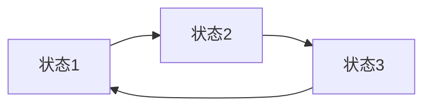
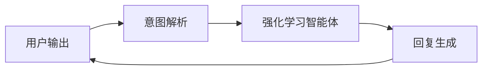
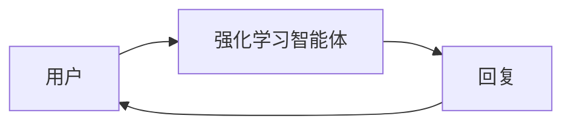
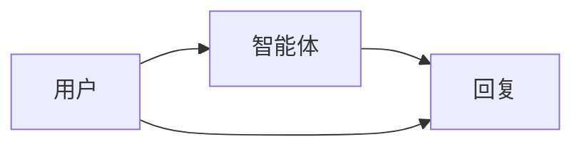

                 


# 强化学习在AI Agent对话策略中的应用

> **关键词**：强化学习、对话系统、AI Agent、策略优化、数学模型、算法实现

> **摘要**：本文深入探讨了强化学习在AI Agent对话策略中的应用，从理论基础到实际应用，结合具体案例，分析了强化学习如何提升对话系统的性能和用户体验。文章详细介绍了强化学习的核心概念、算法框架、对话策略优化方法，以及基于强化学习的对话系统架构设计与实现。通过具体的技术细节和实战项目，展示了如何利用强化学习技术打造高效、智能的AI对话系统。

---

## 第1章 强化学习与对话系统的背景介绍

### 1.1 强化学习的定义与核心概念

**1.1.1 强化学习的定义**  
强化学习（Reinforcement Learning, RL）是一种机器学习范式，通过智能体在与环境的交互中学习策略，以最大化累积奖励。与监督学习和无监督学习不同，强化学习依赖于环境的反馈（即奖励）来指导学习过程。

**1.1.2 强化学习的核心要素**  
- **状态（State）**：智能体所处的环境信息。  
- **动作（Action）**：智能体在状态下的行为选择。  
- **奖励（Reward）**：智能体行为的价值反馈，用于指导学习方向。  
- **策略（Policy）**：智能体在状态下的动作选择概率分布。  
- **值函数（Value Function）**：衡量状态或动作-状态对的价值。  

**1.1.3 强化学习与监督学习、无监督学习的区别**  
- **监督学习**：基于标记数据，学习函数的输入输出关系。  
- **无监督学习**：基于未标记数据，发现数据中的内在结构。  
- **强化学习**：基于与环境的交互，通过试错学习最优策略。

### 1.2 对话系统的定义与分类

**1.2.1 对话系统的定义**  
对话系统是一种人工智能系统，能够通过自然语言与用户进行交互，理解用户意图并生成合适的回应。

**1.2.2 基于规则的对话系统**  
- 通过预定义的规则和模板生成回应。  
- 优点：简单易实现，适用于特定场景。  
- 缺点：灵活性差，难以应对复杂对话。

**1.2.3 基于统计模型的对话系统**  
- 使用概率模型（如马尔可夫链）预测对话的下一步。  
- 优点：能够处理多种对话场景。  
- 缺点：依赖训练数据质量，可能出现错误推断。

**1.2.4 基于深度学习的对话系统**  
- 使用深度神经网络（如LSTM、Transformer）生成对话回应。  
- 优点：能够捕捉对话的上下文信息，生成更自然的回复。  
- 缺点：训练成本高，需要大量数据。

### 1.3 强化学习在对话系统中的应用背景

**1.3.1 对话系统中的挑战**  
- 对话的开放性：用户可能提出各种问题，需要系统具备广泛的知识覆盖。  
- 对话的上下文依赖性：回复需要根据对话历史进行调整。  
- 对话的情感与意图识别：需要准确理解用户的情感和意图。

**1.3.2 强化学习在对话系统中的优势**  
- 强化学习能够通过试错优化对话策略，提升用户体验。  
- 能够在动态对话环境中自适应调整回复策略。  
- 可以结合奖励机制，实现更自然、更符合人类习惯的对话。

**1.3.3 当前研究的热点与趋势**  
- 多模态对话系统：结合视觉、听觉等信息，提升对话效果。  
- 基于强化学习的对话生成：通过与用户的互动优化回复策略。  
- 对话系统的可解释性：如何让用户理解AI的决策过程。

---

## 第2章 强化学习的理论基础

### 2.1 马尔可夫决策过程（MDP）

**2.1.1 状态空间**  
状态（State）是智能体所处环境的信息表示。例如，在对话系统中，状态可以是对话历史、用户意图等。

**2.1.2 动作空间**  
动作（Action）是智能体在给定状态下的行为选择。例如，在对话系统中，动作可以是生成特定的回复。

**2.1.3 奖励函数**  
奖励（Reward）是对智能体行为的反馈，用于指导学习方向。例如，在对话系统中，奖励可以是用户的满意度评分。

**2.1.4 转移概率**  
转移概率（Transition Probability）是智能体在当前状态下采取某个动作后，进入下一个状态的概率。

**2.1.5 图形化表示**  


### 2.2 强化学习算法框架

**2.2.1 Q-learning算法**  
Q-learning是一种经典的强化学习算法，通过更新Q值表来学习最优策略。

**2.2.2 策略梯度方法**  
策略梯度（Policy Gradient）方法通过优化策略的参数，直接最大化奖励的期望值。

**2.2.3 值函数方法**  
值函数方法通过估计每个状态的值函数，间接优化策略。

### 2.3 强化学习中的数学模型

**2.3.1 Q-learning的数学表达**  
$$ Q(s, a) = Q(s, a) + \alpha \left(r + \gamma \max Q(s', a') - Q(s, a) \right) $$

**2.3.2 策略梯度的数学推导**  
目标函数：$$ J(\theta) = \mathbb{E}_{\tau \sim \pi_\theta} [\sum_{t=0}^\infty \gamma^t r_t] $$  
梯度更新：$$ \nabla J(\theta) = \mathbb{E}_{\tau \sim \pi_\theta} [\sum_{t=0}^\infty \gamma^t \nabla \log \pi_\theta(a_t|s_t) Q_\theta(s_t, a_t)] $$

**2.3.3 奖励函数的设计原则**  
- 奖励函数应明确指导智能体的行为。  
- 奖励函数应具有可区分性，区分不同动作的价值。  
- 奖励函数应与任务目标一致。

### 2.4 强化学习在对话系统中的应用

**2.4.1 对话策略的强化学习建模**  
通过强化学习框架建模对话过程，智能体根据当前对话状态选择最优回复。

**2.4.2 基于强化学习的对话生成**  
利用强化学习生成多样化的对话回复，提升用户体验。

**2.4.3 基于强化学习的对话评估**  
通过强化学习优化对话评估指标，提升对话系统的性能。

---

## 第3章 对话策略的强化学习优化

### 3.1 对话策略的强化学习建模

**3.1.1 状态表示**  
对话状态可以表示为：  
$$ s = (u, h) $$  
其中，$u$是用户信息，$h$是对话历史。

**3.1.2 动作表示**  
动作可以表示为生成的回复文本：  
$$ a = \text{"Hello, how are you?"} $$

**3.1.3 奖励函数设计**  
奖励函数可以设计为：  
$$ R(a, s) = \begin{cases} 
1 & \text{如果用户的反馈积极} \\
0 & \text{否则}
\end{cases} $$

### 3.2 基于强化学习的策略优化方法

**3.2.1 值迭代方法**  
通过不断迭代值函数，找到最优策略。  
$$ V_{k+1}(s) = \max_a \left( R(s, a) + \gamma V_k(s') \right) $$

**3.2.2 策略迭代方法**  
通过交替执行策略评估和策略改进，逐步逼近最优策略。

**3.2.3 各种策略优化方法的比较**  
| 方法 | 优点 | 缺点 |
|------|------|------|
| 值迭代 | 收敛速度快 | 需要处理无限状态空间 |
| 策略迭代 | 易于实现 | 收敛速度慢 |
| Q-learning | 适用于离线学习 | 需要合适的状态和动作表示 |

### 3.3 基于强化学习的对话策略评估

**3.3.1 离线评估方法**  
基于历史对话数据评估策略性能。

**3.3.2 在线评估方法**  
在真实对话环境中评估策略性能。

**3.3.3 评估指标的设计与选择**  
常用的评估指标包括：  
- **BLEU**：衡量生成文本的流畅性。  
- **ROUGE**：衡量生成文本的相关性。  
- **人类评分**：通过人工评估生成回复的自然度和相关性。

### 3.4 多智能体协作的对话策略优化

**3.4.1 多智能体强化学习**  
通过多智能体协作，提升对话系统的整体性能。

---

## 第4章 基于强化学习的对话系统架构设计与实现

### 4.1 系统整体架构

**4.1.1 系统功能模块**  
- 用户输入处理模块：解析用户输入，提取意图和情感信息。  
- 对话策略优化模块：基于强化学习优化对话策略。  
- 系统输出生成模块：生成自然的对话回复。

**4.1.2 图形化表示**  


### 4.2 系统功能设计

**4.2.1 对话历史记录**  
记录对话历史，用于生成回复时的上下文理解。

**4.2.2 用户意图识别**  
通过自然语言处理技术识别用户的意图和情感倾向。

### 4.3 系统架构设计

**4.3.1 系统架构图**  


**4.3.2 系统接口设计**  
- 用户输入接口：接收用户的自然语言输入。  
- 系统输出接口：生成并返回对话回复。

### 4.4 系统交互流程

**4.4.1 交互流程图**  


---

## 第5章 系统实现与实战

### 5.1 环境搭建

**5.1.1 开发环境配置**  
- 安装Python、TensorFlow、Keras等工具。  
- 安装自然语言处理库（如spaCy、NLTK）。  

**5.1.2 数据集准备**  
收集和整理对话数据，用于训练强化学习模型。

### 5.2 系统核心实现

**5.2.1 强化学习算法实现**  
实现Q-learning算法，用于优化对话策略。

```python
class QLAgent:
    def __init__(self, state_space, action_space):
        self.q_table = defaultdict(dict)
        self.state_space = state_space
        self.action_space = action_space
        self.alpha = 0.1
        self.gamma = 0.9

    def choose_action(self, state):
        if state not in self.q_table:
            return random.choice(self.action_space)
        else:
            max_action = max(self.q_table[state], key=lambda k: self.q_table[state][k])
            return max_action

    def update_q_table(self, state, action, reward, next_state):
        current_q = self.q_table[state].get(action, 0)
        next_max_q = max(self.q_table[next_state].values(), default=0)
        self.q_table[state][action] = current_q + self.alpha * (reward + self.gamma * next_max_q - current_q)
```

**5.2.2 对话系统实现**  
实现基于强化学习的对话生成模块。

```python
class DialogueSystem:
    def __init__(self, agent):
        self.agent = agent
        self.dialogue_history = []

    def generate_response(self, user_input):
        state = self._create_state(user_input)
        action = self.agent.choose_action(state)
        response = self._get_response(action)
        self.dialogue_history.append((user_input, response))
        return response

    def _create_state(self, user_input):
        return {"history": self.dialogue_history, "input": user_input}
```

### 5.3 项目实战案例分析

**5.3.1 案例分析：智能客服对话系统**  
通过强化学习优化智能客服的对话策略，提升用户满意度。

**5.3.2 系统优化与调优**  
通过实验调整奖励函数和策略参数，提升对话系统的性能。

---

## 第6章 前沿技术与挑战

### 6.1 强化学习的前沿技术

**6.1.1 多模态对话系统**  
结合视觉、听觉等多种模态信息，提升对话系统的理解能力。

**6.1.2 基于Transformer的强化学习模型**  
利用Transformer结构捕捉对话的长距离依赖关系。

### 6.2 对话系统的挑战

**6.2.1 对话系统的可解释性**  
如何让用户理解AI的决策过程，增强用户信任。

**6.2.2 对话系统的泛化能力**  
如何应对未见场景的对话请求，提升系统的 robustness。

**6.2.3 对话系统的计算效率**  
如何在实时对话中快速生成回复，降低计算成本。

### 6.3 未来研究方向

**6.3.1 多智能体协作对话系统**  
研究多智能体协作的对话优化方法。  
**6.3.2 对话系统的可解释性增强**  
探索如何提升对话系统的可解释性，增强用户体验。  
**6.3.3 跨领域对话系统的统一建模**  
研究如何构建适用于多个领域的通用对话系统。

---

## 第7章 总结与展望

### 7.1 全文总结

本文系统地介绍了强化学习在AI Agent对话策略中的应用，从理论基础到实际应用，详细探讨了强化学习如何优化对话系统的性能和用户体验。通过具体的技术细节和实战案例，展示了如何利用强化学习技术打造高效、智能的AI对话系统。

### 7.2 未来展望

随着强化学习技术的不断发展，对话系统的性能和用户体验将得到进一步提升。未来的研究方向包括多模态对话系统、对话系统的可解释性增强，以及跨领域对话系统的统一建模。通过这些努力，我们有望实现更自然、更智能的AI对话系统。

---

## 作者：AI天才研究院/AI Genius Institute & 禅与计算机程序设计艺术 /Zen And The Art of Computer Programming

