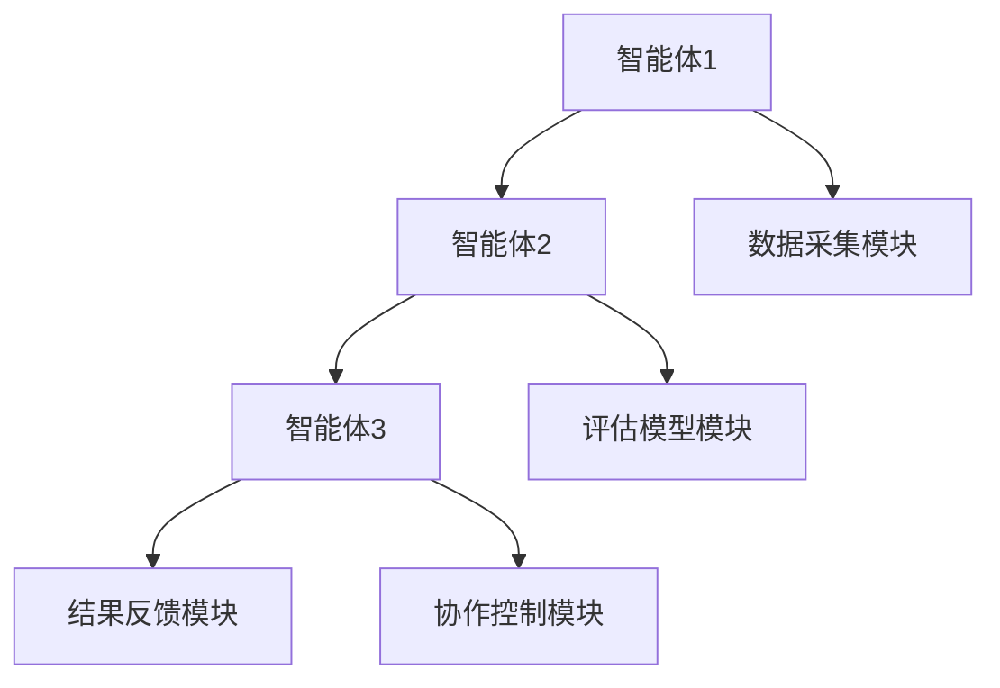

                 


---

# 智能体协作评估公司的环境适应能力：应对气候变化风险

## 关键词：智能体协作，环境适应能力，气候变化风险，多智能体系统，评估模型，系统架构

## 摘要：  
随着气候变化带来的风险日益加剧，企业需要具备更强的环境适应能力以应对潜在的威胁。本文通过智能体协作的方法，探讨如何评估和提升公司的环境适应能力。文章从背景介绍、智能体协作的理论基础、环境适应能力评估模型、算法原理、系统架构设计、项目实战到最佳实践，系统地分析了智能体协作在应对气候变化风险中的应用。通过多智能体系统的协作机制、通信协议、评估模型和优化算法的详细讲解，本文为读者提供了从理论到实践的完整解决方案，帮助企业在气候变化时代保持竞争力。

---

# 第一章: 背景介绍

## 1.1 问题背景

### 1.1.1 气候变化对企业的影响
气候变化正在对企业运营和可持续发展造成深远影响。极端天气事件的增加、资源短缺和供应链中断等问题，迫使企业必须具备更强的环境适应能力。例如，某些行业可能面临原材料价格上涨、生产中断或市场需求变化等挑战。

### 1.1.2 企业环境适应能力的重要性
企业的环境适应能力是指其在面对环境变化时调整策略、优化运营以维持竞争力的能力。这种能力不仅关乎企业的生存，还影响其长期发展和社会责任履行。

### 1.1.3 智能体协作在环境评估中的作用
智能体协作是一种分布式问题解决方法，通过多个智能体的协同工作，能够高效地评估和应对复杂环境问题。在环境适应能力评估中，智能体协作可以分解任务、优化资源分配并提高评估的准确性。

## 1.2 问题描述

### 1.2.1 企业环境适应能力的定义
环境适应能力是指企业在面对环境变化时调整策略、优化运营以维持竞争力的能力。这包括对气候变化、政策变化和社会责任等方面的影响的适应。

### 1.2.2 气候变化带来的具体风险
气候变化可能导致极端天气事件增多、资源短缺、供应链中断等问题，对企业运营造成直接影响。例如，某些地区的洪水或干旱可能影响企业的生产和供应链。

### 1.2.3 智能体协作评估的必要性
传统的单一智能体评估方法存在效率低、覆盖范围有限的问题。通过智能体协作，可以利用多个智能体的分布式计算能力，提高评估的准确性和效率。

## 1.3 问题解决

### 1.3.1 智能体协作的基本原理
智能体协作是通过多个智能体的协同工作来完成复杂任务。每个智能体负责特定的任务模块，通过通信协议共享信息，最终完成整体目标。

### 1.3.2 环境适应能力评估的框架
评估框架包括数据采集、模型构建、评估分析和结果反馈等步骤。智能体协作可以分别处理这些步骤，提高整体效率。

### 1.3.3 多智能体协作的优势
多智能体协作可以充分利用分布式计算资源，提高任务处理能力。同时，智能体之间的协作可以弥补单一智能体的不足，提高评估的全面性。

## 1.4 边界与外延

### 1.4.1 智能体协作的边界
智能体协作的边界包括任务范围、智能体数量和通信范围等。每个智能体负责特定的任务模块，避免任务重叠和资源浪费。

### 1.4.2 评估范围的外延
环境适应能力评估的范围可能包括企业内部和外部的多个方面。通过智能体协作，可以扩展评估的范围，提高评估的全面性。

### 1.4.3 与其他评估方法的区别
智能体协作评估方法通过分布式计算和协作机制，与传统的集中式评估方法相比，具有更高的效率和灵活性。

## 1.5 概念结构与核心要素

### 1.5.1 核心概念的构成
智能体协作评估系统由多个智能体、通信协议、评估模型和结果反馈机制组成。每个部分都有其特定的功能和作用。

### 1.5.2 各要素之间的关系
智能体之间通过通信协议共享信息，评估模型对信息进行处理，结果反馈机制将评估结果反馈给智能体，指导后续任务的执行。

### 1.5.3 案例分析
以一家制造企业为例，智能体协作可以分别评估供应链、生产过程和市场需求等方面，综合评估企业的环境适应能力。

---

# 第二章: 智能体协作的理论基础

## 2.1 多智能体系统（MAS）概述

### 2.1.1 多智能体系统的定义
多智能体系统是指由多个智能体组成的分布式系统，每个智能体能够自主决策并与其他智能体协作完成任务。

### 2.1.2 多智能体系统的分类
多智能体系统可以分为基于任务的MAS和基于市场的MAS。基于任务的MAS适用于需要协调完成特定任务的场景，而基于市场的MAS适用于模拟市场行为的场景。

### 2.1.3 多智能体系统的优缺点
优点包括高效率、灵活性和分布式计算能力；缺点包括复杂性高、通信开销大和协作困难。

## 2.2 智能体协作机制

### 2.2.1 协作协议的设计
协作协议是智能体之间通信和协作的基础。协议设计需要考虑任务分配、信息共享和结果反馈等环节。

### 2.2.2 协作规则的制定
协作规则包括任务分配规则、冲突解决规则和激励机制。这些规则能够指导智能体的行为，确保协作的有效性。

### 2.2.3 协作过程中的通信机制
通信机制包括消息传递、广播和组播等方式。智能体之间通过通信机制共享信息，协调协作过程。

## 2.3 智能体协作的通信协议

### 2.3.1 通信协议的选择
通信协议的选择需要考虑系统的实时性、可靠性和安全性。不同的协议适用于不同的场景，如TCP/IP适用于广域网，而MQTT适用于低带宽环境。

### 2.3.2 通信协议的设计原则
设计原则包括简洁性、高效性和可扩展性。通信协议需要能够支持大规模智能体的协作，并且具备良好的可扩展性。

### 2.3.3 通信协议的实现
通信协议的实现可以通过消息队列、中间件或区块链等技术实现。不同的技术适用于不同的场景，如区块链适用于需要高安全性的协作环境。

---

# 第三章: 环境适应能力评估模型

## 3.1 模型的设计与实现

### 3.1.1 模型的设计目标
评估模型的设计目标是准确、高效地评估企业的环境适应能力。模型需要考虑多个因素，如气候变化的影响、企业的资源分配和市场需求等。

### 3.1.2 模型的实现步骤
实现步骤包括数据采集、模型构建、评估分析和结果反馈。每个步骤都需要智能体的协作完成。

### 3.1.3 模型的验证与测试
模型的验证需要通过实际数据进行测试，并根据结果进行优化。验证过程包括单个智能体的测试和整体系统的测试。

## 3.2 评估指标体系

### 3.2.1 指标的选择标准
评估指标需要具有代表性、可测量性和可操作性。例如，可以选取供应链弹性、生产灵活性和市场响应能力作为评估指标。

### 3.2.2 指标的权重分配
指标的权重分配需要根据企业的实际情况进行调整。例如，供应链弹性可能比生产灵活性更重要，因此分配更高的权重。

### 3.2.3 指标的动态调整
随着环境的变化，评估指标也需要动态调整。例如，当气候变化加剧时，可能需要增加对供应链弹性的关注。

## 3.3 评估方法

### 3.3.1 定量评估方法
定量评估方法通过数学模型对企业的环境适应能力进行量化评估。例如，可以使用线性回归模型预测企业的适应能力。

### 3.3.2 定性评估方法
定性评估方法通过专家评分或案例分析等方式，对企业的环境适应能力进行定性评估。

### 3.3.3 综合评估方法
综合评估方法结合定量和定性评估方法，通过对多种指标的综合分析，得出企业的环境适应能力。

---

# 第四章: 算法原理与数学模型

## 4.1 多智能体协作算法

### 4.1.1 算法的基本原理
多智能体协作算法通过分布式计算和协作机制，将任务分解为多个子任务，由多个智能体分别完成，最终整合结果。

### 4.1.2 算法的实现步骤
算法实现步骤包括任务分解、智能体分配、信息共享和结果整合。每个步骤都需要智能体的协作完成。

### 4.1.3 算法的数学模型
多智能体协作算法的数学模型可以用图论中的图表示，节点代表智能体，边代表智能体之间的协作关系。

$$
G = (V, E)
$$

其中，V表示智能体集合，E表示智能体之间的协作关系。

### 4.1.4 算法的优化方法
优化方法包括任务分配优化、通信优化和协作规则优化。优化目标是提高算法的效率和准确性。

---

# 第五章: 系统架构设计

## 5.1 系统功能设计

### 5.1.1 系统功能模块
系统功能模块包括数据采集模块、评估模型模块、协作控制模块和结果反馈模块。每个模块负责不同的功能。

### 5.1.2 系统功能流程
系统功能流程包括数据采集、模型构建、评估分析和结果反馈。流程需要智能体的协作完成。

### 5.1.3 系统功能的实现
系统功能的实现可以通过软件编程和硬件配置完成。例如，数据采集可以通过传感器和数据库实现。

## 5.2 系统架构图



## 5.3 系统接口设计

### 5.3.1 智能体接口
智能体接口定义了智能体之间的通信协议和数据格式。例如，智能体之间可以通过JSON格式传递数据。

### 5.3.2 系统管理接口
系统管理接口用于管理系统的运行状态和配置参数。例如，可以通过RESTful API进行系统管理。

### 5.3.3 用户接口
用户接口是用户与系统交互的界面。例如，可以通过Web界面查看评估结果和配置参数。

## 5.4 系统交互流程

### 5.4.1 数据采集流程
数据采集流程包括传感器数据采集、数据预处理和数据存储。数据采集模块负责收集环境数据和企业运营数据。

### 5.4.2 智能体协作流程
智能体协作流程包括任务分配、信息共享和结果整合。协作控制模块负责协调智能体的协作过程。

### 5.4.3 评估结果反馈流程
评估结果反馈流程包括结果生成、结果存储和结果展示。结果反馈模块将评估结果反馈给智能体，指导后续任务的执行。

---

# 第六章: 项目实战

## 6.1 环境安装

### 6.1.1 系统需求
系统需求包括硬件配置、软件环境和网络条件。例如，需要安装Python 3.8及以上版本，JDK 1.8及以上版本。

### 6.1.2 系统安装步骤
安装步骤包括安装操作系统、安装开发工具和配置网络环境。例如，安装Ubuntu 20.04 LTS作为操作系统，安装PyCharm作为开发工具。

## 6.2 核心代码实现

### 6.2.1 智能体协作代码
以下是智能体协作的核心代码示例：

```python
class Agent:
    def __init__(self, id):
        self.id = id
        self.data = {}

    def receive_message(self, message):
        self.data.update(message)
        self.process_data()

    def process_data(self):
        # 处理数据并返回结果
        result = self.data
        return result

    def send_message(self, agent, message):
        agent.receive_message(message)

# 使用示例
agent1 = Agent(1)
agent2 = Agent(2)
agent1.send_message(agent2, {"temperature": 30})
```

### 6.2.2 评估模型代码
以下是评估模型的核心代码示例：

```python
def evaluate(assessment_data):
    # 数据预处理
    processed_data = preprocess(assessment_data)
    # 模型评估
    result = model.predict(processed_data)
    return result

# 使用示例
assessment_data = {"score": 80}
result = evaluate(assessment_data)
```

## 6.3 案例分析

### 6.3.1 案例背景
以一家制造企业为例，评估其在气候变化下的环境适应能力。

### 6.3.2 案例分析过程
通过智能体协作，分别评估供应链、生产过程和市场需求等方面，综合评估企业的环境适应能力。

### 6.3.3 案例结果
评估结果显示，该企业在供应链弹性方面表现良好，但在市场响应能力方面存在不足。

## 6.4 项目总结

### 6.4.1 项目成果
通过智能体协作，成功评估了企业的环境适应能力，并提出了改进建议。

### 6.4.2 项目经验
项目经验包括智能体协作的实现难点、通信协议的选择和评估模型的优化。

### 6.4.3 项目不足
项目不足包括评估模型的准确性和系统的实时性需要进一步优化。

---

# 第七章: 最佳实践与小结

## 7.1 最佳实践

### 7.1.1 系统设计
系统设计需要考虑可扩展性、可维护性和可配置性。例如，采用模块化设计，便于后续功能扩展。

### 7.1.2 系统实现
系统实现需要遵循软件工程的规范，包括代码规范、测试用例和文档编写。例如，采用单元测试和集成测试确保系统质量。

### 7.1.3 系统部署
系统部署需要考虑高可用性和安全性。例如，采用负载均衡和容灾备份技术，确保系统的稳定运行。

## 7.2 小结

### 7.2.1 问题回顾
回顾问题背景，智能体协作评估公司的环境适应能力，应对气候变化风险。

### 7.2.2 解决方案
通过智能体协作和环境适应能力评估模型，提供了一种高效的解决方案，帮助企业应对气候变化风险。

### 7.2.3 未来展望
未来的研究方向包括智能体协作的优化、评估模型的改进和系统的扩展性设计。例如，研究多智能体协作的自适应算法，提高系统的灵活性和适应性。

## 7.3 注意事项

### 7.3.1 系统维护
系统维护需要定期更新软件和硬件，确保系统的安全性和稳定性。例如，定期更新操作系统和应用软件，修复系统漏洞。

### 7.3.2 数据隐私
数据隐私是智能体协作系统的重要考虑因素。需要采取数据加密和访问控制等措施，确保数据的安全性。

### 7.3.3 系统监控
系统监控是确保系统正常运行的重要手段。需要实时监控系统的运行状态，及时发现和解决问题。

## 7.4 拓展阅读

### 7.4.1 相关技术
相关技术包括多智能体系统、分布式计算和机器学习等。例如，研究多智能体系统的最新进展，了解分布式计算的应用场景。

### 7.4.2 应用案例
应用案例包括智能交通系统、智能电网和智能制造等领域的应用。例如，研究智能交通系统的协作机制，了解其在环境适应能力评估中的应用。

---

# 作者：AI天才研究院/AI Genius Institute & 禅与计算机程序设计艺术 /Zen And The Art of Computer Programming

