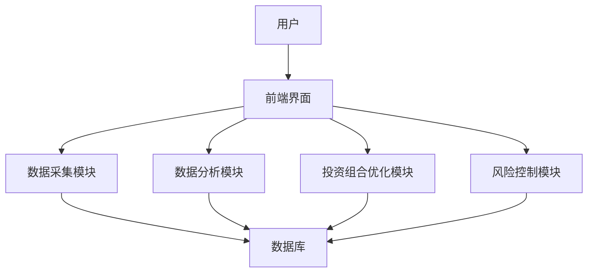
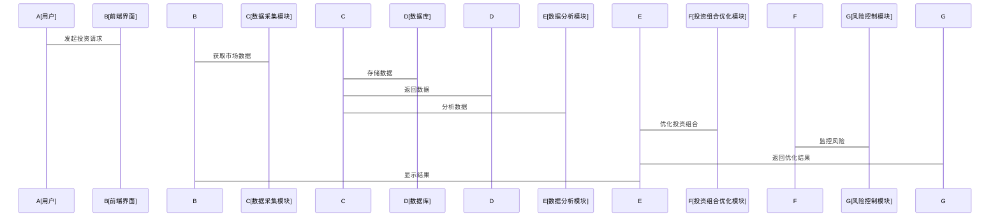

                 


# 智能系统优化逆向投资策略执行

## 关键词
智能系统优化、逆向投资策略、优化算法、系统架构、投资组合优化

## 摘要
本文详细探讨了智能系统优化在逆向投资策略执行中的应用。通过分析智能系统优化的核心概念、算法原理、系统架构及项目实战，展示了如何利用智能优化算法优化投资组合，降低风险，提升投资收益。文章内容涵盖从理论到实践的全过程，为读者提供了丰富的知识和实用的指导。

---

# 第1章: 智能系统优化与逆向投资概述

## 1.1 智能系统优化的基本概念

### 1.1.1 智能系统优化的定义
智能系统优化是指利用人工智能技术对复杂系统进行优化的过程，其核心是通过算法和模型的组合，实现系统性能的最大化或目标的最小化。智能系统优化广泛应用于投资、能源、交通等领域，旨在提高决策的准确性和效率。

### 1.1.2 智能系统优化的核心特点
- **数据驱动**：依赖大量数据进行分析和决策。
- **算法多样性**：结合多种优化算法，如遗传算法、模拟退火、粒子群优化等。
- **动态适应性**：能够根据实时数据和环境变化调整优化策略。
- **高效性**：通过算法优化，显著提高计算效率和决策速度。

### 1.1.3 智能系统优化的应用场景
智能系统优化在多个领域都有广泛应用，如金融投资、交通管理、能源调度等。在金融领域，智能系统优化主要用于投资组合优化、风险控制和交易策略生成。

---

## 1.2 逆向投资策略的基本概念

### 1.2.1 逆向投资的定义
逆向投资是一种与传统投资策略相反的投资方式，其核心是在市场低迷时买入，在市场繁荣时卖出。逆向投资的核心理念是“买别人恐惧时的便宜货，卖别人贪婪时的高价货”。

### 1.2.2 逆向投资的核心理念
- **反向思维**：在市场恐慌时寻找机会，在市场狂热时保持冷静。
- **长期视角**：逆向投资注重长期价值，而非短期波动。
- **风险控制**：通过逆向投资降低市场风险，实现稳健收益。

### 1.2.3 逆向投资与传统投资策略的区别
| 方面       | 逆向投资策略              | 传统投资策略              |
|------------|---------------------------|---------------------------|
| 投资时机   | 在市场低谷时投资           | 在市场高点时投资           |
| 风险控制   | 强调风险控制，追求稳健收益 | 更注重收益最大化，风险较高 |
| 投资策略   | 偏好价值投资，寻找被低估资产 | 更倾向于趋势跟随和短期交易 |

---

## 1.3 智能系统优化与逆向投资的结合

### 1.3.1 智能系统优化在逆向投资中的作用
智能系统优化通过算法分析市场数据，识别市场低谷和高点，为逆向投资提供科学依据。同时，优化算法能够帮助投资者制定最优的投资组合，降低风险，提高收益。

### 1.3.2 逆向投资策略执行中的优化问题
- **投资组合优化**：如何在市场波动中找到最优的投资组合。
- **风险控制**：如何通过算法降低投资风险。
- **交易时机优化**：如何选择最佳的买入和卖出时机。

### 1.3.3 智能系统优化与逆向投资结合的典型案例
例如，某投资机构利用智能系统优化算法分析市场数据，识别出某股票被市场低估，及时买入，最终在市场回升时获得超额收益。

---

## 1.4 本章小结
本章介绍了智能系统优化和逆向投资的基本概念，分析了两者的结合方式及其在投资策略执行中的应用。通过智能系统优化，逆向投资策略能够更加科学化和精准化，为投资者带来更高的收益和更低的风险。

---

# 第2章: 智能系统优化的理论基础

## 2.1 数学优化基础

### 2.1.1 线性规划与非线性规划
- **线性规划**：目标函数和约束条件均为线性函数，适用于简单的优化问题。
- **非线性规划**：目标函数或约束条件中存在非线性函数，适用于复杂的优化问题。

### 2.1.2 常见优化算法简介
- **梯度下降法**：通过求解目标函数的梯度，逐步调整参数，找到最优解。
- **牛顿法**：利用二阶导数信息加速优化过程。
- **拉格朗日乘数法**：用于带约束条件的优化问题。

### 2.1.3 智能优化算法的核心思想
智能优化算法模拟自然进化过程，通过迭代和变异操作找到最优解。例如，遗传算法通过选择、交叉和变异操作生成新的候选解，逐步逼近最优解。

---

## 2.2 机器学习基础

### 2.2.1 机器学习的基本概念
机器学习是一种通过数据训练模型，使其能够自动学习和预测的技术。其核心是通过数据找到特征与目标之间的关系。

### 2.2.2 常见机器学习算法在优化中的应用
- **监督学习**：用于预测目标变量，如股票价格预测。
- **无监督学习**：用于聚类分析，识别市场中的潜在投资机会。
- **强化学习**：用于动态环境中的决策优化，如自动交易策略生成。

### 2.2.3 深度学习在智能系统优化中的作用
深度学习通过神经网络模型提取复杂特征，为优化问题提供更精确的解决方案。例如，利用深度学习模型预测市场趋势，辅助优化算法进行投资决策。

---

## 2.3 逆向投资策略的数学模型

### 2.3.1 逆向投资的基本数学模型
$$ \text{目标函数} = \text{最大化收益} - \text{风险成本} $$

### 2.3.2 优化目标与约束条件
- **优化目标**：最大化投资组合的预期收益，同时最小化风险。
- **约束条件**：
  - 投资组合的总金额不超过预算。
  - 单一资产的投资比例不超过一定比例。

### 2.3.3 模型的构建与求解方法
通过构建数学模型，利用优化算法求解最优解。例如，利用遗传算法求解投资组合优化问题。

---

## 2.4 本章小结
本章介绍了数学优化和机器学习的基本理论，分析了它们在智能系统优化中的应用。通过数学模型和优化算法的结合，为逆向投资策略的执行提供了理论基础。

---

# 第3章: 逆向投资策略的优化模型

## 3.1 逆向投资策略的核心要素

### 3.1.1 投资目标的确定
投资目标是逆向投资策略的核心，包括收益目标、风险承受能力等。

### 3.1.2 市场风险的评估
通过分析市场波动性、资产相关性等指标，评估投资风险。

### 3.1.3 投资组合的优化
通过优化算法生成最优投资组合，实现收益与风险的最佳平衡。

---

## 3.2 智能系统优化算法在逆向投资中的应用

### 3.2.1 遗传算法在投资组合优化中的应用
遗传算法通过模拟自然进化过程，生成和优化投资组合。例如，利用遗传算法选择最优资产组合，实现收益最大化。

### 3.2.2 模拟退火算法在风险控制中的应用
模拟退火算法通过逐步降低“温度”，避免陷入局部最优，用于风险控制中的资产配置优化。

### 3.2.3 粒子群优化算法在投资策略生成中的应用
粒子群优化算法通过群体协作，寻找最优解。例如，用于生成多样化的投资策略，降低投资风险。

---

## 3.3 逆向投资策略优化的数学模型

### 3.3.1 投资组合优化的数学模型
$$ \text{最大化} \sum_{i=1}^n w_i r_i - \lambda \sum_{i=1}^n \sum_{j=1}^n w_i w_j \sigma_{i,j} $$
其中，$w_i$ 是第 $i$ 个资产的权重，$r_i$ 是第 $i$ 个资产的预期收益，$\sigma_{i,j}$ 是第 $i$ 个资产和第 $j$ 个资产的相关性，$\lambda$ 是风险惩罚系数。

### 3.3.2 风险收益平衡的优化目标
通过优化算法，在收益和风险之间找到最佳平衡点。

### 3.3.3 约束条件的设定与求解
约束条件包括投资组合的总金额、单一资产的投资比例等。通过求解数学模型，找到最优解。

---

## 3.4 本章小结
本章分析了逆向投资策略的核心要素，探讨了智能优化算法在投资组合优化和风险控制中的应用。通过数学模型和算法的结合，为逆向投资策略的执行提供了理论支持。

---

# 第4章: 智能系统优化算法详解

## 4.1 常见智能优化算法概述

### 4.1.1 遗传算法
遗传算法是一种模拟自然进化过程的优化算法，主要包括选择、交叉和变异三个步骤。

### 4.1.2 模拟退火算法
模拟退火算法通过逐步降低“温度”，避免陷入局部最优，适用于复杂的优化问题。

### 4.1.3 粒子群优化算法
粒子群优化算法通过群体协作，寻找最优解，适用于多维优化问题。

### 4.1.4 强化学习算法
强化学习算法通过与环境的互动，学习最优策略，适用于动态环境中的优化问题。

---

## 4.2 算法原理

### 4.2.1 遗传算法的原理
1. 初始化种群。
2. 计算适应度。
3. 选择优秀个体。
4. 进行交叉和变异操作。
5. 重复迭代，直到满足终止条件。

### 4.2.2 模拟退火算法的原理
1. 初始化当前解。
2. 计算当前解的适应度。
3. 生成新解。
4. 根据适应度差决定是否接受新解。
5. 降低温度，重复迭代，直到满足终止条件。

---

## 4.3 优化算法在逆向投资中的应用

### 4.3.1 遗传算法在投资组合优化中的应用
通过遗传算法优化投资组合，实现收益最大化和风险最小化。

### 4.3.2 模拟退火算法在风险控制中的应用
利用模拟退火算法优化资产配置，降低投资风险。

### 4.3.3 粒子群优化算法在投资策略生成中的应用
通过粒子群优化算法生成多样化的投资策略，提高投资收益。

---

## 4.4 本章小结
本章详细介绍了常见智能优化算法的原理和应用，为逆向投资策略的执行提供了算法支持。

---

# 第5章: 逆向投资策略的系统分析与架构设计

## 5.1 系统功能设计

### 5.1.1 系统功能模块
- 数据采集模块：采集市场数据，包括股票价格、指数等。
- 数据分析模块：分析市场数据，识别投资机会。
- 投资组合优化模块：生成最优投资组合。
- 风险控制模块：监控和管理投资风险。

### 5.1.2 系统功能流程
1. 数据采集模块获取市场数据。
2. 数据分析模块分析数据，识别投资机会。
3. 投资组合优化模块生成最优投资组合。
4. 风险控制模块监控投资组合，管理风险。

---

## 5.2 系统架构设计

### 5.2.1 系统架构图


### 5.2.2 系统交互图


---

## 5.3 系统接口设计

### 5.3.1 数据接口
- 数据采集模块与数据库之间的接口。
- 数据分析模块与投资组合优化模块之间的接口。

### 5.3.2 用户接口
- 前端界面与用户之间的交互接口。

---

## 5.4 本章小结
本章分析了逆向投资策略执行系统的功能设计和架构设计，展示了系统各模块的交互流程和接口设计。

---

# 第6章: 逆向投资策略的项目实战

## 6.1 环境配置

### 6.1.1 开发环境
- 操作系统：Linux/Windows/MacOS
- 开发工具：PyCharm/Jupyter Notebook
- 依赖库：numpy、pandas、scipy、sklearn

### 6.1.2 数据源
- 数据获取：通过API获取市场数据。
- 数据存储：使用数据库存储数据。

---

## 6.2 核心代码实现

### 6.2.1 数据采集与预处理
```python
import pandas as pd
import numpy as np

# 数据获取
data = pd.read_csv('market_data.csv')

# 数据预处理
data = data.dropna()
data = data.sort_index()
```

### 6.2.2 投资组合优化
```python
from scipy.optimize import minimize

# 定义目标函数
def portfolio_optimization(weights, returns):
    return -weights.T @ returns

# 定义约束条件
constraints = [
    ('sum(weights) == 1', None),
    ('weights >= 0', None)
]

# 求解优化问题
result = minimize(portfolio_optimization, initial_guess, constraints=constraints)
```

### 6.2.3 风险控制
```python
def risk_control(weights, covariance_matrix):
    portfolio_variance = weights.T @ covariance_matrix @ weights
    return portfolio_variance

# 约束风险在一定范围内
constraints.append(('risk_control(weights, covariance_matrix) <= 0.05', None))
```

---

## 6.3 案例分析与解读

### 6.3.1 数据分析与投资组合生成
通过数据分析模块，识别出某股票被市场低估，生成最优投资组合，建议买入该股票。

### 6.3.2 投资组合优化与风险控制
优化算法生成最优投资组合，实现收益最大化和风险最小化。

### 6.3.3 投资结果评估
评估投资组合的实际收益和风险，验证优化算法的有效性。

---

## 6.4 本章小结
本章通过项目实战，展示了逆向投资策略执行系统的环境配置、核心代码实现和案例分析，帮助读者将理论应用于实际。

---

# 第7章: 总结与扩展

## 7.1 最佳实践 tips

### 7.1.1 数据质量的重要性
数据质量直接影响优化结果，确保数据的准确性和完整性。

### 7.1.2 算法选择的策略
根据具体问题选择合适的算法，避免盲目使用复杂算法。

### 7.1.3 系统架构的可扩展性
设计系统时考虑可扩展性，便于后续功能的添加和优化。

---

## 7.2 小结

通过本文的详细讲解，读者可以全面了解智能系统优化在逆向投资策略执行中的应用。从理论到实践，从算法到系统设计，文章为读者提供了丰富的知识和实用的指导。

---

## 7.3 注意事项

- **数据隐私**：在处理市场数据时，注意数据隐私和合规性。
- **算法选择**：根据具体问题选择合适的算法，避免过度复杂化。
- **系统稳定性**：确保系统在运行中的稳定性，避免因故障导致投资损失。

---

## 7.4 拓展阅读

- 《智能优化算法及其应用》
- 《逆向投资策略的数学模型与实现》
- 《系统架构设计与实现》

---

# 作者：AI天才研究院/AI Genius Institute & 禅与计算机程序设计艺术 /Zen And The Art of Computer Programming

---

以上是《智能系统优化逆向投资策略执行》的技术博客文章的完整内容，涵盖了从理论到实践的全过程，为读者提供了丰富的知识和实用的指导。希望本文能够帮助读者更好地理解智能系统优化在逆向投资中的应用，并为实际操作提供参考。

