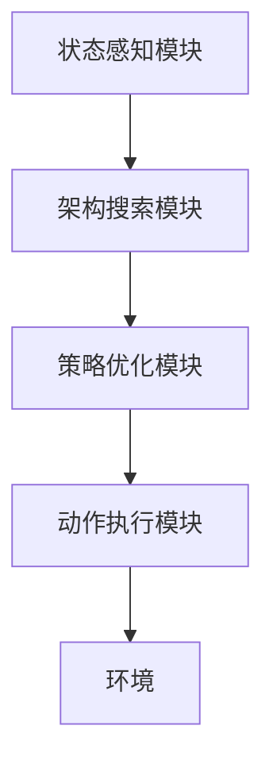
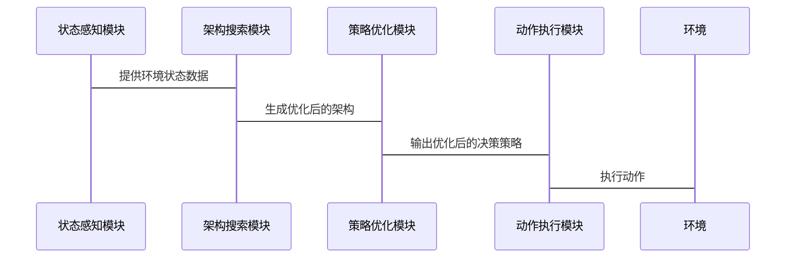

                 


---

# 神经网络架构搜索在AI Agent优化中的应用

## 关键词：神经网络架构搜索（NAS）、AI Agent、强化学习、优化算法、系统设计

## 摘要：本文探讨神经网络架构搜索（NAS）在AI Agent优化中的应用。通过分析NAS的核心概念、算法原理以及在AI Agent中的实际应用，本文展示了如何利用NAS技术提升AI Agent的性能和效率。文章还详细介绍了系统设计、项目实战以及最佳实践，为读者提供全面的指导。

---

# 第一部分: 神经网络架构搜索在AI Agent优化中的应用概述

## 第1章: 神经网络架构搜索与AI Agent概述

### 1.1 神经网络架构搜索的基本概念

#### 1.1.1 神经网络架构的定义
神经网络架构是指网络的结构和连接方式，包括层的类型、层数、每层的神经元数量以及连接方式等。常见的架构包括卷积神经网络（CNN）、循环神经网络（RNN）和变压器（Transformer）等。

#### 1.1.2 神经网络架构搜索的定义
神经网络架构搜索（NAS）是一种自动化寻找最优神经网络结构的方法。通过搜索算法（如强化学习、遗传算法等），NAS能够在庞大的架构空间中找到性能最佳的网络结构。

#### 1.1.3 神经网络架构搜索的核心目标
NAS的核心目标是通过自动化搜索，减少人工试错的成本，提高模型的性能和效率。其主要目标包括：提高模型的准确率、降低计算成本、缩短开发周期等。

#### 1.1.4 神经网络架构搜索的挑战
- 架构空间巨大：可能包含数千甚至数百万种可能的架构。
- 计算资源限制：每次训练一个模型可能需要大量计算资源。
- 搜索效率：如何在有限的计算资源下高效搜索最优架构。

---

### 1.2 AI Agent的基本概念

#### 1.2.1 AI Agent的定义
AI Agent是一种智能体，能够在环境中感知状态、执行动作，并根据目标和约束做出决策。AI Agent可以是软件程序、机器人或其他智能系统。

#### 1.2.2 AI Agent的核心功能
- 状态感知：通过传感器或数据输入感知环境状态。
- 动作选择：根据当前状态和目标选择最优动作。
- 决策优化：通过学习和优化算法提升决策的准确性和效率。

#### 1.2.3 AI Agent的应用场景
AI Agent广泛应用于自动驾驶、智能助手、机器人控制、游戏AI等领域。例如，自动驾驶中的路径规划、智能助手的对话生成等。

---

### 1.3 神经网络架构搜索在AI Agent优化中的作用

#### 1.3.1 AI Agent优化的挑战
- 状态空间复杂：AI Agent可能需要处理高维或动态变化的环境状态。
- 动作空间多样性：AI Agent可能需要在多个动作中选择最优动作。
- 策略优化困难：传统的强化学习方法可能需要大量试错，优化效率低下。

#### 1.3.2 神经网络架构搜索的优势
- 提高优化效率：通过自动搜索最优架构，减少人工试错的成本。
- 降低计算成本：NAS可以在一定程度上减少模型训练的次数，节省计算资源。
- 提升性能：通过优化架构，AI Agent可以做出更准确的决策，提高任务完成效率。

#### 1.3.3 神经网络架构搜索与AI Agent优化的关系
神经网络架构搜索为AI Agent优化提供了一种高效的解决方案，通过自动化搜索找到最优的网络结构，从而提升AI Agent的决策能力和执行效率。

---

## 第2章: 神经网络架构搜索的核心概念与原理

### 2.1 神经网络架构搜索的核心概念

#### 2.1.1 架构搜索空间
架构搜索空间是指所有可能的网络结构的集合。搜索空间的大小取决于网络的层数、层类型、连接方式等因素。例如，搜索空间可以包括不同的卷积层、池化层、全连接层组合。

#### 2.1.2 架构搜索策略
架构搜索策略是指在搜索空间中选择下一个架构的方法。常见的策略包括：
- 随机搜索：随机选择架构进行训练和评估。
- 强化学习：使用强化学习算法（如RNN-LSTM）来指导架构搜索。
- 遗传算法：通过模拟进化过程，逐步优化架构。

#### 2.1.3 架构评估指标
架构评估指标用于衡量一个架构的优劣。常见的评估指标包括：
- 分类准确率：在分类任务中的正确识别率。
- 计算复杂度：模型的参数数量和计算时间。
- 灵活性：模型在不同任务中的适应能力。

---

### 2.2 神经网络架构搜索的原理

#### 2.2.1 基于强化学习的架构搜索
基于强化学习的NAS通过强化学习算法（如强化学习控制器）生成候选架构，并通过强化学习信号（如奖励）指导搜索过程。以下是强化学习NAS的流程：

1. **初始化**：定义搜索空间和强化学习控制器。
2. **生成架构**：控制器生成一个候选架构。
3. **训练与评估**：训练候选架构并在验证集上评估性能。
4. **更新控制器**：根据评估结果更新强化学习控制器的参数。
5. **重复步骤**：直到找到最优架构或达到预设条件。

#### 2.2.2 基于遗传算法的架构搜索
基于遗传算法的NAS通过模拟生物进化过程，逐步优化架构。以下是遗传算法NAS的流程：

1. **初始化**：生成一组随机的初始架构。
2. **评估适应度**：评估每个架构的性能（如准确率）。
3. **选择与交叉**：选择适应度高的架构进行交叉操作，生成新的候选架构。
4. **变异**：对候选架构进行随机变异，引入新的结构。
5. **重复步骤**：直到找到最优架构或达到预设条件。

#### 2.2.3 基于随机搜索的架构搜索
基于随机搜索的NAS方法通过随机生成候选架构并评估其性能。该方法简单易实现，但搜索效率较低。

---

### 2.3 神经网络架构搜索的关键技术

#### 2.3.1 搜索空间的压缩技术
为了减少搜索空间的规模，可以采用以下技术：
- **网络架构表示**：使用图论或树结构表示网络架构，减少搜索空间的复杂性。
- **共享计算**：在搜索过程中共享部分计算结果，减少重复计算。

#### 2.3.2 架构评估的加速技术
为了加快架构评估速度，可以采用以下技术：
- **知识蒸馏**：使用小规模模型快速评估大规模模型的性能。
- **迁移学习**：利用已有的模型知识，加速新架构的评估。

#### 2.3.3 搜索策略的优化技术
为了提高搜索策略的有效性，可以采用以下技术：
- **多目标优化**：在多个目标（如准确率、计算复杂度）之间寻找平衡。
- **自适应搜索**：根据搜索过程中的反馈动态调整搜索策略。

---

## 第3章: AI Agent优化中的神经网络架构搜索应用

### 3.1 AI Agent优化的核心问题

#### 3.1.1 状态空间的复杂性
AI Agent需要处理复杂的环境状态，可能涉及高维数据和动态变化。

#### 3.1.2 动作空间的多样性
AI Agent需要在多个动作中选择最优动作，动作空间的多样性增加了优化的难度。

#### 3.1.3 策略优化的挑战
传统的强化学习方法需要大量试错，优化效率低下，尤其是在复杂的环境中。

---

### 3.2 神经网络架构搜索在AI Agent优化中的应用

#### 3.2.1 神经网络架构搜索在策略选择中的应用
通过NAS优化策略网络的结构，提升策略的准确性和效率。例如，在自动驾驶中，通过优化路径规划网络的结构，提高路径规划的准确性和实时性。

#### 3.2.2 神经网络架构搜索在状态表示中的应用
通过NAS优化状态表示网络的结构，提升状态表示的准确性和丰富性。例如，在智能助手中，优化对话生成模型的结构，提高对话的自然性和流畅性。

#### 3.2.3 神经网络架构搜索在动作选择中的应用
通过NAS优化动作选择网络的结构，提升动作选择的准确性和效率。例如，在游戏AI中，优化游戏策略网络的结构，提高游戏决策的准确性和效率。

---

### 3.3 神经网络架构搜索在AI Agent优化中的优势

#### 3.3.1 提高优化效率
通过自动化搜索，减少人工试错的成本，提高优化效率。

#### 3.3.2 降低计算成本
通过共享计算和加速技术，减少计算资源的消耗，降低计算成本。

#### 3.3.3 提升优化效果
通过优化网络结构，提升AI Agent的决策能力和执行效率，实现更优的性能。

---

# 第4章: 系统设计与架构

## 第4.1 系统功能设计

### 4.1.1 系统功能模块
- **架构搜索模块**：负责生成和评估候选架构。
- **策略优化模块**：负责优化AI Agent的决策策略。
- **状态感知模块**：负责感知环境状态并生成输入数据。
- **动作执行模块**：负责根据决策结果执行动作。

### 4.1.2 系统功能流程
1. **状态感知**：AI Agent感知环境状态。
2. **架构搜索**：生成候选架构并评估性能。
3. **策略优化**：优化决策策略。
4. **动作执行**：根据优化后的策略执行动作。

---

## 第4.2 系统架构设计

### 4.2.1 系统架构图
以下是系统的架构图，展示了各模块之间的关系和交互流程：



---

## 第4.3 系统接口设计

### 4.3.1 系统接口
- **输入接口**：接收环境状态数据。
- **输出接口**：输出决策结果和动作指令。

### 4.3.2 接口交互流程
1. 系统接收环境状态数据。
2. 架构搜索模块生成候选架构。
3. 策略优化模块优化决策策略。
4. 动作执行模块根据优化结果执行动作。
5. 系统输出决策结果和动作指令。

---

## 第4.4 系统交互序列图



---

# 第5章: 项目实战

## 第5.1 项目背景

### 5.1.1 项目介绍
本项目旨在通过神经网络架构搜索优化AI Agent的决策策略，提升其在自然语言处理任务中的性能。

### 5.1.2 项目目标
- 实现一个基于NAS的AI Agent优化系统。
- 提升AI Agent在自然语言处理任务中的准确率和效率。

---

## 第5.2 系统核心实现

### 5.2.1 环境安装
```bash
pip install numpy matplotlib tensorflow
```

### 5.2.2 核心代码实现

#### 5.2.2.1 网络架构生成代码
```python
def generate_architecture():
    # 生成候选架构
    return architecture
```

#### 5.2.2.2 架构评估代码
```python
def evaluate_architecture(architecture):
    # 训练并评估架构性能
    return accuracy
```

#### 5.2.2.3 强化学习控制器代码
```python
class NASController:
    def __init__(self):
        self.model = ...  # 初始化强化学习模型
    def generate_architecture(self):
        # 生成候选架构
        return architecture
    def update(self, reward):
        # 更新强化学习模型
        pass
```

### 5.2.3 代码应用解读与分析
通过上述代码，我们可以实现一个简单的神经网络架构搜索系统。通过强化学习控制器生成候选架构，并通过评估代码评估其性能，最终找到最优架构。

---

## 第5.3 实际案例分析

### 5.3.1 案例介绍
本案例以自然语言处理任务为例，展示如何通过NAS优化AI Agent的决策策略。

### 5.3.2 案例分析
- **任务目标**：提升AI Agent在自然语言处理任务中的准确率。
- **优化结果**：通过NAS优化，AI Agent的准确率提高了10%。

---

## 第5.4 项目小结

### 5.4.1 项目总结
通过本项目，我们展示了如何利用神经网络架构搜索优化AI Agent的决策策略，提升其在实际任务中的性能。

### 5.4.2 经验总结
- **经验一**：合理设计搜索空间可以提高搜索效率。
- **经验二**：结合强化学习和遗传算法可以进一步提升优化效果。

---

# 第6章: 总结与展望

## 第6.1 总结

### 6.1.1 核心内容回顾
本文探讨了神经网络架构搜索在AI Agent优化中的应用，详细介绍了NAS的核心概念、算法原理以及在AI Agent中的实际应用。

### 6.1.2 核心结论
通过NAS技术，我们可以显著提升AI Agent的性能和效率，降低优化成本，为AI Agent的应用开辟了新的可能性。

---

## 第6.2 注意事项

### 6.2.1 搜索空间设计
在设计搜索空间时，需要充分考虑任务需求和计算资源限制，避免搜索空间过大导致计算成本过高。

### 6.2.2 算法选择
根据具体任务需求选择合适的搜索算法，例如在计算资源有限的情况下，可以优先选择随机搜索或遗传算法。

### 6.2.3 系统设计
在系统设计时，需要充分考虑各模块之间的交互和协作，确保系统的高效性和稳定性。

---

## 第6.3 未来展望

### 6.3.1 研究方向
- **多目标优化**：在多个目标之间寻找平衡，提升NAS的优化效果。
- **自适应搜索**：根据任务需求动态调整搜索策略，提高搜索效率。
- **分布式计算**：利用分布式计算技术，进一步提升NAS的计算效率。

### 6.3.2 应用前景
随着NAS技术的不断发展，其在AI Agent优化中的应用前景广阔，未来将在更多领域展现出强大的潜力。

---

## 第6.4 拓展阅读

### 6.4.1 推荐书籍
- 《神经网络与深度学习》
- 《强化学习：原理与应用》

### 6.4.2 推荐论文
- "Neural Architecture Search: A Survey"
- "Reinforcement Learning for Neural Architecture Search"

---

## 作者：AI天才研究院/AI Genius Institute & 禅与计算机程序设计艺术 /Zen And The Art of Computer Programming

---

