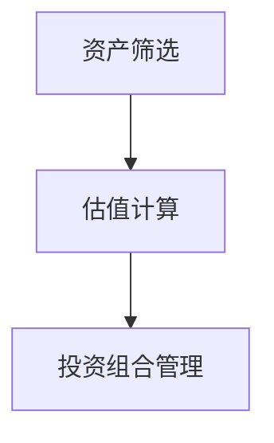
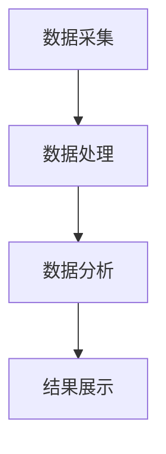

                 


# 约翰·邓普顿的全球价值投资视角

## 关键词：约翰·邓普顿，价值投资，全球投资，安全边际，市场先生，投资策略

## 摘要：本文从约翰·邓普顿的投资哲学出发，深入探讨价值投资的核心概念、全球视角下的投资策略、风险管理及实际案例分析，为读者提供系统性的价值投资框架。

---

## 第1章: 约翰·邓普顿与价值投资概述

### 1.1 约翰·邓普顿的生平简介

约翰·邓普顿（John Templeton）是20世纪最著名的价值投资者之一，被誉为“全球投资之父”。他出生于1912年，去世于2008年，一生致力于投资事业，并创立了邓普顿投资公司。邓普顿的投资理念深刻影响了全球投资领域，尤其是其对价值投资的诠释和实践。

#### 1.1.1 约翰·邓普顿的早期经历
邓普顿出生于英国曼彻斯特，年轻时对投资产生了浓厚兴趣。他在1930年代开始涉足股市，并迅速积累了丰富的投资经验。1940年代，他在加拿大和美国建立了自己的投资公司，开始系统性地实践价值投资。

#### 1.1.2 约翰·邓普顿的投资生涯
邓普顿的职业生涯中，他不仅是一位成功的投资者，还是一位慈善家。他在投资领域的主要成就是发现了许多被低估的股票，并在市场低谷时大量买入，从而在市场复苏时获得超额收益。

#### 1.1.3 约翰·邓普顿的影响力与遗产
邓普顿的投资理念和方法被广泛传播和应用，他的著作和演讲影响了无数投资者。他的遗产包括建立的邓普顿基金会，致力于支持和推广价值投资理念。

### 1.2 价值投资的核心概念

价值投资是一种以低于内在价值的价格买入优质资产的投资策略。其核心在于寻找市场低估的股票，并长期持有，直到市场认识到其真实价值。

#### 1.2.1 价值投资的定义
价值投资是一种逆向投资策略，强调在市场恐慌时买入，在市场狂热时卖出。其核心在于识别市场的非理性，并从中获利。

#### 1.2.2 价值投资与其它投资策略的区别
与成长投资不同，价值投资注重安全边际和低估值。与趋势投资不同，价值投资注重基本面分析和长期持有。

#### 1.2.3 价值投资的基本原则
1. **安全边际**：买入价格低于内在价值，确保有足够的安全空间。
2. **市场先生**：市场的波动性是投资机会的来源。
3. **长期持有**：价值投资强调长期持有，等待市场的认知回归。

### 1.3 全球价值投资的背景与意义

随着全球经济一体化的深入，全球投资成为可能。邓普顿的价值投资理念在全球范围内得到了广泛应用。

#### 1.3.1 全球化经济的现状
全球经济一体化使得投资者可以跨越国界进行投资，寻找全球范围内的投资机会。

#### 1.3.2 全球价值投资的兴起
随着信息的透明化和全球市场的互联互通，价值投资在全球范围内得到了更多的关注和应用。

#### 1.3.3 约翰·邓普顿在全球投资中的地位
邓普顿的全球价值投资理念为投资者提供了在全球范围内寻找低估资产的机会，他的方法在国际市场上同样适用。

### 1.4 价值投资的核心要素

价值投资的核心要素包括安全边际、市场先生和长期持有。

#### 1.4.1 价值投资的三要素
1. **内在价值**：资产的真实价值，需要通过基本面分析得出。
2. **市场价格**：市场的波动导致价格与价值的偏离。
3. **安全边际**：买入价格低于内在价值，确保投资的安全性。

#### 1.4.2 安全边际的定义与作用
安全边际是价值投资的核心，它确保了即使市场波动，投资者仍能获得正收益。

#### 1.4.3 市场先生的概念与应用
市场先生是格雷厄姆提出的一个比喻，用来描述市场的波动性和非理性。投资者应利用市场的波动性，寻找低估资产。

### 1.5 本章小结

本章介绍了约翰·邓普顿的生平及其价值投资的核心理念，强调了安全边际和市场先生的重要性，并探讨了全球价值投资的背景和意义。

---

## 第2章: 价值投资的理论与方法

### 2.1 价值投资的理论基础

价值投资的理论基础来源于格雷厄姆和多德的价值投资体系。

#### 2.1.1 格雷厄姆-多德价值投资体系
格雷厄姆和多德提出的价值投资体系强调安全边际和内在价值的计算。

#### 2.1.2 股票的内在价值计算
内在价值是股票的真实价值，可以通过基本面分析得出。公式如下：
$$
\text{内在价值} = \frac{\text{未来现金流的现值}}{\text{折现率}}
$$

#### 2.1.3 市场价格与内在价值的差异
市场价格受市场情绪影响，常常偏离内在价值，这是价值投资的机会来源。

### 2.2 约翰·邓普顿的投资方法

邓普顿的投资方法是价值投资的典型代表。

#### 2.2.1 狭义的价值投资策略
邓普顿的狭义价值投资策略包括：
1. **识别低估资产**：通过基本面分析，寻找市场价格低于内在价值的资产。
2. **分散投资**：通过投资多个低估资产，分散风险。
3. **长期持有**：等待市场认知回归，实现收益。

#### 2.2.2 广义的价值投资策略
广义的价值投资策略包括：
1. **跨市场投资**：在全球范围内寻找低估资产。
2. **行业轮动**：根据市场变化，调整投资组合。
3. **动态调整**：定期评估资产价值，及时调整投资策略。

#### 2.2.3 约翰·邓普顿的选股标准
邓普顿的选股标准包括：
1. **低市盈率**：市盈率低于行业平均水平。
2. **低市净率**：市净率低于行业平均水平。
3. **高股息率**：股息率高于行业平均水平。

### 2.3 价值投资的核心模型

价值投资的核心模型包括股票估值模型和安全边际模型。

#### 2.3.1 股票估值模型
股票估值模型通过基本面分析，计算股票的内在价值。公式如下：
$$
\text{内在价值} = \frac{\text{净利润} \times (1 + \text{增长率})}{\text{折现率} - \text{增长率}}
$$

#### 2.3.2 市盈率与市净率分析
市盈率（P/E）和市净率（P/B）是衡量股票价值的重要指标。公式如下：
$$
\text{市盈率} = \frac{\text{股价}}{\text{每股收益}}
$$
$$
\text{市净率} = \frac{\text{股价}}{\text{每股净资产}}
$$

#### 2.3.3 现金流折现模型
现金流折现模型通过预测未来现金流，计算股票的内在价值。公式如下：
$$
\text{内在价值} = \sum_{t=1}^{n} \frac{\text{现金流}_t}{(1 + r)^t}
$$
其中，\( r \) 是折现率，\( n \) 是预测期数。

### 2.4 价值投资的实施步骤

价值投资的实施步骤包括：
1. **确定投资目标**：明确投资目标和风险承受能力。
2. **股票筛选与分析**：通过基本面分析，筛选低估资产。
3. **投资组合的构建与调整**：根据市场变化，动态调整投资组合。

### 2.5 本章小结

本章详细介绍了价值投资的理论基础、邓普顿的投资方法以及价值投资的核心模型，为读者提供了系统的投资框架。

---

## 第3章: 全球视角下的价值投资策略

### 3.1 全球化投资的背景分析

全球化使得投资者可以跨越国界进行投资，寻找全球范围内的投资机会。

#### 3.1.1 全球经济一体化的现状
全球经济一体化使得市场之间的关联性增强，投资者可以利用市场的差异性进行套利。

#### 3.1.2 不同国家市场的特点
不同国家市场具有不同的经济结构和市场特点，投资者需要根据不同市场的情况调整投资策略。

#### 3.1.3 全球化对投资策略的影响
全球化使得投资策略更加多元化，投资者可以利用不同市场的差异性进行投资。

### 3.2 约翰·邓普顿的全球投资视角

邓普顿的全球投资视角为投资者提供了在全球范围内寻找低估资产的机会。

#### 3.2.1 全球投资的优势
1. **分散风险**：通过在全球范围内投资，分散市场风险。
2. **寻找低估资产**：不同国家和地区的市场可能存在低估资产。
3. **利用市场差异**：不同市场的差异性为投资者提供了套利机会。

#### 3.2.2 邓普顿的全球投资策略
1. **跨市场投资**：在全球范围内寻找低估资产。
2. **行业轮动**：根据不同国家市场的经济周期，调整投资组合。
3. **动态调整**：根据全球经济形势，及时调整投资策略。

### 3.3 全球价值投资的实施步骤

全球价值投资的实施步骤包括：
1. **选择投资市场**：根据经济基本面和市场估值，选择投资市场。
2. **筛选低估资产**：通过基本面分析，筛选低估资产。
3. **构建投资组合**：根据市场情况，构建多元化投资组合。

### 3.4 本章小结

本章探讨了全球化投资的背景和邓普顿的全球投资视角，分析了全球价值投资的优势和实施步骤。

---

## 第4章: 邓普顿的投资体系与风险管理

### 4.1 邓普顿的投资体系

邓普顿的投资体系是价值投资的典型代表。

#### 4.1.1 投资目标的确定
邓普顿的投资目标是寻找市场价格低于内在价值的资产，通过长期持有实现收益。

#### 4.1.2 股票筛选与分析
邓普顿通过基本面分析，筛选出具有安全边际的低估资产。

#### 4.1.3 投资组合管理
邓普顿的投资组合管理注重分散风险，定期评估资产价值，及时调整投资策略。

### 4.2 风险管理的重要性

风险管理是投资成功的关键。

#### 4.2.1 风险的来源
1. **市场风险**：市场价格波动带来的风险。
2. **流动性风险**：资产难以变现带来的风险。
3. **信用风险**：债券发行人违约带来的风险。

#### 4.2.2 风险的量化
1. **波动率**：衡量资产价格波动性的指标。
2. **VaR**：风险价值，衡量投资组合在一定置信水平下的潜在损失。

#### 4.2.3 风险的控制
1. **分散投资**：通过投资多种资产，分散风险。
2. **止损策略**：设定止损点，控制投资损失。

### 4.3 本章小结

本章分析了邓普顿的投资体系，并探讨了风险管理的重要性，强调了分散投资和止损策略在投资中的作用。

---

## 第5章: 邓普顿投资策略的数学模型与算法

### 5.1 股票估值模型的数学公式

股票估值模型是价值投资的核心工具。

#### 5.1.1 现金流折现模型
现金流折现模型通过预测未来现金流，计算股票的内在价值。公式如下：
$$
\text{内在价值} = \sum_{t=1}^{n} \frac{\text{现金流}_t}{(1 + r)^t}
$$
其中，\( r \) 是折现率，\( n \) 是预测期数。

#### 5.1.2 市盈率与市净率分析
市盈率（P/E）和市净率（P/B）是衡量股票价值的重要指标。公式如下：
$$
\text{市盈率} = \frac{\text{股价}}{\text{每股收益}}
$$
$$
\text{市净率} = \frac{\text{股价}}{\text{每股净资产}}
$$

### 5.2 投资组合管理的优化算法

投资组合管理是实现价值投资的重要环节。

#### 5.2.1 马科维茨的现代投资组合理论
马科维茨的现代投资组合理论通过优化资产配置，实现投资收益的最大化。公式如下：
$$
\text{最优投资组合} = \argmin_{w} w^T \Sigma w \quad \text{subject to} \quad w^T \mu = \text{目标收益}
$$
其中，\( w \) 是资产权重向量，\( \Sigma \) 是协方差矩阵，\( \mu \) 是资产收益向量。

#### 5.2.2 风险平价策略
风险平价策略通过分配风险权重，实现投资组合的均衡风险。公式如下：
$$
\text{风险权重}_i = \frac{\text{资产 } i \text{ 的风险贡献}}{\sum_{j=1}^{n} \text{资产 } j \text{ 的风险贡献}}
$$

### 5.3 本章小结

本章通过数学模型和算法，详细介绍了股票估值和投资组合管理的核心原理，为读者提供了理论支持。

---

## 第6章: 邓普顿投资策略的系统架构与项目实战

### 6.1 系统架构设计

系统架构设计是实现价值投资的重要环节。

#### 6.1.1 领域模型设计
领域模型设计包括资产筛选、估值计算和投资组合管理三个模块。领域模型如下：



#### 6.1.2 系统架构设计
系统架构设计包括数据采集、数据处理、数据分析和结果展示四个模块。系统架构如下：



### 6.2 项目实战

项目实战是将理论应用于实际投资的重要步骤。

#### 6.2.1 环境安装
需要安装Python、Pandas、NumPy和Matplotlib等工具。

#### 6.2.2 核心实现源代码

以下是股票估值模型的Python代码：

```python
import pandas as pd
import numpy as np

def calculate_intrinsic_value(financial_data, discount_rate):
    # 计算未来现金流
    future_cash_flows = financial_data['净利润'] * (1 + financial_data['增长率'])
    # 计算现值
    present_value = future_cash_flows / (1 + discount_rate)
    return present_value.sum()

# 示例数据
data = {
    '净利润': [100, 150, 200],
    '增长率': [0.1, 0.1, 0.1],
    '折现率': 0.08
}
financial_data = pd.DataFrame(data)

# 计算内在价值
intrinsic_value = calculate_intrinsic_value(financial_data, financial_data.loc[0, '折现率'])
print("内在价值:", intrinsic_value)
```

#### 6.2.3 代码应用解读与分析
上述代码通过现金流折现模型计算股票的内在价值，帮助投资者识别低估资产。

#### 6.2.4 实际案例分析
以某公司为例，分析其基本面，计算其内在价值，判断其是否为低估资产。

### 6.3 本章小结

本章通过系统架构设计和项目实战，将理论应用于实际投资，帮助读者更好地理解和应用价值投资策略。

---

## 第7章: 总结与展望

### 7.1 本章总结

本文从约翰·邓普顿的投资哲学出发，深入探讨了价值投资的核心概念、全球视角下的投资策略、风险管理及实际案例分析，为读者提供了系统性的价值投资框架。

### 7.2 最佳实践 tips

1. **长期持有**：价值投资强调长期持有，避免短期波动的影响。
2. **分散投资**：通过投资多个资产，分散风险。
3. **定期评估**：定期评估资产价值，及时调整投资策略。

### 7.3 小结

价值投资是一种长期有效的投资策略，通过识别低估资产和长期持有，投资者可以在市场波动中实现稳健收益。

### 7.4 注意事项

1. **市场波动**：市场波动是投资机会的来源，但也是风险的来源。
2. **信息透明**：投资者需要依赖基本面分析，确保信息的透明和准确。
3. **持续学习**：投资市场变化莫测，投资者需要不断学习和适应。

### 7.5 拓展阅读

1. **《聪明的投资者》**：本杰明·格雷厄姆的著作，价值投资的经典之作。
2. **《投资之道》**：彼得·林奇的著作，提供了丰富的投资实践经验和案例分析。

---

## 作者：AI天才研究院/AI Genius Institute & 禅与计算机程序设计艺术 /Zen And The Art of Computer Programming

---

通过以上内容，读者可以系统性地理解约翰·邓普顿的全球价值投资视角，并将其应用于实际投资中。

