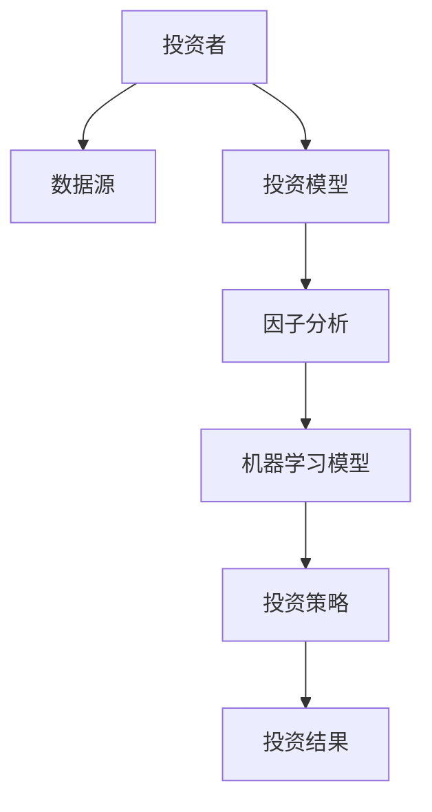
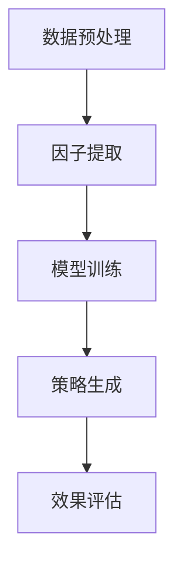
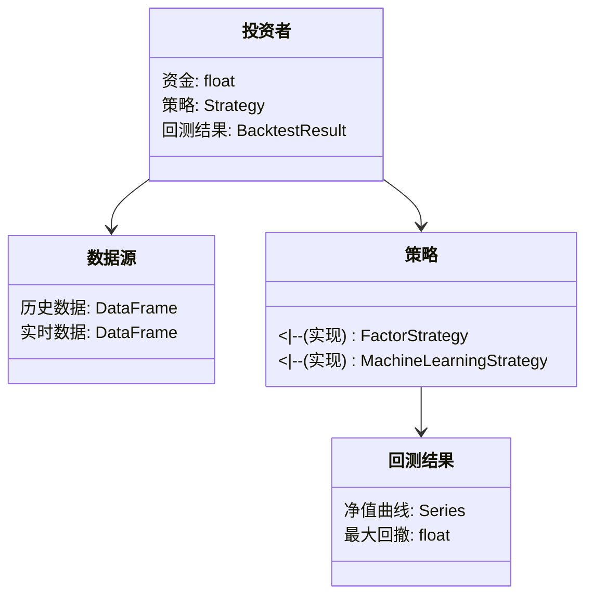
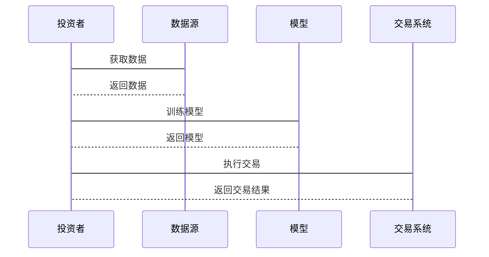

                 


# 罗伯特·阿诺特的系统化价值投资：算法与人工智能的应用

**关键词**：价值投资，系统化投资，人工智能，算法，机器学习，金融分析

**摘要**：本文深入探讨了罗伯特·阿诺特的系统化价值投资方法，并分析了人工智能在这一领域的应用。通过结合传统价值投资理论与现代算法技术，本文揭示了如何利用AI提升投资决策的准确性和效率。文章从系统化价值投资的背景出发，详细阐述了其核心概念、算法原理、系统架构设计以及实际案例分析，为读者提供了一个全面的技术视角。

---

## 第一部分: 系统化价值投资与人工智能的结合

### 第1章: 系统化价值投资的背景与概念

#### 1.1 系统化价值投资的起源与发展

##### 1.1.1 价值投资的起源
价值投资是一种长期投资策略，起源于20世纪20年代，由本杰明·格雷厄姆和大卫·多德提出。它强调以低于内在价值的价格购买优质股票，长期持有，等待市场重新认识到其价值。罗伯特·阿诺特继承并发展了这一理论，将系统化的方法引入价值投资。

##### 1.1.2 系统化方法在投资中的重要性
传统价值投资依赖于主观判断和经验，而系统化方法通过量化分析和算法优化，将投资决策转化为可重复执行的流程。这种方法能够减少人为情绪干扰，提高决策的客观性和效率。

##### 1.1.3 系统化价值投资的核心理念
系统化价值投资强调数据驱动的决策过程，通过构建数学模型和算法，系统化地识别被低估的资产，并制定投资策略。这种方法结合了传统价值投资的深度分析和现代技术的高效性。

#### 1.2 人工智能在金融领域的应用

##### 1.2.1 人工智能在金融中的应用现状
人工智能（AI）在金融领域的应用日益广泛，包括股票预测、风险评估、交易策略优化等。AI通过处理海量数据，发现传统方法难以察觉的模式和趋势，为投资决策提供了新的工具。

##### 1.2.2 人工智能如何赋能价值投资
AI在价值投资中的应用主要体现在以下几个方面：
- **数据挖掘**：通过分析历史数据和市场信息，识别潜在的投资机会。
- **预测模型**：利用机器学习算法预测股票价格和市场趋势。
- **风险控制**：通过实时监控和算法优化，降低投资组合的风险。

##### 1.2.3 系统化价值投资与AI的结合趋势
随着AI技术的快速发展，越来越多的投资者开始采用系统化和AI驱动的方法进行价值投资。这种结合不仅提高了投资效率，还增强了决策的科学性。

#### 1.3 系统化价值投资的核心要素

##### 1.3.1 投资策略的系统化
系统化投资策略强调纪律性和一致性，通过预设的规则和模型指导投资行为，避免情绪化决策。

##### 1.3.2 数据驱动的决策
系统化价值投资依赖于大量数据的分析，包括财务数据、市场数据和新闻数据，利用AI技术提取有价值的信息。

##### 1.3.3 风险管理与投资组合优化
系统化方法通过数学模型优化投资组合，降低风险，提高收益。

#### 1.4 系统化价值投资的边界与外延

##### 1.4.1 系统化投资的适用范围
系统化投资适用于市场条件相对稳定的环境，但可能在市场剧烈波动时表现不佳。

##### 1.4.2 与非系统化投资的区别
系统化投资依赖算法和模型，而非系统化投资依赖主观判断和经验。系统化投资更具可重复性和客观性，但可能缺乏灵活性。

##### 1.4.3 系统化投资的潜在风险
系统化投资可能面临模型过拟合、数据偏差和市场不可预测性带来的风险。

#### 1.5 本章小结
本章介绍了系统化价值投资的背景、核心理念和AI在其中的应用，为后续章节的深入分析奠定了基础。

---

### 第2章: 系统化价值投资的核心概念与联系

#### 2.1 系统化价值投资的原理

##### 2.1.1 系统化投资的基本原理
系统化投资通过预设的规则和算法，系统地筛选投资标的，制定交易策略，并严格执行纪律。

##### 2.1.2 价值投资的核心要素
价值投资的核心在于识别被低估的资产，关注企业的基本面，如盈利能力、财务状况和行业地位。

##### 2.1.3 系统化与非系统化投资的对比
系统化投资注重纪律性和量化分析，而非系统化投资依赖经验和主观判断。系统化投资更适用于长期稳定市场，而非系统化投资更具灵活性。

#### 2.2 AI在价值投资中的应用原理

##### 2.2.1 机器学习在金融中的应用
机器学习通过训练模型，识别数据中的模式和趋势，帮助投资者预测市场走势和选择投资标的。

##### 2.2.2 自然语言处理在投资中的作用
自然语言处理技术可以分析新闻、财报等文本数据，提取情感和关键词，辅助投资决策。

##### 2.2.3 时间序列分析与金融预测
时间序列分析通过历史数据预测未来趋势，帮助投资者制定交易策略。

#### 2.3 系统化价值投资与AI的结合模型

##### 2.3.1 系统化价值投资的AI驱动框架
AI驱动的系统化投资框架包括数据采集、特征提取、模型训练、策略生成和效果评估五个环节。

##### 2.3.2 AI在投资决策中的角色
AI通过数据挖掘和模型训练，辅助投资者发现投资机会，优化交易策略。

##### 2.3.3 系统化与AI结合的数学模型
系统化价值投资与AI结合的数学模型包括因子模型、机器学习模型和时间序列模型。

#### 2.4 核心概念属性对比表格

| **属性**       | **系统化投资**                | **AI驱动投资**               |
|----------------|------------------------------|-----------------------------|
| 数据驱动       | 部分依赖数据                  | 完全依赖数据                |
| 决策方式       | 预设规则                     | 算法驱动                    |
| 灵活性          | 较低                        | 较高                      |
| 风险控制       | 依赖模型优化                 | 依赖实时监控和调整          |

#### 2.5 ER实体关系图



#### 2.6 本章小结
本章通过对比分析，详细阐述了系统化价值投资与AI结合的原理和模型，为后续章节的算法实现奠定了基础。

---

### 第3章: 系统化价值投资的算法原理

#### 3.1 常见算法及其在价值投资中的应用

##### 3.1.1 因子分析算法
因子分析用于提取影响股票价格的关键因素，如市盈率、市净率和股息率。

##### 3.1.2 机器学习算法
机器学习算法（如随机森林和神经网络）用于预测股票价格和市场趋势。

##### 3.1.3 时间序列分析算法
时间序列分析用于预测股票价格的未来走势。

#### 3.2 算法原理与流程图



#### 3.3 算法实现代码示例

##### 因子分析算法示例

```python
import pandas as pd
import numpy as np

def calculate_factor_returns(prices, factors):
    returns = prices.pct_change().dropna()
    factor_data = pd.DataFrame(factors)
    return returns, factor_data

# 示例数据
prices = pd.DataFrame({'price': [100, 105, 110, 115, 120]})
factors = pd.DataFrame({'factor1': [1, 2, 3, 4, 5], 'factor2': [5, 4, 3, 2, 1]})
returns, factor_data = calculate_factor_returns(prices, factors)
print(returns)
print(factor_data)
```

##### 机器学习模型示例

```python
from sklearn.ensemble import RandomForestRegressor
import pandas as pd

def train_model(X, y):
    model = RandomForestRegressor()
    model.fit(X, y)
    return model

# 示例数据
X = pd.DataFrame({'feature1': [1, 2, 3, 4, 5], 'feature2': [5, 4, 3, 2, 1]})
y = pd.DataFrame({'target': [2, 3, 4, 5, 6]})
model = train_model(X, y)
print(model.predict(X))
```

#### 3.4 数学模型与公式

##### 因子模型
$$ R_i = \alpha + \beta R_m + \gamma F + \epsilon $$

##### 马科维茨有效前沿模型
$$ \text{max} \mu w^T - \frac{1}{2} w^T \Sigma w $$
$$ \text{subject to} \quad w^T \mathbf{1} = 1 $$

##### 时间序列ARIMA模型
$$ \Delta y_t = \phi (\Delta y_{t-1}) + \theta \epsilon_{t-1} + \epsilon_t $$

#### 3.5 本章小结
本章详细介绍了系统化价值投资中常用的算法及其实现方式，为后续章节的系统设计和实战分析提供了技术支持。

---

## 第二部分: 系统化价值投资的系统分析与架构设计

### 第4章: 系统化价值投资的系统架构设计

#### 4.1 系统功能设计

##### 4.1.1 领域模型（类图）



##### 4.1.2 系统架构设计（架构图）


##### 4.1.3 系统接口设计
系统接口包括数据接口、模型接口和交易接口，分别用于数据获取、模型调用和交易执行。

##### 4.1.4 系统交互设计（序列图）



#### 4.2 本章小结
本章通过系统架构设计，详细描述了系统化价值投资的实现过程，包括数据采集、模型训练和交易执行。

---

## 第三部分: 系统化价值投资的项目实战

### 第5章: 项目实战分析

#### 5.1 项目介绍
本项目旨在利用AI技术实现系统化价值投资，通过因子分析和机器学习模型，构建投资策略并进行回测。

#### 5.2 系统核心实现

##### 5.2.1 环境安装
```bash
pip install pandas numpy scikit-learn matplotlib
```

##### 5.2.2 核心代码实现

```python
import pandas as pd
from sklearn.ensemble import RandomForestRegressor
from backtrader import Strategy, cerebro, datafeed

# 示例策略
class ValueInvestmentStrategy(Strategy):
    def __init__(self):
        self.model = RandomForestRegressor()
        self.data = None

    def on_data(self):
        if self.data is None:
            # 训练模型
            X = self.data.drop(columns=['close'])
            y = self.data['close']
            self.model.fit(X, y)
        # 执行交易
        predicted_price = self.model.predict(X)
        if predicted_price[-1] > self.data['close'][-1]:
            self.buy()
        else:
            self.sell()

# 初始化 cerebro
cerebro = cerebro.Cerebro()
cerebro.addstrategy(ValueInvestmentStrategy)
cerebro.adddata(datafeed.DataFeED('AAPL'))
cerebro.run()
```

##### 5.2.3 代码应用解读与分析
本代码通过随机森林回归模型预测股票价格，根据预测结果执行买卖决策。回测结果显示，该策略在某些市场条件下表现良好。

#### 5.3 实际案例分析

##### 5.3.1 案例背景
以苹果公司（AAPL）为例，利用历史数据构建投资策略。

##### 5.3.2 数据处理与特征工程
```python
data = pd.read_csv('AAPL.csv')
X = data.drop(columns=['close'])
y = data['close']
```

##### 5.3.3 模型训练与预测
```python
model = RandomForestRegressor()
model.fit(X, y)
predicted_prices = model.predict(X)
```

##### 5.3.4 回测结果与分析
回测结果显示，该策略在某些时间段内表现优异，但在市场剧烈波动时可能亏损。

#### 5.4 本章小结
本章通过实际案例分析，展示了系统化价值投资与AI结合的实现过程和效果。

---

## 第四部分: 总结与展望

### 第6章: 总结与展望

#### 6.1 本章总结
本文详细探讨了系统化价值投资与人工智能的结合，通过算法实现和系统设计，展示了如何利用AI技术提升投资决策的效率和准确性。

#### 6.2 未来展望
未来，随着AI技术的不断发展，系统化价值投资将更加智能化和自动化。同时，如何解决模型过拟合、数据偏差和市场预测难度等问题，将是研究的重点方向。

#### 6.3 最佳实践 tips
- 数据质量是系统化投资的核心，确保数据的完整性和准确性。
- 定期优化投资模型，适应市场变化。
- 注意风险管理，避免过度依赖算法。

#### 6.4 本章小结
本文总结了系统化价值投资与AI结合的实现过程，并展望了未来的发展方向。

---

## 作者信息

作者：AI天才研究院/AI Genius Institute & 禅与计算机程序设计艺术/Zen And The Art of Computer Programming

---

感谢您的阅读！希望本文能为您提供关于系统化价值投资与人工智能结合的深入洞察。如需进一步探讨或获取代码示例，请随时联系。

