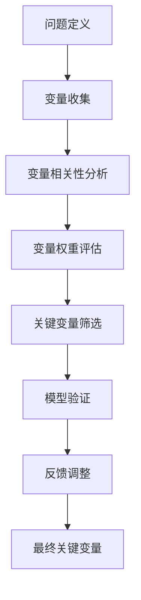

                 

# 《芒格的"关键变量"识别在量子经济系统建模中的运用》

> 关键词：芒格、关键变量识别、量子经济系统、系统建模、量子力学、经济预测

> 摘要：本文探讨了芒格的关键变量识别方法在量子经济系统建模中的应用。通过分析量子经济系统的复杂性和不确定性，结合芒格的哲学和分析方法，提出了一种新的建模框架。文章详细介绍了关键变量识别的理论基础、量子经济系统建模的方法，以及如何将芒格方法与量子模型相结合，以实现更准确的经济预测和决策支持。

---

## 第1章: 芒格的关键变量识别方法

### 1.1 芒格的关键变量识别方法概述

#### 1.1.1 关键变量识别的核心概念

关键变量识别是芒格方法的核心，旨在通过分析系统的输入变量，识别对系统输出影响最大的变量。这种方法依赖于对变量重要性、相关性以及系统复杂性的深刻理解。

**核心概念：**
- **关键变量**：系统中对输出结果影响最大的输入变量。
- **相关性**：变量之间的相互作用和依赖关系。
- **系统复杂性**：系统中变量的相互作用程度和不确定性。

#### 1.1.2 芒格方法的基本原理

芒格方法强调从整体系统出发，通过排除法和权重法，逐步筛选出关键变量。这种方法的关键在于识别变量之间的因果关系，并量化其对系统输出的影响。

**基本步骤：**
1. **问题定义**：明确研究目标和系统边界。
2. **变量收集**：列出所有可能的输入变量。
3. **变量筛选**：通过相关性分析和权重评估，筛选出关键变量。
4. **验证与调整**：通过模型验证和反馈调整，优化关键变量的选择。

#### 1.1.3 关键变量识别的步骤与流程

1. **问题定义**：明确研究目标和系统边界。
2. **变量收集**：通过文献研究和专家访谈，收集所有可能的变量。
3. **变量相关性分析**：使用统计方法（如Pearson相关系数）评估变量之间的相关性。
4. **变量权重评估**：使用层次分析法（AHP）或熵值法，量化每个变量的重要性。
5. **关键变量筛选**：根据权重和相关性，筛选出关键变量。
6. **模型验证**：通过模型仿真和实证分析，验证关键变量的准确性和有效性。
7. **反馈调整**：根据验证结果，调整关键变量的选择。

**图表：**

**Mermaid 流程图：关键变量识别步骤**

### 1.2 芒格方法在经济分析中的应用

#### 1.2.1 经济系统中的关键变量特征

在经济系统中，关键变量通常是那些对经济运行产生重大影响的因素，例如GDP、利率、通货膨胀率等。这些变量具有高度的相关性和影响力。

**特征：**
- **高影响力**：对系统输出（如经济指标）影响显著。
- **高度相关性**：与其他变量密切相关，形成复杂的相互作用网络。
- **动态变化**：受外部因素影响，具有时间依赖性。

#### 1.2.2 芒格方法在经济预测中的作用

芒格方法通过识别关键变量，帮助经济预测模型聚焦于核心因素，提高模型的准确性和效率。这种方法特别适用于复杂经济系统的建模，如金融市场、供应链管理等。

**作用：**
- **提高预测精度**：通过聚焦关键变量，减少噪声变量的干扰。
- **降低计算复杂度**：减少模型的变量数量，提高计算效率。
- **增强模型的可解释性**：通过识别关键变量，便于理解和解释模型结果。

#### 1.2.3 关键变量识别的经济意义

关键变量识别在经济分析中具有重要的现实意义，尤其是在面对复杂经济问题时。通过识别关键变量，经济分析师可以更好地理解经济系统的运行机制，制定更有效的政策和决策。

**意义：**
- **政策制定**：帮助政府制定更有效的经济政策。
- **企业决策**：帮助企业识别市场趋势，优化资源配置。
- **风险管理**：帮助识别潜在风险，制定应对策略。

### 1.3 芒格方法与量子经济系统的结合

#### 1.3.1 量子经济系统的定义与特点

量子经济系统是一种基于量子力学原理的经济系统模型。与经典经济系统不同，量子经济系统具有叠加态和纠缠态的特性，使得系统的状态和变量之间的关系更加复杂和动态。

**特点：**
- **叠加态**：系统变量可以同时处于多个状态。
- **纠缠态**：变量之间的关系高度复杂，难以分离。
- **不确定性**：系统状态具有内在的不确定性，无法通过经典方法完全预测。

#### 1.3.2 芒格方法在量子经济系统建模中的潜力

芒格方法通过识别关键变量，帮助量子经济模型聚焦于核心因素，提高模型的准确性和效率。这种方法特别适用于复杂量子系统的建模，如量子金融市场、量子供应链管理等。

**潜力：**
- **提高模型精度**：通过识别关键变量，减少噪声变量的干扰。
- **降低计算复杂度**：减少模型的变量数量，提高计算效率。
- **增强模型的可解释性**：通过识别关键变量，便于理解和解释模型结果。

#### 1.3.3 量子经济系统的复杂性与挑战

量子经济系统的复杂性主要体现在变量之间的高度纠缠和系统的不确定性。这些特性使得传统的经济建模方法难以有效应用，需要采用新的建模思路和方法。

**挑战：**
- **变量纠缠**：变量之间的关系高度复杂，难以分离。
- **系统不确定性**：系统的状态具有内在的不确定性，无法通过经典方法完全预测。
- **计算资源限制**：量子系统的建模需要大量的计算资源和复杂的技术。

---

## 第2章: 量子经济系统建模基础

### 2.1 量子经济系统的定义与特征

#### 2.1.1 量子经济系统的定义

量子经济系统是一种基于量子力学原理的经济系统模型，其变量和状态具有量子特性，如叠加态和纠缠态。这种系统的建模需要结合量子力学的基本原理和经济系统的特征。

**定义：**
量子经济系统是具有量子特性的经济系统，其变量和状态遵循量子力学的基本规律。

#### 2.1.2 量子经济系统的与经典经济系统的区别

量子经济系统与经典经济系统的区别主要体现在系统的状态和变量之间的关系上。量子系统具有叠加态和纠缠态的特性，而经典系统则具有确定性的状态和独立变量。

**区别：**
- **状态特性**：量子系统具有叠加态和纠缠态，而经典系统具有确定性的状态。
- **变量关系**：量子系统变量之间具有高度纠缠，而经典系统变量之间具有独立性。
- **预测难度**：量子系统的预测具有不确定性，而经典系统的预测具有确定性。

#### 2.1.3 量子经济系统的复杂性与挑战

量子经济系统的复杂性主要体现在系统的变量之间的高度纠缠和系统的不确定性。这些特性使得传统的经济建模方法难以有效应用，需要采用新的建模思路和方法。

**挑战：**
- **变量纠缠**：变量之间的关系高度复杂，难以分离。
- **系统不确定性**：系统的状态具有内在的不确定性，无法通过经典方法完全预测。
- **计算资源限制**：量子系统的建模需要大量的计算资源和复杂的技术。

### 2.2 量子力学在经济建模中的应用

#### 2.2.1 量子力学的基本原理

量子力学是研究微观粒子行为的物理理论，其基本原理包括波函数、叠加态、纠缠态和测量的坍缩等。

**基本原理：**
- **波函数**：描述系统状态的数学函数。
- **叠加态**：系统可以同时处于多个状态。
- **纠缠态**：变量之间的关系高度复杂，难以分离。
- **测量坍缩**：测量导致系统状态的确定。

#### 2.2.2 量子力学在经济系统中的适用性

量子力学在经济系统中的适用性主要体现在系统的复杂性和不确定性。量子系统的特性可以帮助更好地描述和预测经济系统的复杂行为。

**适用性：**
- **复杂性描述**：量子系统的复杂性与经济系统的复杂性相似。
- **不确定性预测**：量子系统的不确定性与经济系统的不确定性相似。
- **高效计算**：量子计算可以在复杂系统中提高计算效率。

#### 2.2.3 量子经济系统建模的方法

量子经济系统的建模方法主要包括量子态表示、量子变量关系建模和量子系统演化方程的建立。

**方法：**
- **量子态表示**：用波函数表示系统变量的状态。
- **量子变量关系建模**：描述变量之间的纠缠关系。
- **量子系统演化方程**：建立系统的演化方程，如薛定谔方程。

### 2.3 关键变量识别在量子经济系统建模中的作用

#### 2.3.1 关键变量识别在量子经济系统中的重要性

关键变量识别在量子经济系统建模中的重要性主要体现在减少计算复杂度和提高模型的准确性。

**重要性：**
- **减少计算复杂度**：通过识别关键变量，减少模型的变量数量，提高计算效率。
- **提高模型准确性**：通过聚焦关键变量，提高模型的预测精度。
- **增强模型的可解释性**：通过识别关键变量，便于理解和解释模型结果。

#### 2.3.2 芒格方法在量子经济系统建模中的应用

芒格方法通过识别关键变量，帮助量子经济模型聚焦于核心因素，提高模型的准确性和效率。

**应用：**
- **提高预测精度**：通过识别关键变量，减少噪声变量的干扰。
- **降低计算复杂度**：减少模型的变量数量，提高计算效率。
- **增强模型的可解释性**：通过识别关键变量，便于理解和解释模型结果。

#### 2.3.3 关键变量识别的量子化特征

关键变量识别的量子化特征主要体现在变量之间的纠缠关系和系统的不确定性。

**量子化特征：**
- **变量纠缠**：变量之间的关系高度复杂，难以分离。
- **系统不确定性**：系统的状态具有内在的不确定性，无法通过经典方法完全预测。
- **量子计算优势**：利用量子计算的优势，提高模型的计算效率。

---

## 第3章: 芒格方法与量子经济系统建模的结合

### 3.1 芒格方法在量子经济系统建模中的核心作用

#### 3.1.1 芒格方法在量子经济系统建模中的优势

芒格方法在量子经济系统建模中的优势主要体现在提高模型的准确性和效率，以及增强模型的可解释性。

**优势：**
- **提高预测精度**：通过识别关键变量，减少噪声变量的干扰。
- **降低计算复杂度**：减少模型的变量数量，提高计算效率。
- **增强模型的可解释性**：通过识别关键变量，便于理解和解释模型结果。

#### 3.1.2 芒格方法在量子经济系统建模中的具体应用

芒格方法在量子经济系统建模中的具体应用包括变量筛选、模型构建和结果验证。

**具体应用：**
- **变量筛选**：通过芒格方法识别关键变量，减少模型的变量数量。
- **模型构建**：基于关键变量构建量子经济模型，提高模型的准确性。
- **结果验证**：通过模型验证和反馈调整，优化关键变量的选择。

#### 3.1.3 芒格方法在量子经济系统建模中的挑战

芒格方法在量子经济系统建模中的挑战主要体现在变量的纠缠关系和系统的不确定性。

**挑战：**
- **变量纠缠**：变量之间的关系高度复杂，难以分离。
- **系统不确定性**：系统的状态具有内在的不确定性，无法通过经典方法完全预测。
- **计算资源限制**：量子系统的建模需要大量的计算资源和复杂的技术。

### 3.2 量子经济系统建模的关键变量识别方法

#### 3.2.1 关键变量识别的量子化特征

关键变量识别的量子化特征主要体现在变量之间的纠缠关系和系统的不确定性。

**量子化特征：**
- **变量纠缠**：变量之间的关系高度复杂，难以分离。
- **系统不确定性**：系统的状态具有内在的不确定性，无法通过经典方法完全预测。
- **量子计算优势**：利用量子计算的优势，提高模型的计算效率。

#### 3.2.2 芒格方法在量子经济系统建模中的具体步骤

芒格方法在量子经济系统建模中的具体步骤包括问题定义、变量收集、变量相关性分析、变量权重评估、关键变量筛选、模型验证和反馈调整。

**具体步骤：**
1. **问题定义**：明确研究目标和系统边界。
2. **变量收集**：通过文献研究和专家访谈，收集所有可能的变量。
3. **变量相关性分析**：使用统计方法（如Pearson相关系数）评估变量之间的相关性。
4. **变量权重评估**：使用层次分析法（AHP）或熵值法，量化每个变量的重要性。
5. **关键变量筛选**：根据权重和相关性，筛选出关键变量。
6. **模型验证**：通过模型仿真和实证分析，验证关键变量的准确性和有效性。
7. **反馈调整**：根据验证结果，调整关键变量的选择。

#### 3.2.3 关键变量识别的量子化模型

关键变量识别的量子化模型是一种基于量子力学原理的模型，用于识别量子经济系统中的关键变量。

**量子化模型：**
- **量子态表示**：用波函数表示系统变量的状态。
- **变量纠缠关系**：描述变量之间的纠缠关系。
- **量子系统演化方程**：建立系统的演化方程，如薛定谔方程。

### 3.3 芒格方法在量子经济系统建模中的案例分析

#### 3.3.1 案例一：量子金融市场的关键变量识别

**案例背景**：在量子金融市场中，识别关键变量对于预测市场趋势和优化投资组合具有重要意义。

**分析步骤**：
1. **问题定义**：明确研究目标和系统边界。
2. **变量收集**：收集所有可能的变量，包括市场指数、利率、通货膨胀率等。
3. **变量相关性分析**：使用统计方法评估变量之间的相关性。
4. **变量权重评估**：使用层次分析法（AHP）或熵值法，量化每个变量的重要性。
5. **关键变量筛选**：根据权重和相关性，筛选出关键变量。
6. **模型验证**：通过模型仿真和实证分析，验证关键变量的准确性和有效性。
7. **反馈调整**：根据验证结果，调整关键变量的选择。

**结果**：通过芒格方法，识别出对量子金融市场影响最大的关键变量，如量子指数、利率和通货膨胀率。

#### 3.3.2 案例二：量子供应链管理中的关键变量识别

**案例背景**：在量子供应链管理中，识别关键变量对于优化供应链运作和降低不确定性具有重要意义。

**分析步骤**：
1. **问题定义**：明确研究目标和系统边界。
2. **变量收集**：收集所有可能的变量，包括供应商、生产成本、运输时间等。
3. **变量相关性分析**：使用统计方法评估变量之间的相关性。
4. **变量权重评估**：使用层次分析法（AHP）或熵值法，量化每个变量的重要性。
5. **关键变量筛选**：根据权重和相关性，筛选出关键变量。
6. **模型验证**：通过模型仿真和实证分析，验证关键变量的准确性和有效性。
7. **反馈调整**：根据验证结果，调整关键变量的选择。

**结果**：通过芒格方法，识别出对量子供应链管理影响最大的关键变量，如供应商可靠性、生产成本和运输时间。

---

## 第4章: 结论与展望

### 4.1 结论

芒格的关键变量识别方法在量子经济系统建模中具有重要的应用价值。通过识别关键变量，可以提高模型的准确性和效率，增强模型的可解释性。量子经济系统的复杂性和不确定性使得传统的经济建模方法难以有效应用，而芒格方法通过聚焦关键变量，为量子经济系统的建模提供了一种新的思路。

### 4.2 未来展望

未来的研究可以进一步探索芒格方法在量子经济系统建模中的应用，特别是在变量筛选、模型构建和结果验证方面。同时，随着量子计算技术的发展，量子经济系统的建模将更加高效和精确，为经济预测和决策支持提供更有力的工具。

---

## 作者：AI天才研究院/AI Genius Institute & 禅与计算机程序设计艺术 /Zen And The Art of Computer Programming

