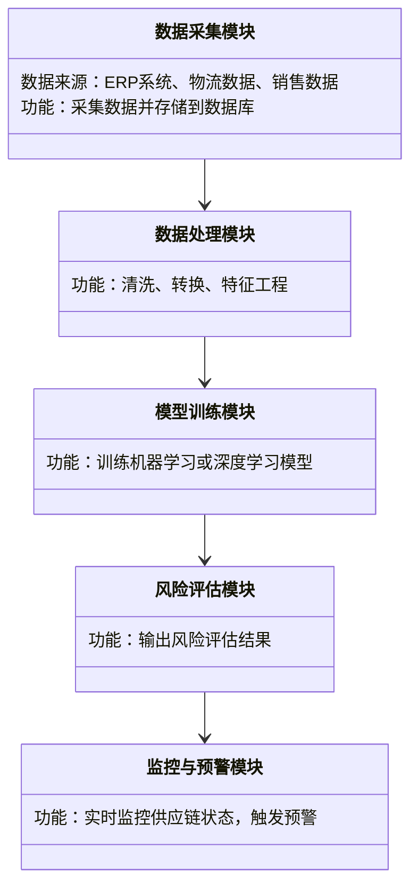

                 


# AI驱动的供应链金融风险管理

> 关键词：供应链金融、风险管理、人工智能、机器学习、大数据分析

> 摘要：本文探讨了AI技术在供应链金融风险管理中的应用，分析了传统风险管理的局限性，介绍了AI驱动的风险评估模型和算法，展示了如何通过数据驱动的方法优化供应链金融的稳定性。文章从背景、核心概念、算法原理、系统设计到项目实战，全面解析了AI在供应链金融风险管理中的潜力和实现路径。

---

# 目录大纲

## 第一部分: 供应链金融风险管理的背景与挑战

### 第1章: 供应链金融风险管理概述

#### 1.1 供应链金融的基本概念
- 1.1.1 供应链金融的定义与特点
  - 供应链金融的定义
  - 供应链金融的核心参与者与流程
  - 供应链金融的关键特征：高效性、协同性、可扩展性

- 1.1.2 供应链金融的核心参与者与流程
  - 供应商、制造商、分销商、零售商的角色分析
  - 供应链金融的资金流、信息流、物流的协同管理
  - 供应链金融的典型流程：融资申请、审批、放款、监控、还款

- 1.1.3 供应链金融的风险类型与管理目标
  - 信用风险、流动性风险、操作风险、市场风险
  - 风险管理的目标：最小化损失、优化资源配置、提升整体效率

#### 1.2 供应链金融风险管理的背景与挑战
- 1.2.1 供应链金融风险管理的重要性
  - 供应链中断对企业的影响：成本上升、客户流失、声誉损失
  - 金融风险对供应链稳定性的影响：资金链断裂、合作伙伴信任危机
  - 风险管理在企业可持续发展中的战略意义

- 1.2.2 传统供应链金融风险管理的局限性
  - 传统方法的不足：依赖人工经验、数据碎片化、反应滞后
  - 现有技术的瓶颈：信息孤岛、数据不一致、缺乏实时性
  - 传统风险管理的低效性：难以应对复杂多变的市场环境

- 1.2.3 数字化与智能化时代的新挑战
  - 数据爆炸：如何处理海量数据并提取有价值的信息
  - 业务复杂化：全球化供应链带来的复杂风险因素
  - 技术驱动的变革：AI与大数据技术如何重塑风险管理模式

#### 1.3 AI驱动的供应链金融风险管理的优势
- 1.3.1 AI技术在供应链金融中的应用潜力
  - 数据分析能力：AI可以处理结构化和非结构化数据，发现隐藏的模式
  - 预测能力：通过机器学习模型预测风险，提前采取措施
  - 自适应能力：AI可以实时监控供应链动态，动态调整风险管理策略

- 1.3.2 数据驱动的决策优势
  - 全面性：AI可以整合供应链中的多方数据，提供全局视角
  - 精准性：基于历史数据和实时数据，实现精准的风险评估
  - 可扩展性：AI模型可以快速适应不同供应链规模和复杂度

- 1.3.3 实时监控与预测的效率提升
  - 实时监控：AI可以实时跟踪供应链中的关键指标，及时发现异常
  - 预测能力：通过时间序列分析和机器学习模型，预测未来的风险
  - 自动化响应：AI驱动的系统可以自动触发风险缓解措施

### 第2章: 供应链金融风险管理的核心概念与联系

#### 2.1 核心概念原理
- 2.1.1 供应链金融中的信用风险
  - 信用风险的定义：供应链中的某一方无法履行合同义务而导致的风险
  - 信用风险的来源：供应商财务状况恶化、客户需求变化、市场波动
  - 信用风险的评估指标：信用评分、历史违约率、财务健康状况

- 2.1.2 数据驱动的信用评估模型
  - 数据驱动信用评估的优势：利用历史交易数据、财务数据、物流数据等进行综合评估
  - 常见的数据驱动模型：线性回归、逻辑回归、随机森林、支持向量机
  - 数据特征的选择：如何从海量数据中提取有效的特征，避免维度灾难

- 2.1.3 AI算法在风险预测中的应用
  - 机器学习算法：决策树、随机森林、梯度提升树
  - 深度学习算法：神经网络在风险评估中的应用
  - 集成学习：如何通过集成多种算法提高预测准确性

#### 2.2 核心概念属性特征对比
- 2.2.1 不同供应链金融模式的对比分析
  - 应收账款质押融资与存货质押融资的对比
  - 供应链反向保理与正向保理的对比
  - 供应链金融与传统银行信贷的对比

- 2.2.2 AI驱动与传统驱动的风险管理对比
  - 传统方法的不足：依赖人工经验，缺乏数据支持
  - AI驱动的优势：数据驱动、实时监控、动态调整
  - 结合AI与传统方法的混合模式：如何取长补短，提升整体效果

- 2.2.3 数据质量对风险管理效果的影响
  - 数据完整性：如何确保数据的全面性和准确性
  - 数据一致性：如何处理不同来源数据的差异
  - 数据实时性：如何保证数据的及时更新

#### 2.3 ER实体关系图架构
```mermaid
erDiagram
    actor 供应链企业 {
        role 供应商
        role 分销商
        role 客户
    }
    actor 金融机构 {
        role 银行
        role 保险公司
    }
    actor 数据源 {
        role ERP系统
        role 电商数据
        role 物流数据
    }
    actor AI模型
    actor 风险管理平台
    actor 监控系统

    供应链企业 --> ERP系统: 使用
    供应链企业 --> 电商数据: 产生
    供应链企业 --> 物流数据: 产生
    ERP系统 --> AI模型: 提供数据
    电商数据 --> AI模型: 提供数据
    物流数据 --> AI模型: 提供数据
    AI模型 --> 风险管理平台: 输出评估结果
    风险管理平台 --> 监控系统: 下达指令
    监控系统 --> 金融机构: 提供实时信息
```

---

## 第三部分: AI驱动的供应链金融风险管理算法原理

### 第3章: 供应链金融风险管理的算法原理

#### 3.1 供应链金融风险管理的核心算法
- 3.1.1 信用风险评估的机器学习模型
  - 线性回归模型
  - 逻辑回归模型
  - 随机森林模型
  - XGBoost模型

- 3.1.2 基于深度学习的风险预测模型
  - 神经网络模型
  - LSTM网络在时间序列预测中的应用
  - 图神经网络在供应链网络中的应用

- 3.1.3 集成学习模型
  - Bagging方法
  - Boosting方法
  - Stacking方法

#### 3.2 供应链金融风险管理算法的实现步骤
- 3.2.1 数据收集与预处理
  - 数据来源：ERP系统、物流数据、销售数据
  - 数据清洗：处理缺失值、异常值、重复值
  - 数据转换：特征工程、标准化、归一化

- 3.2.2 模型训练与优化
  - 训练集、验证集、测试集的划分
  - 超参数调优：网格搜索、随机搜索
  - 模型评估：准确率、召回率、F1分数、AUC曲线

- 3.2.3 模型部署与监控
  - 模型上线：将模型部署到风险管理平台
  - 实时监控：监控模型性能，及时调整参数
  - 模型更新：定期重新训练模型，保持其准确性

#### 3.3 供应链金融风险管理算法的数学模型
- 3.3.1 线性回归模型
  - 普通最小二乘法：$$\hat{y} = \beta_0 + \beta_1 x_1 + \beta_2 x_2 + \dots + \beta_n x_n$$
  - 逻辑回归模型：$$P(y=1|x) = \frac{e^{\beta_0 + \beta_1 x_1 + \dots + \beta_n x_n}}{1 + e^{\beta_0 + \beta_1 x_1 + \dots + \beta_n x_n}}$$

- 3.3.2 随机森林模型
  - 决策树结构：根节点、内部节点、叶子节点
  - 随机森林的优势：$$\text{投票法或平均法}$$

- 3.3.3 LSTM网络
  - LSTM单元结构：输入门、遗忘门、输出门
  - 时间序列预测：$$h_t = \sigma(g_{\text{ gates}}(h_{t-1}, x_t))$$

---

## 第四部分: 供应链金融风险管理系统的分析与设计

### 第4章: 供应链金融风险管理系统的分析与设计

#### 4.1 供应链金融风险管理系统的功能设计
- 4.1.1 系统功能模块
  - 数据采集模块：从ERP、物流、销售等系统获取数据
  - 数据处理模块：清洗、转换、特征工程
  - 模型训练模块：训练机器学习或深度学习模型
  - 风险评估模块：输出风险评估结果
  - 监控与预警模块：实时监控供应链状态，触发预警

- 4.1.2 系统功能流程
  - 数据采集 -> 数据处理 -> 模型训练 -> 风险评估 -> 监控与预警

- 4.1.3 系统功能设计的类图


#### 4.2 供应链金融风险管理系统的架构设计
- 4.2.1 系统架构设计
  - 单体架构：适合小型供应链企业
  - 分布式架构：适合大型复杂供应链
  - 微服务架构：适合需要高扩展性和灵活性的供应链

- 4.2.2 系统架构图


#### 4.3 供应链金融风险管理系统的接口设计
- 4.3.1 数据接口
  - 数据输入接口：从ERP系统获取订单数据
  - 数据输出接口：将风险评估结果传递给监控系统

- 4.3.2 API接口
  - RESTful API：提供标准的HTTP接口，方便与其他系统集成
  - WebSocket接口：实时推送风险预警信息

#### 4.4 供应链金融风险管理系统的交互流程
- 4.4.1 供应链企业发起融资申请
- 4.4.2 系统采集相关数据
- 4.4.3 模型评估信用风险
- 4.4.4 系统输出评估结果
- 4.4.5 监控系统实时跟踪供应链状态

---

## 第五部分: 供应链金融风险管理系统的项目实战

### 第5章: 供应链金融风险管理系统的项目实战

#### 5.1 项目背景与目标
- 5.1.1 项目背景
  - 某大型制造企业的供应链金融需求
  - 企业希望通过AI技术优化风险管理流程
  - 目标：降低信用风险、提高融资效率、增强供应链稳定性

- 5.1.2 项目目标
  - 实现供应链金融风险管理的智能化
  - 提供实时风险评估和预警
  - 优化供应链融资流程，提高资金使用效率

#### 5.2 项目环境与工具安装
- 5.2.1 项目环境
  - 操作系统：Linux/Windows
  - 数据库：MySQL/PostgreSQL
  - 开发工具：Python、Jupyter Notebook、IDE
  - AI框架：TensorFlow/PyTorch
  - 可视化工具：Matplotlib/Seaborn
  - 版本控制：Git

- 5.2.2 项目工具安装
  - Python安装：pip install numpy、pandas、scikit-learn、tensorflow
  - 数据库安装与配置：安装MySQL并配置连接
  - 开发环境搭建：安装Jupyter Notebook和IDE

#### 5.3 项目核心代码实现
- 5.3.1 数据采集与处理代码
  ```python
  import pandas as pd
  # 数据采集
  df = pd.read_csv('supply_chain_data.csv')
  # 数据清洗
  df.dropna(inplace=True)
  df.drop_duplicates(inplace=True)
  # 特征工程
  df['total_revenue'] = df['revenue'] + df['additional_revenue']
  df['risk_score'] = df['credit_score'] * 0.3 + df['logistics_delay'] * 0.4 + df['customer_complaints'] * 0.3
  ```

- 5.3.2 模型训练代码
  ```python
  from sklearn.ensemble import RandomForestClassifier
  from sklearn.metrics import accuracy_score, recall_score, f1_score
  # 训练数据与标签
  X = df.drop('default_risk', axis=1)
  y = df['default_risk']
  # 划分训练集与测试集
  from sklearn.model_selection import train_test_split
  X_train, X_test, y_train, y_test = train_test_split(X, y, test_size=0.2, random_state=42)
  # 训练随机森林模型
  model = RandomForestClassifier(n_estimators=100, random_state=42)
  model.fit(X_train, y_train)
  # 模型评估
  y_pred = model.predict(X_test)
  print(f"准确率: {accuracy_score(y_test, y_pred)}")
  print(f"召回率: {recall_score(y_test, y_pred)}")
  print(f"F1分数: {f1_score(y_test, y_pred)}")
  ```

- 5.3.3 风险评估与预警代码
  ```python
  import pandas as pd
  import numpy as np
  # 数据采集与处理
  df = pd.read_csv('realtime_data.csv')
  # 实时风险评估
  current_risk = model.predict(df.drop('default_risk', axis=1))
  # 预警触发
  if current_risk[0] == 1:
      print("高风险预警：请立即采取措施")
  else:
      print("低风险：运行正常")
  ```

#### 5.4 项目案例分析与解读
- 5.4.1 案例背景
  - 某企业供应链中的某供应商出现财务问题，导致延迟交货
  - 通过AI模型预测出高风险，并触发预警
  - 企业及时调整供应链策略，避免了潜在的损失

- 5.4.2 案例分析
  - 数据分析：供应商的历史交易数据、财务数据、物流数据
  - 模型预测：随机森林模型预测出供应商的违约概率为85%
  - 预警触发：系统自动通知金融机构和企业采取措施
  - 结果：通过调整订单和支付条款，避免了供应链中断

#### 5.5 项目小结
- 5.5.1 项目成果
  - 成功实现了AI驱动的供应链金融风险管理系统
  - 提高了风险预测的准确性和及时性
  - 优化了供应链融资流程，降低了企业的财务成本

- 5.5.2 项目经验与总结
  - 数据质量对模型性能的影响至关重要
  - 模型的选择需要根据具体业务场景进行调整
  - 系统的实时监控和预警功能是关键

---

## 第六部分: 总结与展望

### 第6章: 总结与展望

#### 6.1 供应链金融风险管理的总结
- 6.1.1 AI技术在供应链金融风险管理中的应用价值
  - 提高风险管理的效率和准确性
  - 实现供应链的智能化和数据化
  - 优化企业的财务管理和运营效率

- 6.1.2 本文的主要工作与成果
  - 提出了基于AI的供应链金融风险管理框架
  - 展示了AI技术在风险管理中的实际应用
  - 提供了系统的实现方案和项目案例分析

#### 6.2 供应链金融风险管理的未来展望
- 6.2.1 技术发展趋势
  - 更加智能化的AI算法：如深度学习、强化学习的应用
  - 多模态数据的融合：结合文本、图像、语音等多种数据源
  - 自动化决策系统：实现从预测到执行的自动化

- 6.2.2 应用领域的拓展
  - 供应链金融与其他领域的结合：如区块链、物联网
  - 更加个性化的风险管理：根据企业的具体情况定制化模型
  - 全球化供应链的风险管理：应对跨国供应链的复杂挑战

#### 6.3 最佳实践与注意事项
- 6.3.1 最佳实践
  - 数据驱动的决策：确保数据的准确性和完整性
  - 模型的可解释性：选择适合业务需求的模型，避免黑箱模型
  - 系统的实时性：确保数据的实时更新和模型的动态调整

- 6.3.2 注意事项
  - 数据隐私与安全：保护供应链企业的敏感数据
  - 模型的可扩展性：确保系统能够适应供应链规模的变化
  - 人的因素：AI技术不能完全取代人类的判断，需要人机协同

---

## 作者信息

作者：AI天才研究院（AI Genius Institute） & 禅与计算机程序设计艺术（Zen And The Art of Computer Programming）

---

### 附录
- 附录A: 供应链金融风险管理的常见问题解答
- 附录B: 相关数据集与工具的下载链接
- 附录C: 供应链金融风险管理算法的详细代码实现

