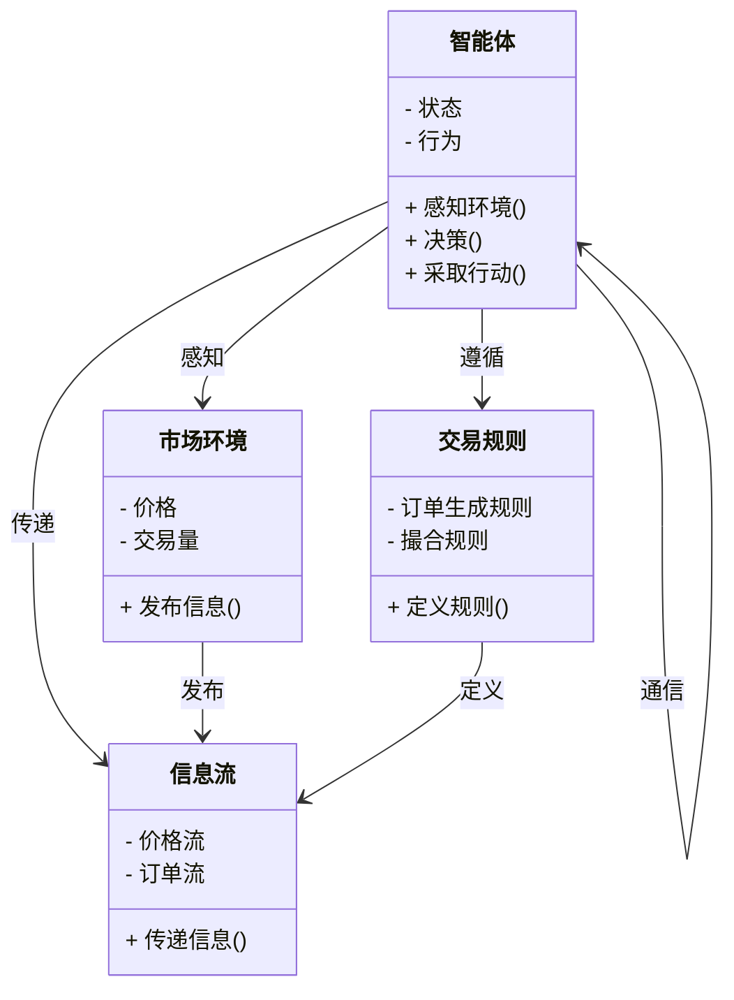
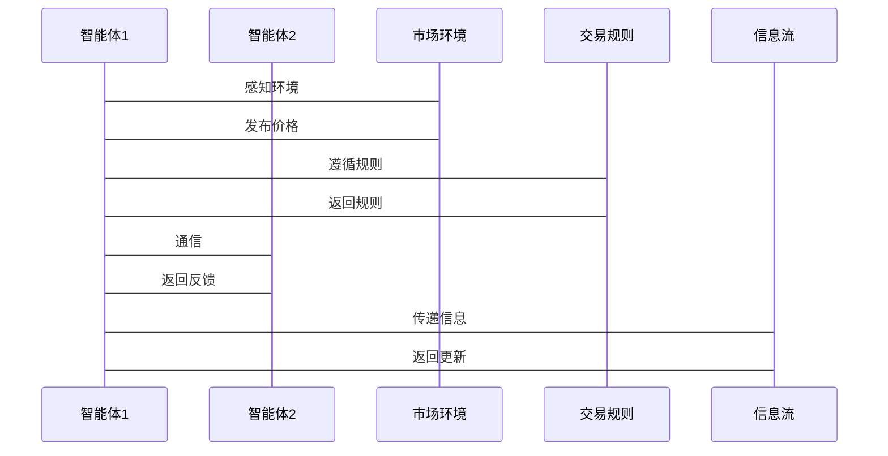

                 


# 利用多智能体系统构建动态市场微观结构模型：优化交易策略

**关键词：多智能体系统, 市场微观结构, 交易策略优化, 动态模型, 金融市场**

**摘要**：  
本文探讨了利用多智能体系统构建动态市场微观结构模型的方法，并详细分析了如何通过该模型优化交易策略。文章首先介绍了多智能体系统的基本概念及其在金融领域的应用，然后深入分析了动态市场微观结构模型的核心要素与构建原理。通过结合多智能体系统的协调机制，本文提出了优化交易策略的具体实现方法，并通过实际案例展示了模型的应用效果。文章还详细阐述了系统的架构设计与实现步骤，为读者提供了从理论到实践的全面指导。

---

# 第1章: 多智能体系统与动态市场微观结构模型的背景与意义

## 1.1 多智能体系统的概念与特点

### 1.1.1 多智能体系统的定义
多智能体系统（Multi-Agent System, MAS）是由多个相互作用的智能体（Agent）组成的系统，这些智能体能够通过自主决策和协作完成特定任务。智能体可以是软件程序、机器人或其他能够感知环境并采取行动的实体。

### 1.1.2 多智能体系统的特征
- **自主性**：智能体能够自主决策，无需外部干预。
- **反应性**：智能体能够实时感知环境并做出反应。
- **协作性**：多个智能体之间可以协作完成复杂任务。
- **分布式性**：智能体分布在网络中，通过通信进行交互。

### 1.1.3 多智能体系统在金融领域的应用
在金融市场中，多智能体系统可以模拟市场参与者的行为，如投资者、交易员和机构。通过模拟这些行为，可以更好地理解市场的动态，并优化交易策略。

---

## 1.2 动态市场微观结构模型的构建背景

### 1.2.1 金融市场微观结构的基本概念
金融市场微观结构指的是市场中的参与者、交易规则和信息流动方式。理解微观结构有助于分析市场的动态行为。

### 1.2.2 动态市场微观结构模型的必要性
传统的静态模型无法捕捉市场的实时变化，而动态模型能够根据市场环境的变化实时调整。

### 1.2.3 优化交易策略的核心问题
交易策略的优化需要考虑市场参与者的博弈行为、价格波动和交易成本等因素。

---

## 1.3 本章小结
本章介绍了多智能体系统的基本概念及其在金融领域的应用，并分析了动态市场微观结构模型的构建背景。多智能体系统的自主性和协作性使其成为构建动态模型的理想工具。

---

# 第2章: 多智能体系统与动态市场微观结构模型的核心概念

## 2.1 多智能体系统的原理

### 2.1.1 多智能体系统的组成
- **智能体**：市场参与者，如投资者、交易员。
- **环境**：金融市场环境，包括价格、交易量等。
- **规则**：交易规则和市场机制。

### 2.1.2 多智能体系统的行为规则
- **感知环境**：智能体通过价格、订单流等信息感知市场。
- **决策与行动**：智能体根据感知信息做出交易决策。
- **通信与协作**：智能体之间通过通信进行协作。

### 2.1.3 多智能体系统的通信机制
智能体之间的通信可以通过消息传递或共享数据库实现。

---

## 2.2 动态市场微观结构模型的构建原理

### 2.2.1 市场微观结构的核心要素
- **参与者**：投资者、机构、交易员。
- **交易规则**：订单生成、撮合规则。
- **信息流**：价格、订单流、市场情绪。

### 2.2.2 动态模型的构建方法
- **数据驱动**：基于历史数据构建模型。
- **规则驱动**：基于市场规则构建模型。
- **混合方法**：结合数据和规则。

### 2.2.3 模型的动态更新机制
模型可以根据市场变化实时更新参数和规则。

---

## 2.3 多智能体系统与动态市场微观结构模型的关系

### 2.3.1 多智能体系统在模型中的角色
智能体模拟市场参与者的行为，模型反映市场的动态变化。

### 2.3.2 模型的动态性与多智能体系统的交互
模型的动态性通过智能体的交互实现，智能体的行为影响模型的状态。

### 2.3.3 模型的实时性与多智能体系统的协调
多智能体系统的协调机制保证模型的实时更新。

---

## 2.4 核心概念对比分析

### 2.4.1 多智能体系统与传统单智能体系统的对比
| 特性       | 多智能体系统 | 单智能体系统 |
|------------|--------------|--------------|
| 自主性      | 高           | 低           |
| 分布式性    | 高           | 低           |
| 协作性      | 高           | 低           |

### 2.4.2 动态模型与静态模型的对比
| 特性       | 动态模型     | 静态模型     |
|------------|--------------|--------------|
| 适应性     | 高           | 低           |
| 实时性      | 高           | 低           |
| 精确性      | 高           | 低           |

### 2.4.3 微观结构与宏观结构的对比
微观结构关注市场参与者的行为，宏观结构关注市场的整体表现。

---

## 2.5 本章小结
本章分析了多智能体系统与动态市场微观结构模型的核心概念，探讨了它们之间的关系，并通过对比分析加深了对模型的理解。

---

# 第3章: 多智能体系统与动态市场微观结构模型的实体关系图

## 3.1 多智能体系统的ER实体关系图

```mermaid
er
  actor: 智能体
  actor: 市场环境
  actor: 交易规则
  actor: 信息流
 

  智能体 --> 市场环境: 感知
  智能体 --> 交易规则: 遵循
  智能体 --> 信息流: 传递
  市场环境 --> 信息流: 发布
  交易规则 --> 信息流: 定义
 

  智能体 --> 智能体: 通信
  信息流 --> 智能体: 接收
  市场环境 --> 智能体: 影响
```

---

## 3.2 动态市场微观结构模型的领域模型



---

## 3.3 本章小结
本章通过ER图和领域模型图展示了多智能体系统与动态市场微观结构模型的实体关系，帮助读者更好地理解系统的结构和交互方式。

---

# 第4章: 多智能体系统与动态市场微观结构模型的算法原理

## 4.1 多智能体系统的协调算法

### 4.1.1 多智能体协调算法的定义
多智能体协调算法用于管理多个智能体之间的协作与冲突。

### 4.1.2 基于协商的协调算法
智能体之间通过协商达成一致。

### 4.1.3 基于规则的协调算法
智能体遵循预定义的规则进行协作。

---

## 4.2 动态市场微观结构模型的构建算法

### 4.2.1 数据驱动的构建算法
基于历史数据构建模型。

### 4.2.2 规则驱动的构建算法
基于市场规则构建模型。

### 4.2.3 混合驱动的构建算法
结合数据和规则构建模型。

---

## 4.3 优化交易策略的算法

### 4.3.1 基于遗传算法的优化
通过遗传算法优化交易策略的参数。

### 4.3.2 基于强化学习的优化
通过强化学习训练智能体的交易策略。

### 4.3.3 基于模拟退火的优化
通过模拟退火算法找到最优策略。

---

## 4.4 算法实现步骤

### 4.4.1 数据准备
收集市场数据，包括价格、订单流等。

### 4.4.2 模型构建
根据数据或规则构建动态模型。

### 4.4.3 策略优化
通过优化算法找到最优交易策略。

---

## 4.5 本章小结
本章详细介绍了多智能体系统与动态市场微观结构模型的算法原理，并给出了优化交易策略的具体方法。

---

# 第5章: 多智能体系统与动态市场微观结构模型的数学模型与公式

## 5.1 动态市场微观结构模型的数学表达

### 5.1.1 市场参与者的博弈模型
$$ u(i) = \max_{a} \sum_{t} \beta^t c(i, a_t) $$

### 5.1.2 价格形成的数学模型
$$ P(t) = \alpha + \beta Q(t) $$

### 5.1.3 交易量与价格的关系
$$ Q(t) = \gamma P(t) $$

---

## 5.2 交易策略优化的数学公式

### 5.2.1 基于收益最大化的优化
$$ \max_{\theta} \sum_{t=1}^T \pi(t, \theta) $$

### 5.2.2 基于风险最小化的优化
$$ \min_{\theta} \sum_{t=1}^T \text{Risk}(t, \theta) $$

### 5.2.3 基于收益风险平衡的优化
$$ \max_{\theta} \frac{\text{Return}(\theta)}{\text{Risk}(\theta)} $$

---

## 5.3 本章小结
本章通过数学公式详细描述了动态市场微观结构模型的核心原理和交易策略优化的方法。

---

# 第6章: 多智能体系统与动态市场微观结构模型的系统分析与架构设计

## 6.1 系统应用场景

### 6.1.1 实时交易模拟
模拟市场中的实时交易行为。

### 6.1.2 策略优化
优化交易策略以提高收益。

### 6.1.3 市场预测
预测市场的未来走势。

---

## 6.2 系统功能设计

### 6.2.1 数据采集模块
采集市场数据，包括价格、订单流等。

### 6.2.2 模型构建模块
构建动态市场微观结构模型。

### 6.2.3 策略优化模块
优化交易策略。

### 6.2.4 结果展示模块
展示模型的运行结果。

---

## 6.3 系统架构设计

### 6.3.1 分层架构
- 数据层：存储市场数据。
- 模型层：构建动态模型。
- 策略层：优化交易策略。
- 展示层：展示结果。

### 6.3.2 微服务架构
- 数据服务：提供市场数据。
- 模型服务：构建动态模型。
- 策略服务：优化交易策略。

---

## 6.4 系统接口设计

### 6.4.1 数据接口
- 输入接口：接收市场数据。
- 输出接口：返回模型结果。

### 6.4.2 通信接口
- 智能体之间的通信接口。
- 模型与数据的接口。

---

## 6.5 系统交互流程



---

## 6.6 本章小结
本章详细分析了系统的应用场景、功能设计、架构设计和交互流程，为后续的实现提供了理论基础。

---

# 第7章: 多智能体系统与动态市场微观结构模型的项目实战

## 7.1 项目环境安装

### 7.1.1 Python环境
安装Python和必要的库，如numpy、pandas、matplotlib。

### 7.1.2 多智能体框架
使用现有的多智能体框架，如Reynolds、 mesa。

### 7.1.3 开发工具
安装Jupyter Notebook、PyCharm等开发工具。

---

## 7.2 系统核心实现源代码

### 7.2.1 数据采集模块

```python
import pandas as pd
import requests

def get_market_data(symbol):
    url = f"https://api.example.com/{symbol}"
    response = requests.get(url)
    data = response.json()
    return pd.DataFrame(data)
```

### 7.2.2 模型构建模块

```python
class MarketModel:
    def __init__(self, data):
        self.data = data
        self.parameters = self.train_model()

    def train_model(self):
        # 训练模型并返回参数
        pass
```

### 7.2.3 策略优化模块

```python
import numpy as np

def optimize_strategy(data):
    # 使用遗传算法优化策略
    pass
```

### 7.2.4 信息流处理模块

```python
class InformationFlow:
    def __init__(self):
        self.data = []

    def receive(self, message):
        self.data.append(message)

    def send(self, message):
        print(f"Message sent: {message}")
```

---

## 7.3 代码应用解读与分析

### 7.3.1 数据采集模块解读
数据采集模块从API获取市场数据，并将其转换为DataFrame格式。

### 7.3.2 模型构建模块解读
模型构建模块使用训练数据构建动态模型，并返回优化后的参数。

### 7.3.3 策略优化模块解读
策略优化模块使用遗传算法优化交易策略，提高收益。

### 7.3.4 信息流处理模块解读
信息流处理模块管理智能体之间的通信，传递信息。

---

## 7.4 实际案例分析

### 7.4.1 案例背景
假设我们有一个股票市场，需要优化交易策略。

### 7.4.2 数据准备
从API获取股票价格和订单流数据。

### 7.4.3 模型构建
使用历史数据构建动态模型。

### 7.4.4 策略优化
通过遗传算法优化交易策略。

### 7.4.5 结果展示
展示优化后的交易策略的收益和风险。

---

## 7.5 本章小结
本章通过实际案例展示了系统的实现过程，从数据采集到策略优化，再到结果展示，详细解读了每个模块的功能和实现方法。

---

# 第8章: 总结与展望

## 8.1 本章小结
本文详细探讨了利用多智能体系统构建动态市场微观结构模型的方法，并优化了交易策略。通过理论分析和实际案例，展示了系统的实现过程和应用效果。

## 8.2 研究的局限性
目前的模型主要基于假设和简化，未来需要考虑更多复杂因素。

## 8.3 未来研究方向
- 更复杂的市场参与者行为建模。
- 更高效的优化算法研究。
- 更精确的市场预测方法探索。

---

# 作者信息

**作者：AI天才研究院/AI Genius Institute & 禅与计算机程序设计艺术 /Zen And The Art of Computer Programming**

