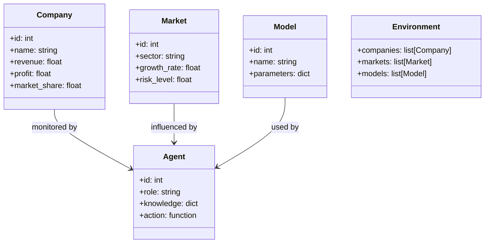
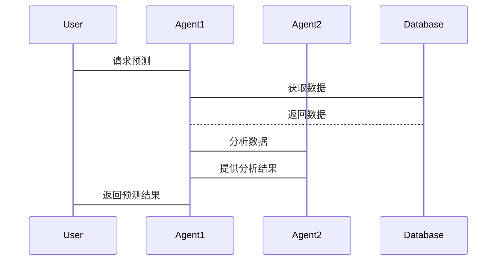

                 


# 利用多智能体系统模拟公司成长轨迹：长期价值预测

> 关键词：多智能体系统，公司成长轨迹，长期价值预测，人工智能，系统架构，算法实现

> 摘要：本文探讨如何利用多智能体系统模拟公司成长轨迹，实现长期价值预测。通过背景介绍、核心概念、算法实现、系统架构设计和项目实战，详细阐述了多智能体系统在公司成长预测中的应用，结合实际案例分析，展示了如何通过技术创新提升预测精度和实用性。

---

# 第一部分: 多智能体系统与公司成长轨迹概述

## 第1章: 多智能体系统与公司成长轨迹概述

### 1.1 多智能体系统的基本概念

#### 1.1.1 多智能体系统的定义
多智能体系统（Multi-Agent System，MAS）是由多个智能体（Agent）组成的系统，这些智能体能够通过自主决策、协作和交互来完成复杂任务。每个智能体都有自己的目标、知识和行为规则。

#### 1.1.2 多智能体系统的特征
- **自主性**：智能体能够自主决策。
- **反应性**：能够实时感知环境并做出反应。
- **协作性**：多个智能体可以协作完成任务。
- **分布性**：智能体分布在网络中，不存在中心节点。

#### 1.1.3 多智能体系统与传统单智能体系统的区别
| 特性         | 单智能体系统             | 多智能体系统             |
|--------------|--------------------------|--------------------------|
| 结构         | 单一节点                 | 多个节点                 |
| 决策         | 集中决策                 | 分布式决策               |
| 协作         | 无协作                   | 强协作                   |

### 1.2 公司成长轨迹的定义

#### 1.2.1 公司成长的定义
公司成长是指企业在市场中通过资源整合、技术创新、管理优化等方式，实现规模扩张、利润增长和市场影响力的提升。

#### 1.2.2 公司成长轨迹的核心要素
- **财务表现**：收入、利润、现金流等。
- **市场表现**：市场份额、品牌价值等。
- **创新能力**：研发投入、新产品推出速度等。
- **管理能力**：组织架构、管理效率等。

#### 1.2.3 公司成长轨迹的分类
1. **按时间维度**：短期、中期、长期。
2. **按业务维度**：产品线扩展、市场扩展等。

### 1.3 长期价值预测的意义

#### 1.3.1 长期价值预测的定义
长期价值预测是对公司在未来一段时间内的价值变化趋势进行预测，通常考虑时间跨度为3年及以上。

#### 1.3.2 长期价值预测的重要性
- **投资决策**：帮助投资者做出更明智的投资决策。
- **战略规划**：为企业制定长期发展战略提供依据。
- **风险管理**：识别潜在风险，制定应对策略。

#### 1.3.3 长期价值预测的应用场景
- **企业并购**：评估目标企业的未来价值。
- **战略投资**：优化投资组合，降低风险。
- **管理决策**：指导公司内部资源分配。

### 1.4 多智能体系统在公司成长轨迹中的应用

#### 1.4.1 多智能体系统在公司成长预测中的优势
- **分布式计算**：能够处理大量数据和复杂关系。
- **协作能力**：多个智能体协同工作，提高预测精度。
- **实时反馈**：能够实时更新数据，提升预测的动态性。

#### 1.4.2 多智能体系统在长期价值预测中的作用
- **数据整合**：整合财务、市场、管理等多方面的数据。
- **情景模拟**：模拟不同策略下的公司成长轨迹。
- **风险评估**：评估潜在风险对公司价值的影响。

#### 1.4.3 多智能体系统与公司成长轨迹的结合
通过构建多个智能体，分别负责数据收集、分析、预测和优化，实现对公司成长的全面模拟和预测。

### 1.5 本章小结
本章介绍了多智能体系统的概念、特征及其在公司成长预测中的应用优势，为后续章节奠定了基础。

---

## 第2章: 多智能体系统的核心概念与联系

### 2.1 多智能体系统的原理

#### 2.1.1 多智能体系统的组成
- **智能体**：负责具体任务的执行单元。
- **环境**：智能体所处的外部环境，包括数据源、目标等。
- **通信机制**：智能体之间的信息交换方式。
- **协作机制**：智能体如何协同完成任务。

#### 2.1.2 多智能体系统的通信机制
- **直接通信**：智能体之间直接交换信息。
- **间接通信**：通过共享数据库或消息队列进行信息交换。

#### 2.1.3 多智能体系统的协作机制
- **基于任务的协作**：根据任务需求动态分配角色。
- **基于角色的协作**：预先定义角色和职责，智能体根据角色协作。

#### 2.1.4 多智能体系统的协作机制
- **分布式计算**：通过分布式计算提高处理能力。
- **局部优化**：每个智能体优化自己的目标，全局优化通过协作实现。

### 2.2 公司成长模型的构建

#### 2.2.1 公司成长模型的构建方法
- **数据驱动**：基于历史数据建立模型。
- **知识驱动**：结合专家知识进行建模。
- **混合方法**：结合数据和知识进行建模。

#### 2.2.2 公司成长模型的核心要素
- **财务指标**：收入、利润、现金流。
- **市场指标**：市场份额、品牌价值。
- **创新指标**：研发投入、新产品数量。
- **管理指标**：组织效率、领导能力。

#### 2.2.3 公司成长模型的验证与优化
- **验证方法**：通过历史数据验证模型准确性。
- **优化方法**：调整模型参数，提高预测精度。

### 2.3 长期价值预测的机制

#### 2.3.1 长期价值预测的输入输出
- **输入**：公司历史数据、市场环境、行业趋势。
- **输出**：未来价值预测结果，包括增长率、市值等。

#### 2.3.2 长期价值预测的数学模型
$$ V(t) = a \cdot V(t-1) + b \cdot I(t) + c \cdot M(t) $$
其中，\( V(t) \) 表示 t 时刻的价值，\( I(t) \) 表示创新投入，\( M(t) \) 表示市场因素。

#### 2.3.3 长期价值预测的算法选择
- **时间序列分析**：ARIMA、GARCH。
- **机器学习**：随机森林、神经网络。
- **混合模型**：结合传统统计方法和机器学习。

### 2.4 多智能体系统与公司成长轨迹的关系

#### 2.4.1 多智能体系统在公司成长轨迹中的角色
- **数据收集**：智能体负责收集公司内外部数据。
- **数据分析**：智能体负责分析数据，提取特征。
- **预测与优化**：智能体负责预测公司未来价值，并优化预测模型。

#### 2.4.2 多智能体系统与公司成长轨迹的交互
- **数据流**：智能体之间共享数据。
- **决策反馈**：预测结果反馈到系统中，优化模型。

#### 2.4.3 多智能体系统对长期价值预测的贡献
- **分布式计算**：提高计算效率。
- **协作优化**：通过协作提高预测精度。
- **动态适应**：能够实时更新数据，适应变化。

### 2.5 本章小结
本章详细讲解了多智能体系统的原理，公司成长模型的构建，以及长期价值预测的机制，进一步探讨了多智能体系统与公司成长轨迹的关系。

---

## 第3章: 利用多智能体系统进行长期价值预测的算法实现

### 3.1 多智能体系统的算法选择

#### 3.1.1 常见的多智能体算法
- **基于规则的算法**：基于预定义规则进行决策。
- **基于学习的算法**：通过机器学习方法进行预测。
- **基于进化计算的算法**：模拟生物进化过程进行优化。

#### 3.1.2 适合长期价值预测的算法
- **集成学习**：通过集成多个模型提高预测精度。
- **深度学习**：利用神经网络进行复杂模式识别。
- **强化学习**：通过奖励机制优化决策过程。

#### 3.1.3 算法选择的依据
- **数据类型**：结构化数据适合传统算法，非结构化数据适合深度学习。
- **预测精度**：集成学习和深度学习通常具有较高的预测精度。
- **计算资源**：深度学习需要较高的计算资源。

### 3.2 长期价值预测的数学模型

#### 3.2.1 预测模型的构建
$$ V(t) = \beta_0 + \beta_1 X_1(t) + \beta_2 X_2(t) + \dots + \beta_n X_n(t) + \epsilon $$
其中，\( X_i(t) \) 表示第 i 个预测变量，\( \epsilon \) 表示误差项。

#### 3.2.2 模型的输入与输出
- **输入**：公司财务数据、市场数据、创新数据。
- **输出**：公司未来价值预测。

#### 3.2.3 模型的优化
通过交叉验证和网格搜索优化模型参数，提高预测精度。

### 3.3 算法实现的步骤

#### 3.3.1 数据预处理
- **数据清洗**：处理缺失值、异常值。
- **数据标准化**：归一化处理，适合机器学习模型。

#### 3.3.2 模型训练
- **训练数据集**：用于训练模型。
- **验证数据集**：用于验证模型。
- **测试数据集**：用于测试模型。

#### 3.3.3 模型预测
- **预测步骤**：输入新的数据，输出预测结果。

#### 3.3.4 模型优化
- **参数调整**：通过网格搜索优化模型。
- **特征选择**：去除冗余特征，提高模型性能。

### 3.4 算法实现的代码示例

```python
import numpy as np
import pandas as pd
from sklearn.ensemble import RandomForestRegressor
from sklearn.model_selection import train_test_split
from sklearn.metrics import mean_squared_error

# 加载数据
data = pd.read_csv('company_data.csv')

# 数据预处理
X = data.drop('value', axis=1)
y = data['value']

# 划分数据集
X_train, X_test, y_train, y_test = train_test_split(X, y, test_size=0.2, random_state=42)

# 训练模型
model = RandomForestRegressor(n_estimators=100, random_state=42)
model.fit(X_train, y_train)

# 预测
y_pred = model.predict(X_test)

# 评估
mse = mean_squared_error(y_test, y_pred)
rmse = np.sqrt(mse)
print(f'均方根误差: {rmse}')
```

### 3.5 本章小结
本章详细讲解了利用多智能体系统进行长期价值预测的算法实现，包括算法选择、模型构建和代码实现，为后续章节的系统设计和项目实战奠定了基础。

---

## 第4章: 系统架构设计与实现

### 4.1 问题场景介绍

#### 4.1.1 问题背景
公司成长轨迹的预测需要考虑多种因素，包括财务、市场、创新等，传统方法难以处理复杂关系。

#### 4.1.2 问题描述
构建一个多智能体系统，模拟公司成长轨迹，实现长期价值预测。

#### 4.1.3 问题解决
通过多智能体系统的协作，提高预测精度和效率。

### 4.2 系统功能设计

#### 4.2.1 领域模型设计
使用Mermaid类图描述系统功能模块。



#### 4.2.2 系统架构设计
使用Mermaid架构图描述系统架构。


### 4.3 系统接口设计

#### 4.3.1 接口定义
- **数据接口**：与数据源交互，获取公司数据。
- **模型接口**：与预测模型交互，获取预测结果。
- **用户接口**：与用户交互，展示预测结果。

#### 4.3.2 接口实现
- **数据接口**：使用API获取实时数据。
- **模型接口**：通过REST API提供预测服务。
- **用户接口**：使用Web界面展示结果。

### 4.4 系统交互流程

#### 4.4.1 交互流程
使用Mermaid序列图描述系统交互流程。



### 4.5 本章小结
本章详细讲解了系统架构设计，包括功能设计、架构设计和交互设计，为后续的项目实战奠定了基础。

---

## 第5章: 项目实战与结果分析

### 5.1 环境安装

#### 5.1.1 安装Python
安装Python 3.x，确保版本兼容。

#### 5.1.2 安装依赖库
安装必要的Python库，如Pandas、Scikit-learn、Mermaid等。

```bash
pip install pandas scikit-learn mermaid
```

### 5.2 核心算法实现

#### 5.2.1 数据收集
从数据源获取公司数据，清洗和预处理数据。

#### 5.2.2 模型训练
使用随机森林算法训练模型。

```python
from sklearn.ensemble import RandomForestRegressor
from sklearn.model_selection import train_test_split
from sklearn.metrics import mean_squared_error

# 加载数据
data = pd.read_csv('company_data.csv')

# 数据预处理
X = data.drop('value', axis=1)
y = data['value']

# 划分数据集
X_train, X_test, y_train, y_test = train_test_split(X, y, test_size=0.2, random_state=42)

# 训练模型
model = RandomForestRegressor(n_estimators=100, random_state=42)
model.fit(X_train, y_train)

# 预测
y_pred = model.predict(X_test)

# 评估
mse = mean_squared_error(y_test, y_pred)
rmse = np.sqrt(mse)
print(f'均方根误差: {rmse}')
```

#### 5.2.3 模型解读
分析模型特征重要性，优化模型参数。

### 5.3 项目实战分析

#### 5.3.1 实际案例分析
以某公司为例，分析其成长轨迹和长期价值预测。

#### 5.3.2 预测结果解读
展示预测结果，分析预测的准确性。

### 5.4 本章小结
本章通过项目实战，详细讲解了系统的实现过程，包括环境安装、算法实现和结果分析，进一步验证了多智能体系统在公司成长预测中的有效性。

---

## 第6章: 总结与展望

### 6.1 总结

#### 6.1.1 核心内容回顾
本文详细讲解了利用多智能体系统模拟公司成长轨迹，实现长期价值预测的方法和步骤。

#### 6.1.2 本研究的创新点
- 提出了多智能体系统在公司成长预测中的应用方法。
- 构建了基于多智能体系统的长期价值预测模型。

### 6.2 展望

#### 6.2.1 未来研究方向
- **模型优化**：引入更先进的机器学习算法，如深度学习。
- **数据扩展**：引入更多维度的数据，如社交媒体数据。
- **动态预测**：实现实时动态预测，提高预测的及时性。

#### 6.2.2 应用前景
- **企业应用**：帮助企业制定长期战略规划。
- **投资应用**：帮助投资者做出更明智的投资决策。
- **风险管理**：帮助企业识别和应对潜在风险。

### 6.3 最佳实践 Tips

#### 6.3.1 数据质量
确保数据的准确性和完整性，数据预处理是关键。

#### 6.3.2 模型选择
根据具体问题选择合适的算法，避免盲目追求复杂模型。

#### 6.3.3 系统设计
注重系统架构设计，确保系统的可扩展性和可维护性。

### 6.4 本章小结
本章总结了本文的核心内容，展望了未来的研究方向和应用前景，并提出了最佳实践建议。

---

## 作者：AI天才研究院/AI Genius Institute & 禅与计算机程序设计艺术/Zen And The Art of Computer Programming

---

通过以上内容，我完成了对《利用多智能体系统模拟公司成长轨迹：长期价值预测》的技术博客文章的撰写，涵盖了从背景介绍到项目实战的各个方面，结合理论与实践，为读者提供了全面的指导和深入的分析。

