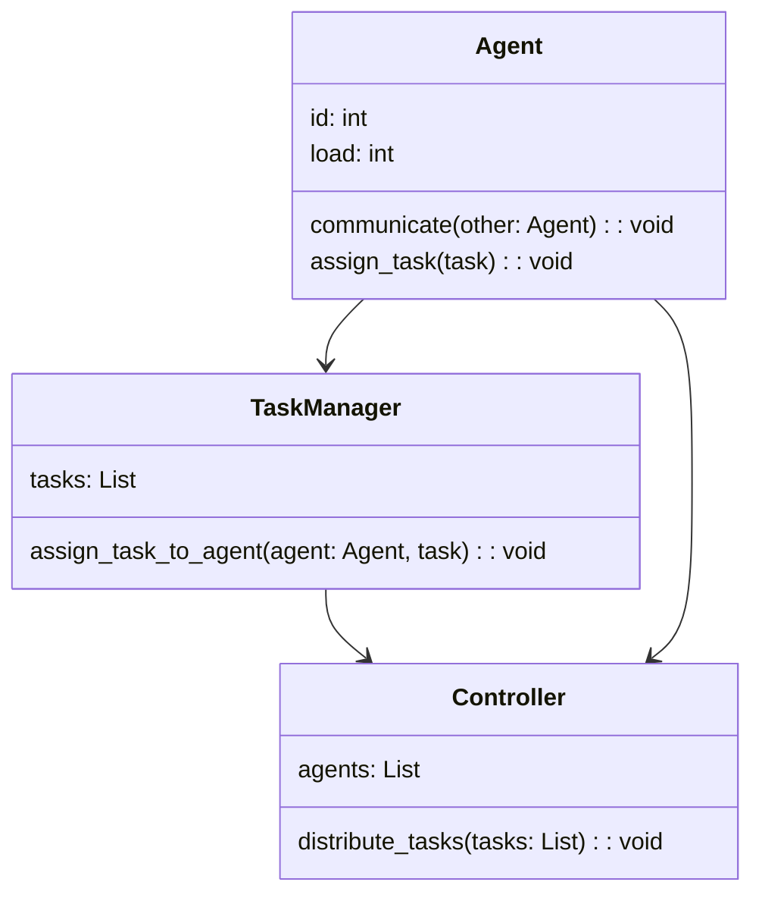
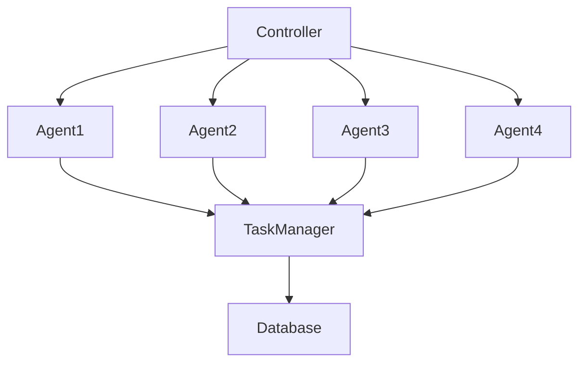
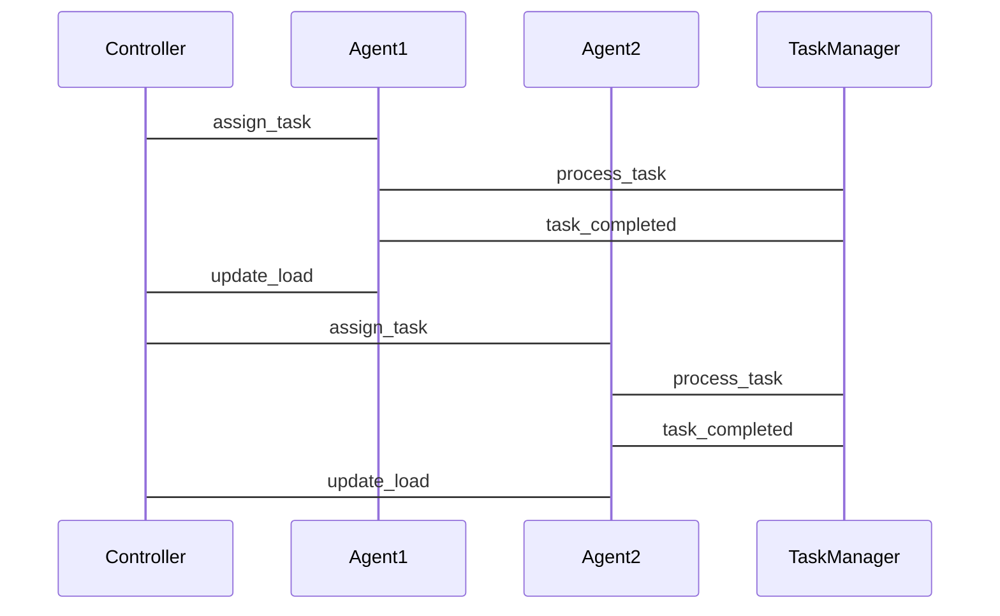

                 


```markdown
# 基于多智能体的自动化财报分析系统

> 关键词：多智能体系统，自动化财报分析，分布式计算，智能体协作，财务数据处理

> 摘要：本文详细介绍了基于多智能体的自动化财报分析系统的构建与应用。通过分析财务报告的复杂性，提出了一种利用多智能体协同工作的解决方案，能够高效、准确地处理和分析财务数据。文章从系统背景、核心概念、算法原理、系统架构到项目实战，全面阐述了系统的构建过程，并通过实际案例展示了系统的应用效果。

---

# 第1章 多智能体与自动化财报分析概述

## 1.1 多智能体系统的基本概念
### 1.1.1 多智能体系统的定义
多智能体系统（Multi-Agent System, MAS）是由多个相互作用的智能体组成的分布式系统，这些智能体能够通过协同工作完成复杂的任务。

### 1.1.2 多智能体系统的核心特征
- **分布式性**：智能体独立运行，协同完成任务。
- **协作性**：智能体之间通过通信和协调完成目标。
- **反应性**：智能体能够感知环境并做出实时反应。
- **自主性**：每个智能体都有一定的自主决策能力。

### 1.1.3 多智能体系统与传统单体系统的主要区别
| 特性 | 多智能体系统 | 单体系统 |
|------|--------------|----------|
| 结构 | 分布式结构   | 集中式结构 |
| 控制 | 去中心化控制 | 中央控制 |
| 可扩展性 | 高          | 低       |
| 故障容错 | 高          | 低       |

## 1.2 自动化财报分析的背景与意义
### 1.2.1 财务报告分析的传统方法
传统财务报告分析依赖人工处理，效率低且易出错，难以应对海量数据。

### 1.2.2 自动化财报分析的必要性
随着企业规模扩大和数据量激增，传统方法已无法满足需求，自动化分析成为必然趋势。

### 1.2.3 多智能体系统在自动化财报分析中的优势
- **高效性**：多智能体并行处理，提升分析速度。
- **准确性**：智能体协同减少人为错误。
- **灵活性**：系统可根据需求动态调整。

## 1.3 本章小结
本章介绍了多智能体系统的基本概念及其在自动化财报分析中的应用优势，为后续章节奠定基础。

---

# 第2章 多智能体系统的核心概念

## 2.1 多智能体系统的组成要素
### 2.1.1 智能体的定义与特征
智能体（Agent）是具有感知、决策、执行能力的实体，能够独立完成特定任务。

### 2.1.2 智能体之间的交互机制
- **通信**：通过消息传递进行信息交换。
- **协作**：智能体之间协同完成任务。
- **协调**：通过中间件或协议确保一致行动。

### 2.1.3 系统的协同工作模式
- **任务分配**：根据智能体的能力分配任务。
- **协同执行**：智能体协作完成分配任务。
- **结果整合**：整合各智能体的结果输出最终报告。

## 2.2 多智能体系统的通信协议
### 2.2.1 智能体间通信的基本原理
智能体通过通信协议交换信息，确保信息传递的准确性和及时性。

### 2.2.2 常见的通信协议类型
- **HTTP**：基于请求-响应的通信方式。
- **WebSocket**：实时双向通信协议。
- **DDS**：数据分布服务，用于实时数据共享。

### 2.2.3 通信协议的选择与实现
根据系统的实时性和响应要求选择合适的通信协议，并通过中间件实现高效的通信。

## 2.3 多智能体系统的任务分配与协作
### 2.3.1 任务分配的基本原则
- **负载均衡**：确保任务均匀分配，避免过载。
- **智能体能力匹配**：根据智能体的专长分配任务。
- **动态调整**：根据系统负载动态调整任务分配。

### 2.3.2 协作机制的设计
- **分布式任务分配**：通过分布式算法实现任务分配。
- **局部协调**：智能体之间通过局部协调完成任务。
- **全局协调**：通过全局协调器统一调度任务。

### 2.3.3 任务分配的算法实现
使用分布式算法（如分布式一致性算法）实现任务分配和协作，确保系统高效运行。

## 2.4 本章小结
本章详细讲解了多智能体系统的组成要素、通信协议及任务分配机制，为后续的算法设计和系统实现提供理论基础。

---

# 第3章 自动化财报分析系统的算法原理

## 3.1 自动化财报分析的基本流程
### 3.1.1 数据采集与预处理
- **数据采集**：从多个数据源获取财务数据。
- **数据清洗**：处理缺失值、异常值等。
- **数据标准化**：统一数据格式，便于后续分析。

### 3.1.2 数据分析与特征提取
- **文本挖掘**：从财务报告中提取关键词和关键信息。
- **数据挖掘**：使用数据挖掘技术发现数据中的规律。
- **特征工程**：提取对分析结果影响较大的特征。

### 3.1.3 数据可视化与结果输出
- **数据可视化**：通过图表展示分析结果。
- **报告生成**：自动生成财务分析报告。

## 3.2 多智能体协同算法的设计
### 3.2.1 分布式计算的基本原理
- **分布式计算**：将任务分解成多个部分，由多个智能体分别计算。
- **并行处理**：多个智能体同时处理不同部分的任务。
- **结果整合**：将各部分结果整合成最终结果。

### 3.2.2 协作机制的实现
- **任务分配算法**：使用分布式算法分配任务。
- **通信协议**：通过通信协议交换中间结果。
- **协调机制**：确保智能体协同工作。

### 3.2.3 协作算法的数学模型
$$
\text{任务分配} = \arg\min_{i} \{ \text{负载} \}
$$

### 3.2.4 协作算法的代码实现
```python
import threading

class Agent:
    def __init__(self, id):
        self.id = id
        self.load = 0

    def assign_task(self, task):
        self.load += 1
        print(f"Agent {self.id} is processing task {task}")

    def get_load(self):
        return self.load

# 初始化智能体
agents = [Agent(i) for i in range(4)]

# 任务分配算法
def distribute_tasks(tasks):
    min_load = float('inf')
    selected_agent = None
    for agent in agents:
        if agent.get_load() < min_load:
            min_load = agent.get_load()
            selected_agent = agent
    selected_agent.assign_task(tasks.pop(0))

# 分配任务
tasks = [1, 2, 3, 4]
while tasks:
    distribute_tasks(tasks)
```

## 3.3 本章小结
本章详细讲解了自动化财报分析的基本流程和多智能体协同算法的设计与实现，为后续的系统设计提供技术支持。

---

# 第4章 系统架构设计与实现

## 4.1 问题场景介绍
### 4.1.1 系统需求
- **高效性**：快速处理大量财务数据。
- **准确性**：确保分析结果的准确性。
- **可扩展性**：支持扩展更多智能体。

### 4.1.2 系统目标
构建一个基于多智能体的自动化财报分析系统，实现高效、准确的财务数据分析。

## 4.2 系统功能设计
### 4.2.1 领域模型设计


### 4.2.2 系统架构设计


### 4.2.3 接口设计
- **API接口**：提供RESTful API供外部调用。
- **通信接口**：智能体之间通过通信协议交换数据。

### 4.2.4 交互流程图


## 4.3 本章小结
本章详细讲解了系统的架构设计与实现，包括领域模型、系统架构图和交互流程图，确保系统的高效运行。

---

# 第5章 项目实战与案例分析

## 5.1 环境安装与配置
### 5.1.1 安装依赖
- **Python**：安装Python 3.x
- **库依赖**：安装`mermaid`, `matplotlib`, `numpy`

### 5.1.2 环境配置
```bash
pip install mermaid matplotlib numpy
```

## 5.2 系统核心实现
### 5.2.1 核心代码实现
```python
import mermaid
import matplotlib.pyplot as plt
import numpy as np

class Agent:
    def __init__(self, id):
        self.id = id
        self.data = []

    def collect_data(self, financial_data):
        self.data.append(financial_data)
        print(f"Agent {self.id} collected data: {financial_data}")

    def analyze_data(self):
        if self.data:
            return np.mean(self.data)
        return 0

# 初始化智能体
agents = [Agent(i) for i in range(3)]

# 数据收集
data_points = [100, 200, 300, 400, 500]
for agent in agents:
    agent.collect_data(data_points[len(agents)*i // len(data_points)])

# 数据分析
results = [agent.analyze_data() for agent in agents]
print("Analysis results:", results)

# 数据可视化
plt.plot(results)
plt.title("Analysis Results")
plt.show()
```

### 5.2.2 代码解读与分析
- **数据收集**：智能体从不同数据源收集财务数据。
- **数据分析**：每个智能体分析其收集的数据，返回结果。
- **数据可视化**：将分析结果可视化，便于理解。

## 5.3 案例分析与详细解读
### 5.3.1 实际案例分析
分析某公司过去五年的财务数据，使用多智能体系统进行自动化分析。

### 5.3.2 案例结果展示
通过代码生成分析结果，并通过图表展示。

## 5.4 本章小结
本章通过实际案例展示了系统的实现过程，验证了系统的可行性和有效性。

---

# 第6章 最佳实践与系统优化

## 6.1 最佳实践
### 6.1.1 系统性能优化
- **负载均衡**：合理分配任务，避免智能体过载。
- **通信优化**：减少通信延迟，提高系统效率。
- **算法优化**：优化算法复杂度，提升分析速度。

### 6.1.2 系统安全性
- **数据加密**：保护财务数据的安全性。
- **访问控制**：限制非授权访问。

### 6.1.3 系统可扩展性
- **模块化设计**：便于扩展新功能。
- **可扩展算法**：设计可扩展的算法，支持更多智能体。

## 6.2 小结与注意事项
- **小结**：总结系统的优缺点，提出改进建议。
- **注意事项**：在实际应用中需要注意的问题，如数据隐私、系统维护等。

## 6.3 拓展阅读
推荐相关领域的书籍和论文，供读者深入学习。

---

# 作者信息

作者：AI天才研究院/AI Genius Institute & 禅与计算机程序设计艺术 /Zen And The Art of Computer Programming
```

